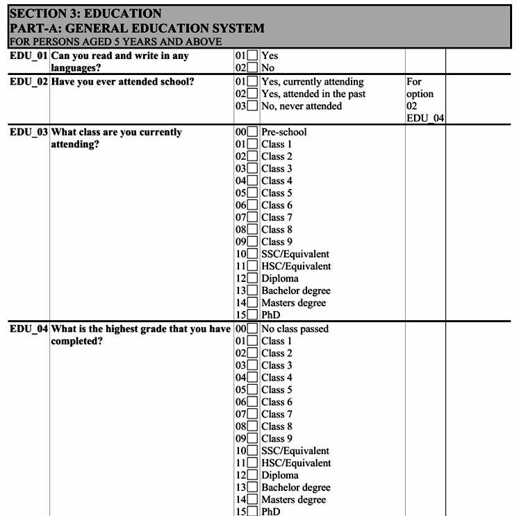

# Education

## Variables

**ed_mod_age**

Codifies the minimum age for which education questions are asked. For example, if education information is only requested from those 4 years and older the variable should be set to 4.

**school**

Codifies whether the person is currently (i.e., at the time of the survey) attending formal education. The codes are: 

0 = No
1 = Yes

**literacy**

Codifies whether person can read and write in at least one language. The codes are: 
0 = No
1 = Yes

**educy**

Codifies the number of years spent in education.

**educat7**

Classifies the highest level of education attained by the respondent to seven levels. The codes are: 

1 = No education
2 = Primary incomplete
3 = Primary complete
4 = Secondary incomplete
5 = Secondary complete
6 = Higher than secondary but not university 
7 = University incomplete or complete

The concept of secondary complete includes all students who have had attended at least one year (complete or incomplete) of upper secondary education (as defined in the ISCED Mappings of UNESCO). That is attendance and completion of “junior high” shall be coded as secondary incomplete while attendance to “senior high school” even if for one year, will be coded as secondary complete.

**educat5**

Classifies the highest level of education attained by the respondent to five levels. The codes are: 

1 = No education
2 = Primary incomplete
3 = Primary complete but secondary incomplete
4 = Secondary complete
5 = Some tertiary/post-secondary

**educat4**

Classifies the highest level of education attained by the respondent to four levels. The codes are: 
1 = No education
2 = Primary (complete or incomplete)
3 = Secondary (complete)
4 = Tertiary (complete or incomplete)

Note: Code as primary education anyone who has undergone some schooling but has not finished secondary education.

**educat_orig**

Original education code as in the raw survey data. If the original survey has a single variable coding the education information, simply copy (`gen educat_orig = survey_education_var`).

If the survey splits the respondents into different groups (commonly a question for people attending school and a different one for those no longer in education), then educat_orig should be made up of both variables. Figure 15 below, shows the example from the 2022 Bangladesh LFS. The skip pattern from variable EDU_02 is not clear, but in the data people who are attending (EDU_02 code 01) answer question EDU_03 and skip EDU_04, while those who state that they attended in the past but are not currently enrolled (EDU_02 code 02) skip EDU_03 and answer EDU_04. People who never attended school (EDU_02 code 03) skip both EDU_03 and EDU_04. In this case educat_orig should be coded as the union of the information of either group (i.e., educat_orig ought to contain the information of both EDU_03 and EDU_04).

  
Figure 15 - Education variables in the 2022 Bangladeshi LFS

  

In other cases, the information may be split into two sub-questions. Figure 16, below, shows the question on education from the 2021 Zimbabwean LFS. Here the information is split into two variables: a level (which we will refer to as ED3a) and a grade within that level (ED3b). 

  
Figure 16 - Education question in the 2021 ZWE LFS

  

If it is possible to combine the information (e.g., by concatenating both variable) this should be tried and explicitly commented in the code. If it is not possible to confidently convey the information split over two (or more) variables, the harmonizer shall leave the educat_orig variable missing.

**educat_isced**

Code of the highest educational level attained as per the International Standard Classification of Education (ISCED). Note that the preamble to the harmonization code should record what version of ISCED is being used.

Moreover, the code should always be as long as the longest depth available for the ISCED version. For example, the latest version at the time of writing (ISCED 2011) has up to three digits. Where the first digit is the level, the first two digits are the category, and all three digits codify the sub-category.

As an example, level 2 codifies “Lower secondary education”, 24 “Lower secondary general education”, and 242 “Sufficient for partial level completion, without direct access to upper secondary education”. Every code should be three digits long. If we only know the level (here 2) add two zeroes after it (here: 200). If we only have the category information (here 24) add a zero to reach three digits (here 240). 
 
## Overview of Variables

Here's the information converted into a markdown table:

| Module Code | Variable name | Variable label | Notes |
|-------------|---------------|-----------------|-------|
| Education | ed_mod_age | Education module minumum age |  |
| Education | school | Currently in school |  |
| Education | literacy | Individual can read and write |  |
| Education | educy | Years of education |  |
| Education | educat7 | Level of education 7 categories | No option for "Other", as opposed to I2D2, anything not in these categories is to be set to missing |
| Education | educat5 | Level of education 5 categories |  |
| Education | educat4 | Level of education 4 categories |  |
| Education | educat_orig | Original education code | Code if there is a single original education variable (as is in most cases). If there are two or more variables, leave missing, make a note of it. |
| Education | educat_isced | International Standard Classification of Education (ISCED A) | Codes are for example:  |
|  |  |  | 2 Lower secondary education |
|  |  |  | 24 General |
|  |  |  | 242 Partial level completion, without direct access to upper secondary education |
|  |  |  | Should be coded as 200, 240, and 242 respectively. |
 