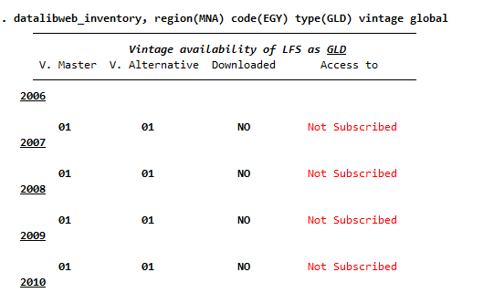
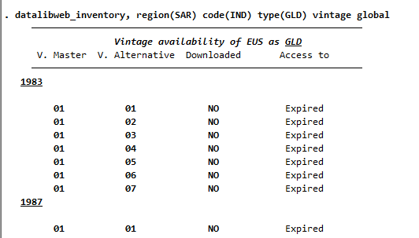
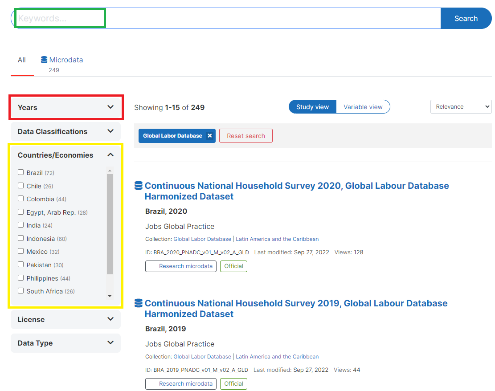
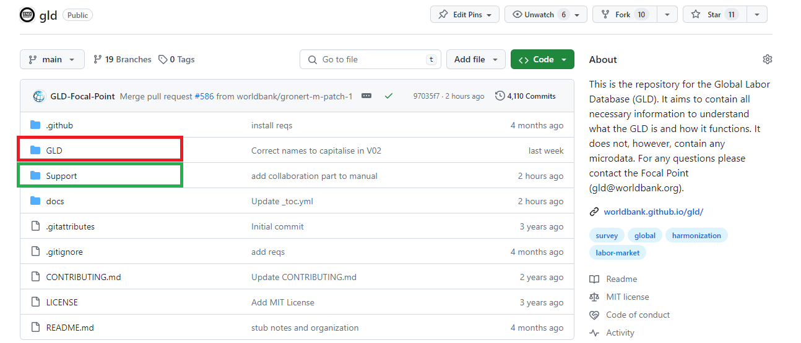
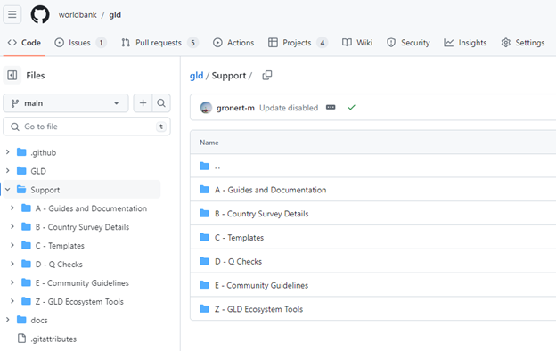
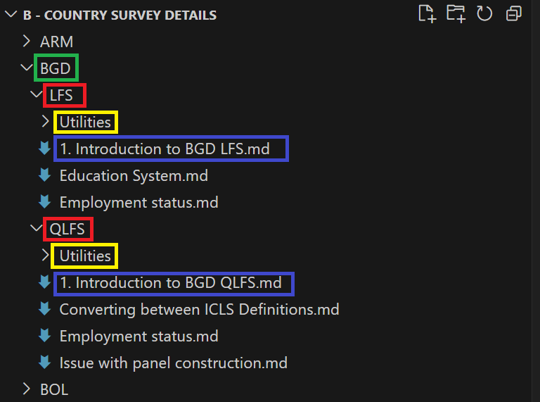

# GLD content, storage, and access

This section discusses the kinds of information that can be found on GLD, the rules that govern each type, and the formats they are in.

## Data and information collected in GLD

### Raw microdata

The raw microdata are the individual level data as received or downloaded by the GLD Team. It may come directly from the National Statistical Offices (NSO), an aggregator (like the African Development Bank Microdata Catalog or the World Bank Microdata Catalog) or from colleagues. They are collectively referred to as the data sharers in this document. 

The raw microdata reflects the original state of the data and its variables should mirror the questionnaire. In cases where no better alternative is found, the raw data the GLD team starts with may have been already processed by either the NSO or an intermediary. If this is the case, this should be described and noted in the background information (see the Survey and other documentation section for more details).

The data sharer will determine the data privacy rights of the data and thus the access. Data access rights can be broadly categorized into three buckets. The first bucket is public domain data. This data is freely accessible to all users. This would be the case of directly downloadable on the NSO website. The second bucket is World Bank official use data. This refers to data that can be used by and shared with World Bank colleagues without any restriction but cannot be shared outside the organization. The third buckets is limited release data. This describes data that are part of GLD yet cannot be shared freely. Access needs to be decided on a case-by-case basis and often requires requesting permission from the data sharer.

Raw microdata is taken in by the GLD Team in whatever format the data sharer choses (e.g., CSV, TXT, Stata, SPSS, …). IF the raw microdata is not in Stata .dta format, the GLD team will convert it to that format for further use. The code to do so is an example of the “other code” GLD produces (that is, GLD code that is not harmonization code – see the Other code section for more information).

### Harmonized microdata

The harmonized microdata is the output of the harmonization process. It is individual level information where every row represents an individual. The GLD data dictionary variables are contained in the columns. The harmonized microdata will only contain those variables for which there are answers. That is, if a variable cannot be coded and thus would be missing for all individuals in the data it is dropped to keep the file size as small as possible. 

The access rights are inherited from the raw microdata. Whatever the rights are for the raw microdata will be applied to the harmonized data.
The harmonized microdata is produced as a Stata .dta file.

### Harmonization code

The harmonization code is the set of instructions used to convert the raw microdata into the harmonized output and the comments explaining, wherever necessary, the rational for the specific coding instructions given. For a description of how to read the code please see section The structure of the harmonization code, for the definition of individual variables please see section The GLD data dictionary.

The harmonization code is created by the GLD team and shared openly and free of charge under the provisions of the MIT License rules (see our [License details here](https://github.com/worldbank/gld/blob/main/LICENSE)).

The harmonization code is written as a Stata .do file.

### Other code

In addition to the harmonization code and the bulk of the GLD code, various other code is written and made available. This code can be categorized into four types:

- Raw Microdata Conversion Code: Code written to convert raw microdata, not in Stata .dta format, into this format.
- GLD Quality Check Code: Code responsible for conducting quality checks on GLD data. For more details on these quality checks, refer to the Validation and quality checks section.
- Code Templates: Predefined code structures or templates to facilitate coding tasks within the GLD framework.
- GLD Ecosystem Tools Code: Code that builds the "GLD Ecosystem Tools," which are small software programs designed to address tasks commonly performed by GLD users on the GLD data. An example includes a tool supporting the conversion of ISIC and ISCO codes (classifications for industries and occupations) across different revisions of the classifications. All [GLD tools can be found here](https://github.com/worldbank/gld/tree/main/Support/Z%20-%20GLD%20Ecosystem%20Tools).

All code of each category, like the harmonization code, is shared under an MIT License free of charge. The code may be written using any software program. Please refer to the individual tools to determine the software type used. Additionally, requests for modifications to existing tools or new tool suggestions can be made (see the How to correct and expand the GLD tools section)

### Survey and other documentation

The survey documentation refers to all documents that are published by the NSO (or other institution running the survey) that serve to understand the survey. This includes but is not limited to the questionnaire, intermediate and final reports, as well as enumerator manuals. The survey documentation is treated as public information and thus shared freely. It is stored and distributed in whatever format the GLD team received it (most commonly a PDF or a spreadsheet format).

Background or contextual information refers to the information the GLD team has acquired in the process of harmonizing that is not (or not directly) in the survey documentation or cannot be embedded into the comments in the harmonization code itself. 

A common occurrence is the change of the employment definition. In its 19th session the International Conference of Labour Statisticians (ICLS), under the auspices of the International Labour Organization (ILO) changed the definition ([more information here](https://www.ilo.org/global/statistics-and-databases/standards-and-guidelines/resolutions-adopted-by-international-conferences-of-labour-statisticians/WCMS_230304/lang--en/index.htm)). Therefore, work for own consumption (for example subsistence agriculture) was no longer considered employment. This change has been implemented differently at different times by different countries. Per the rules of the GLD harmonization each survey will be harmonized using the definition of employment that was applied to each survey and not unified (see the Defining the boundaries of GLD harmonization section for more details). To help users understand these changes, its implication, and – if possible – try to align definitions with earlier ones, the GLD team prepares documentation to detail the changes, show the relevant questionnaire passages and propose alternative coding. Information like this is collectively referred to as *Country Survey Details*.

The Country Survey Details are text files that accessible to all and may be freely shared. You may see them [here online](https://github.com/worldbank/gld/tree/main/Support/B%20-%20Country%20Survey%20Details).

## Data storage platforms and access rules

This section details which GLD information type is stored where and how it is organized. To see what types of information are stored on GLD please see Data and information collected in GLD section.

### The World Bank GLD Server

The raw microdata, harmonization codes, harmonized output, as well as the documentation is stored on a dedicated server. It is organized following the file and folder naming convention of the World Bank Microdata Library ([accessible here](https://github.com/worldbank/gld/blob/main/Support/A%20-%20Guides%20and%20Documentation/WB%20Microdata%20Lib%20Folder%20and%20File%20Naming%20Management.docx)).

The image below exemplifies the structure with the case of Armenia. Within GLD the first level is the country, identified the [country’s three-letter code](https://en.wikipedia.org/wiki/ISO_3166-1_alpha-3) (number 1 in Figure 2, below). The surveys in a country follow the structure CCC_YYYY_[SurveyName], where YYYY is the year of survey start and SurveyName the name or acronym of the survey. In this case the Armenian Labor Force Survey from 2014 is ARM_2014_LFS (number 2 in the image).

<br></br>
Figure 2 - Example of GLD Server folder structure

<br></br>

Inside the survey folder are the master data and the harmonized data folders. Both begin with the same name as the folder above in the nested logic, but the master only has the vintage of the master data (here V01_M, number 3 in the image, as this is the first (and only so far) version of the raw data we have). Master data may be updated if the NSO publishes, for example, a revision to the data.

The harmonized folder (number 4 in the image) starts like the master data folder it harmonizes from (see green arrow in the image above) but adds the vintage of the harmonization (red arrow). It also adds the initials of the collection we are harmonizing towards (GLD).

Inside the master data folder there are three folders: Data, Doc, and Programs. Data itself is divided into Original and Stata. The former contains all files as downloaded if the original download is not in Stata format (i.e., not a .dta file), the latter contains the Stata survey microdata.

Any code changing the raw data is stored in the Programs folder. For example, code converting raw data from other formats to dta, that is, reading from Data/Original, converting it, and storing it in Data/Stata, would be stored under Programs.

The last folder, Doc, contains all further documentation that is needed to work on the survey. It should be divided into two further folders: Questionnaires, containing the questionnaires and all other necessary document to understand the questionnaire and its flow; and Technical, containing all other technical information (e.g., reports, national occupation classifications, etc.).

As a best practice, it is advised to leave in the Doc folder a small Readme file (commonly titled “Where is this data from – ReadMe.txt”) to give information about where the source material is from. This is important for future colleagues, so they can trace information establish the access policy.

The structure for each of the harmonization folders is roughly the same, only with added version numbering and collection name (GLD). The Data/Harmonized folder shall contain the harmonized output in ‘.dta’ form (in this case ARM_2014_LFS_V01_M_V01_A_GLD.dta). The Data/Additional Data folder is an optional contains data not in the raw data that is needed to create the harmonization. For example, if the conversion of the national industry classification to the international version is done via merging in an extra file, this file would be placed under Data/Additional Data. If no such files were used the folder need not exist.

The harmonization code (i.e., the code that takes the Data/Stata input from the master folder system and saves output in Data/Harmonized) is stored in the Programs folder (and in this case would be ARM_2014_LFS_V01_M_V01_A_GLD_ALL.do).

The Doc folder contains any other documentation necessary to describe and understand the survey. Note this is the same content as in ARM_2014_LFS_V01_M/Doc in the example above. Content should be in both at the same time – a small price on duplication we believe is worth for ease of finding for the user.

The Work folder contains any output created during the harmonization that is not the final harmonization. For example, if you needed to create a subfile of the survey containing only households from a certain region for inspection or any other process you may need during your work, these outputs should be stored here. Data/Harmonized should only contain finalized files, here you may store any intermediate results.

The GLD server is closed to members of the GLD team and access cannot be granted other than for exceptional circumstances. To allow World Bank staff member access to the server structure, the GLD team has created a copy of the GLD server, called the GLD WB Staff Server, only containing the subset of the GLD surveys that can be shared.

The GLD WB Staff Server is a subset in two ways. Firstly, it only contains surveys whose raw microdata can be freely shared with World Bank colleagues. Secondly, it only contains the latest harmonized version. For example, while for the 2020 Indian Periodic Labour Force Survey (PLFS), GLD contains the raw data folder (IND_2020_PLFS_V01_M) and four vintages (IND_2020_PLFS_V01_M_V01_M_A_GLD to IND_2020_PLFS_V01_M_V04_A_GLD), the GLD Staff server only contains the master and IND_2020_PLFS_V01_M_V04_A_GLD. 

This reduces space on the server and ensures users are using the latest files are being used. If a user was running some code, calling from the GLD WB Staff Server the IND_2020_PLFS_V01_M_V0*3*_A_GLD files, it would not run and call an error, forcing them to update to the latest vintage.

Other than these two differences, the GLD WB Staff Server is organized like the full GLD server. Access to the GLD Staff Server can be requested and granted by the GLD Focal Point (please reach out to [gld@worldbank.org](mailto:gld@worldbank.org?subject=Requesting%20GLD%20Server%20Access)). 

Access is available to any staff member with an active World Bank email address and access to a World Bank laptop or Virtual Desktop. Once a user has mapped the server (see [instructions here on mapping](https://github.com/worldbank/gld/blob/main/Support/A%20-%20Guides%20and%20Documentation/How%20Map%20Network%20Server.docx)) they do not need to take further steps as the GLD team updates the GLD WB staff server. What is present on the server should always represent the latest vintage of any harmonization available.

### Datalibweb

datalibweb is an application programming interface (API) with two components. It has a website (internal to the World Bank) for data exploration and request and a set of API endpoints to securely access to granted microdata. Currently, the API endpoints are integrated with Stata through the datalibweb Stata package. For more details and information, please visit the [datalibweb GitHub repository](https://github.com/worldbank/datalibweb) or, from the World Bank intranet, type in “datalibweb/” into your browser.

To integrate with datalibweb, GLD has granted its API access to the full GLD server. It thus contains the same information types (raw and harmonized microdata, harmonization codes, and documentation) and can monitor GLD for update. The datalibweb interface allows users to see what surveys are available either via a click and select menu system that appears upon entering “datalibweb” into the Stata command line or programmatically (using the Stata package’s syntax). . For details on how to use the Stata package please see the GitHub page; for questions on datalibweb kindly visit the intranet site (datalibweb/) or reach out to the team ([datalibweb@worldbank.org](mailto:datalibweb@worldbank.org)). For details on the syntax and default behavior of datalibweb (e.g., unless requested otherwise it will load the latest vintage of a harmonization) see the help file by executing “help datalibweb” in the command line.

Access to datalibweb is controlled via the datalibweb intranet site. Uploaders to datalibweb (people who provide data to datalibweb, like the GLD Focal Point) can set data to public (accessible to all with access to datalibweb) or private. If the survey is set to private, the survey information will appear as “Not Subscribed” (see Figure 3 below for Egypt).

<br></br>
Figure 3 - Example of EGY GLD surveys accessed through datalibweb

<br></br>
 
In such cases users can navigate the datalibweb intranet site (accessible by entering “datalibweb/” into their browser) and request access to it. This triggers an email to the data owner who can approve or deny the request.

Note that datalibweb may automatically set surveys that are public to expire. This is the case for the 1983 EUS shown below (Figure 4), for example.

<br></br>
Figure 4 - Example of IND GLD surveys accessed through datalibweb

<br></br>

This is because datalibweb automatically expires data access after a certain time. However, since the data is still declared as public, it can be accessed if requested directly. In the case of the latest vintage of the 1983 survey this would be:

```
datalibweb, country(IND) year(1983) type(GLD) vermast(01) veralt(07) survey(EUS) module(ALL) clear
```

This command grants access to the data via datalibweb despite the expiration.

### Microdata Library

The [Microdata Library](https://microdatalib.worldbank.org/) (MDL) is the World Bank internal microdata catalog. Note that there is an equally named external looking website (its internet presence is microdata.worldbank.org as opposed to microdata**lib**.worldbank.org). In this manual we refer only to the internal site.

The microdata library contains both raw and harmonized surveys. Each type of data would be treated as a separate entry in the MDL. Each survey entry in turn contains additional resources, which most often consists of the survey documentation, but may include other documents, like a harmonization code file.

To see the MDL users are not obliged to login, but this will be necessary to download or request data (more details on how to access data on MDL at the end of this section). 

The image below shows the homepage of the MDL and where to login (red box in Figure 5 below). 

<br></br>
Figure 5 - Header of the Microdata Library

<br></br>
 
The [Microdata Library Catalog](https://microdatalib.worldbank.org/index.php/catalog) itself can be navigated using either by searching for keywords (green box in  Figure 6 below) or using the filters on the right had side like the year (red box) or the country (yellow box).

<br></br>
Figure 6 - Navigating the Microdata Library catalog

<br></br>

GLD data can be found directly via the purpose built GLD collection. To look for different harmonization collections users need to click on the option “Collections” on the top of the page (red box in Figure 7below).

<br></br>
Figure 7 - Accessing collections on the Microdata Library

<br></br>

Once on the collections site, users need to scroll down to the “Specialized Collections” header, where GLD is present (see green box in Figure 8 below).

<br></br>
Figure 8 - Screenshot of collections available on the Microdata Library

<br></br>

Finding surveys works the same way as finding surveys on the MDL in general, by using the search box or the panes explained above.

Access to surveys on the Microdata Library (MDL) is regulated by the data licenses. Figure 9, below, shows the license options users can filter for when searching for surveys.

<br></br>
Figure 9 - License options on MDL

<br></br>
 
Depending on the license type, users will be able to download the data directly, be asked to fill a form, or barred from accessing. All processes are internal to the MDL. Forms are sent to the MDL team and reviewed by them.

### GitHub

Before delving into what information is store on GitHub we first introduce the reader to GitHub. If you are already familiar with GitHub please feel free to skip the next four paragraphs.

GitHub is a web-based platform that allows developers and programmers to store, manage, and collaborate on software projects. It is a central hub where people can upload, download, and work on code files, as well as track changes, report issues, and discuss ideas. GitHub is built on the Git version control system, which lets multiple people work on the same project simultaneously without overwriting each other's work.

The core feature of GitHub is the "repository," which is essentially an online folder that contains all the files and revision history for a particular software project. Users can create their own repositories to store their code or contribute to existing repositories created by others. GitHub provides a user-friendly web interface, as well as desktop and mobile apps, to make it easy for people to access and manage their repositories.

When you interact with a GitHub repository, you may "clone" it, which creates a local copy on your own computer. From there, you can make changes, add new files, and commit those changes back to the central repository. GitHub also supports "branching," which allows multiple versions of a project to be developed in parallel. Users can then submit "pull requests" to propose incorporating their changes into the main branch of the project.

Beyond just code storage and version control, GitHub enables collaboration by allowing users to report bugs, suggest improvements, and discuss the direction of a project through the repository's online tools. This collaborative nature has made GitHub an essential platform for open-source software development, as well as a valuable resource for teams working on a project concurrently.

The GLD team does not story any microdata on GitHub but holds the full set of harmonization codes for all GLD surveys, the templates, and the Country Survey Details as well as the validation’s quality check codes and the GLD ecosystem tools. The code to convert raw microdata received in non-Stata .dta format to .dta are not kept on GitHub either.

On the landing page (shown below in Figure 10) there are two relevant folders that lead to the information: GLD (red box) and Support folder (green box). The former contains the harmonization codes for the GLD surveys while the latter contains all additional information to understand and leverage both the GLD surveys and the GLD ecosystem (quality checks, Country Survey Details, Tools and GLD documentation like the data dictionary). The other folders contain information to make the repository work and are not further discussed here.

<br></br>
Figure 10 - GLD GitHub repository landing page

<br></br>

The GLD folder follows the logic described above for the GLD Server, with a `CCC/CCC_YYYY_Survey-Name/CCC …` structure. The only difference is that it only contains the harmonized folder (i.e., `_V##_M_V##_A_GLD`) and inside this folder there is only the Programs folder.

The Support folder has six subfolders as shown below (Figure 11). Subfolder A – Guides and Documentation contains individual documents that explain the functioning and rules of GLD. In part they are constituents of this manual (i.e., the information in them is also here) but are kept separate for easier sharing. For example, the next section will explain all the variables in GLD, but the data dictionary is available there as a standalone document for ease of review and sharing. In part these are documents referenced in this manual (e.g., the World Bank Micro Data Library folder and file naming convention).

<br></br>
Figure 11 - Structure of the GLD GitHub repository's Support folder

<br></br>

The subfolder B – Country Survey Details contains the metainformation on surveys that cannot be coded into the harmonization or the harmonization code – or need more explaining to be understood. The structure of the folder starts with the three-letter code of the country, within which are the surveys, listed by their name or initials (e.g., LFS, ENE, SAKERNAS). Inside each survey folder there should always be at least one element: the introduction file. All other files and folders are optional and depend on the situation. 

The example below (Figure 12) shows that the structure starts, like the GLD folder, with the three-letter code (green box). Inside of it are all the surveys (LFS and QLFS in this case, red boxes). Each survey will have a Utilities folder (yellow box) where images or documents referenced in the CSD are referred. All surveys have an introductory text (purple box) followed by additional texts that expand on the issues from the introduction (if necessary).

<br></br>
Figure 12 - Structure of the B - Country Survey Details folder

<br></br>

The introduction file starts with “1.” as GitHub orders files alphanumerically and this file should be at the top always. It should always read as Introduction to CCC (or country name) Survey. It contains the basic information every user should read before starting work on a survey. The first part is standardized and is the same for all surveys – further down the template for this document is introduced. The standardized part informs the user of what the survey is, where the information is from (and if public, where to get it), what the sampling procedure was and to what geographic level the information is statistically significant. The latter part called “Other noteworthy aspects” allows the harmonizers to expand on non-standard issues that are of relevance to that survey in that specific country.

If the introduction contains images or references some document, these are stored in the *utilities* folder, a sort of catch-all for the survey. Similarly, if a topic requires more in-depth discussion, it will be referenced in the introduction, but then discussed in detail in a separated file (e.g., how to deal with a break in the definition of employment over a series). Any images or documents referenced here should also be stored in the utilities folder.

The Support subfolder “C – Templates” contains the GLD templates. Currently, there are three. The harmonization code template, the code to create new GLD structured folders, and the template for the CSD introduction. These should allow new harmonizers to create new harmonizations using the same structures.

The subfolder “D – Q Checks” contains the GLD quality checks. There are two types of checks. The checks to be done to each survey (e.g., the 2019 Indian PLFS) and the checks to be done (once all are ready) to a series of years of surveys (e.g., years 2017 to 2022 of the Indian PLFS). The former are in the *Single survey checks* folder, while the latter are in the *Survey series checks* folder. The details of how the checks work is contained in the validation and quality checks section.

The subfolder “E – Community Guidelines” contains the guidelines to interact with the GLD team on GitHub. This refers to the conduct we expect from users as well as checklists to ensure any action is as impactful as possible. Further details of how interact with the team are contained in the Contributing to GLD’s quality and expansion section.

The GLD GitHub repository is an open access repository that can be used by any person without restrictions. Users can also contribute to the GLD. Contributions are vetted and reviewed before being included in the GLD.

### Summary of data and information storage

Table 2 below provides an overview of what information is stored where and how accessible the information is. The rows refer to the GLD server, the GLD public server, datalibweb, the World Bank Microdata Library, and the GLD GitHub repository. The columns refer to the different information types. 

A dark-green colored cell means the information is directly accessible and comprehensive of the surveys on GLD. A light-green colored cell means the information is directly accessible but not comprehensive of GLD (i.e., it represents a subset). A yellow-colored cells refers to information that may require requesting access but should (if properly updated in the case of the MDL) be comprehensive of the GLD. Lastly, grey colored cells mean that the information type is not available from that source (e.g., there are no microdata on GitHub).

<br></br>
Table 2 - Overview of data storage platforms

<br></br>
