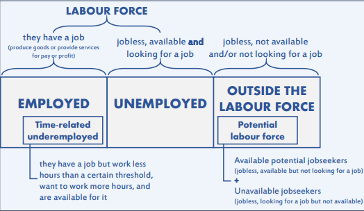
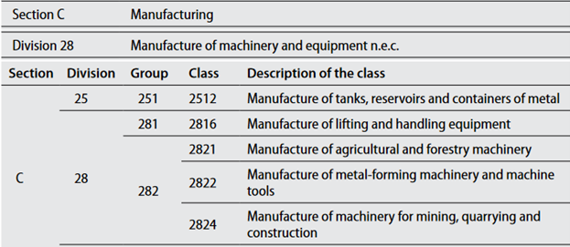

# The GLD harmonization methodology  

For the purposes of this section, harmonization refers only to the act of converting the raw microdata into the variables of the GLD data dictionary. 

## Defining the boundaries of GLD harmonization

The scope of the GLD harmonization is the data dictionary. However, not always the information in the survey fits the concept in the data dictionary. For example, if the questionnaire asks respondents whether the respondent or their employer “contribute to social or private security” is that sufficient to code the `socialsec` variable? Similarly, with a view to the objective of comparison and benchmarking, how should the harmonization handle change to concepts over time, like changes to the definition of employment or administrative areas? 

To define the boundaries of the harmonization, the GLD team follows two principles: (i) each survey is harmonized independently; and (ii) in unclear situations, users are empowered to take informed decisions, rather than having the GLD team making choices for users.

The principle that surveys are harmonized independently means that each survey is harmonized based on the standard and realities present at the time of its collection and processing. Changes introduced in subsequent surveys are not applied retrospectively. For example, if new geographical regions or occupation classifications are introduced, previous surveys will reflect the older versions without any retroactive adjustments.

The principle to allow users to make informed decisions means to provide comprehensive information about changes and document their impact on the data (for example, the [updated occupation classifications in Pakistan](https://github.com/worldbank/gld/blob/main/Support/B%20-%20Country%20Survey%20Details/PAK/LFS/Correspondence_National_International_Classifications.md) and [changes in the definition of employment in Tanzania](https://github.com/worldbank/gld/blob/main/Support/B%20-%20Country%20Survey%20Details/TZA/ILFS/Converting%20between%20ICLS%20Definitions.md)).

However, the GLD harmonization takes a conservative approach, making minimal assumptions and deferring significant decisions to users. This ensures data accuracy and transparency, allowing users to make well-informed choices based on their research objectives.

Unifying elements that have changed over time across multiple surveys or taking leaps on questions that fit the data dictionary only partially is outside the scope of the harmonization. Users are provided with the necessary context and information to bridge these gaps according to their requirements.

##  The structure of the harmonization code

The GLD harmonization code template begins with a header or preamble summarising key survey aspects (see Box 1, below). It contains four blocks:

1.	Information on the code, the author, and the creation date.
2.	Details on the survey context
3.	Details on the versions of the standard classifications used
4.	Version control history, detailing the date and the contents of any changes performed 

```
Box 1 - GLD Harmonization Template Preamble

/*%%=================================================================
	0: GLD Harmonization Preamble
===================================================================*/
/* ----------------------------------------------------------------- 

<_Program name_> [Name of your do file] </_Program name_> 
<_Application_> [Name of your software (STATA) and version] <_Application_> 
<_Author(s)_> [Name(s) of author(s)] </_Author(s)_> 
<_Date created_> YYYY-MM-DD </_Date created_> 

------------------------------------------------------------------ 

<_Country_> [Country_Name (CCC)] </_Country_> 
<_Survey Title_> [SurveyName] </_Survey Title_> 
<_Survey Year_> [Year of start of the survey] </_Survey Year_> 
<_Study ID_> [Microdata Library ID if present] </_Study ID_> 
<_Data collection from_> [MM/YYYY] </_Data collection from_> 
<_Data collection to_> [MM/YYYY] </_Data collection to_> 
<_Source of dataset_> [Source of data, e.g. NSO] </_Source of dataset_> 
<_Sample size (HH)_> [#] </_Sample size (HH)_> 
<_Sample size (IND)_> [#] </_Sample size (IND)_> 
<_Sampling method_> [Brief description] </_Sampling method_> 
<_Geographic coverage_> [To what level is data significant] </_Geographic coverage_> 
<_Currency_> [Currency used for wages] </_Currency_> 

-------------------------------------------------------------------- 

<_ICLS Version_>	 [Version of ICLS for Labor Questions] </_ICLS Version_> 
<_ISCED Version_> [Version of ISCED used to code] </_ISCED Version_> 
<_ISCO Version_>	 [Version of ISCO used to code] </_ISCO Version_> 
<_OCCUP National_> [Version of national occupation code] </_OCCUP National_> 
<_ISIC Version_> [Version of ISIC used to code] </_ISIC Version_> 
<_INDUS National_> [Version of national industry code] </_INDUS National_> 

---------------------------------------------------------------------

<_Version Control_> 
* Date: [YYYY-MM-DD] - [Description of changes]
* Date: [YYYY-MM-DD] - [Description of changes]
</_Version Control_>

-------------------------------------------------------------------*/
```

After the box, the harmonization code is divided into 9 sections. Section 1 contains the codes to set up file and folder paths and assemble the dataset to harmonize from the raw data. It is at this step users would need to update folder and file paths and name if they are using a different storing system (e.g., their server is labelled “E” instead of “Y”).

Sections 2 to 8 cover variables of the different blocks of the data dictionary (e.g., geography, socio-demographic, education, …). Section 9 does the final clean up to keep only variables in the dictionary that have values (i.e., we do not keep variables that have missing values for all respondents), in the correct order. Data is also compressed and unused labels are discarded so the final output is as size-efficient as possible.

Each section is be tagged according to the following rules (see example in Box 2):

- The section marker starts with /*%% followed by the equal sign to pad out the line
- The section title is indented, starting with a number, colon, and section title
- The section marker closes with a line of equal signs ended by %%*/ (inverse of start)

```
Box 2 - Section header example

/*%%=================================================================
1: Setting up of program environment, dataset
=================================================================%%*/
```

Within the “variable” sections 2 to 8, all harmonized variables in the in each section in the data are tagged according to the following convention (see example in Box 3 - Variable tagging example):

- The beginning of the code relating to a harmonized variable should be proceeded by *<_var_> where “var” is the harmonized variable being created.
- The end of the code relating to the variable creation should read *</_var_>.
- Variables that are already named (e.g. if "hhid" exists in raw data file) should be noted. Between the "open" and "close" tags, a starred outline should read:"*'var' present in 'source'".
- If a variable requires more extensive or explicit comments, these should be written between note tags. The note tag is the same as the variable tag only followed by “_note” (e.g., “note_var”). For example, the variable “lstatus” is created in an uncommon or unexpected way, then harmonizers can add the variable-specific note as follow: *<_lstatus_note_> Text explaining issues with variable, why which choices made *</_lfstatus_note_> (see Box 3 below).

```
Box 3 - Variable tagging example
*<_wage_no_compen_>

/*<_wage_no_compen_note_>

The wage questions in the questionnaire are organized into two parts: the first part asks for the specific number of income if the given respondent could recall and was willing to answer; the second part provides different categories of income range if the given respondent could not recall or was not willing to answer the first part. 

The general logic here is to impute wage values for people who only answered an income range. We used industry, occupation, income categories and gender to estimate their specific income values. 

21.86% of total non-missing wage values were imputed using this method.
*<_wage_no_compen_note_>*/

     * Overall --> wage info 
     * Set values of 0 to missing
	 gen wage14=E14_1+E14_2
     replace wage14=. if wage14==0

     * First replace outliers by
     winsor2 wage14, suffix(_w) cuts(1 99)

     * Create salary categories based on winsor values
     gen salary_cat=.
     replace salary_cat=1 if inrange(wage14_w, 1, 55000)

[…]

     * Keep only for employed employees, label
     replace wage_no_compen=. if lstatus!=1|empstat==2
     label var wage_no_compen "Last wage payment primary job 7 day recall"
*</_wage_no_compen_>
```

There are two useful purposes of tagging the harmonization variables: (1) tagging is useful when cross checking the definitions of harmonized variables overtime, and when comparing the comparability of such variables with different countries; (2) tagging will improve the automated updating of the DDI by adding the block of codes used for generating the harmonized variables in the variable description of the DDI. Tagging will also improve the transparency of the metadata DDI for basic users in the Microdata Library. Tagging should be done for one variable at a time, not a group of variables.

## The GLD data dictionary

This section defines one by one each variable in the data dictionary and how they should be harmonized. It is divided into blocks as is done in the harmonization code. Each block section then also contains some lessons learned if any and a tabular overview of the variables.

### Survey & ID module

**countrycode**

countrycode is a string variable that specifies the 3-character country code used by the World Bank to identify each country. Although there are different naming conventions, it is necessary to use those specified to ensure that the data for each country is appropriately labeled.

**survname**

survname codes the acronym of the survey.

**survey**

survey codes the type of survey (e.g., LFS for Labor Force Survey).

**icls_v**

Underlying version of the International Conference of Labour Statisticians that is being used in the survey to code [concepts of work and employment](http://documents1.worldbank.org/curated/en/468881598538973944/pdf/Who-Is-Employed-Evidence-from-Sub-Saharan-Africa-on-Redefining-Employment.pdf).

Most commonly, surveys harmonized to GLD will either follow ICLS-13 or ICLS-19, that is, the directives set out during the 13th or the 19th conference, especially pertaining employment.

In ICLS-13 all work – other than household work – is seen as employment. Thus, subsistence farmers are as employed as the CEO of an international conglomerate. 

The below screenshot (Figure 13) is from the questionnaire of the Zimbabwean 2014 LFS, where any yes answer will skip to questions on main employment (Q25). As highlighted, work for a wage is treated in the same than work on any agricultural holding. This survey follows ICLS-13.

<br></br>
Figure 13 - Example of 2014 ZWE LFS questionnaire

<br></br>

Five years later, the Zimbabwean statistics office, ZimStat, switched to ICLS-19. In ICLS-19, only work for market exchange is considered employment (treating subsistence farming in the same way as household labour). Thus, an additional question is added to differentiate what kind of farming is taking place. The below screenshot (Figure 14) is part of the set of agriculture questions. If the agricultural work on the own agricultural holding is only or mostly for market exchange (codes 1 and 2) the individual should be asked about their first main job (MJ1). If agricultural production is only or mainly for own consumption, then the questionnaire continues, here asking whether they work for others for hire.

<br></br>
Figure 14 - Example of 2019 ZWE LFS questionnaire

<br></br>

If the survey asks questions to understand what kind of farming takes place (subsistence or market exchange) and defines a skip pattern to lead to employment questions based on that, the survey questionnaire follows ICLS-19, otherwise it follows ICLS-13.

**isced_version**

Underlying version of the [International Standard Classification of Education](http://uis.unesco.org/en/isced-mappings) (ISCED) used in the survey. Acceptable values are either isced_1997 or isced_2011.

**isco_version**
Underlying version of the [International Standard Classification of Occupations](https://ilostat.ilo.org/resources/concepts-and-definitions/classification-occupation/) (ISCO) used in the survey. Acceptable values are either isco_1988 or isco_2008

**isic_version**

Underlying version of the [International Standard Industrial Classification of All Economic Activities](https://unstats.un.org/unsd/classifications/Econ/isic) (ISIC) used in the survey. Acceptable values are either isic_2, isic_3, isic_3.1, or isic_4.

**year**

year is a numeric variable that denotes the year in which the implementation of the household survey was begun. For example, if a survey was implemented during October 2018 and September 2019, the year would be 2018.

**vermast**

vermast codes the version of the master file (original data) being used in the harmonization.

**veralt**

veralt codes the version of the harmonization.

**harmonization**

harmonization codes the kind of harmonization (GLD or GMD). For GLD surveys this will always be GLD.

**int_year**

int_year is a numeric variable that specifies the year when the survey questionnaire was administered to the household.

**int_month**

int_month is a numeric variable that specifies the month when the survey questionnaire was administered to the household.

**hhid**

hhid specifies the unique household identification number in the data file. The original format, string or numeric, of original data should be kept. If there is Household ID in the original data, hhid and hhid_orig should be the same. If hhid_orig is missing, it is constructed by "variable names in raw data" variables.

**pid**

This variable allows identification of individuals. Variable will vary in length depending on how the identification code was constructed in each country. Depending on individual countries, this variable may be a concatenation of several variables in the raw data file. Keep format (string or numeric) of original data. If there is Personal ID in the original data, pid and pid_orig should be the same. If pid_orig is missing, it is constructed by "variable names in raw data" variables.

**weight**

weight contains household weights, typically inversely proportional to the probability of the household being selected for the sample, that should be applied to all analysis to make the results representative of the population.

**weight_m**

weight contains household weights, typically inversely proportional to the probability of the household being selected for the sample, that should be applied to all analysis to make the results representative of the population for each month. To be added only if present in the raw data and survey reports estimate results per month.

**weight_q**

weight contains household weights, typically inversely proportional to the probability of the household being selected for the sample, that should be applied to all analysis to make the results representative of the population for each quarter. To be added only if present in the raw data and survey reports estimate results per quarter.

**psu**

Primary sampling unit (psu) refers to sampling units that are selected in the first (primary) stage of multi- stage sample design. These sampling units typically correspond to a number of large aggregate units (clusters), each of which contains sub-units. For example, a primary sampling unit can represent the set of all housing units contained in a well-defined geographic area, such as a municipality or a group of contiguous municipalities. Primary sampling units are numeric and country-specific. A unique identifier is created for each primary sampling unit. In Stata, users are advised to specify the primary sampling unit through the svyset command.

**ssu**

Secondary sampling unit code (if present).

**strata**

Unit defining the first stage stratification strategy.

**wave**

In case of the survey being rolled out over several waves (e.g. quarterly), codes the information of the iteration of the survey.

**panel**

A string variable denoting which panel the individual belongs to. A panel is defined as all individuals who entered a survey at the same time (e.g., Q3 of 2020) and are scheduled to exit at the same time after a fixed number of survey waves (e.g., after four quarters). 

Note that due to attrition not all intakes may exit at the same time. This variable is only to be coded if the concept is present in the raw data already.

**visit_no**

A numeric variable denoting the visit number (e.g., first visit coded as 1, second visit as 2, …) within a panel. This variable is only to be coded if the concept is present in the raw data already.

*Lessons Learned and common challenges*

Coding IDs correctly is integral to allow for analytical tools to leverage the information. The coding of the identifications should follow from the survey structure and should not be built via a sequential index (e.g., gen hhid = _n). Since observations may be ordered differently, possibly even across different vintages of the same file, the coding may lead to different outcomes.

```
* Create hhid like this:
gen hhid = psu * 100 + hh
* Note like this:
gen hhid = _n
```

When creating hhid and pid, especially from string variables or from group(varlist) or concat(varlist) functions, users should try to create them from roster data files first where all information or observations are available. In addition, the order of the variables in the varlist option above must be the same across the files. Across the data files, the order and the sort on the variables in the varlist must be done in the same way across files.

When the hhid and pid are in numeric format but less precision, it is recommended to bring them the accurate precision level so it can be used in the merging correctly. For example, the value of the hhid for an observation might be 100021210121 (a long number), users should format the variable by “format %15.0g hh”.

In case a household survey is conducted more than once per year – e.g. quarterly HH surveys – you may want to use this as panel data, in which case the household ID can remain as is. However, if you want to use the data as cross-sectional, then new HHIDs can be constructed for each HH for each quarter.

| Quarter    | Quarter 1 | Quarter 2 | Quarter 3 | Quarter 4 |
|------------|-----------|-----------|-----------|-----------|
| hhid_orig  | hhid=1    | hhid=1    | hhid=1    | hhid=1    |
| hhid       | hhid=1Q1  | hhid=1Q2  | hhid=1Q3  | hhid=1Q4  |

hhid should never be missing and if there is any missing this variable should be checked.

```
assert missing(hhid)
```

It is recommended to check the uniqueness level of the data files with identifier variables at the corresponding level of the data (i.e. household vs individual level data).

hhid and pid need to be unique in the database.

```
isid hhid pid
cap destring pid, replace 
duplicates report hhid pid 
local n=r(unique_value)
`N'!= `n'
```

Ensure that country is a three-letter country code.

```
cap confirm str3 var country _rc!=0
```

Harmonizers should also ensure that country codes are updated according to the [ISO country codes](https://en.wikipedia.org/wiki/ISO_3166-1_alpha-3). Some common adjustments include the following:

```
replace countrycode="XKX" if countrycode=="KSV"
replace countrycode="TLS" if countrycode=="TMP" 
replace countrycode="PSE" if countrycode=="WBG"
replace countrycode="COD" if countrycode=="ZAR"
```

Furthermore, harmonizers should check that the years used are in an appropriate range.

The year needs to be a four-digit number in the range of 1980 to the current year (assumed here to be 2020).

```
assert year >= 1900 & year <= 2050
```

*Overview of Variables*

| Module | Variable label | Variable name | Notes |
|--------|----------------|---------------|-------|
| Survey & ID | ISO 3 Letter country code | countrycode | |
| Survey & ID | Survey acronym | survname | No spaces, no underscores, split sections by "-" (e.g. "ETC-II") |
| Survey & ID | Survey long name | survey | Possible names are: LFS, LSMS, …   [I am unsure of this difference, some surveys contain either this or the previous variable, have yet to see one with both] |
| Survey & ID | Version of the ICLS followed | icls_v | Defines the labor force definitions used according to the rules set out by the nth International Conference of Labour Statisticians. |
| Survey & ID | Version of ISCED used | isced_version | |
| Survey & ID | Version of ISCO used | isco_version | |
| Survey & ID | Verstion of ISIC used | isic_version | |
| Survey & ID | Year of survey start | year | |
| Survey & ID | Master (Source) data version | vermast | |
| Survey & ID | Alternate (Harmonized) data version | veralt | |
| Survey & ID | Kind of harmonization | harmonization | |
| Survey & ID | Year of interview start | int_year | For HH and Individual interviews in that HH earliest possible date |
| Survey & ID | Month of interview start | int_month | For HH and Individual interviews in that HH earliest possible date |
| Survey & ID | Household ID | hhid | |
| Survey & ID | Personal ID | pid | |
| Survey & ID | Survey weights | weight | |
| Survey & ID | Primary sampling unit | psu | |
| Survey & ID | Secondary sampling unit | ssu | |
| Survey & ID | Stratification (of PSU) | strata | |
| Survey & ID | Wave of the survey (e.g., Q1 for quarter 1) | wave | |
| Survey & ID | Panel the individual belongs to | panel | Only code if concept already in survey |
| Survey & ID | Visit number in panel order | visit_no | Only code if concept already in survey |

### Geography

**urban**

urban is a dummy variable that specifies the location type – urban or rural - of the household. This variable is country specific as each country uses its own criterion to distinguish urban from rural areas. In many cases there is no clear division between urban and rural areas, and areas are classified as “semi-urban” or “mixed”. Harmonizers are advised to classify such categories as “urban.”

Urban categories:
1 = Urban
0 = Rural

**subnatid1**

subnatid1 refers to a subnational identifier at the highest level within the country’s administrative structure. This is typically a province or state. The variable is string and country-specific categorical. Numeric entries are coded in string format using the following naming convention: “1 – Hatay”. That is, the variable itself is to be string, not a labelled numeric vector.

**subnatid2**

subnatid2 refers to a subnational identifier at which survey is representative at the second highest level within the country’s administrative structure. This is typically a district. The variable is string and country- specific categorical. Numeric entries are coded in string format using the following naming convention: “1 – Hatay”. That is, the variable itself is to be string, not a labelled numeric vector.

**subnatid3**

subnatid3 refers to a sub-national identifier at which survey is representative at the third level within the country’s administrative structure. This is typically a sub-district. The variable is string and country-specific categorical. Numeric entries are coded in string format using the following naming convention: “1 – Hatay”. That is, the variable itself is to be string, not a labelled numeric vector.

**subnatid4**

subnatid4 refers to a sub-national identifier at which survey is representative at the lowest level within the country’s administrative structure. In some countries, this is effectively a village. The variable is string and country-specific categorical. Numeric entries are coded in string format using the following naming convention: “1 – Hatay”. That is, the variable itself is to be string, not a labelled numeric vector.

**subnatidsurvey**

subnatidsurvey is a string variable that refers to the lowest level of the administrative level at which the survey is representative. In most cases this will be equal to variable subnatid1 or subnatid2. However, in some cases the lowest level is classified in terms of urban, rural (i.e., variable urban) or any other regional categorization cannot be mapped to subnatid#. 

The below example (Table 3) shows how to code subnatidsurvey for a survey that is representative at the rural/urban level of the province (subnatid1).

Table 3 - Example of a survey significant at subnatid1 and urban/rural level

| subnatid1        | urban | subnatidsurvey     |
|------------------|-------|--------------------|
| "1 – Province A" | 1 | "1 – Province A urban" |
| "1 – Province A" | 1 | "1 – Province A urban" |
| "1 – Province A" | 1 | "1 – Province A urban" |
| "1 – Province A" | 1 | "1 – Province A urban" |
| "1 – Province A" | 0 | "1 – Province A rural" |
| …                | … | …                      |
| "2 – Province B" | 0 | "2 – Province B rural" |
| "2 – Province B" | 0 | "2 – Province B rural" |
| "2 – Province B" | 0 | "2 – Province B rural" |
| "2 – Province B" | 0 | "2 – Province B rural" |
| "2 – Province B" | 1 | "2 – Province B urban" |
| "2 – Province B" | 1 | "2 – Province B urban" |


While the below (Table 4) is the example of a survey representative nationally, nationally at urban / rural level and at province level.

Table 4 - Example of a survey significant at subnatid1 level

| subnatid1        | urban | subnatidsurvey |
|------------------|-------|----------------|
| "1 – Province A" | 1 | "1 – Province A" |
| "1 – Province A" | 1 | "1 – Province A" |
| "1 – Province A" | 1 | "1 – Province A" |
| "1 – Province A" | 1 | "1 – Province A" |
| "1 – Province A" | 0 | "1 – Province A" |
| …                | … | …                |
| "2 – Province B" | 0 | "2 – Province B" |
| "2 – Province B" | 0 | "2 – Province B" |
| "2 – Province B" | 0 | "2 – Province B" |
| "2 – Province B" | 0 | "2 – Province B" |
| "2 – Province B" | 1 | "2 – Province B" |
| "2 – Province B" | 1 | "2 – Province B" |

The variable would contain survey representation at lowest level irrespective of its mapping to subnatids.

**subnatid1_prev**

subnatid1_prev is coded as missing unless the classification used for subnatid1 has changed since the previous survey. In that case, it refers to the subnatid1 code used in the previous survey. This provides a way of tracking splits. For example, if province “32 – West Java” split into province “32 – West Java” and “36 – Banten” since the most recent survey, subnatid1_prev would be "32 – West Java” for cases when subnatid1 is either “32 – West Java” or “36 – Banten”.

**subnatid2_prev**

subnatid2_prev is coded as missing unless the classification used for subnatid2 has changed since the previous survey. In that case, it refers to the subnatid2 code used in the previous survey.

**subnatid3_prev**

subnatid3_prev is coded as missing unless the classification used for subnatid3 has changed since the previous survey. In that case, it refers to the subnatid3 code used in the previous survey.

**subnatid4_prev**

subnatid4_prev is coded as missing unless the classification used for subnatid4 has changed since the previous survey. In that case, it refers to the subnatid4 code used in the previous survey.

**strata**

strata refer to the division of the target population – typically the census sample frame -- into subpopulations based on auxiliary information that is known about the full population. Sampling is conducted separately for each stratum. The strata should be mutually exclusive: every element in the population must be assigned to only one stratum. The strata should also be collectively exhaustive: no population element can be excluded. Sampling strata need to be considered when constructing the variance (or confidence intervals) of population estimates. The strata variable is needed for the correct calculation of standard deviation for each sample design. Strata is numeric and country specific. A unique identifier is created for each stratum. In STATA, users are advised to specify strata through the svyset command. The variable is in string format with the following naming convention “code of stratum – stratum name”, for example: “1 – Dar-es-salaam”.

**gaul_adm1_code**

gaul_adm1_code is numeric and country-specific based on the GAUL database. It should be taken from the same data in the [GAUL database](https://datacatalog.worldbank.org/int/search/dataset/0043635) where the geographical area can be identified in the survey based on the name of the location/area. The number of unique values from the subnatid1 and the gaul_adm1_code could be different or the same. For example, in the case of a fictional country, if the highest-level representation is the state level (53 states) and Gaul also has 53 states, it is the same in this case. In a different example, the survey is representative at the level of statistical regions (7) while the identifiable GAUL code is at state level (53 states); with this setup, one can know how the seven statistical regions are constructed.

**gaul_adm2_code**

gaul_adm2_code is numeric and country-specific based on the GAUL database. It should be taken from the same data in the GAUL database where the geographical area can be identified in the survey based on the name of the location/area.

*Lessons Learned and Challenges*

- subnatid codes should reflect the most recent codes that pertain to that survey. subnatid_prev codes can be used to track splits and new administrative units that have been introduced since the previous survey. It is important to ensure there is consistency in geographic variables across time. Sub- nationally representative units may be added in later additions of surveys, so names of subnational units must be consistent across time. This will allow analysts to make the current administrative units “backwards-compatible” with little additional effort.
- Harmonizers should ensure the subnatid1 through subnatid4 are string variables NOT categorical.
- The urban variable cannot be different from zero or one.
```
urban!= 1 & urban!= 0
```

*Overview of Variables* 

| Module Code | Variable name | Variable label | Notes |
|-------------|---------------|-----------------|-------|
| Geography | urban | Binary - Individual in urban area | |
| Geography | subnatid[i] | Subnational ID - [ith] level | Subnational ID at the ith level, listing as many as available |
| Geography | subnatidsurvey | Lowest level of Subnational ID | subnatidsurvey is a string variable that refers to the lowest level of the administrative level at which the survey is representative. In most cases this will be equal to "subnatid1" or "subnatid2". However, in some cases the lowest level is classified in terms of urban, rural or any other regional categorization cannot be mapped to subnatids. The variable would contain survey representation at lowest level irrespective of its mapping to subnatids. |
| Geography | subnatid[i]_prev | Subnatid previous - [ith] level | Previous subnatid if changed since last survey |
| Geography | strata | Strata | |
| Geography | gaul_adm[i]_code | GAUL ADM[i] code | See en.wikipedia.org/wiki/Global_Administrative_Unit_Layers |

### Demography

**hsize** 

hsize codes the size of the household. This should not include individuals who may be living in the household but do not form an economic unit with the other household members (e.g., a live-in maid is not part of the household).

**age**

age refers to the interval of time between the date of birth and the date of the survey. Every effort should be made to determine the precise and accurate age of each person, particularly of children and older persons. Information on age may be secured either by obtaining the date (year, month, and day) of birth or by asking directly for age at the person’s last birthday. In addition, in the case of children aged less than or equal to 60 months, variable age should be expressed in the number of completed years and months in decimals. For example, If the interview of a 4 years old was in December and he was born in June, his age should be recorded as 4.5. Lastly, if the information on age is not available, it should be coded as missing rather than some other value such as “99” or “999”.

**male**

male is a dummy variable that specifies the sex – male or female – of an individual within a household. While constructing this variable, it is important to make sure that all relevant values are included. Variable values coded as ‘98’ or other numeric characters should be excluded from the values of the `male’ variable. Sex of household member, two categories after harmonization:

1 = male
0 = female

**relationharm**

relationharm is a string variable that indicates a relationship to the reference person of household (usually the head of household). Variable values coded as ‘98’ or other numeric characters should be excluded from the values of relationharm variable.

Relationship to head of household, six categories after harmonization:

1=head
2=spouse
3=children
4=parents
5=other relatives
6=non-relatives

Note: In cases where head is missing or a migrant, we assign spouse as the head of the household. If spouse is also not available, then we will use oldest member of the household as the head and recode all the relations to head accordingly.

**relationcs**

relationcs is a country-specific categorical variable that indicates the relationship to the head of the household. The categories for relationship to the head of the household are defined according to the region or country requirements.

**marital**

Marital is a categorical variable that refers to the personal status of each individual in relation to the marriage laws or customs of the country. The categories of marital status to be identified should include at least the following: (a) single (in other words, never married); (b) married; (c) married but separated; (d) windowed and remarried; (e) divorced and not remarried. 

In some countries, category (b) may require a subcategory of persons who are contractually married but not yet living as man and wife. In all countries, category (c) should comprise both the legally and the de facto separated, who may be shown as separate subcategories if desired. The marital variable should not be imputed but rather calculated only for those to whom the question was asked (in other words, the youngest age at which information is collected may differ depending on the survey). 

The consistency between age and marital needs to be cross-checked. In most countries, there are also likely to be persons who were permitted to marry below the legal minimum age because of special circumstances. To permit international comparisons of data on marital status, however, any tabulations of marital status not cross-classified by exact age should at least distinguish between persons under 15 years of age and over. If it is not possible to distinguish between married and living together, then it should be assumed that the individual is married. Variable values coded as ‘98’ or other numeric characters should be excluded from the values of the ‘marital’ variable.

Marital status, five categories after harmonization: 

1=married
2=never married 
3=living together
4=divorced/separated 
5=widowed

**eye_dsablty**

eye_dsablty is a numerical variable that indicates whether an individual has any difficulty in seeing, even when wearing glasses. Categories after harmonization:

1 = No – no difficulty
2 = Yes – some difficulty 
3 = Yes – a lot of difficulty 
4 = Cannot do at all

**hear_dsablty**

hear_dsablty is a numerical variable that indicates whether an individual has any difficulty in hearing even when using a hearing aid. Categories after harmonization:

1 = No – no difficulty
2 = Yes – some difficulty 
3 = Yes – a lot of difficulty 
4 = Cannot do at all

**walk_dsablty**

walk_dsablty is a numerical variable that indicates whether an individual has any difficulty in walking or climbing steps. Categories after harmonization:

1 = No – no difficulty
2 = Yes – some difficulty 
3 = Yes – a lot of difficulty 
4 = Cannot do at all

**conc_dsord**

conc_dsord is a numerical variable that indicates whether an individual has any difficulty concentrating or remembering. Categories after harmonization:

1 = No – no difficulty
2 = Yes – some difficulty 
3 = Yes – a lot of difficulty 
4 = Cannot do at all

**slfcre_dsablty**

slfcre_dsablty is a numerical variable that indicates whether an individual has any difficulty with self-care such as washing all over or dressing. Categories after harmonization:

1 = No – no difficulty
2 = Yes – some difficulty 
3 = Yes – a lot of difficulty 
4 = Cannot do at all

**comm_dsablty**

comm_dsablty is a numerical variable that indicates whether an individual has any difficulty communicating or understanding usual (customary) language. Categories after harmonization:

1 = No – no difficulty
2 = Yes – some difficulty 
3 = Yes – a lot of difficulty 
4 = Cannot do at all

*Lessons Learned and Challenges*

Data sets that are harmonized incorrectly can lead to skewed and/or incorrect data analysis. Harmonizers should run a series of checks to ensure data is harmonized properly, including the following:

Check to make sure that age is an integer since 5 years old.

```
age/int(age)!= 1 & age!= . & age > 5
```

age cannot have negative or extreme values (>120)

```
(age < 0 | age>120) & age<.	
```

Age cannot be missing

```
age==.	
```

Male variable can only take one of two values 0 or 1 (or missing).

```
male!=. & male!= 1 & male!= 0
```

Check if male is missing.

```
male==.
```

Check to make sure that there is variation in male

```
egen sdmale = sd(male) // sdmale should be 0
```

relationharm must be an integer in the range [1,6].

```
relationharm<1 & relationharm>6 & mod(relationharm, 1) == 1
```

marital must be an integer in the range [1,5].

```
marital<0 & marital>5 & mod(marital, 1) == 1
```

Children are “Never married” and should be coded as so even though it may be perceived as obvious. The marital status of individuals should be harmonized for all individuals. Harmonizers should check to make sure children are not systematically left with missing values for marital.

```
tab age marital, missing
```

weight cannot be missing

```
weight==.
```

Additionally, harmonizers should ensure that the household size variable is calculated correctly. Not all the individuals reported in a household that form the raw data are current household members. For example, for the EU-SILC survey, a household contains the current member, but also the members of the previous survey who have left the household for reasons such as death or migration.

*Overview of Variables*

| Module Code | Variable name | Variable label | Notes |
|-------------|---------------|----------------|-------|
| Demography | hsize | Household size | |
| Demography | age | Age in years | |
| Demography | male | Binary - Individual is male | |
| Demography | relationharm | Relationship to head of household harmonized across all regions | GMD - Harmonized categories across all regions. Same as I2D2 categories. |
| Demography | relationcs | Relationship to head of household country/region specific | country or regionally specific categories |
| Demography | marital | Marital status | |
| Demography | eye_dsablty | Difficulty seeing | See "[Recommended Short Set of Questions](https://www.cdc.gov/nchs/washington_group/wg_questions.htm)" for all disability questions |
| Demography | hear_dsablty | Difficulty hearing | |
| Demography | walk_dsablty | Difficulty walking / steps | |
| Demography | conc_dsord | Difficulty concentrating | |
| Demography | slfcre_dsablty | Difficulty w/ selfcare | |
| Demography | comm_dsablty | Difficulty communicating | |
 
 
### Migration

**migrated_mod_age**

Codes the minimum age the migration module questions of the survey apply to (e.g., if the migration questions are for all 5 years and above this would be 5).

**migrated_ref_time**

Codes the reference period the migration questions cover. If the migration questions only apply after an introductory time window questions (e.g., have you moved in the past five years) and then questions are only asked for those who fall within the time window, code the length of that window (e.g., 5 in the example). If migration questions are posed regardless of time (i.e., no time window) code 99.

**migrated_binary**

Binary question coding whether the individual has ever migrated (within the reference time set out above).

**migrated_years**

Number of full years since the last migration. Often surveys ask how long a person has lived at their current domicile since the last migration. Both questions cover the same information.

**migrated_from_urban**

Codes whether the individual migrated to their current domicile from an urban area.

1 = Yes (i.e., came from urban area)
0 = No (i.e., came from rural area)

**migrated_from_cat**

If the survey contains information on the area from where the person migrated, use the [concept of administrative division](https://en.wikipedia.org/wiki/Administrative_division) to inform the migration pattern. The codes are: 

1 = From same admin3 area
2 = From same admin2 area
3 = From same admin1 area
4 = From other admin1 area
5 = From other country

To exemplify the use, Spain is divided into Communities (admin1 level), Provinces (admin2 level) and municipalities (names change within provinces, but rough concept holds – admin3 level). A person moving within the municipality, for example, from one village to the next, codes 1. A person moving within the province, say from a rural municipality to the province capital codes 2. A person moving within the same community yet leaving their province codes 3. A person moving from one community to another, say from [Andalusia](https://en.wikipedia.org/wiki/Andalusia) to [Galicia](https://en.wikipedia.org/wiki/Galicia_(Spain)), codes 4. If the person moved from outside the country (regardless of their nationality) codes 5.

**migrated_from_code**

Based on the logic set out in the `migrated_from_cat` variable, codify the areas of migration using the survey subnation id classification. For example, if a person migrated from one admin1 area to another, use the subnatid1 codes to inform from which admin1 area they migrated to their current residence (which is codified in subnatid1).

This only codifies information within the country. Set to missing if migrated_from_cat is 5.

Note that most surveys will only provide information of last residence to a higher administrative level (e.g., admin1 level). Codify the information up to the highest level possible. See an example in lessons learned below.

**migrated_from_country**

Codes the country (if migrated_from_cat is 5) from where the person migrated from as a [three letter ISO country code](https://en.wikipedia.org/wiki/ISO_3166-1_alpha-3) or a clear string for regions (“Other Europe”, “Other World”, …)

**migrated_reason**

Codifies the reason why a person migrated. The codes are: 

1 = Family reasons
2 = Educational reasons
3 = Employment
4 = Forced (political reasons, natural disaster, …)
5 = Other reasons

*Lessons Learned and Challenges*

**Codifying migrated_from_* questions**

In the Indian LFS from 1999 (NSS Schedule 10) there are two questions that allow us to codify the four migrated_from_[text] variables (migrated_from_urban, migrated_from_cat, migrage_from_code, and migrated_from_country).

Question 15 of Block 4 asks interviewer to enter the “location code” for the kind of migration the interviewees claim to have made. The codes are:

```
location of last usual residence: same district: rural-1, urban-2; same state but another district: rural-3, urban-4; another state: rural-5, urban-6; another country-7
```

Question 17 of Block 4 then asks for the state code of migration (as codified in subnatid) and adds additional codes for countries from where people commonly migrated into India.
With these two questions we can harmonize the two variables in the following way:

```
*<_migrated_from_urban_>
	gen migrated_from_urban = .
replace migrated_from_urban = 1 if inlist(B4_q15,"2","4","6") &
migrated_binary == 1
replace migrated_from_urban = 0 if inlist(B4_q15,"1","3","5") &
migrated_binary == 1
label de lblmigrated_from_urban 0 "Rural" 1 "Urban"
label values migrated_from_urban lblmigrated_from_urban
label var migrated_from_urban "Migrated from area"
*</_migrated_from_urban_>
	
*<_migrated_from_cat_>
	gen migrated_from_cat = .
replace migrated_from_cat = 2 if inlist(B4_q15,"1","2") &
migrated_binary == 1
replace migrated_from_cat = 3 if inlist(B4_q15,"3","4") &
migrated_binary == 1
replace migrated_from_cat = 4 if inlist(B4_q15, "5", "6") &
migrated_binary == 1
replace migrated_from_cat = 5 if inlist(B4_q15, "7") &
migrated_binary == 1
label de lblmigrated_from_cat 1 "From same admin3 area" 2 "From
same admin2 area" 3 "From same admin1 area" 4 "From other admin1 area" 5 "From other country"
label values migrated_from_cat lblmigrated_from_cat
label var migrated_from_cat "Category of migration area"
*</_migrated_from_cat_>
	
*<_migrated_from_code_>
	destring B4_q17, gen(helper_var)
gen migrated_from_code = .
replace migrated_from_code = subnatid1 if
inrange(migrated_from_cat,1,3)
replace migrated_from_code = helper_var if migrated_from_cat == 4
label var migrated_from_code "Code of migration area as subnatid
level of migrated_from_cat"
drop helper_var
*</_migrated_from_code_>
	
*<_migrated_from_country_>
	gen migrated_from_country = ""
replace migrated_from_country = "BGD" if migrated_from_cat == 5 &
B4_q17 == "51"
replace migrated_from_country = "NPL" if migrated_from_cat == 5 &
B4_q17 == "52"
replace migrated_from_country = "PAK" if migrated_from_cat == 5 &
B4_q17 == "53"
replace migrated_from_country = "LKA" if migrated_from_cat == 5 &
B4_q17 == "54"
replace migrated_from_country = "BTN" if migrated_from_cat == 5 &
B4_q17 == "55"
replace migrated_from_country = "Gulf countries" if
migrated_from_cat == 5 & B4_q17 == "56"
replace migrated_from_country = "Other Asian" if
migrated_from_cat == 5 & B4_q17 == "57"
replace migrated_from_country = "USA" if migrated_from_cat == 5 &
B4_q17 == "58"
replace migrated_from_country = "CAN" if migrated_from_cat == 5 &
B4_q17 == "59"
replace migrated_from_country = "Other Americas" if
migrated_from_cat == 5 & B4_q17 == "60"
replace migrated_from_country = "UK" if migrated_from_cat == 5 &
B4_q17 == "61"
replace migrated_from_country = "Other Europe" if
migrated_from_cat == 5 & B4_q17 == "62"
replace migrated_from_country = "African countries" if
migrated_from_cat == 5 & B4_q17 == "63"
replace migrated_from_country = "Other World" if
migrated_from_cat == 5 & B4_q17 == "64"
label var migrated_from_country "Code of migration country (ISO 3
Letter Code)"
*</_migrated_from_country_>
 ```
 
*Overview of Variables*

| Module Code | Variable name | Variable label | Notes |
|-------------|---------------|----------------|-------|
| Migration | migrated_mod_age | Migration module application age | |
| Migration | migrated_ref_time | Reference time applied to migration questions | If migrated_ref_time = 5 means questions about migration refer to any migration in the last 5 years |
| Migration | migrated_binary | Individual has migrated | |
| Migration | migrated_years | Years since latest migration | Years since last migration is the same as how long lived at current location |
| Migration | migrated_from_urban | Migrated from area | No means migrated from rural area |
| Migration | migrated_from_cat | Category of migration area | |
| Migration | migrated_from_code | Code of migration area | |
| Migration | migrated_from_country | Code of migration country | |
| Migration | migrated_reason | Reason for migrating | |
	
### Education

**ed_mod_age**

Codifies the minimum age for which education questions are asked. For example, if education information is only requested from those 4 years and older the variable should be set to 4.

**school**

Codifies whether the person is currently (i.e., at the time of the survey) attending formal education. The codes are: 

0 = No
1 = Yes

**literacy**

Codifies whether person can read and write in at least one language. The codes are: 
0 = No
1 = Yes

**educy**

Codifies the number of years spent in education.

**educat7**

Classifies the highest level of education attained by the respondent to seven levels. The codes are: 

1 = No education
2 = Primary incomplete
3 = Primary complete
4 = Secondary incomplete
5 = Secondary complete
6 = Higher than secondary but not university 
7 = University incomplete or complete

The concept of secondary complete includes all students who have had attended at least one year (complete or incomplete) of upper secondary education (as defined in the ISCED Mappings of UNESCO). That is attendance and completion of “junior high” shall be coded as secondary incomplete while attendance to “senior high school” even if for one year, will be coded as secondary complete.

**educat5**

Classifies the highest level of education attained by the respondent to five levels. The codes are: 

1 = No education
2 = Primary incomplete
3 = Primary complete but secondary incomplete
4 = Secondary complete
5 = Some tertiary/post-secondary

**educat4**

Classifies the highest level of education attained by the respondent to four levels. The codes are: 
1 = No education
2 = Primary (complete or incomplete)
3 = Secondary (complete)
4 = Tertiary (complete or incomplete)

Note: Code as primary education anyone who has undergone some schooling but has not finished secondary education.

**educat_orig**

Original education code as in the raw survey data. If the original survey has a single variable coding the education information, simply copy (`gen educat_orig = survey_education_var`).

If the survey splits the respondents into different groups (commonly a question for people attending school and a different one for those no longer in education), then educat_orig should be made up of both variables. Figure 15 below, shows the example from the 2022 Bangladesh LFS. The skip pattern from variable EDU_02 is not clear, but in the data people who are attending (EDU_02 code 01) answer question EDU_03 and skip EDU_04, while those who state that they attended in the past but are not currently enrolled (EDU_02 code 02) skip EDU_03 and answer EDU_04. People who never attended school (EDU_02 code 03) skip both EDU_03 and EDU_04. In this case educat_orig should be coded as the union of the information of either group (i.e., educat_orig ought to contain the information of both EDU_03 and EDU_04).

<br></br>
Figure 15 - Education variables in the 2022 Bangladeshi LFS

<br></br>

In other cases, the information may be split into two sub-questions. Figure 16, below, shows the question on education from the 2021 Zimbabwean LFS. Here the information is split into two variables: a level (which we will refer to as ED3a) and a grade within that level (ED3b). 

<br></br>
Figure 16 - Education question in the 2021 ZWE LFS

<br></br>

If it is possible to combine the information (e.g., by concatenating both variable) this should be tried and explicitly commented in the code. If it is not possible to confidently convey the information split over two (or more) variables, the harmonizer shall leave the educat_orig variable missing.

**educat_isced**

Code of the highest educational level attained as per the International Standard Classification of Education (ISCED). Note that the preamble to the harmonization code should record what version of ISCED is being used.

Moreover, the code should always be as long as the longest depth available for the ISCED version. For example, the latest version at the time of writing (ISCED 2011) has up to three digits. Where the first digit is the level, the first two digits are the category, and all three digits codify the sub-category.

As an example, level 2 codifies “Lower secondary education”, 24 “Lower secondary general education”, and 242 “Sufficient for partial level completion, without direct access to upper secondary education”. Every code should be three digits long. If we only know the level (here 2) add two zeroes after it (here: 200). If we only have the category information (here 24) add a zero to reach three digits (here 240). 
 
*Overview of Variables*

Here's the information converted into a markdown table:

| Module Code | Variable name | Variable label | Notes |
|-------------|---------------|-----------------|-------|
| Education | ed_mod_age | Education module minumum age |  |
| Education | school | Currently in school |  |
| Education | literacy | Individual can read and write |  |
| Education | educy | Years of education |  |
| Education | educat7 | Level of education 7 categories | No option for "Other", as opposed to I2D2, anything not in these categories is to be set to missing |
| Education | educat5 | Level of education 5 categories |  |
| Education | educat4 | Level of education 4 categories |  |
| Education | educat_orig | Original education code | Code if there is a single original education variable (as is in most cases). If there are two or more variables, leave missing, make a note of it. |
| Education | educat_isced | International Standard Classification of Education (ISCED A) | Codes are for example:  |
|  |  |  | 2 Lower secondary education |
|  |  |  | 24 General |
|  |  |  | 242 Partial level completion, without direct access to upper secondary education |
|  |  |  | Should be coded as 200, 240, and 242 respectively. |
 
### Training

**vocational**

Codifies whether the person ever attended vocational training. The codes are: 

0 = No
1 = Yes

**vocational_type**

Codifies whether the vocational training took place within the enterprise or was administered by an external party. The codes are: 

1 = Inside Enterprise
2 = External

**vocational_length_l**

Codifies how long the training was in months. Divided into lower and upper in case the information is coded as a range (e.g., 0-3 months, 6-12 months, …). If it is an exact number, lower and upper length are equal. 

**vocational_length_u**

see vocational_length_l

**vocational_field_orig**

Information on the field of training as stored originally in the survey. This variable is to be a string variable. If numeric convert to string while preserving its original structure.

**vocational_financed**

Information on how the vocational training was financed. The codes are: 

1 = Employer
2 = Government
3 = Mixed Employer-Government
4 = Own funds
5 = Other

*Overview of Variables*

| Module | Code | Variable name | Variable label | Notes |
|--------|------|---------------|----------------|-------|
| Education | vocational | Ever received vocational training | |
| Education | vocational_type | Type of vocational training | |
| Education | vocational_length_l | Length of training, lower limit | |
| Education | vocational_length_u | Length of training, upper limit | |
| Education | vocational_field_orig | Original field of training information | |
| Education | vocational_financed | How training was financed | If funded with different sources, chose main source |

### Labour

**minlaborage**

This is the lowest age for which the labor module is implemented in the survey or the minimum working age in the country. For this reason, the lower age cutoff at which information is collected will vary from country to country.

*Labour status, 7-day reference period*

**lstatus**

lstatus is an individual’s labor status in the last 7 days. The value must be missing for individuals less than the required age (minlaborage).

Three categories are used after harmonization:

1 = Employed
2 = Unemployed
3 = Not-in-labor force

All persons are considered active in the labor force if they presently have a job (formal or informal, i.e., employed) or do not have a job but are actively seeking work (i.e., unemployed).

1 = Employed

Employed is defined as anyone who worked during the last 7 days or reference week, regardless of whether the employment was formal or informal, paid or unpaid, for a minimum of 1 hour. Individuals who had a job, but for any reason did not work in the last 7 days are considered employed.

2 = Unemployed

A person is defined as unemployed if he or she is, presently not working but is actively seeking a job. The formal definition of unemployed usually includes being ‘able to accept a job’ (i.e., passively seeking a job). This last question is not asked in all surveys but should be included if present. A person presently not working but waiting for the start of a new job is considered unemployed.

3 = Not-in-labor force

A person is defined as not-in-labor force if he or she is, presently not working and it is not actively seeking a job during the last 7 days or reference week.

Over the past decade, a significant alteration has occurred in survey methodologies regarding the definition of employment, specifically affecting labor status. This change stems from the deliberations of the International Conference of Labour Statisticians (ICLS), a forum for standardization in labor statistics convened by the International Labour Organization (ILO) every five years. During the 19th session of the ICLS in 2013, delegates passed a [resolution pertaining to the categorization of work, employment, and labor underutilization](https://www.ilo.org/global/statistics-and-databases/standards-and-guidelines/resolutions-adopted-by-international-conferences-of-labour-statisticians/WCMS_230304/lang--en/index.htm).

In essence, the ICLS-19 resolution redefines employment as work performed for others in exchange for pay or profit, excluding activities such as subsistence agriculture or self-housing construction, which were previously classified as employment. This revision necessitates a careful adjustment in coding practices for variables associated with labor status, such as the "lstatus" variable.

To ensure accurate coding, harmonizers should discern the underlying ICLS version utilized in each survey through thorough examination of questionnaire text, skip patterns, and survey reports. Consequently, harmonizers must code the "lstatus" variable in accordance with the pertinent ICLS version (and annotate the version used via the "icls_v" variable).

It is imperative to emphasize that each survey undergoes independent harmonization as explained in section Defining the boundaries of GLD harmonization. Therefore, any disparities arising from the adoption of different employment definitions in previous surveys should not impede the harmonization process for the current survey under consideration.

**potential_lf**

The ILO defines unemployment (as stated above) as seeking *and* available for a job. The potential labour force is formed by the “available potential job seekers”, who are available but not looking for a job and the “unavailable job seekers”, that is those looking but not available. The below image (Figure 17 – [source here](https://ilostat.ilo.org/persons-outside-the-labour-force-how-inactive-are-they-really/)) shows the different definitions.

<br></br>
Figure 17 - Definition of different labor force status

<br></br>
 
The variable potential_lf thus codifies whether the person is not in the labour force over the past 7 days (lstatus=3, missing otherwise) but could potentially be they are i) available but not searching or ii) searching but not immediately available to work. The codes are:

0 = No (not potentially in the labour force)
1 = Yes

**underemployment**

Codifies whether the person is in the labour force and working over the past 7 days (lstatus=1, missing otherwise) but would take on more jobs or more hours at their job if possible/available. The codes are:

0 = No (not underemployed)
1 = Yes

**nlfreason**

nlfreason is the reason an individual was not in the labor force in the last 7 days. This variable is constructed for all those who are not presently employed and are not looking for work (lstatus=3) and missing otherwise.

Five categories after harmonization:

1= Student (a person currently studying.)
2= Housekeeper (a person who takes care of the house, older people, or children) 
3= Retired
4 = Disabled (a person who cannot work due to physical conditions) 
5 = Other (a person does not work for any other reason)
Fill this information for all people interviewed in the labor section of the questionnaire regardless of their age.

**unempldur_l**

unempldur_l is a continuous variable specifying the duration of unemployment in months (lower bracket).

The variable is constructed for all unemployed persons (lstatus=2, otherwise missing). If it is specified as continuous in the survey, it records the numbers of months in unemployment. If the variable is categorical it records the lower boundary of the bracket.

Missing values are allowed for everyone who is not unemployed. Other missing values are also allowed.

**unempldur_u**

unempldur_u is a continuous variable specifying the duration of unemployment in months (upper bracket).

The variable is constructed for all unemployed persons (lstatus=2, otherwise missing). If it is specified as continuous in the survey, it records the numbers of months in unemployment. If the variable is categorical it records the upper boundary of the bracket. If the right bracket is open a missing value should be inputted.

Missing values are allowed for everyone who is not unemployed. Other missing values are also allowed. If the duration of unemployment is not reported as a range, but as continuous variables, the unempldur_l and unempldur_u variables will have the same value. If the high range is open-ended the unempldur_u variable will be missing.

*Primary Employment, 7-day reference period*

**empstat**

empstat is a categorical variable that specifies the main employment status in the last 7 days of any individual with a job (lstatus=1) and is missing otherwise. The variable is constructed for all individuals. For this reason, the lower age cutoff (and perhaps upper age cutoff) at which information is collected will vary from country to country.

The definitions are taken from the International Labor Organization’s Classification of Status in Employment with some revisions to take into account the data available.

Five categories after harmonization:

1 = Paid Employee
2 = Non-Paid Employee 
3 = Employer
4 = Self-employed
5 = Other, workers not classifiable by status

1 = Paid Employee

Paid employee includes anyone whose basic remuneration is not directly dependent on the revenue of the unit they work for, typically remunerated by wages and salaries but may be paid for piece work or in-kind. The ‘continuous’ criteria used in the ILO definition is not used here as data are often absent and due to country specificity.

2 = Non-Paid Employee

Non-paid employee includes contributing family workers who hold a self-employment job in a market-oriented establishment operated by a related person living in the same households who cannot be regarded as a partner because of their degree of commitment to the operation of the establishment, in terms of working time or other factors, is not at a level comparable to that of the head of the establishment. All apprentices should be mapped as ‘non-paid employee’

3 = Employer

An employer is a business owner (whether alone or in partnership) with employees. If the only people working in the business are the owner and contributing family workers, the person is not considered an employer (as has no employees) and is, instead classified as self-employed.

4 = Self-employed

Own account or self-employment includes jobs where remuneration is directly dependent from the goods and service produced (where home consumption is considered to be part of the profits) and where one has not engaged any permanent employees to work for them on a continuous basis during the reference period.

Members of producers’ cooperatives are workers who hold a self-employment job in a cooperative producing goods and services, in which each member takes part on an equal footing with other members in determining the organization of production, sales and/or other work of the establishment, the investments and the distribution of the proceeds of the establishment amongst the members.

5 = Other, workers not classifiable by status

Other, workers not classifiable by status include those for whom insufficient relevant information is available and/or who cannot be included in any of the above categories.

**ocusec**

ocusec is a categorical variable that specifies the sector of activity in the last 7 days. It classifies the main job's sector of activity of any individual with a job (lstatus=1) and is missing otherwise. The variable is constructed for all persons administered this module in each questionnaire.

Four categories after harmonization:

1 = Public sector, Central Government, Army (including armed forces) 
2 = Private, NGO
3 = State-owned
4 = Public or State-owned, but cannot distinguish

1 = Public Sector, Central Government, Army (including armed forces) Public sector 

The part of economy run by the government.

2 = Private, NGO

Private sector is that part of the economy which is both run for private profit and is not controlled by the state, it also includes non-governmental organizations.

3 = State-owned enterprises

State-owned includes para-state firms and all others in which the government has control (participation over 50%).

4 = Public or State-owned, but cannot distinguish

Select this option is the questionnaire does not ask for State-owned enterprises, and only for Public sector.

Additionally, recall the fact that, in common English usage, a public company (often denoted as public limited company or PLC) are private companies in the private sector but whose ownership is organized via stocks tradeable in a public market, i.e., accessible to all, not run by the public sector. Figure 18 below is an example of the relevant question in the 2010 Pakistani LFS:

<br></br>
Figure 18 - Excerpt of PAK LFS questionnaire

<br></br>

Here code 4 represents a public enterprise (explicitly mentioned as a corporation created by a legislative body) and code 6 a public limited company (a private sector company whose shares can be bought by the general public). Code 6 should not be considered part of the public sector.

Coding would then be (assuming the original question is called var_sector):

```
gen ocusec = .
replace ocusec = 1 if inrange(var_sector,1,3)
replace ocusec = 2 if inrange(var_sector,5,9)
replace ocusec = 3 if var_sector == 4
replace ocusec = 4 if var_sector == 10
```

Notes: Do not code basis of occupation (ISCO) or industry (ISIC) codes.

**industry_orig**

industry_orig is a string variable that specifies the original industry codes in the last 7 days for the main job provided in the survey (the actual question) and should correspond to whatever is in the original file with no recoding. It will contain missing values for people below the working age. Other missing values are allowed. It classifies the main job of any individual with a job (lstatus=1) and is missing otherwise

**industrycat_isic**

Code (string variable) of the industry according to the International Standard Industry Classification (ISIC) in the last 7 days for the main job of any individual with a job (lstatus=1) and is missing otherwise. Note that the preamble to the harmonization code should record what version of ISIC is being used.

The code should always be as long as the longest depth available for the ISIC version. For example, the latest version at the time of writing (ISIC Rev 4, [available here](https://unstats.un.org/unsd/demographic-social/census/documents/isic_rev4.pdf)) codes industries by sections, divisions, groups, and classes, in decreasing order of hierarchy.

Figure 19 shows the classification structure for the manufacture of machinery and equipment. The letter C codes the Manufacturing section, while the code 28 represents “Manufacture of machines and equipment n.e.c” division. This division has two groups (281 and 282), containing one and three classes respectively.

<br></br>
Figure 19 - Example of ISIC classification

<br></br>
 
A single section will often cover several divisions. While D has only one division (35 – electricity, gas, steam and air conditioning supply) and could be potentially shortened to “3”, section C covers divisions 10 to 33.

If the information in the survey is only present at section level (or can only be translated from the national industry classification to section level) this variable should be a string with the letter coding the correct section.

In most cases, information will be coded as a set of digits. In this case, the codification should be a string of four digits with a zero padding before for division 1 through 9 (i.e., 01, to 09). 

As an example, Figure 20, puts together a few excerpts from ISIC Rev.4. Note that, if we do not codify correctly, group 14 (Animal production) may be misunderstood for division 14 (Manufacture of wearing apparel).

If we only have information up to the group label, fill out the reminder of the digits with zeros. Hence the purple box in Figure 20 would be coded as “0140”. The red box, as we have all digits, including the zero padding at the start codes as “0142”.

The act of adding zeroes to the end is standard if the lower level hierarchy has no further distinctions and can be seen in the yellow box, where group 142 has no classes (or just one class) and thus is coded as “1420”.

Some groups do in fact have several classes, as can be seen for group 151. Again, if we only had information up to group level, we ought to code “1510”. If we have more detailed information, for example identifying the industry as “Tanning and dressing of leather; dressing and dyeing of fur” (green box in Figure 20 below) we would code “1511”.

<br></br>
Figure 20 - Examples of different ISIC codes

<br></br>

**industrycat10**

industrycat10 is a categorical variable that specifies the 1-digit industry classification in the last 7 days for the main job of any individual with a job (lstatus=1) and is missing otherwise. The variable is constructed for all persons administered this module in each questionnaire. The codes for the main job are given here based on the UN International Standard Industrial Classification. It classifies the main job of any individual with a job (lstatus=1) and is missing otherwise

Ten categories after harmonization:

1 = Agriculture, Hunting, Fishing, etc. 
2 = Mining
3 = Manufacturing
4 = Public Utility Services 
5 = Construction
6 = Commerce
7 = Transport and Communications 
8 = Financial and Business Services 
9 = Public Administration
10 = Other Services, Unspecified 
 
Notes: 
- In the case of different classifications (former Soviet Union republics, for example), recoding has been done to best match the ISIC codes.
- Category 10 is also assigned for unspecified categories or items.
- If all 10 categories cannot be identified in the questionnaire create this variable as missing and proceed to create industrycat4.
- Over the years, the different ISIC versions have changed. The original industrycat10 categories are largely based on ISIC Revision 2. The below Figure 21 shows how to classify the different ISIC revision codes into industrycat10.

<br></br>
Figure 21 - Overview of coding of industrycat based on different ISIC revisions

<br></br>

**industrycat4**

industrycat4 is a categorical variable that specifies the 1-digit industry classification in the last 7 days for the main job for Broad Economic Activities. This variable is either created directly from the data (if industry classification does not exist for ten categories) or created from industrycat10.

Four categories after harmonization:

1 = Agriculture
2= Industry
3 = Services
4 = Other

This variable is either created directly from the data (if industry classification does not exist for ten categories) or created from industrycat10.

**occup_orig**

occup_orig is a string variable that specifies the original occupation code in the last 7 days for the main job. This variable corresponds to whatever is in the original file with no recoding.

**occup_isco**

Code (string variable) of the occupation according to the International Standard Classification of Occupations (ISCO) in the last 7 days for the main job of any individual with a job (lstatus=1) and is missing otherwise. Note that the preamble to the harmonization code should record what version of ISCO is being used.

The code should always be as long as the longest depth available for the ISCO) version. For example, the latest version at the time of writing (ISCO-08, [available here](https://www.ilo.org/public/english/bureau/stat/isco/isco08/index.htm)) codes occupations by Major, Sub-major, Minor, and Unit groups, in decreasing order of hierarchy.

ISCO code Major groups cover a single digit, running from 1 (Managers) to 9 (Elementary Occupations) with the additional category 0 (Armed Forces Occupations). Hence there is only need for zero-padding on the left side for Armed Forces Occupations. Figure 22 shows an example of the possible values that can be taken on. 

<br></br>
Figure 22 - Example of values for ISCO-08

<br></br>

If we only had information at Major Group level, a person working as a Services and Sales Worker ought to be coded as the number 5000. If the information is at Sub-major Group level, it should be codified as the number 5100 for a Personal Services Worker, while a Travel Attendant, a Conductor, or a Guide (if information at Minor Group level) should be coded as the number 5110.

Information at the Unit Group level can be coded as is, since it already is at the maximum possible depth.

**occup_skill**

Categorical code for the broad skill level of workers at the main job in the last 7 days of any individual with a job (lstatus=1) and is missing otherwise. It follows from the ISCO classification as shown in Figure 23.

<br></br>
Figure 23 - ISCO broad skill level classification

<br></br>

Thus, the codes are:

3 = High
2 = Medium
1 = Low 
. = Armed Forces and not elsewhere classified

**occup**

occup is a categorical variable that specifies the 1-digit occupational classification for the main job in the last 7 days of any individual with a job (lstatus=1) and is missing otherwise. This variable is constructed for all persons administered this module in each questionnaire. For this reason, the lower age cutoff (and perhaps upper age cutoff) at which information is collected will vary from country to country. Most surveys collect detailed information and then code it, without keeping the original data, no attempt has been made to correct or check the original coding. The classification is based on the International Standard Classification of Occupations (ISCO). It classifies the main job of any individual with a job (lstatus=1) and is missing otherwise.

Eleven categories after harmonization:

1 = Managers
2 = Professionals
3 = Technicians and associate professionals 
4 = Clerical support workers
5 = Service and sales workers
6 = Skilled agricultural, forestry and fishery workers 
7 = Craft and related trades workers
8 = Plant and machine operators, and assemblers 
9 = Elementary occupations
10 = Armed forces occupations 
99 = Other/unspecified

**wage_no_compen**

wage_no_compen is a continuous variable that specifies the last wage payment in local currency of any employed individual (lstatus=1) in its primary occupation at the reference period reported in the survey and it is missing otherwise. The wage should come from the main job, in other words, the job that the person dedicated most time in the week preceding the survey. This excludes tips, bonuses, other compensation such as dwellings or clothes, and other payments. The variable is constructed for all persons administered this module in each questionnaire. For this reason, the lower age cutoff (and perhaps upper age cutoff) will vary from country to country. 

Notes:

- For all those with self-employment or owners of own businesses, this should be net revenues (net of all costs EXCEPT for tax payments) or the amount of salary taken from the business. Due to the almost complete lack of information on taxes, the wage from main job is NOT net of taxes.
- By definition, non-paid employees (empstat=2) should have wage=0.
- The reference period of the wage_no_compen will be recorded in the unitwage variable.

**unitwage**

unitwage is a categorical variable that specifies the time reference for the wage_no_compen variable. It specifies the time unit measurement for the wages of any individual (lstatus=1 & empstat=1) and it is missing otherwise. Acceptable values include:

1 = Daily
2 = Weekly
3 = Every two weeks 
4 = Every two months
5 = Monthly
6 = Quarterly
7 = Every six months 
8 = Annually
9 = Hourly
10 = Other

**whours**

whours is a continuous variable that specifies the hours of work last week for the main job of any individual with a job (lstatus=1) and is missing otherwise. The main job defined as that occupation that the person dedicated more time to over the past week. The variable is constructed for all persons administered this module in each questionnaire. 

Notes:

- If the respondent was absent from the job in the week preceding the survey due to holidays, vacation, or sick leave, then record the time worked in the previous 7 days that the person worked.
- Sometimes the questions are phrased as, “on average, how many hours a week do you work?”.
- For individuals who only give information on how many hours they work per day and no information on number of days worked a week, multiply the hours by 5 days.
- In the case of a question that has hours worked per month, divide by 4.3 to get weekly hours.

**wmonths**

wmonths is a continuous variable that specifies the number of months worked in the last 12 months for the main job of any individual with a job (lstatus=1) and is missing otherwise. The main job is defined as that occupation that the person dedicated more time to over the past week. The variable is constructed for all persons administered this module in each questionnaire.

**wage_total**

wage_total is a continuous variable that specifies the annualized wage payment (regular wage plus bonuses, in-kind, compensation, etc.) for the primary occupation in local currency of any individual (lstatus=1 & empstat=1) and is missing otherwise. The wage should come from the main job, in other words, the job that the person dedicated most time in the week preceding the survey. This wage includes tips, compensations such as bonuses, dwellings or clothes, and other payments. wage_total should be equal to wage_no_compen in case there are no bonuses, tips etc. offered as part of the job. The variable is constructed for all persons administered this module in each questionnaire. The annualization of the wage_total should consider the number of months/weeks the persons have been working and receiving this income. Harmonizer should not assume the person has been working the whole year. Box 4 shows the creation of wage_total when there are no bonuses nor other compensations.

```
Box 4 - Example of wage_total creation
gen double wage_total=.
replace wage_total=(wage_no_compen*5*4.3)*wmonths	if unitwage==1
//Wage in daily unit 
replace wage_total=(wage_no_compen*4.3)*wmonths if unitwage==2 //Wage in weekly unit
replace wage_total=(wage_no_compen*2.15)*wmonths	if unitwage==3
//Wage in every two weeks unit 
replace wage_total=(wage_no_compen)/2*wmonths	if unitwage==4 //Wage in every two months unit 
replace wage_total=( wage_no_compen)*wmonths	if unitwage==5 //Wage in monthly unit
replace wage_total=( wage_no_compen)/3*wmonths	if unitwage==6
//Wage in every quarterly unit 
replace wage_total=(wage_no_compen)/6*wmonths	if unitwage==7 //Wage in every six months unit 
replace wage_total= wage_no_compen/12*wmonths	if unitwage==8 //Wage in annual unit
replace wage_total=(wage_no_compen*whours*4.3)*wmonths if unitwage==9 //Wage in hourly unit
```

Note: Use gross wages when available and net wages only when gross wages are not available. This is done to make it easy to compare earnings in formal and informal sectors.

**contract**

contract is a dummy variable that classifies the contract status (yes/no) of any individual with a job (lstatus=1) and is missing otherwise. It indicates whether a person has a signed (formal and written – not verbal) contract, regardless of duration. The variable is constructed for all persons administered this module in each questionnaire. Two categories after harmonization:

0 = No
1 = Yes

**healthins**

healthins is a dummy variable that classifies the health insurance status (yes/no) of any individual with a job (lstatus=1) and is missing otherwise. Variable is constructed for all persons administered this module in each questionnaire. However, this variable is only constructed if there is an explicit question about health insurance provided by the job. Two categories after harmonization:
0 = No
1 = Yes

**socialsec**

socialsec is a dummy variable that classifies the social security status (yes/no) of any individual with a job (lstatus=1) and is missing otherwise. Variable is constructed for all persons administered this module in each questionnaire. For this reason, the lower age cutoff (and perhaps upper age cutoff) at which information is collected will vary from country to country. However, this variable is only constructed if there is an explicit question about pension plans or social security. Two categories after harmonization:

0 = No
1 = Yes

**union**

union is a dummy variable that classifies the union membership status (yes/no) of any individual with a job (lstatus=1) and is missing otherwise. Variable is constructed for all persons administered this module in each questionnaire. For this reason, the lower age cutoff (and perhaps upper age cutoff) at which information is collected will vary from country to country. However, this variable is only constructed if there is an explicit question about trade unions. Two categories after harmonization:

0 = No
1 = Yes

**firmsize_l**

firmsize_l specifies the lower bracket of the firm size. The variable is constructed for all persons who are employed in the last 7 days for the main job. If it is continuous, it records the number of people working for the same employer. If the variable is categorical, it records the lower boundary of the bracket.

**firmsize_u**

firmsize_u specifies the upper bracket of the firm size. The variable is constructed for all persons who are employed in the last 7 days for the main job. If it is continuous, it records the number of people working for the same employer. If the variable is categorical, it records the upper boundary of the bracket. If the right bracket is open, this variable should be missing.

*Secondary Employment, 7-day reference period*

**empstat_2**

empstat_2 is a categorical variable that specifies employment status of the secondary job with reference period of last 7 days of any individual with a job (lstatus=1) and is missing otherwise. The variable is constructed for all individuals. For this reason, the lower age cutoff (and perhaps upper age cutoff) at which information is collected will vary from country to country.

The definitions are taken from the International Labor Organization’s Classification of Status in Employment with some revisions to take into account the data available. Five categories after harmonization:

1 = Paid Employee
2 = Non-Paid Employee
3 = Employer
4 = Self-employed
5 = Other, workers not classifiable by status

1 = Paid Employee

Paid employee includes anyone whose basic remuneration is not directly dependent on the revenue of the unit they work for, typically remunerated by wages and salaries but may be paid for piece work or in-kind. The ‘continuous’ criteria used in the ILO definition is not used here as data are often absent and due to country specificity.

2 = Non-Paid Employee

Non-paid employee includes contributing family workers who hold a self-employment job in a market-oriented establishment operated by a related person living in the same households who cannot be regarded as a partner because of their degree of commitment to the operation of the establishment, in terms of working time or other factors, is not at a level comparable to that of the head of the establishment. All apprentices should be mapped as non-paid employee.

3 = Employer

Employer is a business owner (whether alone or in partnership) with employees. If the only people working in the business are the owner and ‘contributing family workers, the person is not considered an employer (as has no employees) and is, instead classified as own account.

4 = Self-employed

Own account or self-employment includes jobs are those where remuneration is directly dependent from the goods and service produced (where home consumption is considered to be part of the profits) and have not engaged any permanent employees to work for them on a continuous basis during the reference period.

Members of producers’ cooperatives are workers who hold a self-employment job in a cooperative producing goods and services in which each member takes part on an equal footing with other members in determining the organization of production, sales and/or other work of the establishment, the investments and the distribution of the proceeds of the establishment amongst the members.

5 = Other, workers not classifiable by status

Other, workers not classifiable by status include those for whom insufficient relevant information is available and/or who cannot be included in any of the above categories.

**ocusec_2**

ocusec_2 is a categorical variable that specifies the sector of activity in the last 7 days. It classifies the secondary job's sector of activity of any individual with a job (lstatus=1) and is missing otherwise. The variable is constructed for all persons administered this module in each questionnaire.

Four categories after harmonization:

1 = Public sector, Central Government, Army (including armed forces) 
2 = Private, NGO
3 = State-owned
4 = Public or State-owned, but cannot distinguish

1 = Public Sector, Central Government, Army (including armed forces) 

Public sector is the part of economy run by the government.

2 = Private, NGO

Private sector is that part of the economy which is both run for private profit and is not controlled by the state, it also includes non-governmental organizations

3 = State-owned enterprises

State-owned includes para-state firms and all others in which the government has control (participation over 50%).

4 = Public or State-owned, but cannot distinguish

Select this option is the questionnaire does not ask for State-owned enterprises, and only for Public sector.

Notes: Do not code basis of occupation (ISCO) or industry (ISIC) codes.

**industry_orig_2**

industry_orig_2 is a string variable that specifies the original industry codes for the second job with reference period of the last 7 days and should correspond to whatever is in the original file with no recoding. Do not put missing values for people below the working age. Other missing values are allowed. It classifies the main job of any individual with a job (lstatus=1) and is missing otherwise.

**industrycat_isic_2**

Code (string variable) of the industry according to the International Standard Industry Classification (ISIC) in the last 7 days for the second job of any individual with a job (lstatus=1) and is missing otherwise. 

See industrycat_isic for the details.

**industrycat10_2**

industrycat10_2 is a categorical variable that specifies the 1-digit industry classification that classifies the second job with reference period of the last 7 days of any individual with a job (lstatus=1) and is missing otherwise. The variable is constructed for all persons administered this module in each questionnaire. The codes for the second job are given here based on the UN International Standard Industrial Classification.

Ten categories after harmonization:

1 = Agriculture, Hunting, Fishing, etc. 
2 = Mining
3 = Manufacturing
4 = Public Utility Services 
5 = Construction
6 = Commerce
7 = Transport and Communications
8 = Financial and Business Services 
9 = Public Administration
10 = Other Services, Unspecified 

Notes:

- In the case of different classifications (former Soviet Union republics, for example), recoding has been done to best match the ISIC codes.
- Category 10 is also assigned for unspecified categories or items.
- For details on how to code different ISIC versions to industrycat10_2 see the industrycat10 entry.

**industrycat4_2**

industrycat4_2 is a categorical variable that specifies the 1-digit industry classification for Broad Economic Activities for the second job with reference period of the last 7 days. This variable is either created directly from the data (if industry classification does not exist for 10 categories) or created from industrycat10_2.

Four categories after harmonization:

1 = Agriculture
2= Industry
3 = Services
4 = Other

This variable is either created directly from the data (if industry classification does not exist for 10 categories) or created from industrycat10.

**occup_orig_2**

occup_orig_2 is a string variable that specifies the original occupation code in the last 7 days for the secondary job. This variable corresponds to whatever is in the original file with no recoding.

**occup_isco_2**

Code (string variable) of the occupation according to the International Standard Classification of Occupations (ISCO) in the last 7 days for the second job of any individual with a job (lstatus=1) and is missing otherwise. 

See occup_isco for the details.

**occup_skill_2**

Categorical code for the broad skill level of workers at the second job in the last 7 days of any individual with a job (lstatus=1) and is missing otherwise.

See occup_skill for details.

**occup_2**

occup_2 is a categorical variable that specifies the 1-digit occupation classification. It classifies the second job of any individual with a job (lstatus=1) and is missing otherwise. This variable is constructed for all persons administered this module in each questionnaire. Most surveys collect detailed information and then code it, without keeping the original data. No attempt has been made to correct or check the original coding. The classification is based on the International Standard Classification of Occupations (ISCO). In the case of different classifications, re-coding has been done to best match the ISCO.

Eleven categories after harmonization:

1 = Managers
2 = Professionals
3 = Technicians and associate professionals 
4 = Clerical support workers
5 = Service and sales workers
6 = Skilled agricultural, forestry and fishery workers 
7 = Craft and related trades workers
8 = Plant and machine operators, and assemblers 
9 = Elementary occupations
10 = Armed forces occupations 
99 = Other/unspecified

**wage_no_compen_2**

wage_no_compen_2 is a continuous variable that specifies the last wage payment in local currency of any individual (lstatus=1 & empstat=1) in its secondary occupation and is missing otherwise. The wage should come from the second job, in other words, the job that the person dedicated the second most amount of time in the week preceding the survey. This excludes tips, bonuses, other compensation such as dwellings or clothes, and other payments. The variable is constructed for all persons administered this module in each questionnaire. For this reason, the lower age cutoff (and perhaps upper age cutoff) will vary from country to country. 

Notes:

- For all those with self-employment or owners of own businesses, this should be net revenues (net of all costs EXCEPT for tax payments) or the amount of salary taken from the business. Due to the almost complete lack of information on taxes, the wage from main job is NOT net of taxes.
- By definition, non-paid employees (empstat_2=2) should have wage=0.
- The reference period of the wage_no_compen_2 will be recorded in the unitwage_2 variable.
- Use gross wages when available and net wages only when gross wages are not available. This is done to make it easy to compare earnings in formal and informal sectors.

**unitwage_2**

unitwage_2 is a categorical variable that specifies the time reference for the wage_no_compen_2 variable. It specifies the time unit measurement for the wages for the secondary job of any individual (lstatus=1 & empstat=1) and is missing otherwise.

Ten categories after harmonization:

1 = Daily
2 = Weekly
3 = Every two weeks 
4 = Every two months 
5 = Monthly
6 = Quarterly
7 = Every six months 
8 = Annually
9 = Hourly
10 = Other

**whours_2**

whours_2 is a continuous variable that specifies the hours of work in last week for the second job with reference period of the last 7 days of any individual with a job (lstatus=1) and is missing otherwise. 

The second job defined as that occupation that the person dedicated the second most amount of time to over the past week. The variable is constructed for all persons administered this module in each questionnaire. The lower age cutoff (and perhaps upper age cutoff) at which information is collected will vary from country to country. 

Notes:

- If the respondent was absent from the job in the week preceeding the survey due to holidays, vacation, or sick leave, then record the time worked in the previous 7 days that the person worked.
- Sometimes the questions are phrased as, “on average, how many hours a week do you work?”.
- For individuals who only give information on how many hours they work per day and no information on number of days worked a week, multiply the hours by 5 days.
- In the case of a question that has hours worked per month, divide by 4.3 to get weekly hours.

**wmonths_2**

wmonths_2 is a continuous variable that specifies the number of months worked in the last 12 months for the secondary job of any individual with a job (lstatus=1) and is missing otherwise. The secondary job is defined as that occupation in which the person dedicated less time than the primary job over the past week. The variable is constructed for all persons administered this module in each questionnaire.

**wage_total_2**

wage_total_2 is a continuous variable that specifies the annualized wage payment (regular wage plus bonuses, in-kind, compensation, etc.) in local currency of any individual (lstatus=1 & empstat=1) in its secondary occupation and is missing otherwise. The wage should come from the secondary job, in other words, the job that the person dedicated the second most amount of time in the week preceding the survey. This wage includes tips, compensations such as bonuses, dwellings or clothes, and other payments. wage_total_2 should be equal to wage_no_compen_2 in case there are no bonuses, tips etc. offered as part of the job. The variable is constructed for all persons administered this module in each questionnaire. For this reason, the lower age cutoff (and perhaps upper age cutoff) will vary from country to country. 

Notes:

- The annualization of the wage_total_2 should consider the number of months/weeks the persons have been working and receiving this income. Harmonizer should not assume the person has been working the whole year.
- For an example on how to annualize wage see 5.2.2 Primary Employment last 7-days variable wage_total (Example: Creation of wage_total when there are no bonuses nor other compensations).

**firmsize_l_2**

firmsize_l_2 specifies the lower bracket of the firm size. The variable is constructed for all persons who are employed. If it is continuous, it records the number of people working for the same employer. If the variable is categorical, it records the lower boundary of the bracket.

**firmsize_u_2**

firmsize_u_2 specifies the upper bracket of the firm size. The variable is constructed for all persons who are employed. If it is continuous, it records the number of people working for the same employer. If the variable is categorical, it records the upper boundary of the bracket. If the right bracket is open, a missing value should be inputted.

*Other Employment, 7-day reference period*

**t_hours_others**

t_hours_others is a continuous variable that specifies the hours of work in last 12 months in all jobs excluding the primary and secondary ones.

**t_wage_nocompen_others**

t_wage_nocompen_others is a continuous variable that specifies the annualized wage in all jobs excluding the primary and secondary ones. This excludes tips, bonuses, other compensation such as dwellings or clothes, and other payments.

Note: Use gross wages when available and net wages only when gross wages are not available. This is done to make it easy to compare earnings in formal and informal sectors.

**t_wage_others**

t_wage_others is a continuous variable that specifies the annualized wage in all jobs excluding the primary and secondary ones. This wage includes tips, compensations such as bonuses, dwellings or clothes, and other payments. wage_others should be equal to wage_nocompen_ others in case there are no bonuses, tips etc. offered as part of any of the jobs.

*Total Employment Earnings, 7-day reference period*

**t_hours_total**

t_hours_total is a continuous variable that specifies the hours of work in last 12 months in all jobs including primary, secondary and others.

**t_wage_nocompen_total**

t_wage_nocompen_total is a continuous variable that specifies the total annualized wage income in all jobs including primary, secondary and others. This excludes tips, bonuses, other compensation such as dwellings or clothes, and other payments.

Note: Use gross wages when available and net wages only when gross wages are not available. This is done to make it easy to compare earnings in formal and informal sectors.

**t_wage_total**

t_wage_total is a continuous variable that specifies the total annualized wage income in all jobs including primary, secondary and others. This income includes tips, compensations such as bonuses, dwellings or clothes, and other payments. t_wage_total should be equal to t_wage_nocompen_total in case there are no bonuses, tips etc. offered as part of any of the jobs. If the number of months worked in this job is missing the harmonizer could assumed that the person worked the whole year in this job.

*Labor status, 12-month reference period*

**lstatus_year**

lstatus_year is an individual’s labor status in the last 12 months. The Value must be missing for individuals less than the required age (minlaborage).

Three categories are used after harmonization:

1 = Employed
2 = Unemployed
3 = Not-in-labor force

All persons are considered active in the labor force if they presently have a job (formal or informal, i.e., employed) or do not have a job but are actively seeking work (i.e., unemployed).

1 = Employed

Employed is defined as anyone who worked during the last 12 months or reference week, regardless of whether the employment was formal or informal, paid or unpaid, for a minimum of 1 hour. Individuals who had a job, but for any reason did not work in the last 7 days are considered employed.

2 = Unemployed

A person is defined as unemployed if he or she is, presently not working but is actively seeking a job. The formal definition of unemployed usually includes being ‘able to accept a job.’ This last question was asked in a minority of surveys and is, thus, not incorporated in the present definition. A person presently not working but waiting for the start of a new job is considered unemployed.

3 = Not-in-labor force

A person is defined as not-in-labor force if he or she is, presently not working and it is not actively seeking a job during the last 12 months or reference week.

**potential_lf_year**

Codifies whether the person is not in the labour force over the past year (lstatus_year=3, missing otherwise) but could potentially be they are i) available but not searching or ii) searching but not immediately available to work. The codes are:

0 = No (not potentially in the labour force)
1 = Yes

**underemployment_year**

Codifies whether the person was in the labour force and working in the past 12 months (lstatus_year=1, missing otherwise) but would take on more jobs or more hours at their job if possible/available. The codes are:

0 = No (not underemployed)
1 = Yes

**nlfreason_year**

nlfreason_year is the reason an individual was not in the labor force in the last 12 months. This variable is constructed for all those who are not presently employed and are not looking for work (lstatus_year=3) and missing otherwise.

Five categories after harmonization:

1= Student (a person currently studying.)
2= Housewife (a person who takes care of the house, older people, or children) 
3= Retired
4 = Disabled (a person who cannot work due to physical conditions) 
5 = Other (a person does not work for any other reason)

Do not put missing values for people below the working age, employed, and unemployed. Other missing values allowed.

**unempldur_l_year**

unempldur_l_year is a continuous variable specifying the duration of unemployment in months (lower bracket).

The variable is constructed for all unemployed persons (lstatus_year=2, otherwise missing). If it is specified as continuous in the survey, it records the numbers of months in unemployment. If the ariable is categorical it records the lower boundary of the bracket.

Missing values are allowed for everyone who is not unemployed. Other missing values are also allowed.

**unempldur_u_year**

unempldur_u_year is a continuous variable specifying the duration of unemployment in months (upper bracket).

The variable is constructed for all unemployed persons (lstatus_year=2, otherwise missing). If it is specified as continuous in the survey, it records the numbers of months in unemployment. If the variable is categorical it records the upper boundary of the bracket. If the right bracket is open a missing value should be inputted.

Missing values are allowed for everyone who is not unemployed. Other missing values are also allowed. If the duration of unemployment is not reported as a range, but as continuous variables, the unempldur_l_year and unempldur_u_year variables will have the same value. If the high range is open- ended the unempldur_u_year variable will be missing.

*Primary Employment, 12-month reference period*

**empstat_year**

empstat is a categorical variable that specifies the main employment status in the last 12 months of any individual with a job (lstatus_year =1) and is missing otherwise. The variable is constructed for all individuals. For this reason, the lower age cutoff (and perhaps upper age cutoff) at which information is collected will vary from country to country.

The definitions are taken from the International Labor Organization’s Classification of Status in Employment with some revisions to take into account the data available. Five categories after harmonization:

1 = Paid Employee
2 = Non-Paid Employee 
3 = Employer
4 = Self-employed
5 = Other, workers not classifiable by status

1 = Paid Employee

Paid employee includes anyone whose basic remuneration is not directly dependent on the revenue of the unit they work for, typically remunerated by wages and salaries but may be paid for piece work or in-kind. The ‘continuous’ criteria used in the ILO definition is not used here as data are often absent and due to country specificity.

2 = Non-Paid Employee

Non-paid employee includes contributing family workers who hold a self-employment job in a market-oriented establishment operated by a related person living in the same households who cannot be regarded as a partner because of their degree of commitment to the operation of the establishment, in terms of working time or other factors, is not at a level comparable to that of the head of the establishment. All apprentices should be mapped as ‘non-paid employee’.

3 = Employer

An employer is a business owner (whether alone or in partnership) with employees. If the only people working in the business are the owner and contributing family workers, the person is not considered an employer (as has no employees) and is, instead classified as self-employed.

4 = Self-employed

Own account or self-employment includes jobs where remuneration is directly dependent from the goods and service produced (where home consumption is considered to be part of the profits) and where one has not engaged any permanent employees to work for them on a continuous basis during the reference period.

Members of producers’ cooperatives are workers who hold a self-employment job in a cooperative producing goods and services, in which each member takes part on an equal footing with other members in determining the organization of production, sales and/or other work of the establishment, the investments and the distribution of the proceeds of the establishment amongst the members.

5 = Other, workers not classifiable by status

Other, workers not classifiable by status include those for whom insufficient relevant information is available and/or who cannot be included in any of the above categories.

**ocusec_year**

ocusec_year is a categorical variable that specifies the sector of activity in the last 12 months. It classifies the main job's sector of activity of any individual with a job (lstatus_year =1) and is missing otherwise. The variable is constructed for all persons administered this module in each questionnaire.

Four categories after harmonization:

1 = Public sector, Central Government, Army (including armed forces) 
2 = Private, NGO
3 = State-owned
4 = Public or State-owned, but cannot distinguish

1 = Public Sector, Central Government, Army (including armed forces) 

Public sector is the part of economy run by the government.

2 = Private, NGO

Private sector is that part of the economy which is both run for private profit and is not controlled by the state, it also includes non-governmental organizations

3 = State-owned enterprises

State-owned includes para-state firms and all others in which the government has control (participation over 50%).

4 = Public or State-owned, but cannot distinguish

Select this option is the questionnaire does not ask for State-owned enterprises, and only for Public sector.

Notes: Do not code basis of occupation (ISCO) or industry (ISIC) codes.

**industry_orig_year**

industry_orig_year is a string variable that specifies the original industry codes in the last 12 months for the main job provided in the survey (the actual question) and should correspond to whatever is in the original file with no recoding. It will contain missing values for people below the working age. Other missing values are allowed. It classifies the main job of any individual with a job (lstatus_year =1) and is missing otherwise

**industrycat_isic_year**

Code (string variable) of the industry according to the International Standard Industry Classification (ISIC) in the last 12 months for the main job of any individual with a job (lstatus_year=1) and is missing otherwise. 

See industrycat_isic for the details.

**industrycat10_year**

industrycat10_year is a categorical variable that specifies the 1-digit industry classification in the last 12 months for the main job of any individual with a job (lstatus_year =1) and is missing otherwise. The variable is constructed for all persons administered this module in each questionnaire. The codes for the main job are given here based on the UN International Standard Industrial Classification. It classifies the main job of any individual with a job (lstatus_year =1) and is missing otherwise

Ten categories after harmonization:

1 = Agriculture, Hunting, Fishing, etc. 
2 = Mining
3 = Manufacturing
4 = Public Utility Services
5 = Construction
6 = Commerce
7 = Transport and Communications 
8 = Financial and Business Services 
9 = Public Administration
10 = Other Services, Unspecified Notes:

Notes:

- In the case of different classifications (former Soviet Union republics, for example), recoding has been done to best match the ISIC codes.
- Category 10 is also assigned for unspecified categories or items.
- If all 10 categories cannot be identified in the questionnaire create this variable as missing and proceed to create industrycat4_year.
- For details on how to code different ISIC versions to industrycat10_year see the industrycat10 entry.

**industrycat4_year**

industrycat4_year is a categorical variable that specifies the 1-digit industry classification in the last 12 months for the main job for Broad Economic Activities. This variable is either created directly from the data (if industry classification does not exist for ten categories) or created from industrycat10_year.

Four categories after harmonization:

1 = Agriculture
2= Industry
3 = Services
4 = Other

This variable is either created directly from the data (if industry classification does not exist for ten categories) or created from industrycat10_year.

**occup_orig_year**

occup_orig_year is a string variable that specifies the original occupation code in the last 12 months for the main job. This variable corresponds to whatever is in the original file with no recoding.

**occup_isco_year**

Code (string variable) of the occupation according to the International Standard Classification of Occupations (ISCO) in the last 12 months days for the main job of any individual with a job (lstatus_year=1) and is missing otherwise. 

See occup_isco for the details.

**occup_skill_year**

Categorical code for the broad skill level of workers at the main job in the last 12 months of any individual with a job (lstatus_year=1) and is missing otherwise.

See occup_skill for details.

**occup_year**

occup_year is a categorical variable that specifies the 1-digit occupational classification for the main job in the last 12 months of any individual with a job (lstatus_year =1) and is missing otherwise. This variable is constructed for all persons administered this module in each questionnaire. For this reason, the lower age cutoff (and perhaps upper age cutoff) at which information is collected will vary from country to country. Most surveys collect detailed information and then code it, without keeping the original data, no attempt has been made to correct or check the original coding. The classification is based on the International Standard Classification of Occupations (ISCO). It classifies the main job of any individual with a job (lstatus_year=1) and is missing otherwise.

Eleven categories after harmonization:

1 = Managers
2 = Professionals
3 = Technicians and associate professionals 
4 = Clerical support workers
5 = Service and sales workers
6 = Skilled agricultural, forestry and fishery workers 
7 = Craft and related trades workers
8 = Plant and machine operators, and assemblers 
9 = Elementary occupations
10 = Armed forces occupations 
99 = Other/unspecified

**wage_no_compen_year**

wage_no_compen_year is a continuous variable that specifies the last wage payment in local currency of any individual (lstatus_year =1 & empstat_year =1) in its primary occupation at the reference period reported in the survey and it is missing otherwise. The wage should come from the main job, in other words, the job that the person dedicated most time in the 12 months preceding the survey. This excludes tips, bonuses, other compensation such as dwellings or clothes, and other payments. The variable is constructed for all persons administered this module in each questionnaire. For this reason, the lower age cutoff (and perhaps upper age cutoff) will vary from country to country. 

Notes:

- For all those with self-employment or owners of own businesses, this should be net revenues (net of all costs EXCEPT for tax payments) or the amount of salary taken from the business. Due to the almost complete lack of information on taxes, the wage from main job is NOT net of taxes.
- By definition, non-paid employees (empstat_year=2) should have wage=0.
- The reference period of the wage_no_compen_year will be recorded in the unitwage_year variable.
- Use gross wages when available and net wages only when gross wages are not available. This is done to make it easy to compare earnings in formal and informal sectors.

**unitwage_year**

unitwage_year is a categorical variable that specifies the time reference for the wage_no_compen_year variable. It specifies the time unit measurement for the wages of any individual (lstatus_year =1 & empstat_year =1) and it is missing otherwise. Acceptable values include:

1 = Daily
2 = Weekly
3 = Every two weeks 
4 = Every two months 
5 = Monthly
6 = Quarterly
7 = Every six months 
8 = Annually
9 = Hourly
10 = Other

**whours_year**

whours_year is a continuous variable that specifies the hours of work last week for the main job of any individual with a job (lstatus_year =1) and is missing otherwise. The main job defined as that occupation that the person dedicated more time to over the past 12 months. The variable is constructed for all persons administered this module in each questionnaire. 

Notes:

- Sometimes the questions are phrased as, “on average, how many hours a week do you work?”.
- For individuals who only give information on how many hours they work per day and no information on number of days worked a week, multiply the hours by 5 days.
- In the case of a question that has hours worked per month, divide by 4.3 to get weekly hours.

**wmonths_year**

wmonths_year is a continuous variable that specifies the number of months worked in the last 12 months for the main job of any individual with a job (lstatus_year =1) and is missing otherwise. The main job is defined as that occupation that the person dedicated more time to over the past 12 months. The variable is constructed for all persons administered this module in each questionnaire.

**wage_total_year**

wage_total_year is a continuous variable that specifies the annualized wage payment (regular wage plus bonuses, in-kind, compensation, etc.) for the primary occupation in local currency of any individual (lstatus_year =1 & empstat_year =1) and is missing otherwise. The wage should come from the main job, in other words, the job that the person dedicated most time in the year preceding the survey. This wage includes tips, compensations such as bonuses, dwellings or clothes, and other payments. wage_total_year should be equal to wage_no_compen_year in case there are no bonuses, tips etc. offered as part of the job. The variable is constructed for all persons administered this module in each questionnaire. The annualization of the wage_total_year should consider the number of months/weeks the persons have been working and receiving this income. Harmonizer should not assume the person has been working the whole year.

For an example on how to annualize wage see 5.2.2 Primary Employment last 7-days variable wage_total (Example: Creation of wage_total when there are no bonuses nor other compensations).

**contract_year**

contract_year is a dummy variable that classifies the contract status (yes/no) of any individual with a job (lstatus_year =1) and is missing otherwise. It indicates whether a person has a signed (formal) contract, regardless of duration. The variable is constructed for all persons administered this module in each questionnaire. Two categories after harmonization:

0 = No
1 = Yes

**healthins_year**

healthins_year is a dummy variable that classifies the health insurance status (yes/no) of any individual with a job (lstatus_year =1) and is missing otherwise. Variable is constructed for all persons administered this module in each questionnaire. However, this variable is only constructed if there is an explicit question about health insurance provided by the job. Two categories after harmonization:

0 = No
1 = Yes

**socialsec_year**

socialsec_year is a dummy variable that classifies the social security status (yes/no) of any individual with a job (lstatus_year =1) and is missing otherwise. Variable is constructed for all persons administered this module in each questionnaire. For this reason, the lower age cutoff (and perhaps upper age cutoff) at which information is collected will vary from country to country. However, this variable is only constructed if there is an explicit question about pension plans or social security. Two categories after harmonization:

0 = No
1 = Yes

**union_year**

union_year is a dummy variable that classifies the union membership status (yes/no) of any individual with a job (lstatus_year =1) and is missing otherwise. Variable is constructed for all persons administered this module in each questionnaire. For this reason, the lower age cutoff (and perhaps upper age cutoff) at which information is collected will vary from country to country. However, this variable is only constructed if there is an explicit question about trade unions. Two categories after harmonization:

0 = No
1 = Yes

**firmsize_l_year**

firmsize_l_year specifies the lower bracket of the firm size. The variable is constructed for all persons who are employed in the last 12 months for the main job. If it is continuous, it records the number of people working for the same employer. If the variable is categorical, it records the lower boundary of the bracket.

**firmsize_u_year**

firmsize_u_year specifies the upper bracket of the firm size. The variable is constructed for all persons who are employed in the last 12 months for the main job. If it is continuous, it records the number of people working for the same employer. If the variable is categorical, it records the upper boundary of the bracket. If the right bracket is open, this variable should be missing.

*Secondary Employment, 12-month reference period*

**empstat_2_year**

empstat_2_year is a categorical variable that specifies employment status of the secondary job with reference period of last 12 months of any individual with a job (lstatus_year =1) and is missing otherwise. The variable is constructed for all individuals. For this reason, the lower age cutoff (and perhaps upper age cutoff) at which information is collected will vary from country to country.

The definitions are taken from the International Labor Organization’s Classification of Status in Employment with some revisions to take into account the data available. Five categories after harmonization:

1 = Paid Employee
2 = Non-Paid Employee 
3 = Employer
4 = Self-employed
5 = Other, workers not classifiable by status

1 = Paid Employee

Paid employee includes anyone whose basic remuneration is not directly dependent on the revenue of the unit they work for, typically remunerated by wages and salaries but may be paid for piece work or in-kind. The ‘continuous’ criteria used in the ILO definition is not used here as data are often absent and due to country specificity.

2 = Non-Paid Employee

Non-paid employee includes contributing family workers who hold a self-employment job in a market-oriented establishment operated by a related person living in the same households who cannot be regarded as a partner because of their degree of commitment to the operation of the establishment, in terms of working time or other factors, is not at a level comparable to that of the head of the establishment. All apprentices should be mapped as non-paid employee.
3 = Employer

Employer is a business owner (whether alone or in partnership) with employees. If the only people working in the business are the owner and ‘contributing family workers, the person is not considered an employer (as has no employees) and is, instead classified as own account.

4 = Self-employed

Own account or self-employment includes jobs are those where remuneration is directly dependent from the goods and service produced (where home consumption is considered to be part of the profits) and have not engaged any permanent employees to work for them on a continuous basis during the reference period.

Members of producers’ cooperatives are workers who hold a self-employment job in a cooperative producing goods and services in which each member takes part on an equal footing with other members in determining the organization of production, sales and/or other work of the establishment, the investments and the distribution of the proceeds of the establishment amongst the members.

5 = Other, workers not classifiable by status

Other, workers not classifiable by status include those for whom insufficient relevant information is available and/or who cannot be included in any of the above categories.

**ocusec_2_year**

ocusec_2_year is a categorical variable that specifies the sector of activity in the last 12 months. It classifies the secondary job's sector of activity of any individual with a job (lstatus_year =1) and is missing otherwise. The variable is constructed for all persons administered this module in each questionnaire.

Four categories after harmonization:

1 = Public sector, Central Government, Army (including armed forces) 
2 = Private, NGO
3 = State-owned
4 = Public or State-owned, but cannot distinguish

1 = Public Sector, Central Government, Army (including armed forces) 

Public sector is the part of economy run by the government.

2 = Private, NGO

Private sector is that part of the economy which is both run for private profit and is not controlled by the state, it also includes non-governmental organizations

3 = State-owned enterprises

State-owned includes para-state firms and all others in which the government has control (participation over 50%).

4 = Public or State-owned, but cannot distinguish

Select this option is the questionnaire does not ask for State-owned enterprises, and only for Public sector.

Notes: Do not code basis of occupation (ISCO) or industry (ISIC) codes.

**industry_orig_2_year**

industry_orig_2_year is a string variable that specifies the original industry codes for the second job with reference period of the last 12 months and should correspond to whatever is in the original file with no recoding. Do not put missing values for people below the working age. Other missing values are allowed. It classifies the main job of any individual with a job (lstatus_year=1) and is missing otherwise.

**industry_isic_2_year**

Code (string variable) of the industry according to the International Standard Industry Classification (ISIC) in the last 12 months for the second job of any individual with a job (lstatus_year=1) and is missing otherwise. 

See industrycat_isic for the details.

**industrycat10_2_year**

industrycat10_2_year is a categorical variable that specifies the 1-digit industry classification that classifies the second job with reference period of the last 12 months of any individual with a job (lstatus_year =1) and is missing otherwise. The variable is constructed for all persons administered this module in each questionnaire. The codes for the second job are given here based on the UN International Standard Industrial Classification.

Ten categories after harmonization:

1 = Agriculture, Hunting, Fishing, etc. 
2 = Mining
3 = Manufacturing
4 = Public Utility Services 
5 = Construction
6 = Commerce
7 = Transport and Communications 
8 = Financial and Business Services 
9 = Public Administration
10 = Other Services, Unspecified 

Notes:

- In the case of different classifications (former Soviet Union republics, for example), recoding has been done to best match the ISIC codes.
- Category 10 is also assigned for unspecified categories or items.
- For details on how to code different ISIC versions to industrycat10_2_year see the industrycat10 entry.

**industrycat4_2_year**

industrycat4_2_year is a categorical variable that specifies the 1-digit industry classification for Broad Economic Activities for the second job with reference period of the last 12 months. This variable is either created directly from the data (if industry classification does not exist for 10 categories) or created from industrycat10_year.

Four categories after harmonization:

1 = Agriculture
2= Industry
3 = Services
4 = Other

This variable is either created directly from the data (if industry classification does not exist for 10 categories) or created from industrycat10_2_year.

**occup_orig_2_year**

occup_orig_2_year is a string variable that specifies the original occupation code in the last 12 months for the secondary job. This variable corresponds to whatever is in the original file with no recoding.

**occup_isco_2_year**

Code (string variable) of the occupation according to the International Standard Classification of Occupations (ISCO) for the second job of any individual with a job in the last 12 months (lstatus_year=1) and is missing otherwise. 

See occup_isco for the details.

**occup_skill_2_year**

Categorical code for the broad skill level of workers at the second job in the last 12 months of any individual with a job (lstatus_year=1) and is missing otherwise.

See occup_skill for details.

**occup_2_year**

occup_2_year is a categorical variable that specifies the 1-digit occupation classification. It classifies the second job of any individual with a job (lstatus_year =1) and is missing otherwise. This variable is constructed for all persons administered this module in each questionnaire. Most surveys collect detailed information and then code it, without keeping the original data. No attempt has been made to correct or check the original coding. The classification is based on the International Standard Classification of Occupations (ISCO). In the case of different classifications, re-coding has been done to best match the ISCO.

Eleven categories after harmonization:

1 = Managers
2 = Professionals
3 = Technicians and associate professionals 
4 = Clerical support workers
5 = Service and sales workers
6 = Skilled agricultural, forestry and fishery workers 
7 = Craft and related trades workers
8 = Plant and machine operators, and assemblers 
9 = Elementary occupations
10 = Armed forces occupations 
99 = Other/unspecified

**wage_no_compen_2_year**

wage_no_compen_2_year is a continuous variable that specifies the last wage payment in local currency of any individual (lstatus_year =1 & empstat_year =1) in its secondary occupation and is missing otherwise. The wage should come from the second job, in other words, the job that the person dedicated the second most amount of time in the week preceding the survey. This excludes tips, bonuses, other compensation such as dwellings or clothes, and other payments. The variable is constructed for all persons administered this module in each questionnaire. For this reason, the lower age cutoff (and perhaps upper age cutoff) will vary from country to country. 

Notes:

- For all those with self-employment or owners of own businesses, this should be net revenues (net of all costs EXCEPT for tax payments) or the amount of salary taken from the business. Due to the almost complete lack of information on taxes, the wage from main job is NOT net of taxes.
- By definition, non-paid employees (empstat_year_2 =2) should have wage=0.
- The reference period of the wage_no_compen_year_2 will be recorded in the unitwage_2_year variable.
- Use gross wages when available and net wages only when gross wages are not available. This is done to make it easy to compare earnings in formal and informal sectors.

**unitwage_2_year**

unitwage_2_year is a categorical variable that specifies the time reference for the wage_no_compen_2_year variable. It specifies the time unit measurement for the wages for the secondary job of any individual (lstatus_year =1 & empstat_year =1) and is missing otherwise.

Ten categories after harmonization:

1 = Daily
2 = Weekly
3 = Every two weeks 
4 = Every two months 
5 = Monthly
6 = Quarterly
7 = Every six months 
8 = Annually
9 = Hourly
10 = Other

**whours_2_year**

whours_2_year is a continuous variable that specifies the hours of work in last week for the second job with reference period of the last 12 months of any individual with a job (lstatus_year =1) and is missing otherwise. The second job defined as that occupation that the person dedicated the second most amount of time to over the past year. The variable is constructed for all persons administered this module in each questionnaire. The lower age cutoff (and perhaps upper age cutoff) at which information is collected will vary from country to country. 

Notes:

- Sometimes the questions are phrased as, “on average, how many hours a week do you work?”.
- For individuals who only give information on how many hours they work per day and no information on number of days worked a week, multiply the hours by 5 days.
- In the case of a question that has hours worked per month, divide by 4.3 to get weekly hours.

**wmonths_2_year**

wmonths_2_year is a continuous variable that specifies the number of months worked in the last 12 months for the secondary job of any individual with a job (lstatus_year =1) and is missing otherwise. The secondary job is defined as that occupation in which the person dedicated less time than the primary job over the past year. The variable is constructed for all persons administered this module in each questionnaire.

**wage_total_2_year**

wage_total_2_year is a continuous variable that specifies the annualized wage payment (regular wage plus bonuses, in-kind, compensation, etc.) in local currency of any individual (lstatus_year =1 & empstat_year =1) in its secondary occupation and is missing otherwise. The wage should come from the secondary job, in other words, the job that the person dedicated the second most amount of time in the year preceding the survey. This wage includes tips, compensations such as bonuses, dwellings or clothes, and other payments. wage_total_2_year should be equal to wage_no_compen_2_year in case there are no bonuses, tips etc. offered as part of the job. The variable is constructed for all persons administered this module in each questionnaire. For this reason, the lower age cutoff (and perhaps upper age cutoff) will vary from country to country. 

Notes:

- The annualization of the wage_total_2_year should consider the number of months/weeks the persons have been working and receiving this income. Harmonizer should not assume the person has been working the whole year.
- For an example on how to annualize wage see 5.2.2 Primary Employment last 7-days variable wage_total (Example: Creation of wage_total when there are no bonuses nor other compensations).

**firmsize_l_2_year**

firmsize_l_2_year specifies the lower bracket of the firm size. The variable is constructed for all persons who are employed. If it is continuous, it records the number of people working for the same employer. If the variable is categorical, it records the lower boundary of the bracket.

**firmsize_u_2_year**

firmsize_u_2_year specifies the upper bracket of the firm size. The variable is constructed for all persons who are employed. If it is continuous, it records the number of people working for the same employer. If the variable is categorical, it records the upper boundary of the bracket. If the right bracket is open, a missing value should be inputted.

*Other Employment, 12-month reference period*

**t_hours_others_year**

t_hours_others_year is a continuous variable that specifies the hours of work in last 12 months in all jobs excluding the primary and secondary ones.

**t_wage_nocompen_others_year**

t_wage_nocompen_others_year is a continuous variable that specifies annual wage in all jobs excluding the primary and secondary ones. This excludes tips, bonuses, other compensation such as dwellings or clothes, and other payments.

Note: Use gross wages when available and net wages only when gross wages are not available. This is done to make it easy to compare earnings in formal and informal sectors.

**t_wage_others_year**

t_wage_others_year is a continuous variable that specifies the annual wage in all jobs excluding the primary and secondary ones. This wage includes tips, compensations such as bonuses, dwellings or clothes, and other payments. t_wage_others should be equal to t_wage_nocompen_ others in case there are no bonuses, tips etc. offered as part of any of the jobs.

*Total Employment Earnings, 12-month reference period*

**t_hours_total_year**

t_hours_total_year is a continuous variable that specifies the hours of work in last 12 months in all jobs including primary, secondary and others.

**t_wage_nocompen_total_year**

t_wage_nocompen_total_year is a continuous variable that specifies the total annualized wage income in all jobs including primary, secondary and others. This excludes tips, bonuses, other compensation such as dwellings or clothes, and other payments.

Note: Use gross wages when available and net wages only when gross wages are not available. This is done to make it easy to compare earnings in formal and informal sectors.

**t_wage_total_year**

t_wage_total_year is a continuous variable that specifies the total annualized wage income in all jobs including primary, secondary and others. This income includes tips, compensations such as bonuses, dwellings or clothes, and other payments. t_wage_total should be equal to t_wage_nocompen_total in case there are no bonuses, tips etc. offered as part of any of the jobs.

**njobs**

njobs is a numeric variable that specifies the total number of jobs.

**t_hours_annual**

t_hours_annual is a continuous variable that specifies the annual numbers of hours worked in all the jobs including primary, secondary and others regardless of their period of reference.

**linc_nc**

linc_nc is a continuous variable that specifies the total annualized wage income in all the jobs including primary, secondary and others regardless of their period of reference. This excludes tips, bonuses, other compensation such as dwellings or clothes, and other payments.

Note: Use gross wages when available and net wages only when gross wages are not available. This is done to make it easy to compare earnings in formal and informal sectors.

**laborincome**

laborincome is a continuous variable that specifies the total annualized individual labor income in all jobs including primary, secondary and others regardless of their period of reference. This income includes tips, compensations such as bonuses, dwellings or clothes, and other payments. This variable should be used as the total annual labor income of an individual.

*Lessons Learned and Challenges*

For any variable not collected in a country, the variable should be created and left as missing (.) in the final harmonized file.

Variables in the data files must follow the sequence in which they appear in the manual.
Labor status during last 12 months only reflects if the person has worked during last year or not, as the vast majority of the surveys do not provide enough information to distinguish those individuals that are unemployed from those that are out of the labor force.

Individuals working in cooperatives are considered as “paid employee” in the employment status variable.

Several checks should be conducted to ensure that the data is harmonized correctly. lstatus should be an integer in the range [1,3].

```
lstatus<0 & lstatus>3 & mod(lstatus, 1) == 1	
```

If lstatus is classified as employed then the employment type needs to be defined.

```
lstatus==1 & empstat>5	
```

minlaborage should be an integer.

```
mod(minlaborage,1)==1	
```

The minimum age for employment should not be higher than 20.

```
minlaborage >20 & minlaborage <.
```

empstat should be an integer in the range [1,5].

```
mod(empstat, 1) != 0 & empstat<1 & empstat>5	
```

If employment type is defined then labor force status should be employed.

```
empstat<=5 & lstatus!=1	
```

industrycat10 should be an integer in the range [1,10].

```
industrycat10<0 & industrycat10>10 & mod(industrycat10, 1) == 1	
```

industrycat4 should be an integer in the range [1,4].

```
industrycat4<0 & industrycat4>4 & mod(industrycat4, 1) == 1	
```

There should not be a mismatch between industry and industrycat4.

```
((industrycat4==1 & industrycat10!=1 ) | (industrycat4==2 & (industrycat10 <2 | industrycat10 >5)) | (industrycat4==3 & (industrycat10 <6 | industrycat10 >9)) | (industrycat4==1 & industrycat10 !=1 ) ) & industrycat10 !=.
```

firmsize_u should not be lower than firmsize_l

```
firmsize_u < firmsize_l
```

*Overview of Variables*

| Module | Variable name | Variable label | Notes |
|--------|---------------|----------------|-------|
| Labor | minlaborage | Labor module application age |  |
| Labor | lstatus | Labor status (7-day ref period) | In some GMD harmonizations (not in their dictionaries) this is given as lstatus_7. In general, the 7 day reference ones are then for example ocusec_7 and ocusec_2. This is then not neat with ocusec_year, ocusec_year_2. Either ocusec_week, ocusec_year or ocusec_7, ocusec_365. |
| Labor | potential_lf | Potential labour force (7-day ref period) | A binary indicator taking a value only if the person is not in the labour force (missing if in LF or unemployed). Codes 1 if i) available but not searching or ii) searching but not immediately available to work. Codes 0 otherwise. |
| Labor | underemployment | Underemployment (7-day ref period) | A binary indicator taking value only if the person is in the labour force and working (missing if not or unemployed). Codes 1 if person would take on more jobs or more hours at their job if possible/available, 0 otherwise. |
| Labor | nlfreason | Reason not in the labor force (7-day ref period) |  |
| Labor | unempldur_l | Unemployment duration (months) lower bracket (7-day ref period) |  |
| Labor | unempldur_u | Unemployment duration (months) upper bracket (7-day ref period) |  |

| Module | Variable name | Variable label | Notes |
|--------|---------------|----------------|-------|
| Labor | empstat | Employment status, primary job (7-day ref period) | |
| Labor | ocusec | Sector of activity, primary job (7-day ref period) | NGOs were classified in I2D2 as public sector, switched to private. |
| Labor | industry_orig | Original industry code, primary job (7-day ref period) | |
| Labor | industrycat_isic | ISIC code of the classification, primary job (7-day ref period) | Code of ISIC - 4 for example is Q - Human health and social work activities 86 Human health activities 861 8610 Hospital activities 8620 Medical dental practice activities The four options would be coded as "Q", 8600, 8610, 8620 respectively. |
| Labor | industrycat10 | 1-digit industry classification, primary job (7-day ref period) | |
| Labor | industrycat4 | 4-category industry classification, primary job (7-day ref period) | |
| Labor | occup_orig | Original occupational classification, primary job (7-day ref period) | |
| Labor | occup_isco | ISCO code of the classification, primary job (7-day ref period) | ISCO-08 codes are 8 Plant and machine operators, and assemblers 81 Stationary plant machine operators 811 Mining and mineral processing plant operators 8111 Miners and quarriers Given the level of detail available, this are to be coded as 8000, 8100, 8110, and 8111 respectively. |
| Labor | occup_skill | Skill level based on ISCO standard | https://ilostat.ilo.org/resources/concepts-and-definitions/classification-occupation/ |
| Labor | occup | 1 digit occupational classification, primary job (7-day ref period) | |
| Labor | wage_no_compen | Last wage payment, primary job, excl. bonuses, etc. (7-day ref period) | |
| Labor | unitwage | Time unit of last wages payment, primary job (7-day ref period) | |
| Labor | whours | Hours of work in last week, primary job (7-day ref period) | |
| Labor | wmonths | Months worked in the last 12 months, primary job (7-day ref period) | This definition may appear confusing since it is months out of the past 12 months of work for the 7 day recall and there is a wmonths_year variable for the 12 month recall. It is not clearly defined in the guidelines, yet I would read it as the number of months in the main job for the 7 day recall job, which would be fewer than the wmonths_year number if the person switched jobs say 2 months ago, had the previous one since over a year. |
| Labor | wage_total | Annualized total wage, primary job (7-day ref period) | |
| Labor | contract | Contract (7-day ref period) | |
| Labor | healthins | Health insurance (7-day ref period) | |
| Labor | socialsec | Social security (7-day ref period) | |
| Labor | union | Union membership (7-day ref period) | |
| Labor | firmsize_l | Firm size (lower bracket), primary job (7-day ref period) | |
| Labor | firmsize_u | Firm size (upper bracket), primary job (7-day ref period) | |

| Module | Variable name | Variable label | Notes |
|--------|---------------|----------------|-------|
| Labor | empstat_2 | Employment status, secondary job (7-day ref period) | |
| Labor | ocusec_2 | Sector of activity, secondary job (7-day ref period) | |
| Labor | industry_orig_2 | Original industry code, secondary job (7-day ref period) | |
| Labor | industrycat_isic_2 | ISIC code of the classification, secondary job (7-day ref period) | See industrycat_isic |
| Labor | industrycat10_2 | 1 digit industry classification, secondary job (7-day ref period) | |
| Labor | industrycat4_2 | 4-category industry classification, secondary job (7-day ref period) | |
| Labor | occup_orig_2 | Original occupational classification, secondary job (7-day ref period) | |
| Labor | occup_isco_2 | ISCO code of the classification, secondary job (7-day ref period) | See occup_isco |
| Labor | occup_skill_2 | Skill level based on ISCO standard | https://ilostat.ilo.org/resources/concepts-and-definitions/classification-occupation/ |
| Labor | occup_2 | 1 digit occupational classification, secondary job (7-day ref period) | |
| Labor | wage_no_compen_2 | wage payment, secondary job, excl. bonuses, etc. (7-day ref period) | |
| Labor | unitwage_2 | Time unit of last wages payment, secondary job (7-day ref period) | |
| Labor | whours_2 | Hours of work in last week, secondary job (7-day ref period) | |
| Labor | wmonths_2 | Months worked in the last 12 months, secondary job (7-day ref period) | See note on wmonths |
| Labor | wage_total_2 | Annualized total wage, secondary job (7-day ref period) | |
| Labor | firmsize_l_2 | Firm size (lower bracket), secondary job (7-day ref period) | |
| Labor | firmsize_u_2 | Firm size (upper bracket), secondary job (7-day ref period) | |

| Module | Variable name | Variable label | Notes |
|--------|---------------|----------------|-------|
| Labor | t_hours_others | Total hours of work in the last 12 months in other jobs excluding the primary and secondary ones | |
| Labor | t_wage_nocompen_others | Annualized wage in all jobs excluding the primary and secondary ones (excluding tips, bonuses, etc.). | |
| Labor | t_wage_others | Annualized wage (including tips, bonuses, etc.) in all other jobs excluding the primary and secondary ones. (7 day ref). | |

| Module | Variable name | Variable label | Notes |
|--------|---------------|----------------|-------|
| Labor | t_hours_total | Annualized hours worked in all jobs<br>(7-day ref period) | |
| Labor | t_wage_nocompen_total | Annualized wage in all jobs excl. bonuses, etc.<br>(7-day ref period) | |
| Labor | t_wage_total | Annualized total wage for all jobs<br>(7-day ref period) | |

| Module | Variable name | Variable label | Notes |
|--------|---------------|----------------|-------|
| Labor | lstatus_year | Labor status (12-mon ref period) | |
| Labor | potential_lf_year | Potential labour force (12-mon ref period) | A binary indicator taking a value only if the person is not in the labour force (missing if in LF or unemployed). Codes 1 if i) available but not searching or ii) searching but not immediately available to work. Codes 0 otherwise. |
| Labor | underemployment_year | Underemployment (12-mon ref period) | A binary indicator taking value only if the person is in the labour force and working (missing if not or unemployed). Codes 1 if person would take on more jobs or more hours at their job if possible/available, 0 otherwise. |
| Labor | nlfreason_year | Reason not in the labor force (12-mon ref period) | |
| Labor | unempldur_l_year | Unemployment duration (months) lower bracket (12-mon ref period) | |
| Labor | unempldur_u_year | Unemployment duration (months) upper bracket (12-mon ref period) | |
| Labor | empstat_year | Employment status, primary job (12-mon ref period) | |
| Labor | ocusec_year | Sector of activity, primary job (12-mon ref period) | |
| Labor | industry_orig_year | Original industry code, primary job (12-mon ref period) | |
| Labor | industrycat_isic_year | ISIC code of the classification, primary job (12 month ref period) | See industrycat_isic |
| Labor | industrycat10_year | 1 digit industry classification, primary job (12-mon ref period) | |
| Labor | industrycat4_year | 4-category industry classification primary job (12-mon ref period) | |
| Labor | occup_orig_year | Original occupational classification, primary job (12-mon ref period) | |
| Labor | occup_isco_year | ISCO code of the classification, primary job (12 month ref period) | See occup_isco |
| Labor | occup_skill_year | Skill level based on ISCO standard | https://ilostat.ilo.org/resources/concepts-and-definitions/classification-occupation/ |
| Labor | occup_year | 1 digit occupational classification, primary job (12-mon ref period) | |
| Labor | wage_no_compen_year | Last wage payment, primary job, excl. bonuses, etc. (12-mon ref period) | |
| Labor | unitwage_year | Time unit of last wages payment, primary job (12-mon ref period) | |
| Labor | whours_year | Hours of work in last week, primary job (12-mon ref period) | |
| Labor | wmonths_year | Months worked in the last 12 months, primary job (12-mon ref period) | |
| Labor | wage_total_year | Annualized total wage, primary job (12-mon ref period) | |
| Labor | contract_year | Contract (12-mon ref period) | |
| Labor | healthins_year | Health insurance (12-mon ref period) | |
| Labor | socialsec_year | Social security (12-mon ref period) | |
| Labor | union_year | Union membership (12-mon ref period) | |
| Labor | firmsize_l_year | Firm size (lower bracket), primary job (12-mon ref period) | |
| Labor | firmsize_u_year | Firm size (upper bracket), primary job (12-mon ref period) | |

| Module | Variable name | Variable label | Notes |
|--------|---------------|----------------|-------|
| Labor | empstat_2_year | Employment status, secondary job (12-mon ref period) | |
| Labor | ocusec_2_year | Sector of activity, secondary job (12-mon ref period) | |
| Labor | industry_orig_2_year | Original industry code, secondary job (12-mon ref period) | |
| Labor | industrycat_isic_2_year | ISIC code of the classification, secondary job (12 month ref period) | See industrycat_isic |
| Labor | industrycat10_2_year | 1 digit industry classification, secondary job (12-mon ref period) | |
| Labor | industrycat4_2_year | 4-category industry classification, secondary job (12-mon ref period) | |
| Labor | occup_orig_2_year | Original occupational classification, secondary job (12-mon ref period) | |
| Labor | occup_isco_2_year | ISCO code of the classification, seconddary job (12 month ref period) | See occup_isco |
| Labor | occup_skill_2_year | Skill level based on ISCO standard | https://ilostat.ilo.org/resources/concepts-and-definitions/classification-occupation/ |
| Labor | occup_2_year | 1 digit occupational classification, secondary job (12-mon ref period) | |
| Labor | wage_no_compen_2_year | last wage payment, secondary job, excl. bonuses, etc. (12-mon ref period) | |
| Labor | unitwage_2_year | Time unit of last wages payment, secondary job (12-mon ref period) | |
| Labor | whours_2_year | Hours of work in last week, secondary job (12-mon ref period) | |
| Labor | wmonths_2_year | Months worked in the last 12 months, secondary job (12-mon ref period) | |
| Labor | wage_total_2_year | Annualized total wage, secondary job (12-mon ref period) | |
| Labor | firmsize_l_2_year | Firm size (lower bracket), secondary job (12-mon ref period) | |
| Labor | firmsize_u_2_year | Firm size (upper bracket), secondary job (12-mon ref period) | |

| Module | Variable name | Variable label | Notes |
|--------|---------------|----------------|-------|
| Labor | t_hours_others_year | Annualized hours worked in all but primary and secondary jobs (12-mon ref period) | |
| Labor | t_wage_nocompen_others_year | Annualized wage in all but primary & secondary jobs excl. bonuses, etc. (12-mon ref period) | |
| Labor | t_wage_others_year | Annualized wage in all but primary and secondary jobs (12-mon ref period) | |

| Module | Variable name | Variable label | Notes |
|--------|---------------|----------------|-------|
| Labor | t_hours_total_year | Annualized hours worked in all jobs (12-mon ref period) | t_hours_total_year |
| Labor | t_wage_nocompen_total_year | Annualized wage in all jobs excl. bonuses, etc. (12-mon ref period) | t_wage_nocompen_total_year |
| Labor | t_wage_total_year | Annualized total wage for all jobs (12-mon ref period) | t_wage_total_year |

| Module | Variable name | Variable label | Notes |
|--------|---------------|----------------|-------|
| Labor | njobs | Total number of jobs | Total Labor income will be created based on either the 7 days or 12 months reference period variables or a combination of both. Harmonizers should make sure that all jobs are included and none of them are double counted. |
| Labor | t_hours_annual | Total hours worked in all jobs in the previous 12 months | |
| Labor | linc_nc | Total annual wage income in all jobs, excl. bonuses, etc. | Difference to t_wage_nocompen_total_year? |
| Labor | laborincome | Total annual individual labor income in all jobs, incl. bonuses, etc. | Difference to t_wage_total_year? |
