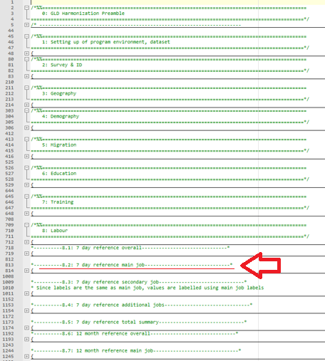

# Using the GLD

## How to use the harmonized dta file

**How to use a *single* harmonized dta file**

A single file can be accessed, as discussed above, via the GLD server, the Microdata Library, or datalibweb. Each file represents the answers of individuals to the standard variables contained in the GLD dictionary. It can be directly used to calculate summary statistics (over the appropriate subgroups) and regressions.

The variables of the first block contain all relevant variables (psu, ssu, strata, …) to correctly set the survey setting with the exception of the [finite population correction factor](https://en.wikipedia.org/wiki/Standard_error#Finite_population_correction_(FPC)), e.g., the total number of primary sampling units from which the PSUs where selected from. This information is not available to us and users should either try to approximate the number or use caution when reading results that implicitly assume an infinite population.

**How to access several harmonized dta files**

Users may access several surveys at a time and append them but should note that there are occasions when then format of a variable (namely the “_orig” variables). The GLD has prepared a Stata tool for users with access to the server to load the latest files from any given country. All explanations from how to install it to how to use it are [available here on the GLD GitHub repository](https://github.com/worldbank/gld/tree/main/Support/Z - GLD Ecosystem Tools/Append latest country surveys from server).

## How to use the harmonization code?

The harmonization code is designed for users to exploit it by amending and adding variables. To amend or edit there are three sections consider. Firstly, amending the filenames and paths, secondly, amending or adding the variable(s) of interest, and thirdly, amending the “Final steps Section” that cleans the dataset.

For the first part, users need to evaluate the paths and overwrite the ones laid out in subsection `1.2` (see example below in Figure 27 of Step 1 of the harmonization code for the Brazilian 2020 PNADC) to ensure the files are read from and stored in the folders they wish to use. 

<br></br>
Figure 27 - Step 1 of the harmonization code

<br></br>

When adding or amending variables, users could add the variable at any point after assembly (i.e., after section 1) and before the final steps. The GLD team recommends adding variables at the end of the section or subsection to which the variable belongs to. That is, if the user is adding an education variable, to do so after the last education variable. If the variable concerns the secondary job over the 12-month recall adding it after the last variable for that section. 

For example, the Pakistani 2020 LFS includes question 5.14 (Figure 28 below) that informs about the location where an activity is carried out.

<br></br>
Figure 28 - Excerpt of the 2020 PAK LFS questionnaire

<br></br>

As this question pertains to the main job over the 7-day recall period it should be placed at the end of the relevant section, namely section 8.2 (see Figure 29 below).

<br></br>
Figure 29 - Indication of the recommended location for including an additional 7 day labor recall variable

<br></br>

The next step in this process is then to add the variable. Users are free to do this as they wish, but the GLD team recommends keeping with the GLD format of wrapping variable code in tags, as shown below (Figure 30).

<br></br>
Figure 30 - Example of the code for an additional, non-standard variable

<br></br>

Once the variable(s) ha(s/ve) been added it needs to be included in the final section. This is because the final section not only drops variables that have missing answers for all observations but also reduces the data only to the variables in the standard dictionary and orders them accordingly. Since, by definition, any additional variable is not part of the standard dictionary it will not be part of the keeping and ordering sections (Figure 31 below). Users need to include it manually.

<br></br>
Figure 31 - Step 9 of the harmonization code

<br></br>

Once these three steps have been completed, the user will have created a customized output that expands on the GLD harmonization without having to go through all the previous steps to create a microdata file from the raw data that can be exploited. The harmonization is no longer a “take it or leave it” product to become sandbox with a sandcastle you can easily transform.

##	How to cite the GLD

Citing the GLD is not as straightforward as citing an academic journal article. Imagine a GLD user who has analyzed, for example, the Brazilian PNADC, and used the harmonization code to build their data file but also added other elements. Moreover, the user read the Country Survey Details and learn something about the survey they may have learned anyway, yet much more quickly because of the CSD. Under a table of summary statistics, should this user reference the GLD or the IBGE, the Brazilian statistics office, who run and publish PNADC?
The GLD team thinks in this case, the IBGE has done the bulk of the work and ought to be named first. We propose to include in the citation that data was mediated by the GLD, that data came via the GLD. The below Table 5 is a mock example of the table with such a citation.

Table 5 - Example mock summary statistics table
| Year | Country | # of concept A | % of concept B |
|------|---------|----------------|----------------|
| 2014 | BRA     | 29,453         | 23.4           |
| 2015 | BRA     | 29,209         | 24.5           |
| ...  | ...     | ...            | ...            |
| 2014 | TZA     | 18,463         | 9.34           |
| 2015 | TZA     | 18,796         | 8.57           |
Source: BRA PNADC, IBGE; …; TZA LFS, NBS via World Bank Global Labor Database

In the bibliography we propose the following citation:

```
World Bank Jobs Group. (n.d.). Global Labor Database. World Bank. Retrieved (Date of retrieval), from https://github.com/worldbank/gld. 
```

The reader should be advised that the Date of retrieval of the data should correspond not to the last day the website was viewed, but to the day the data was last downloaded. Suppose a user downloaded the data by the 10th of Month of Year and on the 11th of that Month, data for the CCCC_YYYY_LFS was updated from CCCC_YYYY_LFS_V01_M_V0*2*_GLD to CCCC_YYYY_LFS_V01_M_V0*3*_GLD. The user’s data still contains V02. Then, even though the website was last accessed on the 13th of Month, the effective date for the purposes of the reference should remain the 10th of Month.
