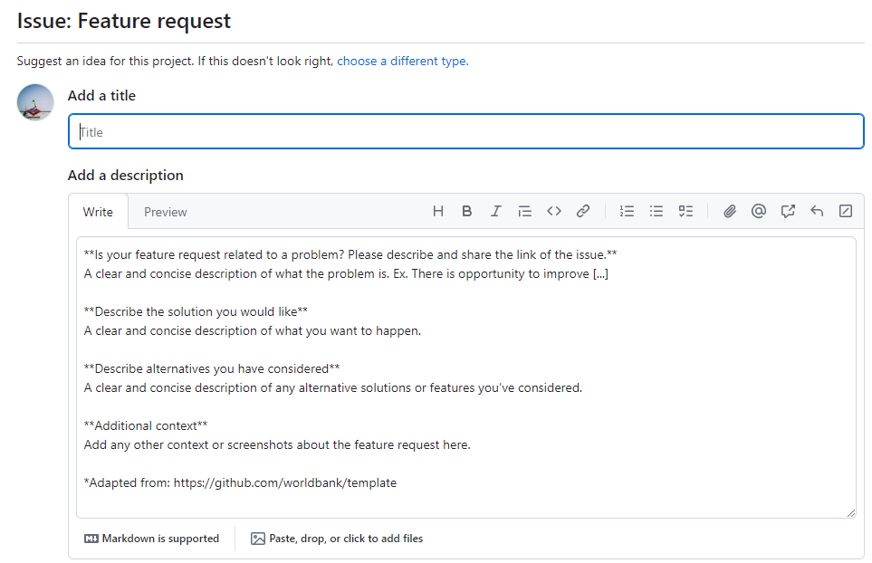

# Collaborating with GLD

This section covers a description of how to collaborate with the GLD team, either improving the current offering or expanding it. 

## What are the general rules to collaborate with GLD?

The GLD team is open to any contribution or collaboration and appreciates your help. From pointing out a typo in a harmonization (Rio de Jane**i**ro, not Rio de Janero) to providing us with a fully worked out harmonization your team had worked on anyway. 

The only rules are, firstly, to be mindful of each other’s timelines and workstreams so that we set out the right expectations about when a product can be delivered, and, secondly, to adhere – if you interact on our GitHub repository – by our [Community Code of Conduct](https://github.com/worldbank/gld/blob/main/Support/E%20-%20Community%20Guidelines/CODE_OF_CONDUCT.md).

## How do I share new raw data with GLD?

If you have a new survey not included in GLD that you would like us to collaborate on, we kindly ask you reach out to the [GLD Focal Point](mailto:gld@worldbank.org).

We kindly request to make us aware of all data access restrictions on the data you would like to share. For data not in the public domain, we highly recommend the data be made available to all staff as a *development data* for *official use*. The former means the data does not contain personal information like names or telephone numbers (age and sex are OK), the latter that the data can be shared with all World Bank colleagues without restriction.

If the data is provided by the producer (commonly the NSO) free of charge, you may use the World Bank’s Data Acquisition Template ([here under the heading *Templates for Data Acquisition*](https://microdatalib.worldbank.org/index.php/resources)). If the data is purchased from the provider, the process depends on the amount. Below a certain threshold it can by acquired by your business unit, above a threshold the acquisition needs to go through Central Procurement. For more details and general support, please visit the (intranet) site of [Central Procurement](https://worldbankgroup.sharepoint.com/sites/procurement/sitepages/publishingpages/Conducting-a-Solicitation-07302018-103353.aspx).

For restricted surveys, that is, once that cannot be shared even within the World Bank, we can keep the survey stored on the GLD server, which is only accessible to the core team and share it on a case-by-case basis. Moreover, via the datalibweb distribution system we can not only share it, equally, case-by-case, but put you as the Task Leader for the data so request and the power of approval remain with you.

## How do I share a harmonization for a survey not covered by GLD?

If you wish to share a harmonization for a survey not covered by GLD, first of all: thank you! That is the data equivalent of finding a banknote on the street. As such, we will try to accommodate you as best as we can.

The easiest way is to reach out us is via an email to the [GLD Focal Point](mailto:gld@worldbank.org). We can grant you temporary access to the core team GLD server where data can be exchanged. For users familiar with GitHub (or those who want to be), you may also “clone” or copy our repository, add your harmonization (following the [GLD folder structure](https://worldbank.github.io/gld/Support/A%20-%20Guides%20and%20Documentation/GLD%20Manual/GLD_Manual_Overview.html#how-is-the-information-i-access-organized)) and make a pull request. For those intrigued, you can find more details [here on cloning](https://docs.github.com/en/repositories/creating-and-managing-repositories/cloning-a-repository) as well as [here on making a pull request](https://docs.github.com/en/pull-requests/collaborating-with-pull-requests/proposing-changes-to-your-work-with-pull-requests/creating-a-pull-request).

## How do I collaborate with GLD on a new harmonization?

The GLD team is happy to collaborate with you on a new harmonization, divide tasks and reduce duplication. You can reach us via an email to the [GLD Focal Point](mailto:gld@worldbank.org) or by raising a blank issue on the GitHub repository. For more details on how to do this, please see the last sub-section of this section.

## How do I correct/ expand an existing harmonization? 

The GLD team is happy to rectify errors in the harmonization or add a variable we had not included previously. Despite our best efforts and extensive validation efforts some things fall through the cracks. Only extensive use of the data and your collaboration can add value at this stage. For either issue you can email the [GLD Focal Point](mailto:gld@worldbank.org) directly.

Additionally, you can raise an issue about this on our GitHub repository. This provides a standardized form to give feedback we may be able to incorporate more quickly. To do so, you may navigate to [github.com/worldbank/gld/issues](https://github.com/worldbank/gld/issues) or click on the issues tab on the GLD repository (see red square in the image below).

  

  

Users then will see the list of open issues and can, by clicking on the button on the top right, open a new issues (see red square in the image below).

  

  

Now users have five options at their disposal (see image below). The four options listed, each with a green button stating “Get started” to initiate the issue, plus the option at the bottom (see red square in the image below) to open a blank issues, that is one that has no prior formatting.

  

  

For reporting an error in the code, we recommend choosing the “Code Correction Report” option (the first). This will lead to the page shown below, where the user is provided with some boxes to make sure the information can be used directly in our data updating process, namely to enter which surveys this applies to, a description of the error, the erroneous code and (not shown in the image below) a box for a proposed corrected code.

  

  

Users can also alert us of a bug in the code via issues. There are two prepared formats for this. The first is the text based alert (shown below). Again the user is requested to give information about the survey, describe the issue and, if possible, add the code that is causing the issue. 

  

  

The alternative is the image/screenshot based issue report (third option on the issues options list). The text box is pre-filled with indications of what kind of information would be most useful to the GLD team (see image below).

  

  

## How do I correct/expand on the Country Survey Details?

There is no specific method to expand or correct the Country Survey Details (CSD). Users are asked to either reach out to the [GLD Focal Point](mailto:gld@worldbank.org) or raise a blank issue on GitHub detailing the problems with the CSD. How to do this is described in the last sub-section of this page.

Alternatively, users can make a pull request from a clone of the GLD repository where they have corrected or amended the text, so that we may review their request and integrate it. You can find details [here on cloning](https://docs.github.com/en/repositories/creating-and-managing-repositories/cloning-a-repository) as well as [here on making a pull request](https://docs.github.com/en/pull-requests/collaborating-with-pull-requests/proposing-changes-to-your-work-with-pull-requests/creating-a-pull-request).

## How do I correct/expand on the GLD tools?

The GLD team is happy to receive updates on the tools we have created as well as on request for new tools. For corrections users can reach out to the [GLD Focal Point](mailto:gld@worldbank.org) or raise a blank issue on GitHub (see next sub-section on blank issues). They may also, as detailed above, update information on a copy of the repository and propose to merge it into the GLD via a pull request.

For requesting new tools, in addition to emails and blank issues, there is also the “Feature Request” issue (shown below). The Description box guides users on what kind of information would be most helpful for us to create a tool that solves issues you may be encountering when using the GLD.

  

  

## How do I communicate on any other issue?

The GLD team encourages you to reach out on any issue. To inform us you can either reach out via [email](mailto:gld@worldbank.org) or create a blank issue on GitHub. A blank issue can be created, after clicking on the “Issues” tab in the [repository](https://github.com/worldbank/gld), by selecting the “Open a blank issue” option at the end of the list of issue templates (red box in the image below).

  

  

Here the user is only requested to enter a title to their issue and they have a blank box at their disposal to detail any issue they wish to communicate to us (see image below). 

  

  