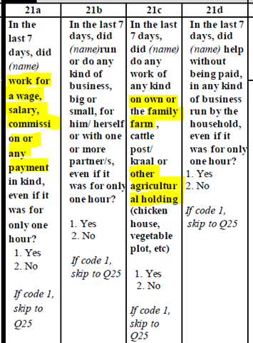

# Survey & ID module

## Mapping and Description of Variables

### countrycode

countrycode is a string variable that specifies the 3-character country code used by the World Bank to identify each country. Although there are different naming conventions, it is necessary to use those specified to ensure that the data for each country is appropriately labeled.

### survname

survname codes the acronym of the survey.

### survey

survey codes the type of survey (e.g., LFS for Labor Force Survey).

### icls_v

Underlying version of the International Conference of Labour Statisticians that is being used in the survey to code [concepts of work and employment](http://documents1.worldbank.org/curated/en/468881598538973944/pdf/Who-Is-Employed-Evidence-from-Sub-Saharan-Africa-on-Redefining-Employment.pdf).

Most commonly, surveys harmonized to GLD will either follow ICLS-13 or ICLS-19, that is, the directives set out during the 13<sup>th</sup> or the 19<sup>th</sup> conference, especially pertaining employment.

In ICLS-13 all work – other than household work – is seen as employment. Thus, subsistence farmers are as employed as the CEO of an international conglomerate.

The below screenshot is from the questionnaire of the Zimbabwean 2014 LFS, where any yes answer will skip to questions on main employment (Q25). As highlighted, work for a wage is treated in the same than work on any agricultural holding. This survey follows ICLS-13.

<br></br>

<br></br>

Five years later, the Zimbabwean statistics office, ZimStat, switched to ICLS-19. In ICLS-19, only work for market exchange is considered employment (treating subsistence farming in the same way as household labour). Thus, an additional question is added to differentiate what kind of farming is taking place.

The below screenshot is part of the set of agriculture questions. If the agricultural work on the own agricultural holding is only or mostly for market exchange (codes 1 and 2) the individual should be asked about their first main job (MJ1). If agricultural production is only or mainly for own consumption, then the questionnaire continues, here asking whether they work for others for hire.

<br></br>

<br></br>

If the survey asks questions to understand what kind of farming takes place (subsistence or market exchange) and defines a skip pattern to lead to employment questions based on that, the survey questionnaire follows ICLS-19, otherwise it follows ICLS-13.

### isced_version

Underlying version of the [International Standard Classification of Education](http://uis.unesco.org/en/isced-mappings) (ISCED) used in the survey. Acceptable values are either isced_1997 or isced_2011.

### isco_version

Underlying version of the [International Standard Classification of Occupations](https://ilostat.ilo.org/resources/concepts-and-definitions/classification-occupation/) (ISCO) used in the survey. Acceptable values are either isco_1988 or isco_2008

### isic_version

Underlying version of the [International Standard Industrial Classification of All Economic Activities](https://unstats.un.org/unsd/classifications/Econ/isic) (ISIC) used in the survey. Acceptable values are either isic_2, isic_3, isic_3.1, or isic_4.

### year

year is a numeric variable that denotes the year in which the implementation of the household survey was begun. For example, if a survey was implemented during October 2018 and September 2019, the year would be 2018.

### vermast

vermast codes the version of the master file (original data) being used in the harmonization.

### veralt

veralt codes the version of the harmonization.

### harmonization

harmonization codes the kind of harmonization (GLD or GMD). For GLD surveys this will always be GLD.

### int_year

int_year is a numeric variable that specifies the year when the survey questionnaire was administered to the household.

### int_month

int_month is a numeric variable that specifies the month when the survey questionnaire was administered to the household.

### hhid

hhid specifies the unique household identification number in the data file. The original format, string or numeric, of original data should be kept. If there is Household ID in the original data, hhid and hhid_orig should be the same. If hhid_orig is missing, it is constructed by "variable names in raw data" variables.

### pid

This variable allows identification of individuals. Variable will vary in length depending on how the identification code was constructed in each country. Depending on individual countries, this variable may be a concatenation of several variables in the raw data file. Keep format (string or numeric) of original data. If there is Personal ID in the original data, pid and pid_orig should be the same. If pid_orig is missing, it is constructed by "variable names in raw data" variables.

### weight

weight contains household weights, typically inversely proportional to the probability of the household being selected for the sample, that should be applied to all analysis to make the results representative of the population.

### weight_m

weight contains household weights, typically inversely proportional to the probability of the household being selected for the sample, that should be applied to all analysis to make the results representative of the population for each month. To be added only if present in the raw data and survey reports estimate results per month.

### weight_q

weight contains household weights, typically inversely proportional to the probability of the household being selected for the sample, that should be applied to all analysis to make the results representative of the population for each quarter. To be added only if present in the raw data and survey reports estimate results per quarter.

### psu

Primary sampling unit (psu) refers to sampling units that are selected in the first (primary) stage of multi- stage sample design. These sampling units typically correspond to a number of large aggregate units (clusters), each of which contains sub-units. For example, a primary sampling unit can represent the set of all housing units contained in a well-defined geographic area, such as a municipality or a group of contiguous municipalities. Primary sampling units are numeric and country-specific. A unique identifier is created for each primary sampling unit. In Stata, users are advised to specify the primary sampling unit through the svyset command.

### ssu

Secondary sampling unit code (if present).

### strata

Unit defining the first stage stratification strategy.

### wave

In case of the survey being rolled out over several waves (e.g. quarterly), codes the information of the iteration of the survey.

### panel

A string variable denoting which panel the individual belongs to. A panel is defined as all individuals who entered a survey at the same time (e.g., Q3 of 2020) and are scheduled to exit at the same time after a fixed number of survey waves (e.g., after four quarters).

Note that due to attrition not all intakes may exit at the same time. This variable is only to be coded if the concept is present in the raw data already.

### visit_no

A numeric variable denoting the visit number (e.g., first visit coded as 1, second visit as 2, …) within a panel. This variable is only to be coded if the concept is present in the raw data already.

## Lessons Learned and Challenges

### Creating and checking IDs

Avoid using the sequential index of the observation as the ID (i.e. gen hhid = \_n). This is dangerous as the order of each observation may be different, even across vintages of the same file sorted by to different variables.

```
* Create hhid like this:
gen hhid = psu \* 100 + hh

* Note like this:
gen hhid = \_n
```

When creating hhid and pid, especially from string variables or from group(varlist) or concat(varlist) functions, users should try to create them from roster data files first where all information or observations are available. In addition, the order of the variables in the varlist option above must be the same across the files. Across the data files, the order and the sort on the variables in the varlist must be done in the same way across files.

When the hhid and pid are in numeric format but less precision, it is recommended to bring them the accurate precision level so it can be used in the merging correctly. For example, the value of the hhid for an observation might be 100021210121 (a long number), users should format the variable by “format %15.0g hh”.

In case a household survey is conducted more than once per year – e.g. quarterly HH surveys – you may want to use this as panel data, in which case the household ID can remain as is. However, if you want to use the data as cross-sectional, then new HHIDs can be constructed for each HH for each quarter.

| **Quarter** | **Quarter 1** | **Quarter 2** | **Quarter 3** | **Quarter 4** |
| --- | --- | --- | --- | --- |
| hhid_orig | hhid=1 | hhid=1 | hhid=1 | hhid=1 |
| hhid | hhid=1Q1 | hhid=1Q2 | hhid=1Q3 | hhid=1Q4 |

hhid should never be missing and if there is any missing this variable should be checked.
```
assert missing(hhid)
```
It is recommended to check the uniqueness level of the data files with identifier variables at the corresponding level of the data (i.e. household vs individual level data).

hhid and pid need to be unique in the database.
```
isid hhid pid
cap destring pid, replace 
duplicates report hhid pid 
assert `r(unique_value)’ == `r(N)’
```

### Checks on the country code and year

Ensure that country is a three-letter country code.

cap confirm str3 var country \_rc!=0

Harmonizers should also ensure that country codes are updated according to the [ISO country codes](https://en.wikipedia.org/wiki/ISO_3166-1_alpha-3). Some common adjustments include the following:

```
replace countrycode="XKX" if countrycode=="KSV"
replace countrycode="TLS" if countrycode=="TMP"
replace countrycode="PSE" if countrycode=="WBG"
replace countrycode="COD" if countrycode=="ZAR"
```

Furthermore, harmonizers should check that the years used are in an appropriate range.

The year needs to be a four-digit number in the range of 1980 to the current year (assumed here to be 2020).

## Tabular Overview of Variables

| Module Code | Variable label | Variable name | Notes |
| --- | --- | --- | --- |
| Survey & ID | ISO 3 Letter country code | countrycode |     |
| Survey & ID | Survey acronym | survname | No spaces, no underscores, split sections by "-" (e.g. "ETC-II") |
| Survey & ID | Survey long name | survey | Possible names are: LFS, LSMS, … \[I am unsure of this difference, some surveys contain either this or the previous variable, have yet to see one with both\] |
| Survey & ID | Version of the ICLS followed | icls_v | Defines the labor force definitions used according to the rules set out by the nth International Conference of Labour Statisticians. |
| Survey & ID | Version of ISCED used | isced_version |     |
| Survey & ID | Version of ISCO used | isco_version |     |
| Survey & ID | Verstion of ISIC used | isic_version |     |
| Survey & ID | Year of survey start | year |     |
| Survey & ID | Master (Source) data version | vermast |     |
| Survey & ID | Alternate (Harmonized) data version | veralt |     |
| Survey & ID | Kind of harmonization | harmonization |     |
| Survey & ID | Year of interview start | int_year | For HH and Individual interviews in that HH earliest possible date |
| Survey & ID | Month of interview start | int_month | For HH and Individual interviews in that HH earliest possible date |
| Survey & ID | Household ID | hhid |     |
| Survey & ID | Personal ID | pid |     |
| Survey & ID | Survey weights | weight |     |
| Survey & ID | Primary sampling unit | psu |     |
| Survey & ID | Secondary sampling unit | ssu |     |
| Survey & ID | Stratification (of PSU) | strata |     |
| Survey & ID | Wave of the survey (e.g., Q1 for quarter 1) | wave |     |
| Survey & ID | Panel the individual belongs to | panel | Only code if concept already in survey |
| Survey & ID | Visit number in panel order | visit_no | Only code if concept already in survey |

