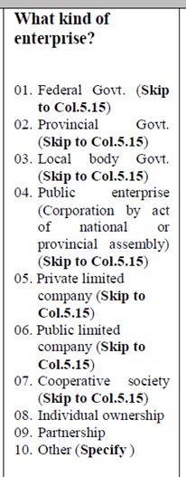
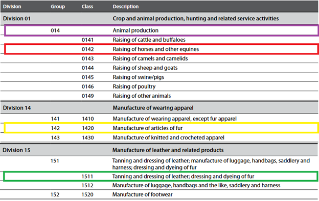

# Labor

## Mapping and Description of Variables

#### minlaborage

This is the lowest age for which the labor module is implemented in the survey or the minimum working age in the country. For this reason, the lower age cutoff at which information is collected will vary from country to country.

### Labor status, 7-day reference period

#### lstatus

lstatus is an individual’s labor status in the last 7 days. The Value must be missing for individuals less than the required age (minlaborage).

Three categories are used after harmonization:

1 = Employed

2 = Unemployed

3 = Not-in-labor force

All persons are considered active in the labor force if they presently have a job (formal or informal, i.e., employed) or do not have a job but are actively seeking work (i.e., unemployed).

1 = Employed

Employed is defined as anyone who worked during the last 7 days or reference week, regardless of whether the employment was formal or informal, paid or unpaid, for a minimum of 1 hour. Individuals who had a job, but for any reason did not work in the last 7 days are considered employed.

2 = Unemployed

A person is defined as unemployed if he or she is, presently not working but is actively seeking a job. The formal definition of unemployed usually includes being ‘able to accept a job.’ This last question was asked in a minority of surveys and is, thus, not incorporated in the present definition. A person presently not working but waiting for the start of a new job is considered unemployed.

3 = Not-in-labor force

A person is defined as not-in-labor force if he or she is, presently not working and it is not actively seeking a job during the last 7 days or reference week.

#### potential_lf

The ILO defines unemployment (as stated above) as seeking \*and\* available for a job. The potential labor force is formed by the “available potential job seekers”, who are available but not looking for a job and the “unavailable job seekers”, that is those looking but not available. The below image ([source here](https://ilostat.ilo.org/persons-outside-the-labor-force-how-inactive-are-they-really/)) shows the different definitions.

<br></br>

<br></br>


The variable potential_lf thus codifies whether the person is not in the labor force over the past 7 days (lstatus=3, missing otherwise) but could potentially be they are i) available but not searching or ii) searching but not immediately available to work. The codes are:

0 = No (not potentially in the labor force)

1 = Yes

#### underemployment

Codifies whether the person is in the labor force and working over the past 7 days (lstatus=1, missing otherwise) but would take on more jobs or more hours at their job if possible/available. The codes are:

0 = No (not underemployed)

1 = Yes

#### nlfreason

nlfreason is the reason an individual was not in the labor force in the last 7 days. This variable is constructed for all those who are not presently employed and are not looking for work (lstatus=3) and missing otherwise.

Five categories after harmonization:

1= Student (a person currently studying.)

2= Housekeeper (a person who takes care of the house, older people, or children)

3= Retired

4 = Disabled (a person who cannot work due to physical conditions)

5 = Other (a person does not work for any other reason)

Fill this information for all people interviewed in the labor section of the questionnaire regardless of their age.

#### unempldur_l

unempldur_l is a continuous variable specifying the duration of unemployment in months (lower bracket).

The variable is constructed for all unemployed persons (lstatus=2, otherwise missing). If it is specified as continuous in the survey, it records the numbers of months in unemployment. If the variable is categorical it records the lower boundary of the bracket.

Missing values are allowed for everyone who is not unemployed. Other missing values are also allowed.

#### unempldur_u

unempldur_u is a continuous variable specifying the duration of unemployment in months (upper bracket).

The variable is constructed for all unemployed persons (lstatus=2, otherwise missing). If it is specified as continuous in the survey, it records the numbers of months in unemployment. If the variable is categorical it records the upper boundary of the bracket. If the right bracket is open a missing value should be inputted.

Missing values are allowed for everyone who is not unemployed. Other missing values are also allowed. If the duration of unemployment is not reported as a range, but as continuous variables, the unempldur_l and unempldur_u variables will have the same value. If the high range is open-ended the unempldur_u variable will be missing.

### Primary Employment, 7-day reference period

#### empstat

empstat is a categorical variable that specifies the main employment status in the last 7 days of any individual with a job (lstatus=1) and is missing otherwise. The variable is constructed for all individuals. For this reason, the lower age cutoff (and perhaps upper age cutoff) at which information is collected will vary from country to country.

The definitions are taken from the International Labor Organization’s Classification of Status in Employment with some revisions to take into account the data available.

Five categories after harmonization:

1 = Paid Employee

2 = Non-Paid Employee

3 = Employer

4 = Self-employed

5 = Other, workers not classifiable by status

1 = Paid Employee

Paid employee includes anyone whose basic remuneration is not directly dependent on the revenue of the unit they work for, typically remunerated by wages and salaries but may be paid for piece work or in-kind. The ‘continuous’ criteria used in the ILO definition is not used here as data are often absent and due to country specificity.

2 = Non-Paid Employee

Non-paid employee includes contributing family workers who hold a self-employment job in a market-oriented establishment operated by a related person living in the same households who cannot be regarded as a partner because of their degree of commitment to the operation of the establishment, in terms of working time or other factors, is not at a level comparable to that of the head of the establishment. All apprentices should be mapped as ‘non-paid employee’

3 = Employer

An employer is a business owner (whether alone or in partnership) with employees. If the only people working in the business are the owner and contributing family workers, the person is not considered an employer (as has no employees) and is, instead classified as self-employed.

4 = Self-employed

Own account or self-employment includes jobs where remuneration is directly dependent from the goods and service produced (where home consumption is considered to be part of the profits) and where one has not engaged any permanent employees to work for them on a continuous basis during the reference period.

Members of producers’ cooperatives are workers who hold a self-employment job in a cooperative producing goods and services, in which each member takes part on an equal footing with other members in determining the organization of production, sales and/or other work of the establishment, the investments and the distribution of the proceeds of the establishment amongst the members.

5 = Other, workers not classifiable by status

Other, workers not classifiable by status include those for whom insufficient relevant information is available and/or who cannot be included in any of the above categories.

#### ocusec

ocusec is a categorical variable that specifies the sector of activity in the last 7 days. It classifies the main job's sector of activity of any individual with a job (lstatus=1) and is missing otherwise. The variable is constructed for all persons administered this module in each questionnaire.

Four categories after harmonization:

1 = Public sector, Central Government, Army (including armed forces)

2 = Private, NGO

3 = State-owned

4 = Public or State-owned, but cannot distinguish

1 = Public Sector, Central Government, Army (including armed forces) Public sector

The part of economy run by the government.

2 = Private, NGO

Private sector is that part of the economy which is both run for private profit and is not controlled by the state, it also includes non-governmental organizations

3 = State-owned enterprises

State-owned includes para-state firms and all others in which the government has control (participation over 50%).

4 = Public or State-owned, but cannot distinguish

Select this option is the questionnaire does not ask for State-owned enterprises, and only for Public sector.

Additionally, recall the fact that, in common English usage, a public company (often denoted as public limited company or PLC) are private companies in the private sector but whose ownership is organized via stocks tradeable in a _public_ market, i.e., accessible to all, not run by the public sector.

The following is an example of the relevant question in the 2010 Pakistani LFS:
<br></br>

<br></br>


Here code 4 represents a public enterprise (explicitly mentioned as a corporation created by a legislative body) and code 6 a public limited company (a private sector company whose shares can be bought by the general public). **Code 6 should not be considered part of the public sector**.

Coding would then be (assuming the original question is called var_sector):

```
gen ocusec = .
replace ocusec = 1 if inrange(var_sector,1,3)
replace ocusec = 2 if inrange(var_sector,5,9)
replace ocusec = 3 if var_sector == 4
replace ocusec = 4 if var_sector == 10
```
_Notes_: Do not code basis of occupation (ISCO) or industry (ISIC) codes.

#### industry_orig

industry_orig is a string variable that specifies the original industry codes in the last 7 days for the main job provided in the survey (the actual question) and should correspond to whatever is in the original file with no recoding. It will contain missing values for people below the working age. Other missing values are allowed. It classifies the main job of any individual with a job (lstatus=1) and is missing otherwise

#### industrycat_isic

Code (string variable) of the industry according to the International Standard Industry Classification (ISIC) in the last 7 days for the main job of any individual with a job (lstatus=1) and is missing otherwise. Note that the preamble to the harmonization code should record what version of ISIC is being used.

The code should always be as long as the longest depth available for the ISIC version. For example, the latest version at the time of writing (ISIC Rev 4, [available here](https://unstats.un.org/unsd/demographic-social/census/documents/isic_rev4.pdf)) codes industries by sections, divisions, groups, and classes, in decreasing order of hierarchy.

Figure 1 shows the classification structure for the manufacture of machinery and equipment. The letter C codes the Manufacturing _section_, while the code 28 represents “Manufacture of machines and equipment n.e.c” _division_. This division has two _groups_ (281 and 282), containing one and three _classes_ respectively.

<br></br>
*Figure 1 - Example of ISIC classification*

<br></br>

A single section will often cover several divisions. While D has only one division (35 – electricity, gas, steam and air conditioning supply) and could be potentially shortened to “3”, section C covers divisions 10 to 33.

If the information in the survey is only present at section level (or can only be translated from the national industry classification to section level) this variable should be a string with the letter coding the correct section.

In most cases, information will be coded as a set of digits. In this case, the codification should be a string of four digits with a zero padding before for division 1 through 9 (i.e., 01, to 09).

As an example, Figure 2, puts together a few excerpts from ISIC Rev.4. Note that, if we do not codify correctly, group 14 (Animal production) may be misunderstood for division 14 (Manufacture of wearing apparel).

If we only have information up to the group label, fill out the reminder of the digits with zeros. Hence the purple box in Figure 2 would be coded as “0140”. The red box, as we have all digits, including the zero padding at the start codes as “0142”.

The act of adding zeroes to the end is standard if the lower level hierarchy has no further distinctions and can be seen in the yellow box, where group 142 has no classes (or just one class) and thus is coded as “1420”.

Some groups do in fact have several classes, as can be seen for group 151. Again, if we only had information up to group level, we ought to code “1510”. If we have more detailed information, for example identifying the industry as “Tanning and dressing of leather; dressing and dyeing of fur” (green box) we would code “1511”.

<br></br>
*Figure 2 - Examples of different ISIC codes*

<br></br>


#### industrycat10

industrycat10 is a categorical variable that specifies the 1-digit industry classification in the last 7 days for the main job of any individual with a job (lstatus=1) and is missing otherwise. The variable is constructed for all persons administered this module in each questionnaire. The codes for the main job are given here based on the UN International Standard Industrial Classification. It classifies the main job of any individual with a job (lstatus=1) and is missing otherwise

Ten categories after harmonization:

1 = Agriculture, Hunting, Fishing, etc.

2 = Mining

3 = Manufacturing

4 = Public Utility Services

5 = Construction

6 = Commerce

7 = Transport and Communications

8 = Financial and Business Services

9 = Public Administration

10 = Other Services, Unspecified

Notes:

- In the case of different classifications (former Soviet Union republics, for example), recoding has been done to best match the ISIC codes.
- Category 10 is also assigned for unspecified categories or items.
- If all 10 categories cannot be identified in the questionnaire create this variable as missing and proceed to create industrycat4.
- Over the years, the different ISIC versions have changed. The original industrycat10 categories are largely based on ISIC Revision 2. The below table shows how to classify the different ISIC revision codes into industrycat10.

<br></br>

<br></br>

#### industrycat4

industrycat4 is a categorical variable that specifies the 1-digit industry classification in the last 7 days for the main job for Broad Economic Activities. This variable is either created directly from the data (if industry classification does not exist for ten categories) or created from industrycat10.

Four categories after harmonization:

1 = Agriculture

2= Industry

3 = Services

4 = Other

This variable is either created directly from the data (if industry classification does not exist for ten categories) or created from industrycat10.

#### occup_orig

occup_orig is a string variable that specifies the original occupation code in the last 7 days for the main job. This variable corresponds to whatever is in the original file with no recoding.

#### occup_isco

Code (string variable) of the occupation according to the International Standard Classification of Occupations (ISCO) in the last 7 days for the main job of any individual with a job (lstatus=1) and is missing otherwise. Note that the preamble to the harmonization code should record what version of ISCO is being used.

The code should always be as long as the longest depth available for the ISCO) version. For example, the latest version at the time of writing (ISCO-08, [available here](https://www.ilo.org/public/english/bureau/stat/isco/isco08/index.htm)) codes occupations by Major, Sub-major, Minor, and Unit groups, in decreasing order of hierarchy.

ISCO code Major groups cover a single digit, running from 1 (Managers) to 9 (Elementary Occupations) with the additional category 0 (Armed Forces Occupations). Hence there is only need for zero-padding on the left side for Armed Forces Occupations. Figure 3 shows an example of the possible values that can be taken on.


<br></br>
*Figure 3 - Example of values for ISCO-08*

<br></br>

If we only had information at Major Group level, a person working as a Services and Sales Worker ought to be coded as the number 5000. If the information is at Sub-major Group level, it should be codified as the number 5100 for a Personal Services Worker, while a Travel Attendant, a Conductor, or a Guide (if information at Minor Group level) should be coded as the number 5110.

Information at the Unit Group level can be coded as is, since it already is at the maximum possible depth.

#### occup_skill

Categorical code for the broad skill level of workers at the main job in the last 7 days of any individual with a job (lstatus=1) and is missing otherwise. It follows from the ISCO classification as shown in Figure 4.

Figure 4 - ISCO broad skill level classification

vars_occup_skill.png

Thus, the codes are:

3 = High

2 = Medium

1 = Low

. = Armed Forces and not elsewhere classified

#### occup

occup is a categorical variable that specifies the 1-digit occupational classification for the main job in the last 7 days of any individual with a job (lstatus=1) and is missing otherwise. This variable is constructed for all persons administered this module in each questionnaire. For this reason, the lower age cutoff (and perhaps upper age cutoff) at which information is collected will vary from country to country. Most surveys collect detailed information and then code it, without keeping the original data, no attempt has been made to correct or check the original coding. The classification is based on the International Standard Classification of Occupations (ISCO). It classifies the main job of any individual with a job (lstatus=1) and is missing otherwise.

Eleven categories after harmonization:

1 = Managers

2 = Professionals

3 = Technicians and associate professionals

4 = Clerical support workers

5 = Service and sales workers

6 = Skilled agricultural, forestry and fishery workers

7 = Craft and related trades workers

8 = Plant and machine operators, and assemblers

9 = Elementary occupations

10 = Armed forces occupations

99 = Other/unspecified

#### wage_no_compen

wage_no_compen is a continuous variable that specifies the last wage payment in local currency of any employed individual (lstatus=1) in its primary occupation at the reference period reported in the survey and it is missing otherwise. The wage should come from the main job, in other words, the job that the person dedicated most time in the week preceding the survey. This excludes tips, bonuses, other compensation such as dwellings or clothes, and other payments. The variable is constructed for all persons administered this module in each questionnaire. For this reason, the lower age cutoff (and perhaps upper age cutoff) will vary from country to country.

Notes:

- For all those with self-employment or owners of own businesses, this should be net revenues (net of all costs EXCEPT for tax payments) or the amount of salary taken from the business. Due to the almost complete lack of information on taxes, the wage from main job is NOT net of taxes.
- By definition, non-paid employees (empstat=2) should have wage=0.
- The reference period of the wage_no_compen will be recorded in the unitwage variable.

#### unitwage

unitwage is a categorical variable that specifies the time reference for the wage_no_compen variable. It specifies the time unit measurement for the wages of any individual (lstatus=1 & empstat=1) and it is missing otherwise. Acceptable values include:

1 = Daily

2 = Weekly

3 = Every two weeks

4 = Every two months

5 = Monthly

6 = Quarterly

7 = Every six months

8 = Annually

9 = Hourly

10 = Other

#### whours

whours is a continuous variable that specifies the hours of work last week for the main job of any individual with a job (lstatus=1) and is missing otherwise. The main job defined as that occupation that the person dedicated more time to over the past week. The variable is constructed for all persons administered this module in each questionnaire.

Notes:

- If the respondent was absent from the job in the week preceeding the survey due to holidays, vacation, or sick leave, then record the time worked in the previous 7 days that the person worked.
- Sometimes the questions are phrased as, “on average, how many hours a week do you work?”.
- For individuals who only give information on how many hours they work per day and no information on number of days worked a week, multiply the hours by 5 days.
- In the case of a question that has hours worked per month, divide by 4.3 to get weekly hours.

#### wmonths

wmonths is a continuous variable that specifies the number of months worked in the last 12 months for the main job of any individual with a job (lstatus=1) and is missing otherwise. The main job is defined as that occupation that the person dedicated more time to over the past week. The variable is constructed for all persons administered this module in each questionnaire.

#### wage_total

wage_total is a continuous variable that specifies the annualized wage payment (regular wage plus bonuses, in-kind, compensation, etc.) for the primary occupation in local currency of any individual (lstatus=1 & empstat=1) and is missing otherwise. The wage should come from the main job, in other words, the job that the person dedicated most time in the week preceding the survey. This wage includes tips, compensations such as bonuses, dwellings or clothes, and other payments. wage_total should be equal to wage_no_compen in case there are no bonuses, tips etc. offered as part of the job. The variable is constructed for all persons administered this module in each questionnaire. The annualization of the wage_total should consider the number of months/weeks the persons have been working and receiving this income. Harmonizer should not assume the person has been working the whole year. Box 4 shows the creation of wage_total when there are no bonuses nor other compensations.

*Box 4 - Example of wage_total creation*
```
gen double wage_total=.
replace wage_total=(wage_no_compen\*5\*4.3)\*wmonths if unitwage==1 //Wage in daily unit
replace wage_total=(wage_no_compen\*4.3)\*wmonths if unitwage==2 //Wage in weekly unit
replace wage_total=(wage_no_compen\*2.15)\*wmonths if unitwage==3 //Wage in every two weeks unit
replace wage_total=(wage_no_compen)/2\*wmonths if unitwage==4 //Wage in every two months unit
replace wage_total=( wage_no_compen)\*wmonths if unitwage==5 //Wage in monthly unit
replace wage_total=( wage_no_compen)/3\*wmonths if unitwage==6 //Wage in every quarterly unit
replace wage_total=(wage_no_compen)/6\*wmonths if unitwage==7 //Wage in every six months unit
replace wage_total= wage_no_compen/12\*wmonths if unitwage==8 //Wage in annual unit
replace wage_total=(wage_no_compen\*whours\*4.3)\*wmonths if unitwage==9 //Wage in hourly unit
```
_Note_: Use gross wages when available and net wages only when gross wages are not available. This is done to make it easy to compare earnings in formal and informal sectors.

#### contract

contract is a dummy variable that classifies the contract status (yes/no) of any individual with a job (lstatus=1) and is missing otherwise. It indicates whether a person has a signed (formal and written – not verbal) contract, regardless of duration. The variable is constructed for all persons administered this module in each questionnaire. Two categories after harmonization:

0 = No

1 = Yes

#### healthins

healthins is a dummy variable that classifies the health insurance status (yes/no) of any individual with a job (lstatus=1) and is missing otherwise. Variable is constructed for all persons administered this module in each questionnaire. However, this variable is only constructed if there is an explicit question about health insurance provided by the job. Two categories after harmonization:

0 = No

1 = Yes

#### socialsec

socialsec is a dummy variable that classifies the social security status (yes/no) of any individual with a job (lstatus=1) and is missing otherwise. Variable is constructed for all persons administered this module in each questionnaire. For this reason, the lower age cutoff (and perhaps upper age cutoff) at which information is collected will vary from country to country. However, this variable is only constructed if there is an explicit question about pension plans or social security. Two categories after harmonization:

0 = No

1 = Yes

#### union

union is a dummy variable that classifies the union membership status (yes/no) of any individual with a job (lstatus=1) and is missing otherwise. Variable is constructed for all persons administered this module in each questionnaire. For this reason, the lower age cutoff (and perhaps upper age cutoff) at which information is collected will vary from country to country. However, this variable is only constructed if there is an explicit question about trade unions. Two categories after harmonization:

0 = No

1 = Yes

#### firmsize_l

firmsize_l specifies the lower bracket of the firm size. The variable is constructed for all persons who are employed in the last 7 days for the main job. If it is continuous, it records the number of people working for the same employer. If the variable is categorical, it records the lower boundary of the bracket.

#### firmsize_u

firmsize_u specifies the upper bracket of the firm size. The variable is constructed for all persons who are employed in the last 7 days for the main job. If it is continuous, it records the number of people working for the same employer. If the variable is categorical, it records the upper boundary of the bracket. If the right bracket is open, this variable should be missing.

### Secondary Employment, 7-day reference period

#### empstat_2

empstat_2 is a categorical variable that specifies employment status of the secondary job with reference period of last 7 days of any individual with a job (lstatus=1) and is missing otherwise. The variable is constructed for all individuals. For this reason, the lower age cutoff (and perhaps upper age cutoff) at which information is collected will vary from country to country.

The definitions are taken from the International Labor Organization’s Classification of Status in

Employment with some revisions to take into account the data available. Five categories after harmonization:

1 = Paid Employee

2 = Non-Paid Employee

3 = Employer

4 = Self-employed

5 = Other, workers not classifiable by status

1 = Paid Employee

Paid employee includes anyone whose basic remuneration is not directly dependent on the revenue of the unit they work for, typically remunerated by wages and salaries but may be paid for piece work or in-kind. The ‘continuous’ criteria used in the ILO definition is not used here as data are often absent and due to country specificity.

2 = Non-Paid Employee

Non-paid employee includes contributing family workers who hold a self-employment job in a market-oriented establishment operated by a related person living in the same households who cannot be regarded as a partner because of their degree of commitment to the operation of the establishment, in terms of working time or other factors, is not at a level comparable to that of the head of the establishment. All apprentices should be mapped as non-paid employee.

3 = Employer

Employer is a business owner (whether alone or in partnership) with employees. If the only people working in the business are the owner and ‘contributing family workers, the person is not considered an employer (as has no employees) and is, instead classified as own account.

4 = Self-employed

Own account or self-employment includes jobs are those where remuneration is directly dependent from the goods and service produced (where home consumption is considered to be part of the profits) and have not engaged any permanent employees to work for them on a continuous basis during the reference period.

Members of producers’ cooperatives are workers who hold a self-employment job in a cooperative producing goods and services in which each member takes part on an equal footing with other members in determining the organization of production, sales and/or other work of the establishment, the investments and the distribution of the proceeds of the establishment amongst the members.

5 = Other, workers not classifiable by status

Other, workers not classifiable by status include those for whom insufficient relevant information is available and/or who cannot be included in any of the above categories.

#### ocusec_2

ocusec_2 is a categorical variable that specifies the sector of activity in the last 7 days. It classifies the secondary job's sector of activity of any individual with a job (lstatus=1) and is missing otherwise. The variable is constructed for all persons administered this module in each questionnaire.

Four categories after harmonization:

1 = Public sector, Central Government, Army (including armed forces)

2 = Private, NGO

3 = State-owned

4 = Public or State-owned, but cannot distinguish

1 = Public Sector, Central Government, Army (including armed forces) Public sector is the part of economy run by the government.

2 = Private, NGO

Private sector is that part of the economy which is both run for private profit and is not controlled by the state, it also includes non-governmental organizations

3 = State-owned enterprises

State-owned includes para-state firms and all others in which the government has control (participation over 50%).

4 = Public or State-owned, but cannot distinguish

Select this option is the questionnaire does not ask for State-owned enterprises, and only for Public sector.

Notes: Do not code basis of occupation (ISCO) or industry (ISIC) codes.

#### industry_orig_2

industry_orig_2 is a string variable that specifies the original industry codes for the second job with reference period of the last 7 days and should correspond to whatever is in the original file with no recoding. Do not put missing values for people below the working age. Other missing values are allowed. It classifies the main job of any individual with a job (lstatus=1) and is missing otherwise.

#### industrycat_isic_2

Code (string variable) of the industry according to the International Standard Industry Classification (ISIC) in the last 7 days for the second job of any individual with a job (lstatus=1) and is missing otherwise.

See industrycat_isic for the details.

#### industrycat10_2

industrycat10_2 is a categorical variable that specifies the 1-digit industry classification that classifies the second job with reference period of the last 7 days of any individual with a job (lstatus=1) and is missing otherwise. The variable is constructed for all persons administered this module in each questionnaire. The codes for the second job are given here based on the UN International Standard Industrial Classification.

Ten categories after harmonization:

1 = Agriculture, Hunting, Fishing, etc.

2 = Mining

3 = Manufacturing

4 = Public Utility Services

5 = Construction

6 = Commerce

7 = Transport and Communications

8 = Financial and Business Services

9 = Public Administration

10 = Other Services, Unspecified

Notes:

- In the case of different classifications (former Soviet Union republics, for example), recoding has been done to best match the ISIC codes.
- Category 10 is also assigned for unspecified categories or items.
- For details on how to code different ISIC versions to industrycat10_2 see the industrycat10 entry.

#### industrycat4_2

industrycat4_2 is a categorical variable that specifies the 1-digit industry classification for Broad Economic Activities for the second job with reference period of the last 7 days. This variable is either created directly from the data (if industry classification does not exist for 10 categories) or created from industrycat10_2.

Four categories after harmonization:

1 = Agriculture

2= Industry

3 = Services

4 = Other

This variable is either created directly from the data (if industry classification does not exist for 10 categories) or created from industrycat10.

#### occup_orig_2

occup_orig_2 is a string variable that specifies the original occupation code in the last 7 days for the secondary job. This variable corresponds to whatever is in the original file with no recoding.

#### occup_isco_2

Code (string variable) of the occupation according to the International Standard Classification of Occupations (ISCO) in the last 7 days for the second job of any individual with a job (lstatus=1) and is missing otherwise.

See occup_isco for the details.

#### occup_skill_2

Categorical code for the broad skill level of workers at the second job in the last 7 days of any individual with a job (lstatus=1) and is missing otherwise.

See occup_skill for details.

#### occup_2

occup_2 is a categorical variable that specifies the 1-digit occupation classification. It classifies the second job of any individual with a job (lstatus=1) and is missing otherwise. This variable is constructed for all persons administered this module in each questionnaire. Most surveys collect detailed information and then code it, without keeping the original data. No attempt has been made to correct or check the original coding. The classification is based on the International Standard Classification of Occupations (ISCO). In the case of different classifications, re-coding has been done to best match the ISCO.

Eleven categories after harmonization:

1 = Managers

2 = Professionals

3 = Technicians and associate professionals

4 = Clerical support workers

5 = Service and sales workers

6 = Skilled agricultural, forestry and fishery workers

7 = Craft and related trades workers

8 = Plant and machine operators, and assemblers

9 = Elementary occupations

10 = Armed forces occupations

99 = Other/unspecified

#### wage_no_compen_2

wage_no_compen_2 is a continuous variable that specifies the last wage payment in local currency of any individual (lstatus=1 & empstat=1) in its secondary occupation and is missing otherwise. The wage should come from the second job, in other words, the job that the person dedicated the second most amount of time in the week preceding the survey. This excludes tips, bonuses, other compensation such as dwellings or clothes, and other payments. The variable is constructed for all persons administered this module in each questionnaire. For this reason, the lower age cutoff (and perhaps upper age cutoff) will vary from country to country.

Notes:

- For all those with self-employment or owners of own businesses, this should be net revenues (net of all costs EXCEPT for tax payments) or the amount of salary taken from the business. Due to the almost complete lack of information on taxes, the wage from main job is NOT net of taxes.
- By definition, non-paid employees (empstat_2=2) should have wage=0.
- The reference period of the wage_no_compen_2 will be recorded in the unitwage_2 variable
- Use gross wages when available and net wages only when gross wages are not available. This is done to make it easy to compare earnings in formal and informal sectors.

#### unitwage_2

unitwage_2 is a categorical variable that specifies the time reference for the wage_no_compen_2 variable. It specifies the time unit measurement for the wages for the secondary job of any individual (lstatus=1 & empstat=1) and is missing otherwise.

Ten categories after harmonization:

1 = Daily

2 = Weekly

3 = Every two weeks

4 = Every two months

5 = Monthly

6 = Quarterly

7 = Every six months

8 = Annually

9 = Hourly

10 = Other

#### whours_2

whours_2 is a continuous variable that specifies the hours of work in last week for the second job with reference period of the last 7 days of any individual with a job (lstatus=1) and is missing otherwise. The

second job defined as that occupation that the person dedicated the second most amount of time to over the past week. The variable is constructed for all persons administered this module in each questionnaire. The lower age cutoff (and perhaps upper age cutoff) at which information is collected will vary from country to country.

Notes:

- If the respondent was absent from the job in the week preceeding the survey due to holidays, vacation, or sick leave, then record the time worked in the previous 7 days that the person worked.
- Sometimes the questions are phrased as, “on average, how many hours a week do you work?”.
- For individuals who only give information on how many hours they work per day and no information on number of days worked a week, multiply the hours by 5 days.
- In the case of a question that has hours worked per month, divide by 4.3 to get weekly hours.

#### wmonths_2

wmonths_2 is a continuous variable that specifies the number of months worked in the last 12 months for the secondary job of any individual with a job (lstatus=1) and is missing otherwise. The secondary job is defined as that occupation in which the person dedicated less time than the primary job over the past week. The variable is constructed for all persons administered this module in each questionnaire.

#### wage_total_2

wage_total_2 is a continuous variable that specifies the annualized wage payment (regular wage plus bonuses, in-kind, compensation, etc.) in local currency of any individual (lstatus=1 & empstat=1) in its secondary occupation and is missing otherwise. The wage should come from the secondary job, in other words, the job that the person dedicated the second most amount of time in the week preceding the survey. This wage includes tips, compensations such as bonuses, dwellings or clothes, and other payments. wage_total_2 should be equal to wage_no_compen_2 in case there are no bonuses, tips etc. offered as part of the job. The variable is constructed for all persons administered this module in each questionnaire. For this reason, the lower age cutoff (and perhaps upper age cutoff) will vary from country to country.

Notes:

- The annualization of the wage_total_2 should consider the number of months/weeks the persons have been working and receiving this income. Harmonizer should not assume the person has been working the whole year.
- For an example on how to annualize wage see 5.2.2 Primary Employment last 7-days variable wage_total (Example: Creation of wage_total when there are no bonuses nor other compensations).

#### firmsize_l_2

firmsize_l_2 specifies the lower bracket of the firm size. The variable is constructed for all persons who are employed. If it is continuous, it records the number of people working for the same employer. If the variable is categorical, it records the lower boundary of the bracket.

#### firmsize_u_2

firmsize_u_2 specifies the upper bracket of the firm size. The variable is constructed for all persons who are employed. If it is continuous, it records the number of people working for the same employer. If the variable is categorical, it records the upper boundary of the bracket. If the right bracket is open, a missing value should be inputted.

### Other Employment, 7-day reference period

#### t_hours_others

t_hours_others is a continuous variable that specifies the hours of work in last 12 months in all jobs excluding the primary and secondary ones.

#### t_wage_nocompen_others

t_wage_nocompen_others is a continuous variable that specifies the annualized wage in all jobs excluding the primary and secondary ones. This excludes tips, bonuses, other compensation such as dwellings or clothes, and other payments.

Note: Use gross wages when available and net wages only when gross wages are not available. This is done to make it easy to compare earnings in formal and informal sectors.

#### t_wage_others

t_wage_others is a continuous variable that specifies the annualized wage in all jobs excluding the primary and secondary ones. This wage includes tips, compensations such as bonuses, dwellings or clothes, and other payments. wage_others should be equal to wage_nocompen_ others in case there are no bonuses, tips etc. offered as part of any of the jobs.

- 1. Total Employment Earnings, 7-day reference period

#### t_hours_total

t_hours_total is a continuous variable that specifies the hours of work in last 12 months in all jobs including primary, secondary and others.

#### t_wage_nocompen_total

t_wage_nocompen_total is a continuous variable that specifies the total annualized wage income in all jobs including primary, secondary and others. This excludes tips, bonuses, other compensation such as dwellings or clothes, and other payments.

Note: Use gross wages when available and net wages only when gross wages are not available. This is done to make it easy to compare earnings in formal and informal sectors.

#### t_wage_total

t_wage_total is a continuous variable that specifies the total annualized wage income in all jobs including primary, secondary and others. This income includes tips, compensations such as bonuses, dwellings or clothes, and other payments. t_wage_total should be equal to t_wage_nocompen_total in case there are no bonuses, tips etc. offered as part of any of the jobs. If the number of months worked in this job is missing the harmonizer could assumed that the person worked the whole year in this job.

### Labor status, 12-month reference period

#### lstatus_year

lstatus_year is an individual’s labor status in the last 12 months. The Value must be missing for individuals less than the required age (minlaborage).

Three categories are used after harmonization:

1 = Employed

2 = Unemployed

3 = Not-in-labor force

All persons are considered active in the labor force if they presently have a job (formal or informal, i.e., employed) or do not have a job but are actively seeking work (i.e., unemployed).

1 = Employed

Employed is defined as anyone who worked during the last 12 months or reference week, regardless of whether the employment was formal or informal, paid or unpaid, for a minimum of 1 hour. Individuals who had a job, but for any reason did not work in the last 7 days are considered employed.

2 = Unemployed

A person is defined as unemployed if he or she is, presently not working but is actively seeking a job. The formal definition of unemployed usually includes being ‘able to accept a job.’ This last question was asked in a minority of surveys and is, thus, not incorporated in the present definition. A person presently not working but waiting for the start of a new job is considered unemployed.

3 = Not-in-labor force

A person is defined as not-in-labor force if he or she is, presently not working and it is not actively seeking a job during the last 12 months or reference week.

#### potential_lf_year

Codifies whether the person is not in the labor force over the past year (lstatus_year=3, missing otherwise) but could potentially be they are i) available but not searching or ii) searching but not immediately available to work. The codes are:

0 = No (not potentially in the labor force)

1 = Yes

#### underemployment_year

Codifies whether the person was in the labor force and working in the past 12 months (lstatus_year=1, missing otherwise) but would take on more jobs or more hours at their job if possible/available. The codes are:

0 = No (not underemployed)

1 = Yes

#### nlfreason_year

nlfreason_year is the reason an individual was not in the labor force in the last 12 months. This variable is constructed for all those who are not presently employed and are not looking for work (lstatus_year=3) and missing otherwise.

Five categories after harmonization:

1= Student (a person currently studying.)

2= Housewife (a person who takes care of the house, older people, or children)

3= Retired

4 = Disabled (a person who cannot work due to physical conditions)

5 = Other (a person does not work for any other reason)

Do not put missing values for people below the working age, employed, and unemployed. Other missing values allowed.

#### unempldur_l_year

unempldur_l_year is a continuous variable specifying the duration of unemployment in months (lower bracket).

The variable is constructed for all unemployed persons (lstatus_year=2, otherwise missing). If it is specified as continuous in the survey, it records the numbers of months in unemployment. If the ariable is categorical it records the lower boundary of the bracket.

Missing values are allowed for everyone who is not unemployed. Other missing values are also allowed.

#### unempldur_u_year

unempldur_u_year is a continuous variable specifying the duration of unemployment in months (upper bracket).

The variable is constructed for all unemployed persons (lstatus_year=2, otherwise missing). If it is specified as continuous in the survey, it records the numbers of months in unemployment. If the variable is categorical it records the upper boundary of the bracket. If the right bracket is open a missing value should be inputted.

Missing values are allowed for everyone who is not unemployed. Other missing values are also allowed. If the duration of unemployment is not reported as a range, but as continuous variables, the unempldur_l_year and unempldur_u_year variables will have the same value. If the high range is open- ended the unempldur_u_year variable will be missing.

### Primary Employment, 12-month reference period

#### empstat_year

empstat is a categorical variable that specifies the main employment status in the last 12 months of any individual with a job (lstatus_year =1) and is missing otherwise. The variable is constructed for all individuals. For this reason, the lower age cutoff (and perhaps upper age cutoff) at which information is collected will vary from country to country.

The definitions are taken from the International Labor Organization’s Classification of Status in

Employment with some revisions to take into account the data available. Five categories after harmonization:

1 = Paid Employee

2 = Non-Paid Employee

3 = Employer

4 = Self-employed

5 = Other, workers not classifiable by status

1 = Paid Employee

Paid employee includes anyone whose basic remuneration is not directly dependent on the revenue of the unit they work for, typically remunerated by wages and salaries but may be paid for piece work or in-kind. The ‘continuous’ criteria used in the ILO definition is not used here as data are often absent and due to country specificity.

2 = Non-Paid Employee

Non-paid employee includes contributing family workers who hold a self-employment job in a market-oriented establishment operated by a related person living in the same households who cannot be regarded as a partner because of their degree of commitment to the operation of the establishment, in terms of working time or other factors, is not at a level comparable to that of the head of the establishment. All apprentices should be mapped as ‘non-paid employee’

3 = Employer

An employer is a business owner (whether alone or in partnership) with employees. If the only people working in the business are the owner and contributing family workers, the person is not considered an employer (as has no employees) and is, instead classified as self-employed.

4 = Self-employed

Own account or self-employment includes jobs where remuneration is directly dependent from the goods and service produced (where home consumption is considered to be part of the profits) and where one has not engaged any permanent employees to work for them on a continuous basis during the reference period.

Members of producers’ cooperatives are workers who hold a self-employment job in a cooperative producing goods and services, in which each member takes part on an equal footing with other members in determining the organization of production, sales and/or other work of the establishment, the investments and the distribution of the proceeds of the establishment amongst the members.

5 = Other, workers not classifiable by status

Other, workers not classifiable by status include those for whom insufficient relevant information is available and/or who cannot be included in any of the above categories.

#### ocusec_year

ocusec_year is a categorical variable that specifies the sector of activity in the last 12 months. It classifies the main job's sector of activity of any individual with a job (lstatus_year =1) and is missing otherwise. The variable is constructed for all persons administered this module in each questionnaire.

Four categories after harmonization:

1 = Public sector, Central Government, Army (including armed forces)

2 = Private, NGO

3 = State-owned

4 = Public or State-owned, but cannot distinguish

1 = Public Sector, Central Government, Army (including armed forces)

Public sector is the part of economy run by the government.

2 = Private, NGO

Private sector is that part of the economy which is both run for private profit and is not controlled by the state, it also includes non-governmental organizations

3 = State-owned enterprises

State-owned includes para-state firms and all others in which the government has control (participation over 50%).

4 = Public or State-owned, but cannot distinguish

Select this option is the questionnaire does not ask for State-owned enterprises, and only for Public sector.

Notes: Do not code basis of occupation (ISCO) or industry (ISIC) codes.

#### industry_orig_year

industry_orig_year is a string variable that specifies the original industry codes in the last 12 months for the main job provided in the survey (the actual question) and should correspond to whatever is in the original file with no recoding. It will contain missing values for people below the working age. Other missing values are allowed. It classifies the main job of any individual with a job (lstatus_year =1) and is missing otherwise

#### industrycat_isic_year

Code (string variable) of the industry according to the International Standard Industry Classification (ISIC) in the last 12 months for the main job of any individual with a job (lstatus_year=1) and is missing otherwise.

See industrycat_isic for the details.

#### industrycat10_year

industrycat10_year is a categorical variable that specifies the 1-digit industry classification in the last 12 months for the main job of any individual with a job (lstatus_year =1) and is missing otherwise. The variable is constructed for all persons administered this module in each questionnaire. The codes for the main job are given here based on the UN International Standard Industrial Classification. It classifies the main job of any individual with a job (lstatus_year =1) and is missing otherwise

Ten categories after harmonization:

1 = Agriculture, Hunting, Fishing, etc.

2 = Mining

3 = Manufacturing

4 = Public Utility Services

5 = Construction

6 = Commerce

7 = Transport and Communications

8 = Financial and Business Services

9 = Public Administration

10 = Other Services, Unspecified Notes:

Notes:

- In the case of different classifications (former Soviet Union republics, for example), recoding has been done to best match the ISIC codes.
- Category 10 is also assigned for unspecified categories or items.
- If all 10 categories cannot be identified in the questionnaire create this variable as missing and proceed to create industrycat4_year.
- For details on how to code different ISIC versions to industrycat10_year see the industrycat10 entry.

#### industrycat4_year

industrycat4_year is a categorical variable that specifies the 1-digit industry classification in the last 12 months for the main job for Broad Economic Activities. This variable is either created directly from the data (if industry classification does not exist for ten categories) or created from industrycat10_year.

Four categories after harmonization:

1 = Agriculture

2= Industry

3 = Services

4 = Other

This variable is either created directly from the data (if industry classification does not exist for ten categories) or created from industrycat10_year.

#### occup_orig_year

occup_orig_year is a string variable that specifies the original occupation code in the last 12 months for the main job. This variable corresponds to whatever is in the original file with no recoding.

#### occup_isco_year

Code (string variable) of the occupation according to the International Standard Classification of Occupations (ISCO) in the last 12 months days for the main job of any individual with a job (lstatus_year=1) and is missing otherwise.

See occup_isco for the details.

#### occup_skill_year

Categorical code for the broad skill level of workers at the main job in the last 12 months of any individual with a job (lstatus_year=1) and is missing otherwise.

See occup_skill for details.

#### occup_year

occup_year is a categorical variable that specifies the 1-digit occupational classification for the main job in the last 12 months of any individual with a job (lstatus_year =1) and is missing otherwise. This variable is constructed for all persons administered this module in each questionnaire. For this reason, the lower age cutoff (and perhaps upper age cutoff) at which information is collected will vary from country to country. Most surveys collect detailed information and then code it, without keeping the original data, no attempt has been made to correct or check the original coding. The classification is based on the International Standard Classification of Occupations (ISCO). It classifies the main job of any individual with a job (lstatus_year=1) and is missing otherwise.

Eleven categories after harmonization:

1 = Managers

2 = Professionals

3 = Technicians and associate professionals

4 = Clerical support workers

5 = Service and sales workers

6 = Skilled agricultural, forestry and fishery workers

7 = Craft and related trades workers

8 = Plant and machine operators, and assemblers

9 = Elementary occupations

10 = Armed forces occupations

99 = Other/unspecified

#### wage_no_compen_year

wage_no_compen_year is a continuous variable that specifies the last wage payment in local currency of any individual (lstatus_year =1 & empstat_year =1) in its primary occupation at the reference period reported in the survey and it is missing otherwise. The wage should come from the main job, in other words, the job that the person dedicated most time in the 12 months preceding the survey. This excludes tips, bonuses, other compensation such as dwellings or clothes, and other payments. The variable is constructed for all persons administered this module in each questionnaire. For this reason, the lower age cutoff (and perhaps upper age cutoff) will vary from country to country.

Notes:

- For all those with self-employment or owners of own businesses, this should be net revenues (net of all costs EXCEPT for tax payments) or the amount of salary taken from the business. Due to the almost complete lack of information on taxes, the wage from main job is NOT net of taxes.
- By definition, non-paid employees (empstat_year=2) should have wage=0.
- The reference period of the wage_no_compen_year will be recorded in the unitwage_year variable.
- Use gross wages when available and net wages only when gross wages are not available. This is done to make it easy to compare earnings in formal and informal sectors.

#### unitwage_year

unitwage_year is a categorical variable that specifies the time reference for the wage_no_compen_year variable. It specifies the time unit measurement for the wages of any individual (lstatus_year =1 & empstat_year =1) and it is missing otherwise. Acceptable values include:

1 = Daily

2 = Weekly

3 = Every two weeks

4 = Every two months

5 = Monthly

6 = Quarterly

7 = Every six months

8 = Annually

9 = Hourly

10 = Other

#### whours_year

whours_year is a continuous variable that specifies the hours of work last week for the main job of any individual with a job (lstatus_year =1) and is missing otherwise. The main job defined as that occupation that the person dedicated more time to over the past 12 months. The variable is constructed for all persons administered this module in each questionnaire.

Notes:

- Sometimes the questions are phrased as, “on average, how many hours a week do you work?”.
- For individuals who only give information on how many hours they work per day and no information on number of days worked a week, multiply the hours by 5 days.
- In the case of a question that has hours worked per month, divide by 4.3 to get weekly hours.

#### wmonths_year

wmonths_year is a continuous variable that specifies the number of months worked in the last 12 months for the main job of any individual with a job (lstatus_year =1) and is missing otherwise. The main job is defined as that occupation that the person dedicated more time to over the past 12 months. The variable is constructed for all persons administered this module in each questionnaire.

#### wage_total_year

wage_total_year is a continuous variable that specifies the annualized wage payment (regular wage plus bonuses, in-kind, compensation, etc.) for the primary occupation in local currency of any individual (lstatus_year =1 & empstat_year =1) and is missing otherwise. The wage should come from the main job, in other words, the job that the person dedicated most time in the year preceding the survey. This wage includes tips, compensations such as bonuses, dwellings or clothes, and other payments. wage_total_year should be equal to wage_no_compen_year in case there are no bonuses, tips etc. offered as part of the job. The variable is constructed for all persons administered this module in each questionnaire. The annualization of the wage_total_year should consider the number of months/weeks the persons have been working and receiving this income. Harmonizer should not assume the person has been working the whole year.

For an example on how to annualize wage see 5.2.2 Primary Employment last 7-days variable wage_total (Example: Creation of wage_total when there are no bonuses nor other compensations).

#### contract_year

contract_year is a dummy variable that classifies the contract status (yes/no) of any individual with a job (lstatus_year =1) and is missing otherwise. It indicates whether a person has a signed (formal) contract, regardless of duration. The variable is constructed for all persons administered this module in each questionnaire. Two categories after harmonization:

0 = No

1 = Yes

#### healthins_year

healthins_year is a dummy variable that classifies the health insurance status (yes/no) of any individual with a job (lstatus_year =1) and is missing otherwise. Variable is constructed for all persons administered this module in each questionnaire. However, this variable is only constructed if there is an explicit question about health insurance provided by the job. Two categories after harmonization:

0 = No

1 = Yes

#### socialsec_year

socialsec_year is a dummy variable that classifies the social security status (yes/no) of any individual with a job (lstatus_year =1) and is missing otherwise. Variable is constructed for all persons administered this module in each questionnaire. For this reason, the lower age cutoff (and perhaps upper age cutoff) at which information is collected will vary from country to country. However, this variable is only constructed if there is an explicit question about pension plans or social security. Two categories after harmonization:

0 = No

1 = Yes

#### union_year

union_year is a dummy variable that classifies the union membership status (yes/no) of any individual with a job (lstatus_year =1) and is missing otherwise. Variable is constructed for all persons administered this module in each questionnaire. For this reason, the lower age cutoff (and perhaps upper age cutoff) at which information is collected will vary from country to country. However, this variable is only constructed if there is an explicit question about trade unions. Two categories after harmonization:

0 = No

1 = Yes

#### firmsize_l_year

firmsize_l_year specifies the lower bracket of the firm size. The variable is constructed for all persons who are employed in the last 12 months for the main job. If it is continuous, it records the number of people working for the same employer. If the variable is categorical, it records the lower boundary of the bracket.

#### firmsize_u_year

firmsize_u_year specifies the upper bracket of the firm size. The variable is constructed for all persons who are employed in the last 12 months for the main job. If it is continuous, it records the number of people working for the same employer. If the variable is categorical, it records the upper boundary of the bracket. If the right bracket is open, this variable should be missing.

### Secondary Employment, 12-month reference period

#### empstat_2_year

empstat_2_year is a categorical variable that specifies employment status of the secondary job with reference period of last 12 months of any individual with a job (lstatus_year =1) and is missing otherwise. The variable is constructed for all individuals. For this reason, the lower age cutoff (and perhaps upper age cutoff) at which information is collected will vary from country to country.

The definitions are taken from the International Labor Organization’s Classification of Status in

Employment with some revisions to take into account the data available. Five categories after harmonization:

1 = Paid Employee

2 = Non-Paid Employee

3 = Employer

4 = Self-employed

5 = Other, workers not classifiable by status

1 = Paid Employee

Paid employee includes anyone whose basic remuneration is not directly dependent on the revenue of the unit they work for, typically remunerated by wages and salaries but may be paid for piece work or in-kind. The ‘continuous’ criteria used in the ILO definition is not used here as data are often absent and due to country specificity.

2 = Non-Paid Employee

Non-paid employee includes contributing family workers who hold a self-employment job in a market-oriented establishment operated by a related person living in the same households who cannot be regarded as a partner because of their degree of commitment to the operation of the establishment, in terms of working time or other factors, is not at a level comparable to that of the head of the establishment. All apprentices should be mapped as non-paid employee.

3 = Employer

Employer is a business owner (whether alone or in partnership) with employees. If the only people working in the business are the owner and ‘contributing family workers, the person is not considered an employer (as has no employees) and is, instead classified as own account.

4 = Self-employed

Own account or self-employment includes jobs are those where remuneration is directly dependent from the goods and service produced (where home consumption is considered to be part of the profits) and have not engaged any permanent employees to work for them on a continuous basis during the reference period.

Members of producers’ cooperatives are workers who hold a self-employment job in a cooperative producing goods and services in which each member takes part on an equal footing with other members in determining the organization of production, sales and/or other work of the establishment, the investments and the distribution of the proceeds of the establishment amongst the members.

5 = Other, workers not classifiable by status

Other, workers not classifiable by status include those for whom insufficient relevant information is available and/or who cannot be included in any of the above categories.

#### ocusec_2_year

ocusec_2_year is a categorical variable that specifies the sector of activity in the last 12 months. It classifies the secondary job's sector of activity of any individual with a job (lstatus_year =1) and is missing otherwise. The variable is constructed for all persons administered this module in each questionnaire.

Four categories after harmonization:

1 = Public sector, Central Government, Army (including armed forces)

2 = Private, NGO

3 = State-owned

4 = Public or State-owned, but cannot distinguish

1 = Public Sector, Central Government, Army (including armed forces)

Public sector is the part of economy run by the government.

2 = Private, NGO

Private sector is that part of the economy which is both run for private profit and is not controlled by the state, it also includes non-governmental organizations

3 = State-owned enterprises

State-owned includes para-state firms and all others in which the government has control (participation over 50%).

4 = Public or State-owned, but cannot distinguish

Select this option is the questionnaire does not ask for State-owned enterprises, and only for Public sector.

Notes: Do not code basis of occupation (ISCO) or industry (ISIC) codes.

#### industry_orig_2_year

industry_orig_2_year is a string variable that specifies the original industry codes for the second job with reference period of the last 12 months and should correspond to whatever is in the original file with no recoding. Do not put missing values for people below the working age. Other missing values are allowed. It classifies the main job of any individual with a job (lstatus_year=1) and is missing otherwise.

#### industry_isic_2_year

Code (string variable) of the industry according to the International Standard Industry Classification (ISIC) in the last 12 months for the second job of any individual with a job (lstatus_year=1) and is missing otherwise.

See industrycat_isic for the details.

#### industrycat10_2_year

industrycat10_2_year is a categorical variable that specifies the 1-digit industry classification that classifies the second job with reference period of the last 12 months of any individual with a job (lstatus_year =1) and is missing otherwise. The variable is constructed for all persons administered this module in each questionnaire. The codes for the second job are given here based on the UN International Standard Industrial Classification.

Ten categories after harmonization:

1 = Agriculture, Hunting, Fishing, etc.

2 = Mining

3 = Manufacturing

4 = Public Utility Services

5 = Construction

6 = Commerce

7 = Transport and Communications

8 = Financial and Business Services

9 = Public Administration

10 = Other Services, Unspecified

Notes:

- In the case of different classifications (former Soviet Union republics, for example), recoding has been done to best match the ISIC codes.
- Category 10 is also assigned for unspecified categories or items.
- For details on how to code different ISIC versions to industrycat10_2_year see the industrycat10 entry.

#### industrycat4_2_year

industrycat4_2_year is a categorical variable that specifies the 1-digit industry classification for Broad Economic Activities for the second job with reference period of the last 12 months. This variable is either created directly from the data (if industry classification does not exist for 10 categories) or created from industrycat10_year.

Four categories after harmonization:

1 = Agriculture

2= Industry

3 = Services

4 = Other

This variable is either created directly from the data (if industry classification does not exist for 10 categories) or created from industrycat10_2_year.

#### occup_orig_2_year

occup_orig_2_year is a string variable that specifies the original occupation code in the last 12 months for the secondary job. This variable corresponds to whatever is in the original file with no recoding.

#### occup_isco_2_year

Code (string variable) of the occupation according to the International Standard Classification of Occupations (ISCO) for the second job of any individual with a job in the last 12 months (lstatus_year=1) and is missing otherwise.

See occup_isco for the details.

#### occup_skill_2_year

Categorical code for the broad skill level of workers at the second job in the last 12 months of any individual with a job (lstatus_year=1) and is missing otherwise.

See occup_skill for details.

#### occup_2_year

occup_2_year is a categorical variable that specifies the 1-digit occupation classification. It classifies the second job of any individual with a job (lstatus_year =1) and is missing otherwise. This variable is constructed for all persons administered this module in each questionnaire. Most surveys collect detailed information and then code it, without keeping the original data. No attempt has been made to correct or check the original coding. The classification is based on the International Standard Classification of Occupations (ISCO). In the case of different classifications, re-coding has been done to best match the ISCO.

Eleven categories after harmonization:

1 = Managers

2 = Professionals

3 = Technicians and associate professionals

4 = Clerical support workers

5 = Service and sales workers

6 = Skilled agricultural, forestry and fishery workers

7 = Craft and related trades workers

8 = Plant and machine operators, and assemblers

9 = Elementary occupations

10 = Armed forces occupations

99 = Other/unspecified

#### wage_no_compen_2_year

wage_no_compen_2_year is a continuous variable that specifies the last wage payment in local currency of any individual (lstatus_year =1 & empstat_year =1) in its secondary occupation and is missing otherwise. The wage should come from the second job, in other words, the job that the person dedicated the second most amount of time in the week preceding the survey. This excludes tips, bonuses, other compensation such as dwellings or clothes, and other payments. The variable is constructed for all persons administered this module in each questionnaire. For this reason, the lower age cutoff (and perhaps upper age cutoff) will vary from country to country.

Notes:

- For all those with self-employment or owners of own businesses, this should be net revenues (net of all costs EXCEPT for tax payments) or the amount of salary taken from the business. Due to the almost complete lack of information on taxes, the wage from main job is NOT net of taxes.
- By definition, non-paid employees (empstat_year_2 =2) should have wage=0.
- The reference period of the wage_no_compen_year_2 will be recorded in the unitwage_2_year variable.
- Use gross wages when available and net wages only when gross wages are not available. This is done to make it easy to compare earnings in formal and informal sectors.

#### unitwage_2_year

unitwage_2_year is a categorical variable that specifies the time reference for the wage_no_compen_2_year variable. It specifies the time unit measurement for the wages for the secondary job of any individual (lstatus_year =1 & empstat_year =1) and is missing otherwise.

Ten categories after harmonization:

1 = Daily

2 = Weekly

3 = Every two weeks

4 = Every two months

5 = Monthly

6 = Quarterly

7 = Every six months

8 = Annually

9 = Hourly

10 = Other

#### whours_2_year

whours_2_year is a continuous variable that specifies the hours of work in last week for the second job with reference period of the last 12 months of any individual with a job (lstatus_year =1) and is missing otherwise. The second job defined as that occupation that the person dedicated the second most amount of time to over the past year. The variable is constructed for all persons administered this module in each questionnaire. The lower age cutoff (and perhaps upper age cutoff) at which information is collected will vary from country to country.

Notes:

- Sometimes the questions are phrased as, “on average, how many hours a week do you work?”.
- For individuals who only give information on how many hours they work per day and no information on number of days worked a week, multiply the hours by 5 days.
- In the case of a question that has hours worked per month, divide by 4.3 to get weekly hours.

#### wmonths_2_year

wmonths_2_year is a continuous variable that specifies the number of months worked in the last 12 months for the secondary job of any individual with a job (lstatus_year =1) and is missing otherwise. The secondary job is defined as that occupation in which the person dedicated less time than the primary job over the past year. The variable is constructed for all persons administered this module in each questionnaire.

#### wage_total_2_year

wage_total_2_year is a continuous variable that specifies the annualized wage payment (regular wage plus bonuses, in-kind, compensation, etc.) in local currency of any individual (lstatus_year =1 & empstat_year =1) in its secondary occupation and is missing otherwise. The wage should come from the secondary job, in other words, the job that the person dedicated the second most amount of time in the year preceding the survey. This wage includes tips, compensations such as bonuses, dwellings or clothes, and other payments. wage_total_2_year should be equal to wage_no_compen_2_year in case there are no bonuses, tips etc. offered as part of the job. The variable is constructed for all persons administered this module in each questionnaire. For this reason, the lower age cutoff (and perhaps upper age cutoff) will vary from country to country.

Notes:

- The annualization of the wage_total_2_year should consider the number of months/weeks the persons have been working and receiving this income. Harmonizer should not assume the person has been working the whole year.
- For an example on how to annualize wage see 5.2.2 Primary Employment last 7-days variable wage_total (Example: Creation of wage_total when there are no bonuses nor other compensations).

#### firmsize_l_2_year

firmsize_l_2_year specifies the lower bracket of the firm size. The variable is constructed for all persons who are employed. If it is continuous, it records the number of people working for the same employer. If the variable is categorical, it records the lower boundary of the bracket.

#### firmsize_u_2_year

firmsize_u_2_year specifies the upper bracket of the firm size. The variable is constructed for all persons who are employed. If it is continuous, it records the number of people working for the same employer. If the variable is categorical, it records the upper boundary of the bracket. If the right bracket is open, a missing value should be inputted.

### Other Employment, 12-month reference period

#### t_hours_others_year

t_hours_others_year is a continuous variable that specifies the hours of work in last 12 months in all jobs excluding the primary and secondary ones.

#### t_wage_nocompen_others_year

t_wage_nocompen_others_year is a continuous variable that specifies annual wage in all jobs excluding the primary and secondary ones. This excludes tips, bonuses, other compensation such as dwellings or clothes, and other payments.

Note: Use gross wages when available and net wages only when gross wages are not available. This is done to make it easy to compare earnings in formal and informal sectors.

#### t_wage_others_year

t_wage_others_year is a continuous variable that specifies the annual wage in all jobs excluding the primary and secondary ones. This wage includes tips, compensations such as bonuses, dwellings or clothes, and other payments. t_wage_others should be equal to t_wage_nocompen_ others in case there are no bonuses, tips etc. offered as part of any of the jobs.

- 1. Total Employment Earnings, 12-month reference period

#### t_hours_total_year

t_hours_total_year is a continuous variable that specifies the hours of work in last 12 months in all jobs including primary, secondary and others.

#### t_wage_nocompen_total_year

t_wage_nocompen_total_year is a continuous variable that specifies the total annualized wage income in all jobs including primary, secondary and others. This excludes tips, bonuses, other compensation such as dwellings or clothes, and other payments.

Note: Use gross wages when available and net wages only when gross wages are not available. This is done to make it easy to compare earnings in formal and informal sectors.

#### t_wage_total_year

t_wage_total_year is a continuous variable that specifies the total annualized wage income in all jobs including primary, secondary and others. This income includes tips, compensations such as bonuses, dwellings or clothes, and other payments. t_wage_total should be equal to t_wage_nocompen_total in case there are no bonuses, tips etc. offered as part of any of the jobs.

### Total Labor Income

#### njobs

njobs is a numeric variable that specifies the total number of jobs.

#### t_hours_annual

t_hours_annual is a continuous variable that specifies the annual numbers of hours worked in all the jobs including primary, secondary and others regardless of their period of reference.

#### linc_nc

linc_nc is a continuous variable that specifies the total annualized wage income in all the jobs including primary, secondary and others regardless of their period of reference. This excludes tips, bonuses, other compensation such as dwellings or clothes, and other payments.

Note: Use gross wages when available and net wages only when gross wages are not available. This is done to make it easy to compare earnings in formal and informal sectors.

#### laborincome

laborincome is a continuous variable that specifies the total annualized individual labor income in all jobs including primary, secondary and others regardless of their period of reference. This income includes tips, compensations such as bonuses, dwellings or clothes, and other payments. This variable should be used as the total annual labor income of an individual.

## Lessons Learned and Challenges

For any variable not collected in a country, the variable should be created and left as missing (.) in the final harmonized file.

Variables in the data files must follow the sequence in which they appear in the manual.

Labor status during last 12 months only reflects if the person has worked during last year or not, as the vast majority of the surveys do not provide enough information to distinguish those individuals that are unemployed from those that are out of the labor force.

Individuals working in cooperatives are considered as “paid employee” in the employment status

variable.

Several checks should be conducted to ensure that the data is harmonized correctly. lstatus should be an integer in the range \[1,3\].
```
lstatus&lt;0 & lstatus&gt;3 & mod(lstatus, 1) == 1
```
If lstatus is classified as employed then the employment type needs to be defined.
```
lstatus==1 & empstat>5
```
minlaborage should be an integer.
```
mod(minlaborage,1)==1
```
The minimum age for employment should not be higher than 20.
```
minlaborage >20 & minlaborage <.
```
empstat should be an integer in the range \[1,5\].
```
mod(empstat, 1) != 0 & empstat&lt;1 & empstat&gt;5
```
If employment type is defined then labor force status should be employed.
```
empstat<=5 & lstatus!=1
```
industrycat10 should be an integer in the range \[1,10\].
```
industrycat10&lt;0 & industrycat10&gt;10 & mod(industrycat10, 1) == 1
```
industrycat4 should be an integer in the range \[1,4\].
```
industrycat4&lt;0 & industrycat4&gt;4 & mod(industrycat4, 1) == 1
```
There should not be a mismatch between industry and industrycat4.
```
((industrycat4==1 & industrycat10!=1 ) | (industrycat4==2 & 
(industrycat10 &lt;2 | industrycat10 &gt;5)) | (industrycat4==3 & 
(industrycat10 &lt;6 | industrycat10 &gt;9)) | (industrycat4==1 & 
industrycat10 !=1 ) ) & industrycat10 !=.
```
firmsize_u should not be lower than firmsize_l
```
firmsize_u < firmsize_l
```

## Tabular Overview of Variables

| Module | Variable name | Variable label | Notes |
| --- | --- | --- | --- |
| Labor | minlaborage | Labor module application age | &nbsp; |
| Labor | lstatus | Labor status (7-day ref period) | In some GMD harmonizations (not in their dictionaries) this is given as lstatus_7. In general, the 7 day reference ones are then for example ocusec_7 and ocusec_2. This is then not neat with ocusec_year, ocusec_year_2. Either ocusec_week, ocusec_year or ocusec_7, ocusec_365. |
| Labor | potential_lf | Potential labor force  <br>(7-day ref period) | A binary indicator taking a value only if the person is not in the labor force (missing if in LF or unemployed). Codes 1 if i) available but not searching or ii) searching but not immediately available to work. Codes 0 otherwise. |
| Labor | underemployment | Underemployment  <br>(7-day ref period) | A binary indicator taking value only if the person is in the labor force and working (missing if not or unemployed). Codes 1 if person would take on more jobs or more hours at their job if possible/available, 0 otherwise. |
| Labor | nlfreason | Reason not in the labor force  <br>(7-day ref period) | &nbsp; |
| Labor | unempldur_l | Unemployment duration (months)  <br>lower bracket (7-day ref period) | &nbsp; |
| Labor | unempldur_u | Unemployment duration (months)  <br>upper bracket (7-day ref period) | &nbsp; |

| Module | Variable name | Variable label | Notes |
| --- | --- | --- | --- |
| Labor | empstat | Employment status, primary job  <br>(7-day ref period) | &nbsp; |
| Labor | ocusec | Sector of activity, primary job  <br>(7-day ref period) | NGOs were classified in I2D2 as public sector, switched to private. |
| Labor | industry_orig | Original industry code, primary  <br>job (7-day ref period) | &nbsp; |
| Labor | industrycat_isic | ISIC code of the classification,  <br>primary job (7-day ref period) | Code of ISIC - 4 for example is  <br><br/>Q - Human health and social work activities  <br>86 Human health activities  <br>861  <br>8610 Hospital activities  <br>8620 Medical dental practice activities  <br><br/>The four options would be coded as "Q", 8600, 8610, 8620 respectively. |
| Labor | industrycat10 | 1-digit industry classification,  <br>primary job (7-day ref period) | &nbsp; |
| Labor | industrycat4 | 4-category industry classification,  <br>primary job (7-day ref period) | &nbsp; |
| Labor | occup_orig | Original occupational classification,  <br>primary job (7-day ref period) | &nbsp; |
| Labor | occup_isco | ISCO code of the classification,  <br>primary job (7-day ref period) | ISCO-08 codes are  <br><br/>8 Plant and machine operators, and assemblers  <br>81 Stationary plant machine operators  <br>811 Mining and mineral processing plant operators  <br>8111 Miners and quarriers  <br><br/>Given the level of detail available, this are to be coded as 8000, 8100, 8110, and 8111 respectively. |
| Labor | occup_skill | Skill level based on ISCO standard | <https://ilostat.ilo.org/resources/concepts-and-definitions/classification-occupation/> |
| Labor | occup | 1 digit occupational classification,  <br>primary job (7-day ref period) | &nbsp; |
| Labor | wage_no_compen | Last wage payment,  <br>primary job, excl. bonuses, etc.  <br>(7-day ref period) | &nbsp; |
| Labor | unitwage | Time unit of last wages  <br>payment, primary job  <br>(7-day ref period) | &nbsp; |
| Labor | whours | Hours of work in last week,  <br>primary job (7-day ref period) | &nbsp; |
| Labor | wmonths | Months worked in the last 12 months,  <br>primary job (7-day ref period) | This definition may appear confusing since it is months out of the past 12 months of work for the 7 day recall and there is a wmonths_year variable for the 12 month recall. It is not clearly defined in the guidelines, yet I would read it as the number of months in the main job for the 7 day recall job, which would be fewer than the wmonths_year number if the person switched jobs say 2 months ago, had the previous one since over a year. |
| Labor | wage_total | Annualized total wage,  <br>primary job (7-day ref period) | &nbsp; |
| Labor | contract | Contract (7-day ref period) | &nbsp; |
| Labor | healthins | Health insurance  <br>(7-day ref period) | &nbsp; |
| Labor | socialsec | Social security (7-day ref period) | &nbsp; |
| Labor | union | Union membership  <br>(7-day ref period) | &nbsp; |
| Labor | firmsize_l | Firm size (lower bracket),  <br>primary job (7-day ref period) | &nbsp; |
| Labor | firmsize_u | Firm size (upper bracket),  <br>primary job (7-day ref period) | &nbsp; |

| Module | Variable name | Variable label | Notes |
| --- | --- | --- | --- |
| Labor | empstat_2 | Employment status,  <br>secondary job (7-day ref period) |     |
| Labor | ocusec_2 | Sector of activity,  <br>secondary job (7-day ref period) |     |
| Labor | industry_orig_2 | Original industry code,  <br>secondary job (7-day ref period) |     |
| Labor | industrycat_isic_2 | ISIC code of the classification, secondary job (7-day ref period) | See industrycat_isic |
| Labor | industrycat10_2 | 1 digit industry classification,  <br>secondary job (7-day ref period) |     |
| Labor | industrycat4_2 | 4-category industry classification,  <br>secondary job (7-day ref period) |     |
| Labor | occup_orig_2 | Original occupational classification,  <br>secondary job (7-day ref period) |     |
| Labor | occup_isco_2 | ISCO code of the classification, secondary job (7-day ref period) | See occup_isco |
| Labor | occup_skill_2 | Skill level based on ISCO standard | <https://ilostat.ilo.org/resources/concepts-and-definitions/classification-occupation/> |
| Labor | occup_2 | 1 digit occupational classification,  <br>secondary job (7-day ref period) |     |
| Labor | wage_no_compen_2 | wage payment,  <br>secondary job, excl. bonuses, etc.  <br>(7-day ref period) |     |
| Labor | unitwage_2 | Time unit of last wages payment,  <br>secondary job (7-day ref period) |     |
| Labor | whours_2 | Hours of work in last week,  <br>secondary job (7-day ref period) |     |
| Labor | wmonths_2 | Months worked in the last 12 months,  <br>secondary job (7-day ref period) | See note on wmonths |
| Labor | wage_total_2 | Annualized total wage,  <br>secondary job  <br>(7-day ref period) |     |
| Labor | firmsize_l_2 | Firm size (lower bracket),  <br>secondary job  <br>(7-day ref period) |     |
| Labor | firmsize_u_2 | Firm size (upper bracket),  <br>secondary job  <br>(7-day ref period) |     |

| Module | Variable name | Variable label | Notes |
| --- | --- | --- | --- |
| Labor | t_hours_others | Total hours of work in the last 12 months in other jobs excluding the primary and secondary ones |     |
| Labor | t_wage_nocompen_others | Annualized wage in all jobs excluding the primary and secondary ones (excluding tips, bonuses, etc.). |     |
| Labor | t_wage_others | Annualized wage (including tips, bonuses, etc.) in all other jobs excluding the primary and secondary ones. (7 day ref). |     |

| Module | Variable name | Variable label | Notes |
| --- | --- | --- | --- |
| Labor | t_hours_total | Annualized hours worked in all jobs  <br>(7-day ref period) |     |
| Labor | t_wage_nocompen_total | Annualized wage in all jobs excl. bonuses, etc.  <br>(7-day ref period) |     |
| Labor | t_wage_total | Annualized total wage for all jobs  <br>(7-day ref period) |     |

| Module | Variable name | Variable label | Notes |
| --- | --- | --- | --- |
| Labor | lstatus_year | Labor status (12-mon ref period) |     |
| Labor | potential_lf_year | Potential labor force  <br>(12-mon ref period) | A binary indicator taking a value only if the person is not in the labor force (missing if in LF or unemployed). Codes 1 if i) available but not searching or ii) searching but not immediately available to work. Codes 0 otherwise. |
| Labor | underemployment_year | Underemployment  <br>(12-mon ref period) | A binary indicator taking value only if the person is in the labor force and working (missing if not or unemployed). Codes 1 if person would take on more jobs or more hours at their job if possible/available, 0 otherwise. |
| Labor | nlfreason_year | Reason not in the labor force  <br>(12-mon ref period) | &nbsp; |
| Labor | unempldur_l_year | Unemployment duration (months)  <br>lower bracket (12-mon ref period) | &nbsp; |
| Labor | unempldur_u_year | Unemployment duration (months)  <br>upper bracket (12-mon ref period) | &nbsp; |
| Labor | empstat_year | Employment status, primary job  <br>(12-mon ref period) | &nbsp; |
| Labor | ocusec_year | Sector of activity, primary job  <br>(12-mon ref period) | &nbsp; |
| Labor | industry_orig_year | Original industry code,  <br>primary job  <br>(12-mon ref period) | &nbsp; |
| Labor | industrycat_isic_year | ISIC code of the classification, primary job (12 month ref period) | See industrycat_isic |
| Labor | industrycat10_year | 1 digit industry classification,  <br>primary job (12-mon ref period) | &nbsp; |
| Labor | industrycat4_year | 4-category industry classification  <br>primary job (12-mon ref period) | &nbsp; |
| Labor | occup_orig_year | Original occupational  <br>classification, primary job  <br>(12-mon ref period) | &nbsp; |
| Labor | occup_isco_year | ISCO code of the classification, primary job (12 month ref period) | See occup_isco |
| Labor | occup_skill_year | Skill level based on ISCO standard | <https://ilostat.ilo.org/resources/concepts-and-definitions/classification-occupation/> |
| Labor | occup_year | 1 digit occupational classification,  <br>primary job (12-mon ref period) | &nbsp; |
| Labor | wage_no_compen_year | Last wage payment, primary job,  <br>excl. bonuses, etc.  <br>(12-mon ref period) | &nbsp; |
| Labor | unitwage_year | Time unit of last wages payment,  <br>primary job (12-mon ref period) | &nbsp; |
| Labor | whours_year | Hours of work in last week,  <br>primary job (12-mon ref period) | &nbsp; |
| Labor | wmonths_year | Months worked in the last 12 months,  <br>primary job (12-mon ref period) | &nbsp; |
| Labor | wage_total_year | Annualized total wage,  <br>primary job (12-mon ref period) | &nbsp; |
| Labor | contract_year | Contract (12-mon ref period) | &nbsp; |
| Labor | healthins_year | Health insurance  <br>(12-mon ref period) | &nbsp; |
| Labor | socialsec_year | Social security  <br>(12-mon ref period) | &nbsp; |
| Labor | union_year | Union membership  <br>(12-mon ref period) | &nbsp; |
| Labor | firmsize_l_year | Firm size (lower bracket),  <br>primary job (12-mon ref period) | &nbsp; |
| Labor | firmsize_u_year | Firm size (upper bracket),  <br>primary job (12-mon ref period) | &nbsp; |

| Module | Variable name | Variable label | Notes |
| --- | --- | --- | --- |
| Labor | empstat_2_year | Employment status,  <br>secondary job  <br>(12-mon ref period) | &nbsp; |
| Labor | ocusec_2_year | Sector of activity, secondary job  <br>(12-mon ref period) | &nbsp; |
| Labor | industry_orig_2_year | Original industry code,  <br>secondary job  <br>(12-mon ref period) | &nbsp; |
| Labor | industrycat_isic_2_year | ISIC code of the classification, secondary job (12 month ref period) | See industrycat_isic |
| Labor | industrycat10_2_year | 1 digit industry classification,  <br>secondary job  <br>(12-mon ref period) | &nbsp; |
| Labor | industrycat4_2_year | 4-category industry classification,  <br>secondary job  <br>(12-mon ref period) | &nbsp; |
| Labor | occup_orig_2_year | Original occupational classification, secondary job (12-mon ref period) | &nbsp; |
| Labor | occup_isco_2_year | ISCO code of the classification, seconddary job (12 month ref period) | See occup_isco |
| Labor | occup_skill_2_year | Skill level based on ISCO standard | <https://ilostat.ilo.org/resources/concepts-and-definitions/classification-occupation/> |
| Labor | occup_2_year | 1 digit occupational classification,  <br>secondary job  <br>(12-mon ref period) | &nbsp; |
| Labor | wage_no_compen_2_year | last wage payment, secondary job,  <br>excl. bonuses, etc.  <br>(12-mon ref period) | &nbsp; |
| Labor | unitwage_2_year | Time unit of last wages payment,  <br>secondary job  <br>(12-mon ref period) | &nbsp; |
| Labor | whours_2_year | Hours of work in last week,  <br>secondary job  <br>(12-mon ref period) | &nbsp; |
| Labor | wmonths_2_year | Months worked in the last 12 months,  <br>secondary job  <br>(12-mon ref period) | &nbsp; |
| Labor | wage_total_2_year | Annualized total wage,  <br>secondary job  <br>(12-mon ref period) | &nbsp; |
| Labor | firmsize_l_2_year | Firm size (lower bracket),  <br>secondary job  <br>(12-mon ref period) | &nbsp; |
| Labor | firmsize_u_2_year | Firm size (upper bracket),  <br>secondary job  <br>(12-mon ref period) | &nbsp; |

| Module | Variable name | Variable label | Notes |
| --- | --- | --- | --- |
| Labor | t_hours_others_year | Annualized hours worked  <br>in all but primary and secondary jobs  <br>(12-mon ref period) | &nbsp; |
| Labor | t_wage_nocompen_others_year | Annualized wage in all  <br>but primary & secondary jobs  <br>excl. bonuses, etc.  <br>(12-mon ref period) | &nbsp; |
| Labor | t_wage_others_year | Annualized wage in all  <br>but primary and secondary jobs  <br>(12-mon ref period) | &nbsp; |

| Module | Variable name | Variable label | Notes |
| --- | --- | --- | --- |
| Labor | t_hours_total_year | Annualized hours worked in all jobs  <br>(12-mon ref period) | t_hours_total_year |
| Labor | t_wage_nocompen_total_year | Annualized wage in all jobs  <br>excl. bonuses, etc.  <br>(12-mon ref period) | t_wage_nocompen_total_year |
| Labor | t_wage_total_year | Annualized total wage for all jobs  <br>(12-mon ref period) | t_wage_total_year |

| Module | Variable name | Variable label | Notes |
| --- | --- | --- | --- |
| Labor | njobs | Total number of jobs | Total Labor income will be created based on either the 7 days or 12 months reference period variables or a combination of both. Harmonizers should make sure that all jobs are included and none of them are double counted. |
| Labor | t_hours_annual | Total hours worked in all jobs  <br>in the previous 12 months | &nbsp; |
| Labor | linc_nc | Total annual wage income in all  <br>jobs, excl. bonuses, etc. | Difference to t_wage_nocompen_total_year? |
| Labor | laborincome | Total annual individual labor income  <br>in all jobs, incl. bonuses, etc. | Difference to t_wage_total_year? |