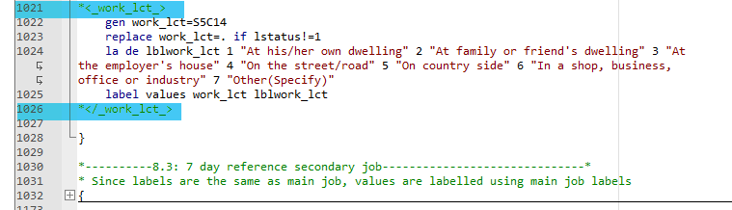
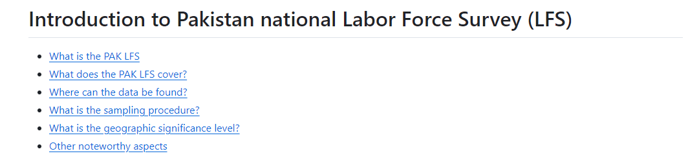
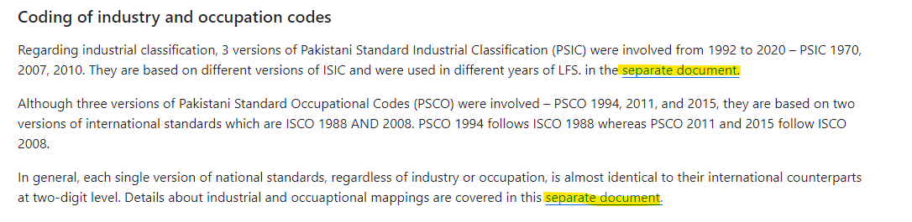

# Using and leveraging the GLD

## How do I cite GLD?

Citing the GLD is not as straightforward as citing an academic journal article. After all, if you have analyzed, for example, the Brazilian PNADC, used the harmonization code to help you built it but not exclusively, and maybe read the Country Survey Details to learn something about the survey that you probably would have learned anyway, just with the CSD you were quicker, the source under a table, should it not still be “PNADC (Years so and so), IBGE”, where IBGE is the Brazilian statistics office?

Certainly IBGE has done the bulk of the work and ought to be named first. What we propose is to include in the source description that data was mediated by the GLD, that data came *via* the GLD. The below is a mock example of the table with such a citation.

| **Year** | **Country**	| **# of concept A**	| **% of concept B**	| 
| :------:	      | :-------:		| :-------:	 	| :-------:	 	| 
| 2014 | BRA         | 29,453      |  23.4  | 
| 2015 | BRA         | 29,662      |  24.5  | 
| …       | …             | …                |  …  | 
| 2014 | TZA         | 28,463      |  9.34  | 
| 2015 | TZA         | 28,296      |  8.57  | 
 **Source : ** BRA PNADC, IBGE; …; TZA LFS, NBS via World Bank Global Labor Database

In the bibliography we propose the following citation:

```
World Bank Jobs Group. (n.d.). Global Labor Database. World Bank. Retrieved (Date), from https://github.com/worldbank/gld. 
```

It is understood that the Date of retrieval of the data should correspond not just to the last day the website was inspected, but that the underlying data used corresponds to the latest version at that time. Suppose a user downloaded the data by the 10th of Month of Year and on the 11th of that Month, data for the CCCC_YYYY_LFS was updated from CCCC_YYYY_LFS_V01_M_V0*2*_GLD to CCCC_YYYY_LFS_V01_M_V0*3*_GLD. The user’s data still contains V02. Then, even though the website was last accessed on the 13th of Month, the effective date for the purposes of the reference should remain the 10th of Month.

## How do I use the harmonized dta file?

### How do I use a single harmonized dta file?

A single file can be accessed, as discussed above, via the GLD server, the Microdata Library, or datalibweb. Each file represents the answers of individuals to the standard variables contained in the GLD dictionary. It can be directly used to calculate summary statistics (over the appropriate subgroups) and regressions.

The variables of the first block contain all relevant variables (psu, ssu, strata, …) to correctly set the survey setting with the exception of the [finite population correction factor](https://en.wikipedia.org/wiki/Standard_error#Finite_population_correction_(FPC)https://en.wikipedia.org/wiki/Standard_error#Finite_population_correction_(FPC)), e.g., the total number of primary sampling units from which the PSUs where selected from. This information is not available to us and users should either try to approximate the number or use caution when reading results that implicitly assume an infinite population.

### How do I access several harmonized dta files?

Users may access several surveys at a time and append them but should note that there are occasions when then format of a variable (namely the “_orig” variables). The GLD has prepared a Stata tool for users with access to the server to load the latest files from any given country. All explanations from how to install it to how to use it [are available here on the GLD GitHub repository](https://github.com/worldbank/gld/tree/main/Support/Z%20-%20GLD%20Ecosystem%20Tools/Append%20latest%20country%20surveys%20from%20server).

## How do I use/piggyback on the harmonization code?

The harmonization code is designed for users to exploit it by amending and adding variables. To amend or edit there are three sections consider. Firstly, amending the filenames and paths, secondly, amending or adding the variable(s) of interest, and thirdly, amending the “Final steps Section” that cleans the dataset.

For the first part, users need to evaluate the paths and overwrite the ones laid out in subsection `1.2` (see example below of the section for the Brazilian 2020 PNADC) to ensure the files are read from and stored in the folders they wish to use. 

<br></br>

<br></br>

When adding or amending variables, users could add the variable at any point after assembly (i.e., after section 1) and before the final steps. The GLD team recommends adding variables at the end of the section or subsection to which the variable belongs to. That is, if the user is adding an education variable, to do so after the last education variable. If the variable concerns the secondary job over the 12-month recall to add it after the last variable for that section. 

For example, the Pakistani 2020 LFS includes question 5.14 (shown below) that informs about the location where an activity is carried out.

<br></br>

<br></br>

As this question pertains to the main job over the 7-day recall period it should be placed at the end of the relevant section, namely section 8.2 (see screenshot below).

<br></br>

<br></br>

The next step in this process is then to add the variable. Users are free to do this as they wish, but the GLD team recommends keeping with the GLD format of wrapping variable code in tags, as shown below.

<br></br>

<br></br>

Once the variable(s) ha(s/ve) been added it needs to be included in the final section. This is because the final section not only drops variables that have missing answers for all observations but also reduces the data only to the variables in the standard dictionary and orders them accordingly. Since, by definition, any additional variable is not part of the standard dictionary it will not be part of the keeping and ordering sections (shown below). Users need to include it manually.

<br></br>

<br></br>

Once these three steps have been completed, the user will have created a customized output that expands on the GLD harmonization without having to go through all the previous steps to create a microdata file from the raw data that can be exploited. The harmonization is no longer a “take it or leave it” product to become sandbox with a sandcastle you can easily transform.

## How do I use the metadata/context information?

There are two parts of the GLD ecosystem that contain information that help users understand the survey context. The documentation files on the server and the Country Survey Details on the GitHub repository. 
The documentation on the server, if the users has access to it, should be straightforward. Inside every survey folder are the folders with the raw and harmonized data, that is, the `CCC_YYYY_Survey_V##_M` and the `CCC_YYYY_Survey_V##_M_V##_A_GLD` folders. Inside either type of folder is a `Doc` that contains the `Questionnaires` folder, holding all questionnaires and documents necessary to understand the survey flow; and the `Technical` folder, holding all other documents relevant to the understanding of it. 

If the `Doc/Questionnaires` or the `Doc/Technical` folders are missing in any one raw or harmonized folder, please inform the [GLD Focal Point](mailto:gld@worldbank.org). Similarly, kindly inform us if the content in the folders is different as we strive to have the same documents in all types of GLD versions, allowing a bit of duplication for quicker access to documents.
If there some document is not in the folder that is relevant it is, we would argue, because we could not find it at the time of preparing the harmonization. Nonetheless, if you are in possession of such a document and believe it should be added, please let the [GLD Focal Point](mailto:gld@worldbank.org) know so they may add it.

The documentation on the GitHub repository is organized first by country on the repository’s [Country Survey Details site](https://github.com/worldbank/gld/tree/main/Support/B%20-%20Country%20Survey%20Details). Within each country it is organized by survey (e.g., in India, on entry for the Employment Unemployment Survey (EUS) and one for the Periodic Labour Force Survey (PLFS)). Each survey information contains at least an introductory note (called the `1. Introduction to [CCC] [Survey]`) that will have, as shown below, six basic elements.

<br></br>

<br></br>

Each introduction will (1) explain what kind of survey the particular survey of interest is (i.e., LFS, budget survey, …). It will (2) inform the user what kind of information the survey covers, commonly with information on the sample sizes as well as (3) information on where the data can be found and how to access it. This will be links to the download sites if the data is in the public domain, or explanations how to obtain it for World Bank staff or reasons why they may not if restricted. The introduction covers broadly (4) the sampling procedure used to create the survey and (5) the geographic level to which the survey information is significant. For example, in the case of the Indian PLFS (before 2020) the information of the districts (administrative division below the states) is provided but the survey is not designed to produce estimates at this level. 

Finally, the introduction contains a catch-all section (6) that covers information relevant to the user but that cannot be standardise by category as it is a particularity of the survey (e.g., information on changes in the currency over time, if a country underwent a change in the currency).

If any of the topics covered in the last catch-all section (called the “Other noteworthy aspects”) cannot be explained in a paragraph, the GLD standard is to summarise the most salient aspects in the paragraph in the noteworthy aspects but elaborate on the details and inform the user more comprehensively in a separate document. Below an example of this for the [Introduction to the Pakistani LFS](https://github.com/worldbank/gld/blob/main/Support/B%20-%20Country%20Survey%20Details/PAK/LFS/1.%20Introduction%20to%20Pakistan%20LFS.md), where the issues around industry and occupation classifications are introduced only to link to a separate document where this can be covered in more detail. The introduction document should remain a sort of executive summary of the issues of a survey.

<br></br>

<br></br>

### How do I use the Github tools?

In addition to the harmonization codes and the context information, the GLD Github repository provides users with tools to support certain common tasks like converting between versions of the industry and occupation classifications (e.g., unifying surveys that have information using both ISIC revision 3.1 and revision 4).

The tools can be [accessed in the Z – GLD Ecosystem Tools](https://github.com/worldbank/gld/tree/main/Support/Z%20-%20GLD%20Ecosystem%20Tools) section of the repository. They do not follow a distinct policy (i.e., tools that serve a particular goal like simplifying unification of surveys) but rather are the byproduct of work the GLD team found itself doing repeatedly and that we believe can help users. 

Every tool should be a self-contained software project that contains all relevant instructions to allow users to install and use the code. Currently the tools ecosystem contains the following projects:

- A project to help users quickly append the latest versions of the harmonized files from a country on the server. [Link](https://github.com/worldbank/gld/tree/main/Support/Z%20-%20GLD%20Ecosystem%20Tools/Append%20latest%20country%20surveys%20from%20server).
- A project to create panels out of surveys that contain a panel element, as well as tools to evaluate the quality and consistency of the evaluated panels. [Link](https://github.com/worldbank/gld/tree/main/Support/Z%20-%20GLD%20Ecosystem%20Tools/GLD%20Panels).
- A project to help users check whether their harmonization files are the latest available by comparing a user submitted lists with the latest GLD survey on datalibweb. [Link](https://github.com/worldbank/gld/tree/main/Support/Z%20-%20GLD%20Ecosystem%20Tools/GLD%20files%20update%20check).
- A project to create correspondences between ISCO and ISIC versions to unify surveys using different revisions of classifications. [Link](https://github.com/worldbank/gld/tree/main/Support/Z%20-%20GLD%20Ecosystem%20Tools/ISIC%20ISCO%20conversion%20tool).
- A project to evaluate whether codes in the harmonization code do exists in the universe of possible codes the classification allows for. [Link](https://github.com/worldbank/gld/tree/main/Support/Z%20-%20GLD%20Ecosystem%20Tools/ISIC%20ISCO%20universe%20check).