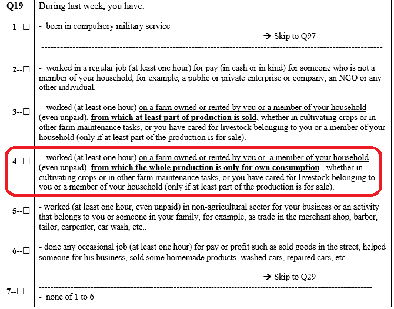
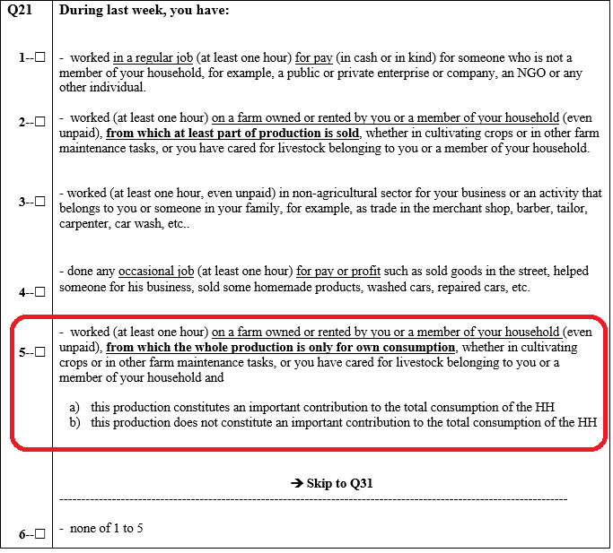

# Introduction

At the 19th ICLS in 2013, a significant development emerged with the adoption of the [Resolution concerning statistics of work, employment, and labor underutilization](https://www.ilo.org/resource/resolution-concerning-statistics-work-employment-and-labour). This led to a change in the concept of employment compared to ICLS-13.

In essence, the ICLS-19 resolution delineates **employment** only as work conducted for pay or profit. Activities performed not in exchange for remuneration, like own-use production work, volunteer work, and unpaid trainee work, are classified as **other forms of work**.

Therefore, in order to compare LFS 2007 to 2013 to surveys which employ ICLS-19, it is necessary to modify the coding of  variable `lstatus` using the nuances of the questionnaire.

## Framework for identifying employment in the LFS

All questionnaires used information on current activity to define employment through the ***Labour Status*** block.

## Current coding to the ICLS-19 definition

In converting to the new definition, the approach adopted here is to create a variable that identifies those that are engaged in non-market farming. See the Figure 1 below for the relevant parts in the questionnaires (for two time periods).

<div align="center"><strong>Figure 1: LFS Labour Questions</strong></div>

| LFS 2007 to 2010           |  LFS 2011 to 2013 |
|:-------------------------:|:-------------------------:|
|  |  |


The code below should be pasted after the code creating the ```lstatus``` variable. Note that this is based on the options available. ILO standard usually excludes work done *mostly* for own consumption from employment, which is not the case here. Hence differences may still arise and users should be aware of these caveats.

***For LFS 2007 to 2010:***

```     
  *Create an indicator "emp_diff" that identifies the difference between definitions (emp_diff)
	 gen emp_diff = 0 if inrange(lstatus, 2, 3)
	*Add those in non market farming
	 replace emp_diff = 1 if emp_diff == 0 & inrange(q19, 4) 
  
  * Use emp_diff to generate ICLS-19 definition
	replace lstatus = . if emp_diff == 1
	
	replace lstatus = . if age < minlaborag
```
***For LFS 2011 to 2013:***
```     
  *Create an indicator "emp_diff" that identifies the difference between definitions (emp_diff)
	 gen emp_diff = 0 if inrange(lstatus, 2, 3)
	*Add those in non market farming
	 replace emp_diff = 1 if emp_diff == 0 & inrange(q21, 5) 
  
  * Use emp_diff to generate ICLS-19 definition
	replace lstatus = . if emp_diff == 1
	
	replace lstatus = . if age < minlaborag
```

We can go further an try to overwrite the employment status, occupation sector, industry and occupation of those that we assume would have - under the new definition - been recorded with their own consumption definition under the new employment definition.

```     
	replace empstat = . if emp_diff == 1
	replace industrycat10 = . if emp_diff == 1
	replace occup = . if emp_diff == 1
```
Finally, do the last bits of cleaning up to ensure the other labour variables are in line with what could be expected for own-consumption workers.

```
  * WAGE (send to missing)
  replace wage_no_compen = . if emp_diff == 1 
  
  * WHOURS (send to missing)
  replace whours = . if emp_diff == 1 
  
  * CONTRACT (send to missing)
  replace contract = . if emp_diff == 1 
  
  * SOCIAL SECURITY (send to missing)
  replace socialsec = . if emp_diff == 1
  
  * UNION (send to missing)
  replace union = . if emp_diff == 1 
  
  * FIRMSIZE (send to missing)
  replace firmsize_l = . if emp_diff == 1 
  replace firmsize_u = . if emp_diff == 1
```

