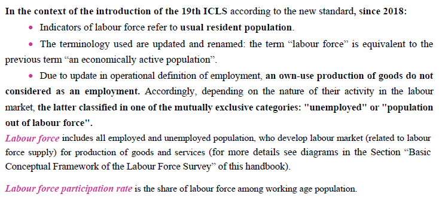
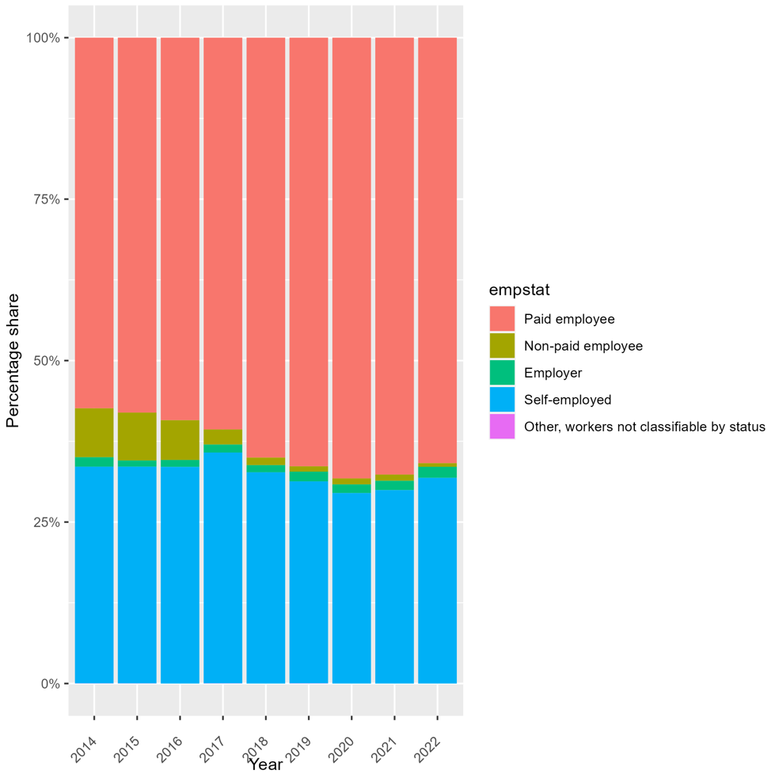

# Introduction to Armenia (ARM) national Labour Force Survey (LFS)

- [What is the ARM LFS](#what-is-the-arm-lfs)
- [What does the ARM LFS cover?](#what-does-the-arm-lfs-cover)
- [Where can the data be found?](#where-can-the-data-be-found)
- [What is the sampling procedure?](#what-is-the-sampling-procedure)
- [What is the geographic significance level?](#what-is-the-geographic-significance-level)
- [Other noteworthy aspects](#other-noteworthy-aspects)

## What is the ARM LFS?

The Armenian Labour Force Survey (LFS) is a household-based sample survey conducted by the National Statistical Service (NSS) of the Republic of Armenia. Before 2014, the Households Integrated Living Condition Survey played the central role of providing labour market statistics. Since 2014, the ARM LFS was conducted monthly every year with the aim to measure the levels and trends of employment, unemployment and labour force in Armenia. 

## What does the ARM LFS cover?

The ARM LFS findings provide annual and quarterly short-term labour market statistical indicators. In addition to general household characteristics, the LFS covers indicators such as the country labour resources, or working age population (aged 15 to 75), by gender, age, education and family statues; active and inactive population in labour market by various characteristics; employment in different economic sectors, working hours and incomes etc. The ARM LFS started to include migration information since 2018. 

**Scope of Survey**:
 
1) Primary Sampling Unit (PSU): PSU is a private household. The residents of the retirement homes, prisons
and other institutional households are not surveyed.
2) Survey Units: People aged from 15 to 75 who a) usually live in a given household; b) were absent from the household up to 12 months (in country or abroad); c) were in compulsory military service.
3) Observation Period: All 12 months of the surveyed year.
4) Reference Period: The last one calendar week preceding the survey, from Monday to Sunday.
5) Geographical Coverage: Survey conducted in all 11 marzes (provinces), covering both rural and urban settlements.

GLD harmonization of ARM LFS covers years from 2014 to 2022 continuously, 9 years in total. Years and their corresponding sample sizes of LFS harmonized are:

| **Year**	| **# of Households**	| **# of Individuals**	| **Expanded Population**	| **Officially Reported Sample Size(# HH)**	| 
| :------:	| :-------:		| :-------:	 	| :-------:	 	| :-------:	| 
| 2014 | 7,679         | 29,453      |  3,087,669  |   7,680   |
| 2015 | 7,788         | 29,662      |  3,023,842  |   7,788   | 
| 2016 | 7,788         | 28,516      |  2,895,298  |   7,788   | 
| 2017 | 7,783         | 28,463      |  2,927,886  |   7,788   | 
| 2018 | 7,788         | 28,296      |  2,908,921  |   7,788   |
| 2019 | 7,768         | 27,854      |  2,839,777  |   7,788   | 
| 2020 | 7,781         | 27,986      |  2,961,467  |   7,788   |
| 2021 | 7,776         | 26,923      |  2,962,306  |   7,788   | 
| 2022 | 7,760         | 27,218      |  2,969,037  |   7,788   | 

(*Note: The officially reported sample sizes are from methodology documentation of each year, which can be found from the [online publication library of NSS](https://armstat.am/en/?nid=82&year=2013).*)  

## Where can the data be found?
All data is publicly available on the website of [Statistical Committee of the Republic of Armenia] ([http://nada.nso.gov.lk/index.php/home](https://armstat.am/en/?nid=212)). As mentioned above, each year's corresponding documentation on employment and other estimates can be downloaded without any restrictions from their oneline publication library.

## What is the sampling procedure?

A two stage stratified sample by regions (marzes) has been designed to conduct the survey. The method of systematic probability sampling was used to frame the sample. Yerevan and all marzes with rural and urban settlements were covered by sample population with proportion of all households available in these strata. Based on the administrative and territorial division of ARM at the first stage of sampling, the preliminary sampling units, i.e. enumeration areas were selected. At the second stage of sampling, the PSU or households, were randomly selected.  

## What is the geographic significance level?

According to the [methodology section](utilities/ARM_2018_methodologies.pdf) in ARM LFS annual reports, the annual size of the sample in terms of aggregated indicators (e.g. unemployment, employment, etc.) provides high representativeness on country level, and provides minimum representativeness on marz
(province) level.

## Other noteworthy aspects  

### Changes in International Conference of Labour Statisticians (ICLS) version and its impact on results  

The ARM LFS went through a change between 2017 and 2018 in its questionnaire structure and the ICLS version applied which accordingly changed some of the questions surveyed. From 2014 to 2017, the ARM LFS used ICLS-13, meaning that working for own consumption is defined as employed. The change in the definition is documented in the employment section of [2017](utilities/ARM_2014-2017_employment_definition.pdf) and [2018](utilities/ARM_2018_employment_definition.pdf)'s annual reports. The table below shows the difference in the official explanations and employment block in 2017 and 2018's questionnaires.  

|  **2014-2017**	|  **2018-2022**	| 
| :-------------:	| :------------:	|
| |  | 
| |  |

This change leads to an apparent decrease in non-paid employees.

### Coding of industry and occupation codes

In terms of classifications of industry and occupation, ARM LFS used ISIC-4 and ISCO-08 respectively for all years. No national classifications applied. However, regarding the level of classification, both industry and occupation only used letters. The full lists of industry and occupation labels are covered in this [separate document](Classifications_of_Industry_and_Occupation.md) . 

### Migrated from other countries

Since 2018, ARM LFS started to have the migration section. From 2019 to 2022, one of the "last settlement" options is Artsakh, an enclave within Azerbaijan from the 2020 Nagorno-Karabakh war until the 2023 Azerbaijani offensive, when the Azerbaijani military took control over the remaining territory controlled by Artsakh. Although Artsakh declared itself an independent state, as the Republic of Artsakh, no United Nations member state or observer recognised Artsakh's independence and consider it as part of Azerbaijiani. Consequently, there is no ISO three-letter country code for Artsakh. In this case, we coded Artsakh "AZE", using the ISO code of Azerbaijiani for Artsakh. 

### Age variables in 2021 and 2022

Different from previous years, the last two years, 2021 and 2022 do not have the actual age of each observation in the raw dataset. Instead, they coded the age variable as in 16 age groups (refer to the screenshot from 2022 below).

In this case, we harmonized our `age` variable using the mean of each sub-group of the original `Age_16groups` so as to proceed with our quality checks. Hence, for 2021 and 2022, `age` in GLD harmonization of ARM LFS does not represnt the actual age of a given observation. Yet instead, it indicates the age group a given observation belongs to. 

### Educational categories

### Employment rate comparison
