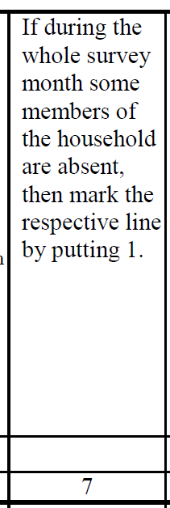

# Introduction to [Full Name of Survey] ([Survey Acronym)]

- [What is the ARM survey?](#what-is-the-arm-ilcs)
- [What does the ARM survey cover?](#what-does-the-arm-ilcs-cover)
- [Where can the data be found?](#where-can-the-data-be-found)
- [What is the sampling procedure?](#what-is-the-sampling-procedure)
- [What is the significance level?](#what-is-the-geographic-significance-level)
- [Other noteworthy aspects](#other-noteworthy-aspects)

## What is the ARM ILCS?

The Integrated Living Conditions Survey (ILCS) was first conducted in Armenia in 1996 (in a one-month period), followed by the one in 1998/99; thereafter, it has been conducted every year
since 2001. The GLD version only covers the years 2008 to 2013, since Armenia also has a labour force survey since 2014.

## What does the ARM ILCS cover?

The Armenian ILCS covers all standard modules of a living conditions survey (household assets, health, labor, savings). Moreover, it contains a diary of daily expenditures (food and non-food). The harmonization covers the following years with the following sample sizes:

| Year	| # of Households	| # of Individuals	|
| :-------	| :--------		| :--------	 	|
| 2008	| 7,872		| 32,756		|
| 2009	| 7,872		| 32,362		|
| 2010	| 7,872		| 32,353		|
| 2011	| 7,872		| 31,024		|
| 2012	| 5,184		| 20,134		|
| 2013	| 5,184 	| 19,831		|

## Where can the data be found?

The data are publicly available on the website of the Statistical Committee of the Republic of Armenia (ARMSTAT). The data are stored in series for [the households](https://armstat.am/en/?nid=205), [the household members](https://armstat.am/en/?nid=206), and [the consumption diaries](https://armstat.am/en/?nid=207). The site additionally links to the World Bank Microdata Library

## What is the sampling procedure?

The GLD team has only found documentation on the sampling procedure for 2008 and 2009. However, there is no reason to assume this does not hold for years 2010 to 2013. The following passage explains the stratified, two stage sampling approach. It is taken from the [2009 AILCS document available here](utilities/AILCS.pdf):

> The sampling frame for 2009 was designed according to the database of addresses of all households in the country developed on basis of the 2001 Population Census results, with the
technical assistance of the World Bank.

> The sample consisted of two parts – master sample and supplementary sample.

> 1. For the purpose of drawing the master sample, the sample frame was divided into 48 strata including 12 communities of Yerevan City (currently, the administrative districts).
Communities in all regions were grouped into three categories: large towns with 15.000 and more inhabitants, small towns with less than 15.000 inhabitants, and villages. Large towns
formed 16 groups (strata), while small towns and villages formed 10 strata each.

> According to this division, a random two-tier sample was drawn, stratified by regions and by Yerevan. All regions and Yerevan, as well as all urban and rural communities were included
in the sample in accordance to the shares of their resident households within the total number of households in the country. In the first round, enumeration districts – that is primary sample
units to be surveyed during the year – were selected. The ILCS 2009 sample included 46 enumeration districts in urban and 18 enumeration districts in rural communities per month.

> 2. The supplementary sample was drawn from the list of the villages included in MCA-Armenia road rehabilitation projects. Then, enumeration districts of the villages already included in
the master sample were excluded from this list. Eighteen enumeration districts were selected per month from among the remaining ones. Thus, the sample of rural communities doubled.

> 3. After merging the master and supplementary samples, the households to be surveyed were selected in the second round. A total of 656 households were surveyed per month, of which
368 and 288 households from urban and rural communities, respectively. 


## What is the geographic significance level?

Survey data provide for a minimum representativeness by regions (variable `subnatid1`).

## Other noteworthy aspects

### Age restriction of the questionnaire labor market module

While most surveys limit the market module to all people aged above lower age threshold (commonly 15 years of age), the Armenian ILCS is limited also by an upper age threshold. Only people aged 15 to 75 respond to the labor market module and thus have labor variables. Given the low labor forceparticipation of people aged 76 and older, it can be assumed that the labor force participation of the population 15+ is lower than the one that can be calculated.

### Handling of absentees

The Armenian ILCS surveys include a question whether household members are absent (defined as not being in the household for the whole survey month). The below shows screenshots of this question in the 2008 and 2013 questionnaires.

| Questionnaire 2008                                               | Questionnaire 2013                                              | 
|------------------------------------------------------------------|-----------------------------------------------------------------|
|    |   | 

There are 1,274 household members aged between 15 and 75 coded as absent for whome there is no labor market information. The number for 2013 is 1,323. Absentees are being skipped in the labor market module despite the questionnaire having no direct skip pattern.

As a consequence, `lstatus` and all labor variables are missing for this group of people. However, we have information on their personal details (sex, age, marital status) and their education, as well as a weight variable.

Normally, the population for whom `lstatus` is defined (i.e., `lstatus` is 1, 2, or 3) should be the same as that of household members in working age (here, ages 15 to 75). This is not the case here. Hence, the below calculations are not equal:

```math
\frac{\text{people aged 15-75 with lstatus 1 or 2}}{\text{people aged 15-75 with lstatus 1, 2, or 3}} \neq \frac{\text{people aged 15-75 with lstatus 1 or 2}}{\text{people aged 15-75}} 
```

The GLD harmonization has kept the absentees in the data. They can be identified by having missing values for `lstatus` despite being aged 15 to 75.

The only exception are 228 individuals in 2013 who are coded as absent but answer some labor market questions (though not all the ones they should). All are coded as completing their military service. They are coded as not in the labour force (`lstatus == 3`). This way we match the numbers reported by ARMSTAT.

### Coding of education variables

Text