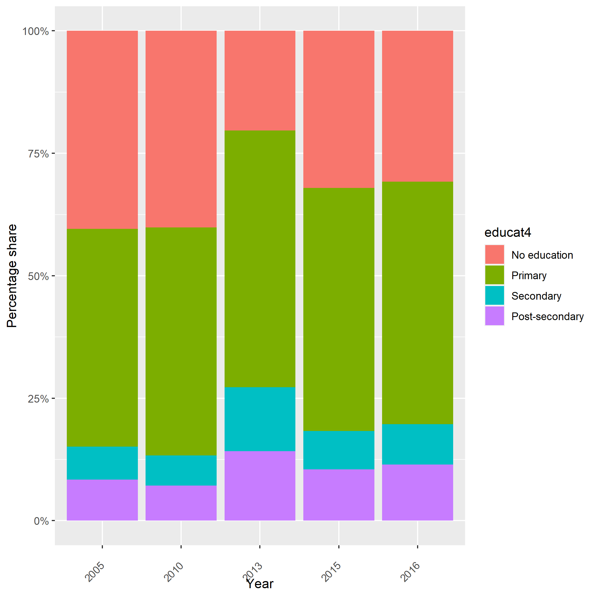
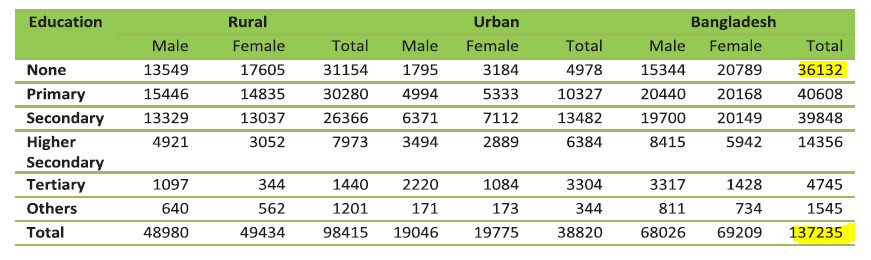

# Education system in Bangladesh

## Overview of Bangladesh education system

The education system in Bangladesh comprise of 5 years in primary, 3 years in junior secondary, 2 years in secondary, and 2 years in higher secondary before admission into tertiary education.

1. **Primary education** in Bangladesh starts at the age of six and covers Classes 1 - 5. This level of education is compulsory for all children aged between six and ten. At the end of the fifth year, students must sit for a national examination called the Primary Education Completion (PEC) exam.

2. **Secondary education** in Bangladesh is divided into two parts: junior secondary (Classes 6 - 8) and upper secondary (Classes 9 - 10). Lower secondary education, known as Junior Secondary School Certificate (JSC), is two years long and starts after the successful completion of primary education. 
After that, students move on to upper secondary education, which culminates with the Secondary School Certificate (SSC) exam.

3. After successfully completing the SSC exam, students move on to **Higher Secondary Education** (Classes 11 - 12) where the completion of the Higher Secondary Certificate (HSC) exam is required to advance to tertiary education.

**Vocational education** is an alternative to the academic path, and there are different levels of vocational education along with different academic prerequisites. 
Entry to non-formal trainings, such as a 21-day housekeeping course, requires completion of primary education (Class 5).
Meanwhile, the formal vocational track is multi-tiered. The *basic training program* is guided by the National Vocational Qualifications Framework. Under this system, there are 5 levels of National Skills Standards, with the most basic
level requiring completion of junior secondary (Class 8). The *certificate training program* pertains to the vocational training alternative in the secondary and higher secondary curricula. The *diploma courses* are offered as four-year post-secondary diploma courses by polytechnic institutes. 
The minimum entry requirement at this level is completion of SSC (Class 10). For more information on the Bangladesh's vocational education system, refer to [this report.](Utilities/tvet-hrd-south-asia-bangladesh.pdf)

## Mapping with the GLD education categories

| BGD LFS                              | educat7 |
|--------------------------------------|---------|
| 1. no education                      | 1 - No Education            |
| 2. class i-v                         | 2 - Primary Incomplete      |
| 3. class vi-viii                     | 4 - Secondary Incomplete    |
| 4. class ix-x                        | 4 - Secondary Incomplete    |
| 5. ssc/equivalent                    | 5 - Secondary Complete    |
| 6. hsc/equivalent                    | 6 - Higher than Secondary   |
| 7. bachelor degree/equivalent        | 7 - University In/complete   |
| 8. master degree/equivalent          | 7 - University In/complete     |
| 9. medical/engineering degree        | 7 - University In/complete     |
| 10. technical/vocational   education | missing |
| 11. others                           | missing |

Note that there is no mapping to "3 - Primary Complete". But it is possible to infer that individuals in Classes 6 - 10 completed primary education given that these levels require completion of the PEC. Since these individuals took education beyond PEC, these were coded as "4 - Secondary Incomplete", whereas coding "3 - Primary Complete" suggests that no education beyond PEC has been taken. 

Also, given the multiple tiers of technical and vocational education training (TVET) in Bangladesh, it is not possible for a 1:1 or many:1 correspondence with the GLD `educat7` categories. If distinction is made among the different tiers of TVET, it may be possible to do the mappings for specific tiers based on the minimum education requirements. For instance, *diploma courses* can be mapped to "6 - Higher than Secondary". 

## Note on the 2013 estimates

In 2013, there was a marked decrease in the estimated percentage of individuals without education. However, if we exclude this particular year from our observations, we see a more gradual and consistent decline in this demographic over time. This gradual decrease is more intuitively aligned with  expectations, given that the educational attainment is a *stock* variable, i.e., it is cumulative and changes slowly over time. 

The estimates for 2013 align with the data published by the Bangladesh Bureau of Statistics (see table below). It's worth noting that there may be minor discrepancies in these figures due to differences in the age ranges considered within the population statistics. Once we adjust these statistics to ensure a consistent age range denominator, the results align precisely with the estimates provided by the NSO.

