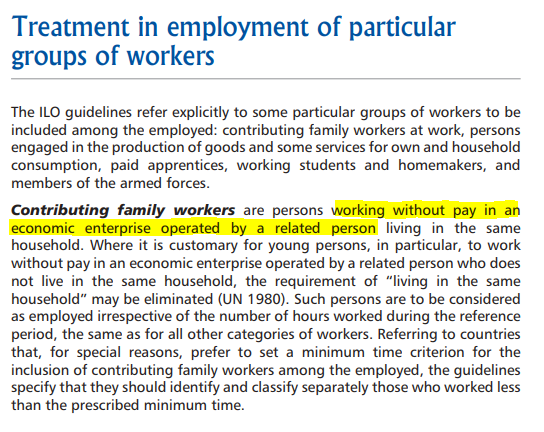

# Coding `empstat` in the BGD LFS

The employment status categories in the Bangladesh LFS vary over the years. The table below lists down the employment status categories used in each survey, and the check mark ✓ identifies the GLD `empstat` category to which they were mapped. 

| **BGD LFS employment   status** | **Paid employee** | **Non-paid employee** | **Employer** | **Self-employed** | **Not classificable** |
|---|:---:|:---:|:---:|:---:|:---:|
| **2005** |  |  |  |  |  |
| 1. regular paid employee | ✓ |  |  |  |  |
| 2. employer |  |  | ✓ |  |  |
| 3. self-employed |  |  |  | ✓ |  |
| 4. unpaid family worker |  | ✓ |  |  |  |
| 5. irregular paid worker | ✓ |  |  |  |  |
| 6. day labor (agriculture) | ✓ |  |  |  |  |
| 7. day labor (non-agriculture) | ✓ |  |  |  |  |
| 8. domestic worker (maid servant) | ✓ |  |  |  |  |
| 9. paid/unpaid apprentice |  |  |  |  | ✓ |
| 10. others |  |  |  |  | ✓ |
| **2010** |  |  |  |  |  |
| 1. regular paid employee | ✓ |  |  |  |  |
| 2. employer |  |  | ✓ |  |  |
| 3. self employed (agri) |  |  |  | ✓ |  |
| 4. self employed (non-agri) |  |  |  | ✓ |  |
| 5. unpaid family worker |  | ✓ |  |  |  |
| 6. irregular paid worker | ✓ |  |  |  |  |
| 7. day labourer (agri) | ✓ |  |  |  |  |
| 8. day labourer (non-agri) | ✓ |  |  |  |  |
| 9. servant | ✓ |  |  |  |  |
| **2013** |  |  |  |  |  |
| 1. employer |  |  | ✓ |  |  |
| 2. self employed (agri) |  |  |  | ✓ |  |
| 3. self-employed (non-agriculture) |  |  |  |  | ✓ |
| 4. contributing family helper |  | ✓ |  |  |  |
| 5. employee | ✓ |  |  |  |  |
| 6. day labour (agriculture) | ✓ |  |  |  |  |
| 7. day labour (non-agriculture) | ✓ |  |  |  |  |
| 8. apprentice |  |  |  |  | ✓ |
| 9. domestic worker | ✓ |  |  |  |  |
| 99. others |  |  |  |  | ✓ |

**Treatment of contributing family workers**. The employment status category, "unpaid family worker" was no longer used beginning in the 2013 survey, and was replaced by "contributing family worker", a category introduced by the [International Classification of Status of Employment (ICSE)
1993](Utilities/icse93.pdf) as a type of "self-employment" activity where individual may or may not be receiving income as an allocation from the family-based enterprise. However, many institutions treat this category as unpaid work:
- The WDI considers this as similar to "unpaid family work" (see this [definition](https://databank.worldbank.org/metadataglossary/millennium-development-goals/series/SL.FAM.WORK.MA.ZS)
- The [Australia Bureau of Statistics](https://www.abs.gov.au/ausstats/abs@.nsf/Lookup/2901.0Chapter27002016) defines this as "a person who works without pay, in an economic enterprise operated by a relative"
- A [2003 ILO Training Manual](Utilities/ilo_labstat.pdf) explicitly defines this as "persons working without pay", see below:

In the GLD harmonization, it is decided to treat this as a "non-paid employee". This allows continuity of this `empstat` category over time, and at the same time, it allows for flexibility as users can easily recode this to "self-employed" or "others, not classifiable by status" without altering the do file given the 1:1 correspondence with non-paid employees. 

**Treatment of apprenticeship**. The apprenticeship category is treated differently in two surveys. In the 2005 round, this category is worded as "paid/unpaid apprentice", while in the 2013 round, it is worded simply as "apprenticeship". By capturing both paid and unpaid apprentices, the wording in 2005 round makes it impossible to distinguish between paid and unpaid; thus, it is classified as "Other, workers not classificable by status". Meanwhile, in the 2013 round, all apprentices reported a non-zero income, indicating these were all paid apprentices. For this reason, the 2013 harmonized data codes this as "paid employee". 

