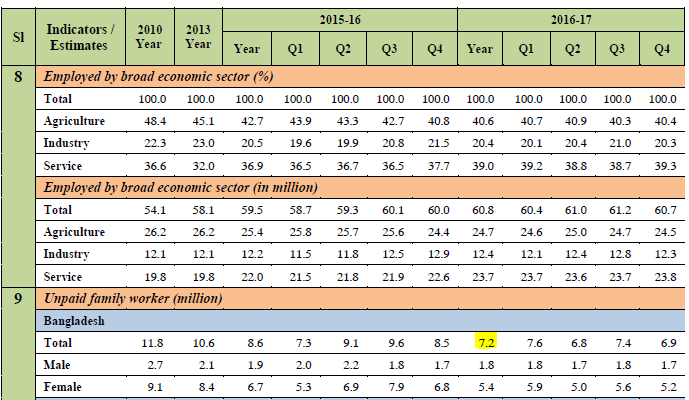

# Coding `empstat` in the BGD LFS

The employment status categories in the Bangladesh LFS vary over the years. The table below lists down the employment status categories used in each survey, and the check mark ✓ identifies the GLD `empstat` category to which they were mapped. 

| **QLFS status of   employment** | **empstat** |
|---|---|
| Employer (Self-employed with paid   employees) | Employer |
| Self - employed | Self-employed |
| Contributing family member | Non-paid employee |
| Paid    Employee | Paid employee |
| Day labourer | Paid employee |
| Apprentices/intern/ trainees (If paid) | Paid employee |
| Domestic worker | Paid employee |
| Others (Specify) | Others, workers not classificable by status |

**Treatment of contributing family workers**. The QLFS uses the employment status category called "contributing family worker", a category introduced by the [International Classification of Status of Employment (ICSE)
1993](Utilities/icse93.pdf) as a type of "self-employment" activity where individual may or may not be receiving income as an allocation from the family-based enterprise. However, many institutions treat this category as unpaid work:
- The WDI considers this as similar to "unpaid family work" (see this [definition](https://databank.worldbank.org/metadataglossary/millennium-development-goals/series/SL.FAM.WORK.MA.ZS)
- The [Australia Bureau of Statistics](https://www.abs.gov.au/ausstats/abs@.nsf/Lookup/2901.0Chapter27002016) defines this as "a person who works without pay, in an economic enterprise operated by a relative"
- A [2003 ILO Training Manual](Utilities/ilo_labstat.pdf) explicitly defines this as "persons working without pay", see below:

In the GLD harmonization, it is decided to treat this as a "non-paid employee". This allows continuity of this `empstat` category over time, and at the same time, it allows for flexibility as users can easily recode this to "self-employed" or "others, not classifiable by status" without altering the do file given the 1:1 correspondence with non-paid employees. Moreover, the Bangladesh Bureau of Statistics presented estimates of "unpaid family workers" in their official reports, and the estimates can be replicated by using information from contributing family workers. See example below for 2016:

These are the estimates from the annual report:

These are the estimates from the GLD harmonized data after adjusting for the old ICLS definition:

