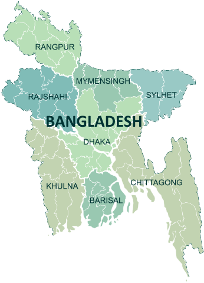
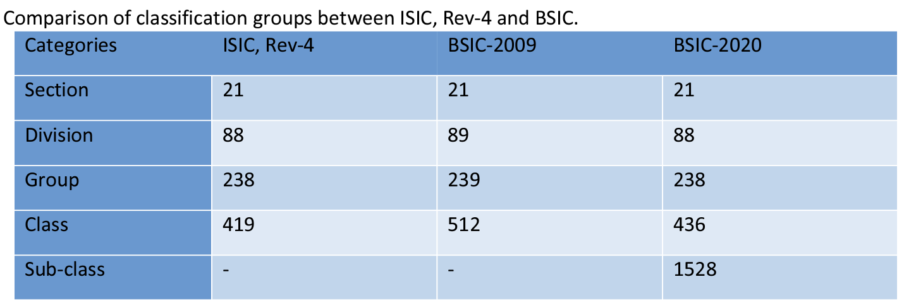
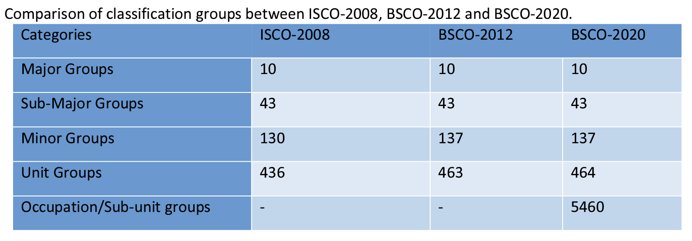

-   [Introduction to Bangladesh Labor Force Survey (BGD
    QLFS)](#introduction-to-bangladesh-labor-force-survey-bgd-lfs)
    -   [What is the BGD QLFS?](#what-is-the-bgd-lfs)
    -   [What does the BGD QLFS cover?](#what-does-the-bgd-lfs-cover)
    -   [Where can the data be found?](#where-can-the-data-be-found)
    -   [What is the sampling
        procedure?](#what-is-the-sampling-procedure)
    -   [What is the significance
        level?](#what-is-the-significance-level)
    -   [Other noteworthy aspects](#other-noteworthy-aspects)

# Introduction to Bangladesh Quarterly Labor Force Survey (BGD QLFS)

## What is the BGD QLFS?

The Bangladesh Quarterly Labor Force Survey (QLFS) succeeds the annual LFS after its first survey was conducted between 2015 and 2016. The QLFS mainly differs from the annual LFS by providing nationally-representative data on a quarterly basis, and offers a more detailed understanding of labor market dynamics. Specifically, the questionnaire is aligned with the ICLS-19, with questions aimed to gather information on the individuals' own-use production of goods and services, a crucial aspect of the informal labor market and subsistence activities in Bangladesh.

## What does the BGD QLFS cover?

The Bangladesh QLFS is a quarterly labor force survey with information on demographic characteristics, education, and labor market activities over the past 7 days. The harmonized years and sample sizes used in the GLD harmonization are as follows:

| Year | HH count | Individual count |
|---|---|---|
| 2015-16 |          121,082  |                      503,756  |
| 2016-17 |          122,455|                      493,886  |

Unlike its precedessor, the Bangladesh QLFS implements a rotational sampling design, in which households were interviewed for two consecutive quarters before being replaced. In the frequency table above, household and individuals were counted distinctly per round. This means that an individual interviewed for two consecutive quarters is counted twice in the reported frequency table. 

## Where can the data be found?

The datasets are not accessible to the public and researchers have to request the data from the Bangladesh Bureau of Statistics. The World Bank has been granted access to the datasets, if you work or are part of the World Bank Group, kindly contact the Jobs Group with a formal request for access to gld@worldbank.org

## What is the sampling procedure?

The Bangladesh QLFS employs a two-stage stratified sampling design to gather representative data on the country's labor force. This sampling methodology involves selecting Primary Sampling Units (PSUs) in the first stage and households within each PSU in the second stage. Both stages employ random selection techniques, ensuring the sample's representativeness. In the 2015-16 and 2016-17 rounds, the QLFS implemented a rotational panel strategy, where some households in each cluster were replaced by new ones every two quarters.

## What is the significance level?

The official reports detail estimates by area of residence (urban or rural), and the first level administrative units, called *divisions* in Bangladesh. In contrast to the LFS, the QLFS allows breakdown of estimates at a greater level of detail. Disaggregation is possible at a quarterly basis, and area of residence by divisions. However, the GLD data uses annual weights. Data for quarterly weights is available for the 2016-2017 round, but not for the 2015-2016 round. 

## Other noteworthy aspects

### Concept of employment

Since the passing of the [resolution concerning statistics of work, employment and labour underutilization](https://www.ilo.org/global/statistics-and-databases/standards-and-guidelines/resolutions-adopted-by-international-conferences-of-labour-statisticians/WCMS_230304/lang--en/index.htm) in 2013 at the 19th International Conference of Labour Statisticians (ICLS) surveys are at risk of a series break due to the change in the concept of employment.

In short, the ICLS 19 resolution restricts employment to *work performed for others in exchange for pay or profit*, meaning that own consumption work (e.g., subsistence agriculture or building housing for oneself) are not counted as employment.

The Bangladesh QLFS survey reports are consistent with the LFS in using a definition for employment that includes individuals working for their own consumption. Although this definition does not align with international standards, the QLFS series contain information on individuals' intentions for economic activity, whether for sale or own consumption. This information can be used to code employment to exclude individuals whose primary intention for economic activity is own consumption. This approach allows us to adopt a definition of employment that aligns with international standards. However, adopting this break in definition makes it challenging to meaningfully compare data over time. To address this, we provide a code that enables us to identify employment using the previous definition. The precise details can be found in a [separate document here](Converting%20between%20ICLS%20Definitions.md)

### Household ID

The datasets received do not contain ID information. In the GLD project, we have created IDs to provide the best user experience based on geographic identifiers. The household ID is formed based on information on the primary sampling unit and the household identification number. 

### Geographic Information

As of the time of writing (April 2023) Bangladesh is composed of eight administrative divisions: Dhaka, Chittagong, Khulna, Barisal, Rajshahi, Sylhet, Rangpur, and Mymensingh (see figure below). 

  

  

The table below shows the divisions as of writing and what divisions they belonged to for both 2015-16 and 2016-17 QLFS rounds.

| Divisions as of April 2023    | Divisions in 2015-2016        |
|:-----------------------------:|:------------------------------|
| Barisal                       | Barisal                       |
| Chittagong                    | Chittagong                    |
| Dhaka                         | Dhaka                         |
| Khulna                        | Khulna                        |
| Mymenshingh                   | Dhaka                         |
| Rajshahi                      | Rajshahi                      |
| Rangpur                       | Rangpur                       |
| Sylhet                        | Sylhet                        |

The division of Mymensingh was created in 2015, splitting off Dhaka, and consists of the districts of Jamalpur, Mymensingh, Netrokona, and Sherpur.

### Employment: Industry Classification

The Bangladesh QLFS employs its national industry classification system called the Bangladesh Standards for Industrial Classification (BSIC) 2009, which is adapted from the International Standards for Industrial Classification (ISIC) revision 4.

| Year    | Classification in survey | ISIC revision mapped to | How mapped                |
|:-------:|:------------------------:|:-----------------------:|:--------------------------|
| 2015-16 | BSIC 2009                | ISIC revision 4         | First 3 digits; first 2 digits if non-existent at 3 digits          |
| 2016-17 | BSIC 2009                | ISIC revision 4         | First 3 digits; first 2 digits if non-existent at 3 digits          |

As of time of writing (April 2023), an update of the BSIC has been released in 2020 to use more detailed categories of industries. While the ISIC version 4 details occupational categories at four digits, the BSIC 2020 is detailed at six digits. Based on the table below, both BSIC 2020 and BSIC 2009 are comparable at most at the single digit level. BSIC is comparable with the ISIC rev. 4 at 2 digits except for an additional two-digit code that is not in ISIC, and neither was it reported as an industry of any individual in either survey. 

### Employment: Occupation Classification

The Bangladesh QLFS employs its national occupational classification system called the Bangladesh Standard Classification of Occupations (BSCO) 2012, which is adapted from the International Standard Classification of Occupations (ISC0) 2008. 

| Year    | Classification in survey | ISIC revision mapped to | How mapped                |
|:-------:|:------------------------:|:-----------------------:|:--------------------------|
| 2015-16 | BSCO 2012                | ISCO 2008               | First 2 digits; first digit if non-existent at 2 digits         |
| 2016-17 | BSCO 2012                | ISCO 2008               | First 2 digits; first digit if non-existent at 2 digits           |

As of time of writing (April 2023), an update of the BSCO has been released in 2020 to use more detailed categories of occupation. While the ISCO 2008 details occupational categories at four digits, the BSCO 2020 is detailed at six digits. Based on the table below, both BSCO 2012 and 2020 are comparable at most at the 3-digit level, and both are comparable with the ISCO at 2 digits. For more information, refer to this [document](Utilities/3(v)-Bangladesh-18Feb2022.pdf).

