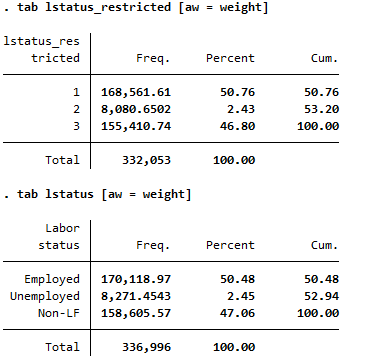
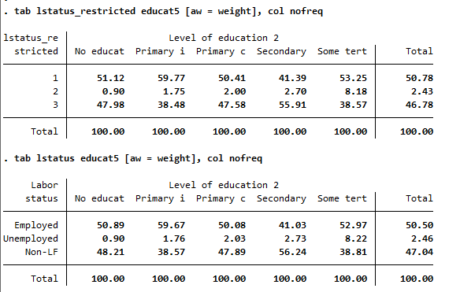

# Issues with panel construction in the QLFS

## Overview of the issues
The QLFS employs a rotating panel survey design in which the same household is interviewed for two consecutive quarters before being replaced. Typically, a combination of household information and line numbers serves as the panel identifier to track households and individuals across quarters. However, when comparing variables that should remain relatively stable or unchanged between two rounds, certain logical inconsistencies may arise, indicating potential issues in data entry and/or panel identification.

Here are a few examples illustrating these challenges:

**Age.**  There were instances where the reported age of the same individual drastically changes between two consecutive quarters.
One way to examine the scale of this problem is by analyzing the frequency of age differences within the panel identifier across different years.
While a one-year difference may be tolerable, considering the likelihood that an individual's birth date falls between 
two survey rounds, the problem becomes more substantial when larger age discrepancies occur. 
In particular, such inconsistencies may lead to misrepresentations within the working-age population, which may affect the overall reliability of the survey findings.

| **Age   difference within panel id** | **2015** | **2016** |
|---|---|---|
| Equal to 0 | 261,626 | 273,323 |
| Equal to 1 | 90,279 | 108,849 |
| Equal to 2 | 40,996 | 35,349 |
| Between 3 and 9 | 77,267 | 52,782 |
| 10 and above | 33,583 | 23,581 |

If the inconsistencies were random, the overall impact on the reliability of the findings might be minimal. Tabulating for labor status with and without these inconsistent panels show that the estimates do not change significantly. Below, the variable `lstatus_restricted` defines labor status only for individuals with age difference equal to zero or 1.  

Disaggregating labor status by education also shows that results do not vary significantly. 

**Names of respondents.** Another direct issue in the data arises from the mismatch of names. There are several instances where the name of the respondent does not uniquely align with the assigned line number within the household. For example, an individual identified by a name variable is assigned to a specific line number in one round, but this same line number in the following round identifies a different name that used a separate line number in the previous round. This indicates that using line numbers as a panel identifier may be problematic. Instead, the variable corresponding to respondent names might serve as a more reliable and unique panel identifier for tracking individuals across rounds.

**Re-using household ID** Also, there were cases when the same household ID was used for two different households. Respondents' names were different and unrelated, despite sharing the same ID. This issue is not the result of duplicate entries, as these households originate from two different rotation groups. This undermines the assumption that the same household ID refers to the same household across all quarters. The unique household ID is a crucial component of this survey design because it serves as the identifier that links the same households across quarters. Ideally, each household ID should correspond to one household only and remain consistent throughout the survey rounds in which the household participates. When the same household ID is assigned to two different households from two different rotation groups, this can create problems. For instance, let's say Household A is in its first quarter of participation, and Household B is in its second. Both households are assigned the same ID. In the data, it will appear as though Household A is the same as Household B, even though they are two completely separate households. 

The cases of individual and household misidentification detailed above are problematic as they can lead to inaccuracies when attempting to analyze longitudinal trends or changes in these households, which is the key objective of rotating panel surveys. While the re-use of household IDs can introduce potential complications when conducting longitudinal analysis, it may not have a significant impact when making annual estimates as data is averaged over a larger sample of households, and the sample is treated as cross-sectional.

