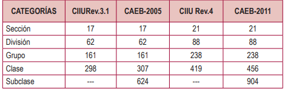
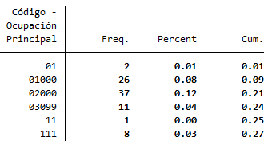

Introduction to the Bolivian Continuous Employment Survey (ECE) 
================

- [What is the BOL ECE?](#what-is-the-bol-ece)
- [What does the BOL ECE cover?](#what-does-the-bol-ece-cover)
- [Where can the data be found?](#where-can-the-data-be-found)
- [What is the sampling procedure?](#what-is-the-sampling-procedure)
- [What is the geographic significance level?](#what-is-the-geographic-significance-level)
- [Other noteworthy aspects](#other-noteworthy-aspects)

## What is the BOL ECE?

Since 2015 (Q4), the Bolivian National Statistics Institute (INE) carries-out the ECE. The survey goal is to collect national data to develop better labour indicators. The ECE gathers national, rural and urban data for unemployment, labour supply, and migration. 

## What does the BOL ECE cover?

The ECE covers national, urban and rural data from nine "departmentos" (subnational level 1). Information is available at the national, household and individual level.

| Year	    | # of Households	| # of Individuals	|
| :-------	| :--------		    | :--------	 	      |
| 2015*	    | 18,354          | 69,431           |
| 2016	    | 39,939          | 254,234	          |
| 2017	    | 39,840          | 253,293           |
| 2018	    | 39,830          | 245,041	          
| 2019	    | 40,119          | 228,619           |
| 2021	    | 39,901          | 220,667	          

\* Only Q4 data is available
  
## Where can the data be found?

The microdata is free and publicly available on the [INE website](https://www.ine.gob.bo/index.php/censos-y-banco-de-datos/censos/bases-de-datos-encuestas-sociales/).

## What is the sampling procedure?

The sampling procedure is two stage probabilistic, stratified, by conglomerate. In the first step, the NSO selects the probabilitic measure unit (UPM), the selection process is proportional to the number of households in the UPM. The second step is to select the households inside the selected UPM, the selection process is aleatory and systematic. 

## What is the geographic significance level?

The results are significant at national, rural, urban levels. The departments considered in the survey are Chuquisaca, La Paz, Cochabamba, Oruro, Potosi, Tarija, Santa Cruz, Beni and Pando.

## Other Noteworthy Aspects 

### ISIC codes
The GLD data provides ISIC data to four digits. 

According to the INE, their national industry classification is comparable to ISIC rev. 4. to the 3th digit.  The Bolivian industry classification has 5 digits. After checking that the third digits follow the ISIC rev.4 , we created a variable “industrycat_isic” variable with a 0 at the end. The same explanation applies to the respective second job variable.

  

  

### ISCO codes
The survey uses the occupation classification from Bolivia (COB 2009). The COB 2009 is a version of ISCO-08 for Bolivia with five digits. Compared to ISIC, the resemblance is not always straighforward in this case. As a result, the team mapped the ISCO-08 codes to the COB version, the outcome can be found in this [link](utilities/Classification_ISCO_COB.xlsx) in an excel file. However, the do files also contain the mapping for each year. The same explanation applies for the respective second job variable.   

  

  

  

  

