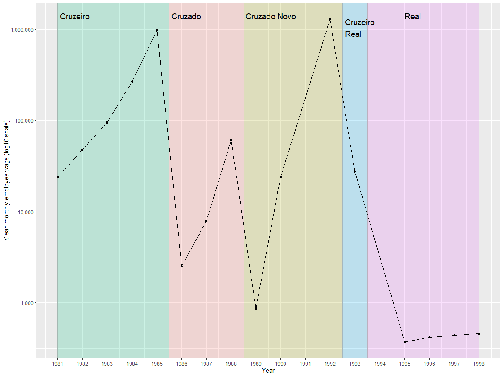
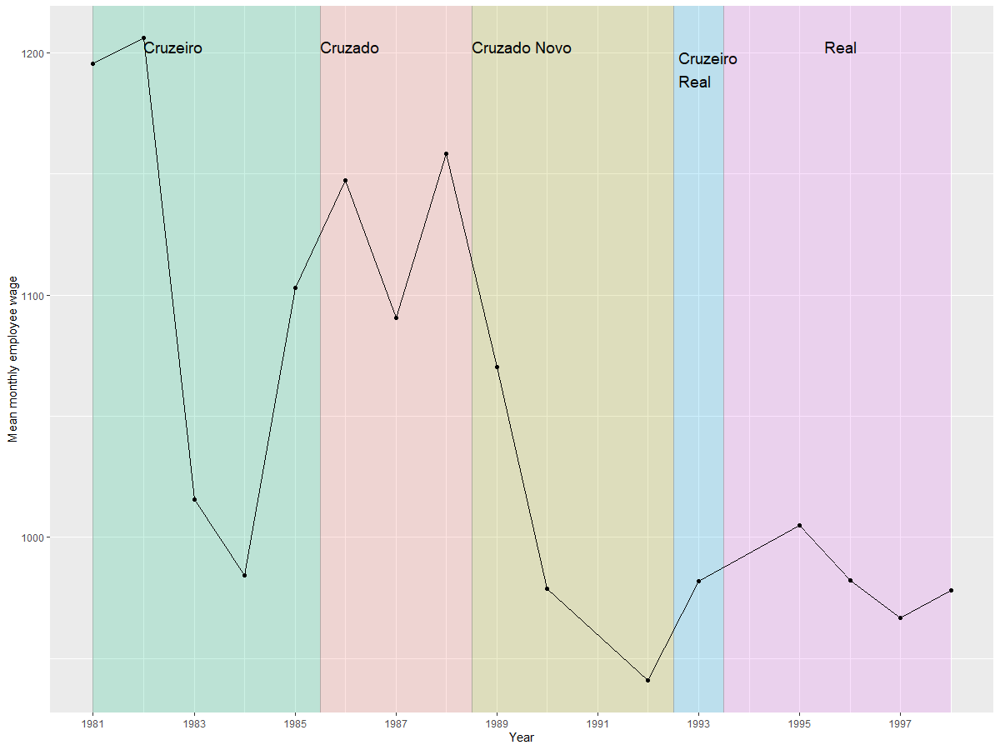

# Changes in the currency unit in the PNAD survey

## History of currency changes

The answers recorded for the wages of employees in the PNAD (and PNAD-C) surveys are in the currency of legal tender at the moment of the survey. In most situations this is not noteworthy, yet for the PNAD data of the 1980’s and early 1990’s it is indeed relevant.

This era was marked by high inflation and a series of changes in the official currency (more details [here](utilities/160223 Paper MFHLA BRAZIL.pdf) and [here](https://www.npr.org/sections/money/2010/10/04/130329523/how-fake-money-saved-brazil)) summarised in the below table based on [publicly available information](https://en.wikipedia.org/wiki/Brazilian_currency):

| Introduction     | Name                  | Conversion              | Notes                           |
|------------------|-----------------------|-------------------------|---------------------------------|
| 15 May 1970      | Cruzeiro (second)     | = 1 cruzeiro novo       |                                 |
| 27 February 1986 | Cruzado               | = 1,000 cruzeiros       |                                 |
| 15 January 1989  | Cruzado novo          | = 1,000 cruzados        |                                 |
| 16 March 1990    | Cruzeiro (third)      | = 1 cruzado novo        | Name change only, no conversion |
| 1 August 1993    | Cruzeiro real         | = 1,000 cruzeiros       |                                 |
| 1 July 1994      | Real (new, pl. reais) | = 2,750 cruzeiros reais | Still in use                    |

The below chart shows the mean monthly wage for employees recorded in the survey (unchanged, i.e., without outlier correction). The different currencies are denoted by the coloured ranges and the name of the currency. Note that the name change from Cruzado Novo to (third) Cruzeiro is not depicted as it does not impact the nominal value. Note further that there were no PNAD surveys in 1991 and 1994.

<br></br>

<br></br>

## Proposed conversion to Reais

Using the above table the data can be unified to the level of the Real (plural Reais), the currency introduced in 1994 and still in use today. The below code is an example of how to code this.

```
gen wage_reais_unified = .
replace wage_reais_unified = wage_no_compen if year > 1993
replace wage_reais_unified = wage_no_compen/2750 if year == 1993
replace wage_reais_unified = wage_no_compen/2750/1000 if inrange(year, 1989, 1992)
replace wage_reais_unified = wage_no_compen/2750/1000/1000 if inrange(year, 1986, 1988)
replace wage_reais_unified = wage_no_compen/2750/1000/1000/1000 if year < 1986
```

Using this process and CPI data (for example the World Bank's [FP.CPI.TOTL](https://data.worldbank.org/indicator/FP.CPI.TOTL)) the data can be converted into a series without needing a logarithmic scale. The below chart (and the one above) were created using [this R code](utilities/Brazil_currency_changes.R)

<br></br>

<br></br>
