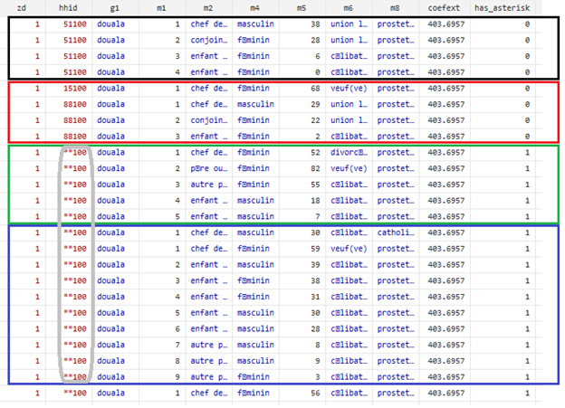
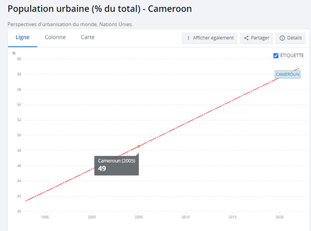
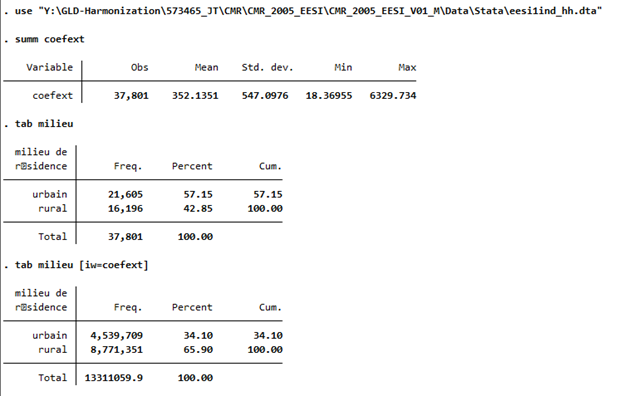
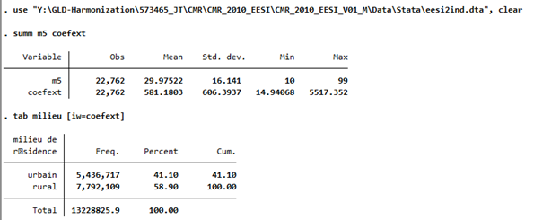
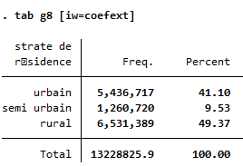
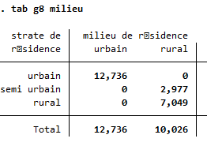
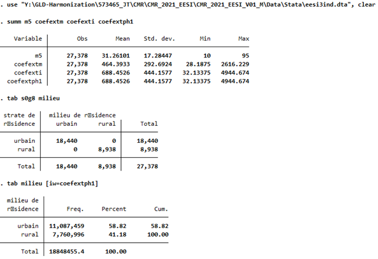
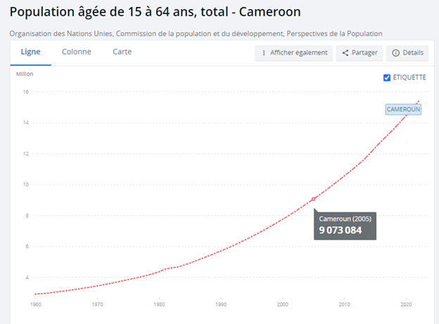
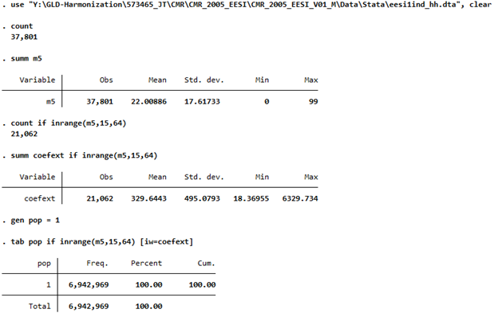

# Introduction to the Enquête sur l'Emploi et le Secteur Informel (EESI - Employment and Informal Sector Survey) 

- [What is the CMR EESI survey?](#what-is-the-ccc-survey-acronym)
- [What does the CMR EESI survey cover?](#what-does-the-ccc-survey-acronym-cover)
- [Where can the data be found?](#where-can-the-data-be-found)
- [What is the sampling procedure?](#what-is-the-sampling-procedure)
- [What is the significance level?](#what-is-the-geographic-significance-level)
- [Other noteworthy aspects](#other-noteworthy-aspects)

## What is the CMR EESI?

The EESI is the national labor force survey of Cameroun.

## What does the CMR EESI cover?

The EESI covers labor market information as well as detailed information on the informal sector and specific questionnaires on the enterprises run by the households. The latter part is not used in the GLD harmonization but may be of interest to users.

| Year	| # of Households	| # of Individuals	|
| :-------	| :--------		| :--------	 	|
| 2005	| 8,527		| 26,467 (aged 10+)		|
| 2010	| 4,629*		| 22,762 (aged 10+)		|
| 20201	| 8,524		| 40,112 (all ages)		|

(* - See [Household identifier in 2010](#household-identifier-in-2010))

## Where can the data be found?

The data are not publicly accessible but can be found on the Microdata Website of the [Cameroonian Statistics Bureau](http://nada.stat.cm/index.php/catalog). The data were given to the World Bank team for a specific project. Other World Bank Staff may reach out to the [GLD Focal Point for more information](mailto:gld@worldbank.org)

## What is the sampling procedure?

The survey follows a two stage sampling procedure. In the first stage enumeration areas (EA - from the most recent census) are selected with probability proportional to the EA's population. Moreover, the EAs are stratified by region and area of residence (urban, semi-urban, and rural). In the second stage households are selected from the EAs with equal probability. The number of households may vary by region.

## What is the geographic significance level?

The survey is designed to obtain estimates of indicators on employment at the national level, according to residence (urban, rural), and for the twelve survey regions (alone and by residence): Yaounde, Douala and the 10 administrative regions namely: Adamawa, Centre excluding Yaounde, East, Far North, Littoral excluding Douala, North, North-West, West, South and South-West.

## Other noteworthy aspects

### Household identifier in 2010

The hhid variable in 2010 has asterisks (*) that cause the IDs not to be unique in the data the GLD has. The below shows the start of the file. It appears to be clear that there are distinct households (four horizontal boxes), but the last two have same hhid pattern since the first two digits are scrambled by asterisks (vertical box, grey).

  

  

Hence the number of uniquely identifiable households is about half of that of other years. 

### Urban / rural shares in 2005 and 2010

The information on WDI from the United Nations (shown below - [source here](https://donnees.banquemondiale.org/indicateur/SP.URB.TOTL.IN.ZS?end=2022&locations=CM&start=1993)) puts the share of urban population at 49% in 2005 and it increases steadily (probably interpolated) to reach about 59% in 2021.

  

  

As shown below, variables `milieu` and `coefext` exists for all observations (using the raw `ind_hh file` for 2005). That is we can calculate the urban share for the whole population in order to compare it. The EESI-1 data gives us an urban share of 34.1%, much below the WDI data.

  

  

The same is true for 2010, where the urban share is only 49%. Note the for 2010 we have two datasets: `ind_hh` (containing information for all ages) and `ind` (containing information for ages 10+). The `ind_hh` data file does not contain `milieu` so we can only calculate the number with the `ind` dataset (ages 10-99 only). However, the shares should not vary significantly.

  

  

However, 2010 data also includes the `strate` variable (named `g8` in the data). Cross tabulating reveals that `milieu` includes rural *and* semi-urban. If we were to assign semi-urban as urban instead, we would obtain estimates much closer to the WDI data.

<table>
  <tr>
    <td></td>
    <td> </td>
    <td></td>
  </tr>
</table>

In 2021 we can calculate the urban share for the population 10+ only. Here, firstly, `milieu` and `strate` agree (there is no semi-urban), and, secondly, the numbers agree with the WDI data (urban share is nearly 59%).

  

  

Thus, either the 2005 and 2010 surveys have an overemphasis on rural areas not accounted for in the weighting (rural share is much higher) or the definition of `milieu` is different to the WDI one (in EESI 2 milieu treats semi-urban as rural while WDI might be coding it as urban). 

The GLD team cannot change the data or obtain more data. Users should be aware of these sources of difference.

### Total population in 2005

As shown below, the population aged 15 to 64, [according to the UN data](https://donnees.banquemondiale.org/indicateur/SP.POP.1564.TO?locations=CM), was of just over 9 million people in Cameroon in 2005.

  

  

However, using the EESI-1 data, we get a population of just 6.9 million. The below example is using the ind_hh dataset, but the `ind` variable (limited to ages 10-99) gives the same result. Note further that there are no missing age values (variable m5) and the weight variable is not missing for anyone in the 15-64 age bracket.

Thus, the difference cannot be explained by missing values of either the weight or the age variable.

  

  

No statement can be made on the accuracy of either, yet users should be aware of these differences.