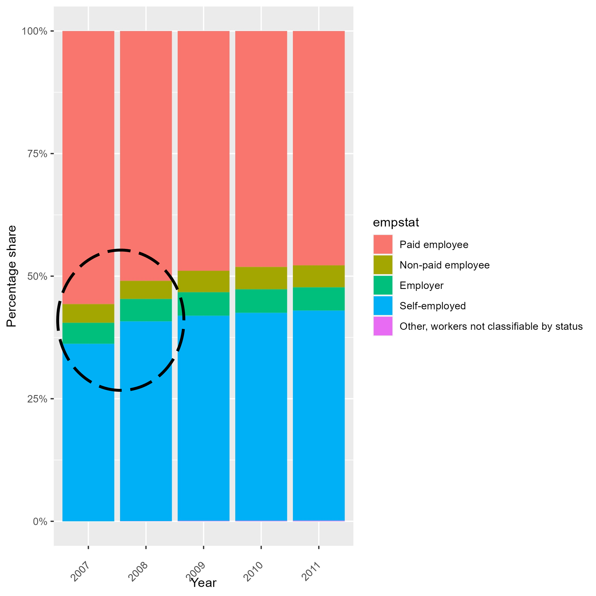
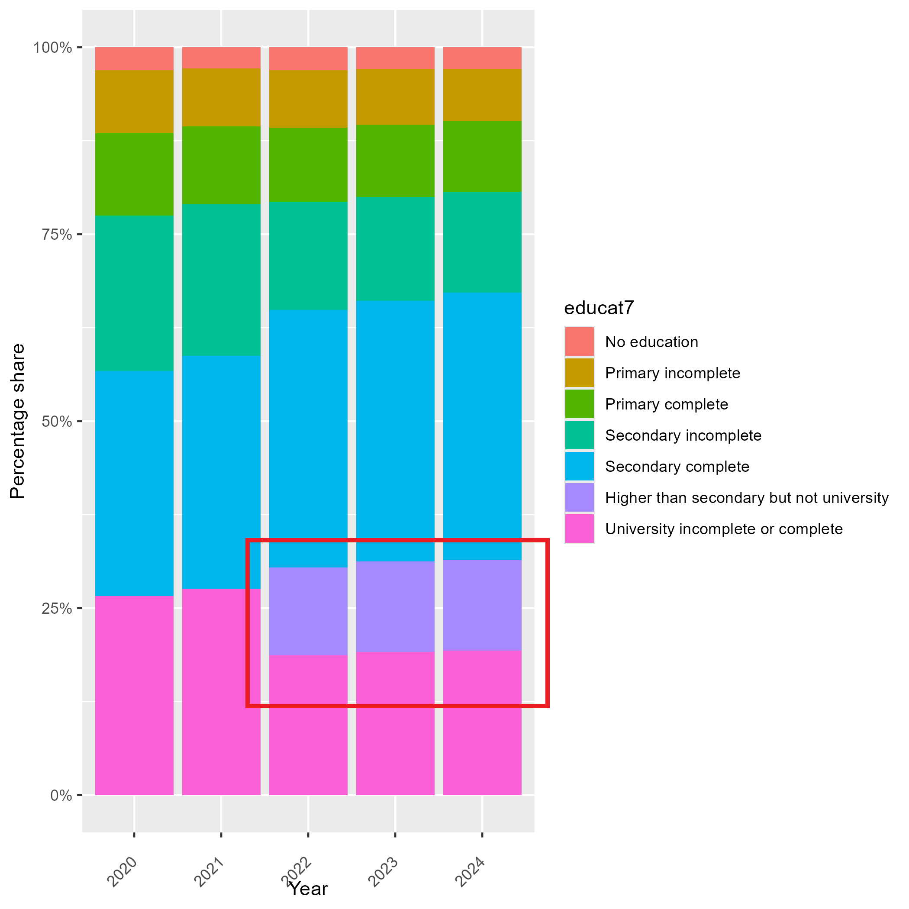

# Introduction to the Colombian "Gran Encuesta Integrada de Hogares" (Great Integrated Household Survey - GEIH)

- [What is the COL survey?](#what-is-the-COL-survey)
- [What does the COL survey cover?](#what-does-the-COL-survey-cover)
- [Where can the data be found?](#where-can-the-data-be-found)
- [What is the sampling procedure?](#what-is-the-sampling-procedure)
- [What is the significance level?](#what-is-the-geographic-significance-level)
- [Other noteworthy aspects](#other-noteworthy-aspects)

## What is the COL survey?

The Extended unified Colombian household survey (GEIH) is the colombian national household survey that records information from the labour force, income and household spending since 2006 (in the current format). Starting November 2006 selected months used the income and households spending GEIH format , yet after January 2009 all months started using the GEIH format. 

## What does the COL survey cover?

The Colombia GEIH is a household survey collecting information on age, sex, location, migration, education (academic), living conditions,income, labour market activities over 12 months, as well as time use and activities over the previous 7 days.  The years and sample size of GEIH harmonized for GLD are:

| Year | # of Individuals | # of Households |
|------|------------------|------------------|
| 2007 | 838,421          | 221,048          |
| 2008 | 823,814          | 221,988          |
| 2009 | 816,242          | 221,181          |
| 2010 | 822,087          | 226,303          |
| 2011 | 827,526          | 230,500          |
| 2012 | 859,393          | 242,676          |
| 2013 | 850,077          | 244,263          |
| 2014 | 839,715          | 244,251          |
| 2015 | 840,444          | 248,152          |
| 2016 | 831,642          | 247,169          |
| 2017 | 816,607          | 245,785          |
| 2018 | 810,135          | 245,876          |
| 2019 | 803,342          | 246,851          |
| 2020 | 795,304          | 244,939          |
| 2021 | 711,381          | 225,853          |
| 2022 | 919,459          | 304,459          |
| 2023 | 860,802          | 293,511          |
| 2024 | 829,683          | 290,968          |

## Where can the data be found?

The microdata are free and publicly available on the Colombian National Data Archive (ANDA) [online access](https://microdatos.dane.gov.co/index.php/catalog/MERCLAB-Microdatos). The microdata is in SPSS, CSV, and TXT format as well as from september 2017- onwards in Stata format. The colombian microdata catalogue also contains all the relevant documentation for each year. 

## What is the sampling procedure?

The GEIH uses a probabilistic, multistage design, stratified, unequal clustered, and self-weighted. 

The 2009 manual (see document *Metodología Gran Encuesta Integrada de Hogares* under the ["Related Materials" section of the 2009 documentation site](https://microdatos.dane.gov.co/catalog/207/related_materials)) outlines the sampling procedure as:

    Taking into account the objectives of the GEIH Survey, and the fundamental premises, a probabilistic, multi-stage, 
    stratified, unequal conglomerate and self-weighted design was chosen (for the twenty-four capital cities with their 
    metropolitan areas).

Note that, even though the sampling logic is consistent over time, there could be changes over time (please consult documentation for each year).

## What is the geographic significance level?

The data covers national information at the urban and rural levels. It also includes information on the largest regions and political geographic representations (departments). Overall, the sample covers five regions: Atlantic, Oriental, Central, Pacific and Bogota and twenty-four cities and metropolitan areas.

The data is:

- Nationaly representative.
- Monthly representative at the national level.
- Monthly representative for each of the 24 cities and 13 metropolitan areas of the sample.
- Annually representative for the sub-regional levels (departments).

However, the survey only covers 24 of the 33 departments(sub-regional levels) (32 plus a Bogotá D.C.).

The missing ones are the Caribbean archipelago of San Andres and 8 provinces in Amazonia and Orinoquia. The survey is still representative nationally as they only represent some 5% of the population.

| 13 large cities	| 11 intermediate Cities	|
| :-------	| :--------		| 
|Bogotá | Tunja
| Medellín - Valle de Aburrá | Florencia
| Cali - Yumbo | Popayán
| Barranquilla - Soledad | Valledupar
| Bucaramanga - Floridablanca - Girón - Piedecuesta | Quibdó
| Manizales - Villamaría | Neiva
| Pasto | Riohacha
| Pereira - Dosquebradas - La Virginia | Santa Marta
| Ibagué | Armenia
| Cúcuta - Villa del Rosario - Los Patios - El Zulia | Sincelejo
| Villavicencio | San Andrés
| Montería |
| Cartagena| 

Although the GEIH is nationally representative and provides monthly estimates for the main cities, the effective level of geographic disaggregation depends on the underlying sample design. In practice, Colombia's GEIH operates under two significance levels, which determine how granular the aggregate indicators can be interpreted:

#### 1. City-level significance (main 24 cities and metropolitan areas)

For the dominant urban domains, the GEIH ensures robust estimates at the city level. This is the finest territorial disaggregation consistently supported by the survey.

#### 2. Department-level significance for the rest of the territory

For all other areas outside the 24 domain cities, the GEIH provides representativeness **at the departmental level**.  
This is possible because the sample design aggregates:

- observations from the department’s capital (when included), and  
- observations from the department’s non-metropolitan areas.

Hence, individual municipalities other than the domain cities are not representative on their own. Estimates must consequently be interpreted at the **departmental level** for these areas.

Therefore, `subnatidsurvey` is the GLD variable that identifies the **correct geographic domain** to use when producing subnational indicators from the GEIH.

Source. Dane 2021 [GEIH Documentation](https://microdatos.dane.gov.co/index.php/catalog/701/get_microdata)

## Other noteworthy aspects

### The impact of the COVID-19 pandemic on data collection

Due to the COVID-19 Pandemic, the Colombian NSO conducted the GEIH 2020 through phone surveys for the months of March through July. As a result, the data retrieved contains inconsistencies for those months. In particular,  personal information (such as labour status) was absent from the survey responses for these months. The harmonization team has done its best to reduce the consequences of the absence of data in those months. The resulting harmonization is robust enough as per our harmonization methodology. Please, refer to the do-file for this year for further information.

### Absence of ISCO (occupation classification) information

In the GLD harmonized files for Colombia, the ISCO information in "occup_isco" is not present. This is because until recently (mid-2021), the DANE used the national occupation classification or CNO 1970 to categorize occupations of the labour force. The CNO 1970 classification does not directly correspond to the international occupation classification (ISCO), but it was inspired by the ISCO 1968. As a result, the harmonization team decided to declare the variable as missing for the harmonized years until 2021. 

Starting with GEIH 2022, DANE adopted a national version of ISCO-08, so "occup_isco"" is available from 2022 onwards. Although this is a national adaptation of ISCO-08, it can be consistently mapped to the international ISCO-08 structure for GLD harmonization purposes.

###  ISIC (economic activity classification) Classification

The DANE used a version of the international industry classification or ISIC  to classify the economic activities in the household survey (geih). In this [webpage](https://www.dane.gov.co/files/sen/nomenclatura/tablasCorrelativas/TablasCorrelativasCIIURev3_1A_C.pdf), DANE has made avaialble tables of correspondance that can be used to compare the national classificaiton to the international version. 

| Year	| National classification| ISIC classification	|
| :-------	| :--------		| :--------		| 
|2007-2019| ISIC COLOMBIA AC 3 | ISIC REV 3.1 |
| 2020-2024 |ISIC COLOMBIA AC 4| ISIC REV 4 |

### Jumps in employment status composition at the start of the time series

The categories of paid employees and self-employment from the variable `empstat` (employment status) see a marked jump between 2007 and 2008, with the other categories staying constant (see figure below). While the GLD team has no clear explanation for this somewhat sudden jump, the change is in line with ILO numbers. In the ILO data, 36.2% of employed individuals reported working by their own account in 2007. In 2008, the number jumped to 40.7%, and it remained stable thereafter, with 41.8% in 2009. Please, visit [the ILOSTAT data application website](https://www.ilo.org/shinyapps/bulkexplorer53/?lang=en&id=EMP_TEMP_SEX_AGE_STE_NB_A) for further details.

  

  

### Redesign of the Education Questions in GEIH

Until 2021, the GEIH used the following categories to capture the respondent’s highest level of education attained:

**“What is the highest level of education attained by … and the last year or grade completed at that level?”**

  a. None
  b. Preschool
  c. Primary education (1st–5th grade)
  d. Lower secondary education (6th–9th grade)
  e. Upper secondary (10th–13th grade)
  f. Higher or university education
  g. Don’t know / No information

Starting in 2022, the structure of the question was redesigned, and the list of categories became more detailed:

**“What is the highest level of education attained and the last grade or semester completed by …?”**

  1. None  
  2. Preschool  
  3. Primary education (1st–5th grade)  
  4. Lower secondary education (6th–9th grade)  
  5. Upper secondary, academic track (classical high school)  
  6. Upper secondary, technical track (technical high school)  
  7. Teacher-training program (Normalista)  
  8. Professional technical degree  
  9. Technological degree  
  10. University degree  
  11. Specialization  
  12. Master’s degree  
  13. Doctorate  
  99. Don’t know / No information  

*Note: English translation provided by the GLD team.*

The main implication for GLD harmonization relates to the variable educat7. Beginning in 2022, tertiary education categories can be disaggregated into university and non-university tertiary pathways, introducing a level of detail that was not available in earlier GEIH rounds. This refinement has direct effects on the classification and comparability of educational attainment across years, as illustrated in the following figure:

  

  

### Migration data
From 2022 onwards, we use a .dta file containing country codes to construct variables related to international migration. To access this file, please visit the following [link](utilities/Additional%20Data/mig_countries.dta)

###  Additional information

1. The choice of cities and regions of Colombia is further discussed in the following [page](geography.md).
2. For users interested in the method chosen for assembling the data please visit the following [link](data_assembling.md).
3. More details of the ISIC classification [here](ISIC_classification.md).

