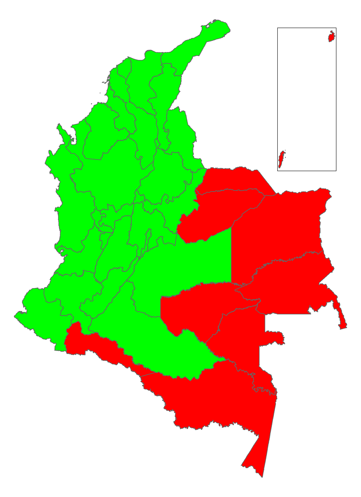

# About the GEIH geographic coverage

The Colombian GEIH survey uses cartographic references from the Master Household Sample (list of households) that is permanently updated by the NSO. 

The GEIH survey uses probabilistic, stratified, and multi-stage sampling. 

In the GEIH, the first strata contain 24 capital cities (varies across years) and metropolitan areas (urban) as independent domains of study. Every city and metropolitan area is auto-represented.  

The second strata contain the rest of the urban households and the rest of the disperse rural dwellings. 

The municipalities were stratified following socioeconomic criteria:

- urbanization level: population numbers by municipalities.
- urban-rural structure: % of the population by the municipality over the proportion of the population with unsatisfied basic needs. 
- Population size from the social group ("estrato"): every municipality with 7,000 o more inhabitants was considered a PSU (primary sampling unit), and those with lower population size were regrouped with nearby locations.

The image below shows the locations that contain data for urban and rural areas (green) and only urban/metropolitan cities (red). The red area represents the region of Amazonia and Orinoquia on the mainland and the San Andres city on the box of the top right corner. 

  

  

At the multi-stage level, the PSUs were designed using forced inclusion of major metropolitan urban capitals and probabilistic inclusion of second primary units of sampling such as high populated towns and neighbouring locations with small population sizes. 

### About not covered areas

1.	The population not covered on the monthly data from Amazonía & Orinoquía and San Andres is about 3% of the total population in 2018 up from 2.2 in 2005, which shows greater relative population growth in the region.
2.	The population not covered  (rural areas from Amazonía & Orinoquía and San Andres ) is about 5% of the total rural population in 2018 (and that share has nearly doubled from the 3% in 2005).
3.	The population not covered in all the country is about 1.3% of overall population in 2018, again nearly doubling the figure from 2005’s 0.7%.
