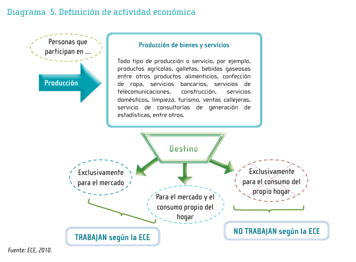

# Introduction to the Costa Rican Continuous Employment Survey (ECE)

- [What is the CRI ECE?](#what-is-the-cri-ece)
- [What does the CRI ECE cover?](#what-does-the-cri-ece-cover)
- [Where can the data be found?](#where-can-the-data-be-found)
- [What is the sampling procedure?](#what-is-the-sampling-procedure)
- [What is the geographic significance level?](#what-is-the-geographic-significance-level)
- [Other noteworthy aspects](#other-noteworthy-aspects)

## What is the CRI ECE?

The Costa Rican Continuous Employment Survey (*Encuesta Continua de Empleo*, ECE) is a continuous household survey conducted by the National Institute of Statistics and Censuses (*Instituto Nacional de Estadística y Censos*, INEC). Launched on May 31, 2010, the survey specializes in measuring employment, unemployment, and labour income. Data collection takes place continuously throughout the year, and the survey produces quarterly indicators designed to track short-term changes and seasonal variations in Costa Rica's labour market.

## What does the CRI ECE cover?

The CRI ECE collects demographic information and detailed information on labour force participation, employment, unemployment, working hours, occupation, economic activity, employment characteristics, job quality, and labour income. The GLD harmonization covers every available quarter from the third quarter of 2010 through the fourth quarter of 2025. The harmonized sample sizes and quarterly expanded populations are presented below.

| **Year** | **# of Households** | **# of Individuals** | **Expanded Population** |
| :------: | ------------------: | -------------------: | ----------------------: |
| 2010Q3 | 7,539 | 26,538 | 4,539,435 |
| 2010Q4 | 7,556 | 26,347 | 4,553,913 |
| 2011Q1 | 7,583 | 26,559 | 4,567,464 |
| 2011Q2 | 7,633 | 26,486 | 4,582,382 |
| 2011Q3 | 7,726 | 26,689 | 4,596,033 |
| 2011Q4 | 7,625 | 26,158 | 4,612,678 |
| 2012Q1 | 7,538 | 25,563 | 4,628,758 |
| 2012Q2 | 7,526 | 25,477 | 4,642,616 |
| 2012Q3 | 7,472 | 25,449 | 4,657,757 |
| 2012Q4 | 7,396 | 25,082 | 4,672,935 |
| 2013Q1 | 7,378 | 24,846 | 4,687,302 |
| 2013Q2 | 7,527 | 25,286 | 4,703,581 |
| 2013Q3 | 7,533 | 25,275 | 4,717,478 |
| 2013Q4 | 7,598 | 25,389 | 4,733,053 |
| 2014Q1 | 7,841 | 26,073 | 4,747,489 |
| 2014Q2 | 7,957 | 26,153 | 4,763,662 |
| 2014Q3 | 8,101 | 26,682 | 4,778,864 |
| 2014Q4 | 8,178 | 26,983 | 4,792,617 |
| 2015Q1 | 8,144 | 26,710 | 4,807,263 |
| 2015Q2 | 8,104 | 26,397 | 4,823,600 |
| 2015Q3 | 8,093 | 26,412 | 4,836,819 |
| 2015Q4 | 7,990 | 26,052 | 4,850,933 |
| 2016Q1 | 8,016 | 25,884 | 4,865,436 |
| 2016Q2 | 8,144 | 26,247 | 4,881,713 |
| 2016Q3 | 8,204 | 26,402 | 4,895,459 |
| 2016Q4 | 8,137 | 26,003 | 4,909,297 |
| 2017Q1 | 8,208 | 26,226 | 4,923,317 |
| 2017Q2 | 8,256 | 26,331 | 4,938,264 |
| 2017Q3 | 8,288 | 26,473 | 4,951,219 |
| 2017Q4 | 8,145 | 25,920 | 4,966,414 |
| 2018Q1 | 8,103 | 25,560 | 4,981,193 |
| 2018Q2 | 8,277 | 25,995 | 4,993,754 |
| 2018Q3 | 8,233 | 25,650 | 5,006,453 |
| 2018Q4 | 8,183 | 25,565 | 5,022,311 |
| 2019Q1 | 8,235 | 25,695 | 5,034,571 |
| 2019Q2 | 8,250 | 25,530 | 5,048,263 |
| 2019Q3 | 8,257 | 25,397 | 5,062,745 |
| 2019Q4 | 8,248 | 25,342 | 5,075,372 |
| 2020Q1 | 8,015 | 24,746 | 5,088,437 |
| 2020Q2 | 6,743 | 20,720 | 5,101,953 |
| 2020Q3 | 6,864 | 21,143 | 5,115,360 |
| 2020Q4 | 7,316 | 22,468 | 5,128,407 |
| 2021Q1 | 7,600 | 23,334 | 5,142,195 |
| 2021Q2 | 7,750 | 23,669 | 5,154,669 |
| 2021Q3 | 7,811 | 23,887 | 5,167,294 |
| 2021Q4 | 7,808 | 23,681 | 5,180,040 |
| 2022Q1 | 7,568 | 22,906 | 5,192,543 |
| 2022Q2 | 7,709 | 23,160 | 5,205,148 |
| 2022Q3 | 7,793 | 23,484 | 5,218,374 |
| 2022Q4 | 7,766 | 23,251 | 5,229,297 |
| 2023Q1 | 7,756 | 22,892 | 5,241,752 |
| 2023Q2 | 7,778 | 22,844 | 5,254,497 |
| 2023Q3 | 7,626 | 22,300 | 5,265,954 |
| 2023Q4 | 7,684 | 22,428 | 5,278,110 |
| 2024Q1 | 7,678 | 22,142 | 5,290,340 |
| 2024Q2 | 7,623 | 21,904 | 5,302,069 |
| 2024Q3 | 7,767 | 21,967 | 5,313,792 |
| 2024Q4 | 7,703 | 21,698 | 5,325,109 |
| 2025Q1 | 7,853 | 21,962 | 5,337,379 |
| 2025Q2 | 7,913 | 21,891 | 5,347,560 |
| 2025Q3 | 7,903 | 21,981 | 5,359,946 |
| 2025Q4 | 7,733 | 21,398 | 5,370,133 |

## Where can the data be found?

The ECE microdata and supporting documentation are publicly available through the National Data Archive (*Archivo Nacional de Datos*, ANDA), now accessible through the INEC Data Access Program (*Programa de Acceso a Datos*, PAD). The catalogue provides separate microdata files for each quarter, together with questionnaires, methodological documents, metadata, and published results. Users should obtain the public-use files directly from the [INEC ECE catalogue](https://sistemas.inec.cr/nada5.4/index.php/catalog/369).

## What is the sampling procedure?

The CRI ECE uses a probabilistic, stratified, two-stage cluster sampling design. In the first stage, primary sampling units are selected with probability proportional to the number of occupied dwellings within each planning region, urban or rural area, and sample replicate. In the second stage, 12 dwellings are selected with equal probability within each primary sampling unit. The original quarterly sample comprised 752 census segments and 9,024 dwellings. The sample follows a rotating-panel design in which 25 percent of the dwellings are replaced each quarter; consequently, a selected dwelling may be interviewed for up to four consecutive quarters. Further details are available in the [ECE sampling design document](utilities/ECE_Sampling_Design.pdf).

During 2014, the ECE gradually migrated from the 2000 Housing Sampling Frame, based on the 2000 Population and Housing Census, to the 2011 Housing Sampling Frame. The updated sample comprised 794 primary sampling units and 9,528 dwellings per quarter, while retaining the same general sampling design and the 25 percent quarterly rotation scheme. The transition was implemented gradually throughout 2014, replacing one quarter of the former sample each quarter, and was completed in the fourth quarter. The change is documented in [ECE Migration to the 2011 Housing Sampling Frame](utilities/ECE_Migration_to_2011_Sampling_Frame.pdf).

## What is the geographic significance level?

The CRI ECE produces statistically representative quarterly estimates at the national level and separately for urban and rural areas. It also supports estimates for Costa Rica's six planning regions: Central, Chorotega, Pacífico Central, Brunca, Huetar Caribe, and Huetar Norte.

## Other noteworthy aspects

### Employment definition and ICLS version

Since its launch in 2010, the ECE has treated an activity as employment when at least some of its output, even a small share, is intended for sale or profit. Only activities carried out entirely for own consumption, with no output intended for the market, fall outside employment. Although the ECE predates the adoption of ICLS-19 in 2013, its employment definition is conceptually consistent with the ICLS-19 employment concept. Therefore, for harmonization purposes, GLD retrospectively classifies all harmonized ECE years under `icls_v = ICLS-19`. This classification does not imply that the survey was originally designed under ICLS-19, but rather that its underlying employment definition is aligned with that standard.

  

Users wishing to recode the harmonized data to the ICLS-13 employment definition can consult the [ICLS-19 to ICLS-13 conversion note](icls19to13.md).

### Education system

Costa Rica's formal education system comprises primary, secondary, para-university and university education. Primary education covers six grades. Secondary education consists of five years in the academic track and six years in the technical track. Para-university programs generally last two to three years, while the duration of university and postgraduate programs varies by qualification.

The ECE records both the highest grade or year approved (`Educacion_nivel_grado`) and the total number of approved years of education (`Amos_educacion`). Therefore, GLD constructs `educy` directly from the reported total rather than assigning standard durations based on the education level. The detailed education codes are grouped into `educat7` as follows:

| Education reported in the ECE | Typical duration | `educat7` category |
|:------------------------------|:----------------:|:--------------------|
| No education | 0 years | 1 - No education |
| Primary, grades 1-5 | Up to 5 years | 2 - Primary incomplete |
| Primary, grade 6 completed | 6 years | 3 - Primary complete |
| Academic secondary, years 1-4 | Up to 4 additional years | 4 - Secondary incomplete |
| Technical secondary, years 1-5 | Up to 5 additional years | 4 - Secondary incomplete |
| Academic secondary completed | 5 additional years | 5 - Secondary complete |
| Technical secondary completed | 6 additional years | 5 - Secondary complete |
| Para-university education | Generally 2-3 years | 6 - Higher than secondary but not university |
| University, specialization or postgraduate education | Varies | 7 - University incomplete or complete |

Codes identifying an unspecified grade within primary, academic secondary or technical secondary, as well as unknown education, remain missing in `educat7`. 

### COVID-19 and changes in data collection

In response to the COVID-19 emergency, the ECE replaced face-to-face interviews with telephone interviews from late March 2020. During 2020Q2, the usual quarterly replacement of 25 percent of sampled dwellings was suspended because telephone numbers were unavailable for approximately 15 percent of the sample; dwellings that would otherwise have rotated out were instead interviewed for a fifth time. The survey obtained responses from 6,744 households, equivalent to 71.1 percent of the full sample. INEC adjusted the expansion factors using response-propensity models to mitigate potential coverage and nonresponse bias. Further details are provided in the [2020Q2 technical note](utilities/ECE_COVID19_Technical_Note_2020Q2.pdf).

Telephone collection continued in 2020Q3. Before that quarter, a field operation obtained telephone numbers for the incoming 25 percent of the sample, allowing the rotation to resume. The survey obtained responses from 6,864 households, and the response rate increased to 75.8 percent of the full sample. The concepts and reference periods used to measure employment, unemployment and persons outside the labor force remained unchanged under telephone collection. See the [2020Q3 technical note](utilities/ECE_COVID19_Technical_Note_2020Q3.pdf) for additional information.
