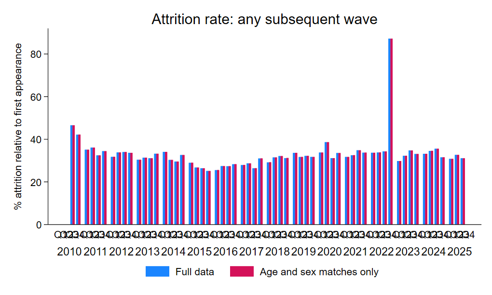

# Panel reconstruction

## Overview

The ECE is a rotating household panel. The official design replaces one quarter of sampled dwellings each quarter, so a dwelling is normally observed for up to four consecutive quarters. The harmonized cross-sectional household and person identifiers are therefore not treated as permanent longitudinal identifiers.

GLD reconstructs longitudinal household and person identifiers from the observed quarterly records. First, candidate household-person links are formed from the household identifier and the roster line number. A link is retained as part of the same spell only when it appears in consecutive quarters and its demographic information remains compatible. A new spell is started when there is a gap between quarters or when there is evidence that the identifier corresponds to a different person or household, such as an incompatible change in sex or age. The reconstructed household identifier distinguishes these spells, and the reconstructed person identifier adds the roster line number. The visit number is then the sequential interview number within each reconstructed household spell.

These variables are derived for longitudinal analysis and quality assessment; they are not official INEC panel identifiers.

## Code

The code used to build and assess the reconstructed ECE panel is available in the [CRI ECE panel programs](https://github.com/worldbank/gld/tree/main/GLD/CRI/CRI_2010-2025_ECE_Panel/CRI_2010-2025_ECE_V01_M_V01_A_GLD/Programs).

## COVID-19 and extended interviews

During the second quarter of 2020, INEC changed fieldwork from face-to-face to telephone interviews because of the COVID-19 emergency. The [technical note for 2020q2](utilities/ECE_COVID19_Technical_Note_2020Q2.pdf) states that INEC did not replace the scheduled 25 percent of dwellings in that quarter, because telephone numbers were not available for the incoming dwellings. Instead, dwellings scheduled for replacement received a fifth interview. The [2020q3 technical note](utilities/ECE_COVID19_Technical_Note_2020Q3.pdf) reports that the quarterly 25 percent sample update resumed in the third quarter.

The reconstructed data show the following households reaching a fifth observed interview. The table reports reconstructed households, not weighted population estimates.

| Quarter of observed fifth interview | Households reaching a fifth interview | Corresponding entry cohort |
| --- | ---: | --- |
| 2020q2 | 892 | 2019q2 |
| 2020q3 | 896 | 2019q3 |
| 2020q4 | 970 | 2019q4 |
| 2021q1 | 838 | 2020q1 |

The sequence is consistent with a one-quarter delay in the rotation schedule. Because the scheduled 25 percent replacement was skipped in 2020q2, the affected rotation group received a fifth interview. Resuming the usual 25 percent replacement rate in 2020q3, rather than replacing an additional group to catch up, would shift the rotation schedule by one quarter across the four rotation groups. This produces fifth interviews successively from 2020q2 through 2021q1, as shown in the table. The extended visits should therefore be interpreted as a temporary COVID-period adjustment, not as a permanent change in the standard ECE rotation design.

## 2022-2023 continuity break

The reconstructed data show an unusually large break in household continuity between 2022q4 and 2023q1. Of 7,757 reconstructed households observed in 2022q4, only 1,741 reappear in 2023q1, implying an unweighted household attrition rate of 77.56 percent. In adjacent quarter-to-quarter transitions, the corresponding rate is approximately 39 to 41 percent.

This discontinuity should not be interpreted automatically as substantive household attrition. It is consistent with a change or reset in the underlying identifiers, an operational change in fieldwork, or another undocumented change affecting longitudinal linkage. No explanation for this break was identified in the technical documentation reviewed. Longitudinal analyses crossing the 2022q4-2023q1 boundary should therefore be treated with caution and, where relevant, assessed through sensitivity analysis.

  

*The figure shows attrition among reconstructed person IDs. The sharp spike around the 2022q4-2023q1 boundary is consistent with the household-level continuity break described above.*
