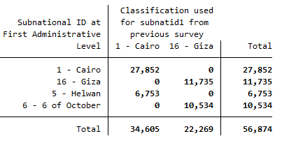

# Introduction to the Egypt (LFS) Labour Force Survey (LFS)

- [What is the EGY LFS](#what-is-the-egy-lfs)
- [What does the EGY LFS cover?](#what-does-the-egy-lfs-cover)
- [Where can the data be found?](#where-can-the-data-be-found)
- [What is the sampling procedure?](#what-is-the-sampling-procedure)
- [What is the geographic significance level?](#what-is-the-geographic-significance-level)
- [Other noteworthy aspects](#other-noteworthy-aspects)

## What is the EGY LFS?

The EGY LFS is a quarterly survey collected by the Egypcian Central Agency for Public Mobilization and Statistics (CAPMAS). The data used by GLD is the cleaned and harmonized version of the survey data produced and published by the Economic Research Forum (ERF) [on their microdata catalogue](http://www.erfdataportal.com/index.php/catalog). 

## What does the EGY LFS cover?

The EGY LFS contains data on the size of manpower and labor force (employed and unemployed) and the geographical distribution by characteristics i.e (gender, age, education,and economic activity). 

The harmonized years and sample sizes used in the GLD harmonization are:

| Year	| # of Households	| # of Individuals	|
| :-------	| :--------		| :--------	 	|
| 2006	| 76,802	| 33,449	|
| 2007	| 77,215	| 331,005	|
| 2008	| 75,327	| 330,850 |
| 2009	| 75,039	| 333,847	|
| 2010	| 79,834	| 343,913	|
| 2011	| 88,108	| 372,384	|
| 2012	| 88,324	| 370,290 |
| 2013	| 85,451  | 350,827 |
| 2014	| 85,668	| 353,340 |
| 2015	| 86,571	| 357,400 |
| 2016	| 83,949	| 347,604 |
| 2017	| 82,902	| 335,396 |
| 2018	| 80,804	| 323,679 |
| 2019	| 80,825	| 322,957 |

## Where can the data be found?

TThe LFS data for Egypt can be found on the [ERF Data Catalogue site](http://www.erfdataportal.com/index.php/catalog#_r=&collection=HLFS&country=225&dtype=&from=1963&page=1&ps=&sid=&sk=&sort_by=nation&sort_order=&to=2021&topic=&view=s&vk=). To obtain the data, users need to create and account and then request the data, by filling out the forms that will appear on the site. If users are not granted the data within two-weeks’ time it is recommended to try to reach out to ERF to inquire about the process. The World Bank has been granted access to the datasets, if you work for the World Bank Group, kindly contact the Jobs Group with a formal request for access to [gld@worldbank.org](gld@worldbank.org).

## What is the sampling procedure?

The LFS is designed following the simple systematic random sampling procedure. Details on it can be found in the annual aggregated bulleting which is part of the [documentation](http://www.erfdataportal.com/index.php/catalog/141/related-materials) the ERF data sets (information in Arabic).

## What is the geographic significance level?

The data covers a sample of urban and rural in all egyptian governorates (27 or 29 ). Each year the list of geographic locations below governorates changes to dismiss or include existent cities or new cities. Below a summary of the changes that the user may encounter. 

| Year	| # of governorates (subnatid1)	|
| :-------	| :--------		|
| 2006-2008	| 27	|
| 2009-2010	| 29	|
| 2011-2019	| 27 |

| Year	| # Municipal divisions (subnatid2)	|
| :-------	| :--------		|
| 2006-2007	| 269	|
| 2008 | 273 |
| 2009	| 271 |
| 2010	| 299 |
| 2012,2014	| 295 |
| 2013,2017	| 293 |
| 2015	| 294 |
| 2018	| 305 |
| 2011, 2016, 2019	| N/A |

## Other noteworthy aspects

### ISCO and ISIC Classification

The data already included the occupation and economic activities in the international version of the the ISCO -88 for all the years. Between 2006-2008 ISIC rev 3 was used and 2010-2019 ISIC Rev 4. Thus, the GLD harmonized data only called the results from the main source with no major changes or shifts in the groups structures. Note that only from 2009 onwards there is documentation the isco / isic;   the user has to assert the version idependently for other data.

### Changes in governorates

In the years 2008, 2 new governorates (Helwan and 6th of Ocotber) where created one from Cairo and other from Giza Governorates. In 2011, the governorates are re absorved by Cairo and Giza. Below we show the correspondance matrix. The GLD team cannot decide which districts in 2011 were part of the new governorates, however the team is happy to exchange correspondace with researchers that have information on this, kindly direct your communications to [gld@worldbank.org](gld@worldbank.org).

  

  

Sources: [Helwan](https://en.wikipedia.org/wiki/Helwan_Governorate) & [6th of October](https://en.wikipedia.org/wiki/6th_of_October_Governorate#:~:text=The%206th%20of%20October%20Governorate%20was%20split%20from%20the%20Giza,Egypt's%20most%20densely%20populated%20governorates.)

Additionally, even though Luxor governorate only became an independent governorate in 2009 (splitting from Qena governorate), CAPMAS (Central Agency for Public Mobilization and Statistics) already considered it an independent governorate in its survey. Thus the note that the data contains Luxor as an independent unit (own category in `subnatid1`) since 2006. For further information, please contact the Egypt NSO.

