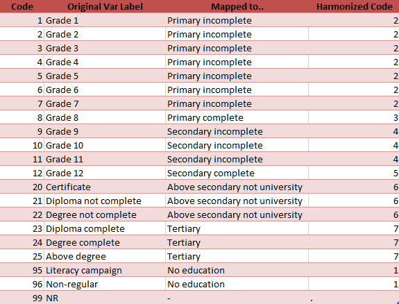
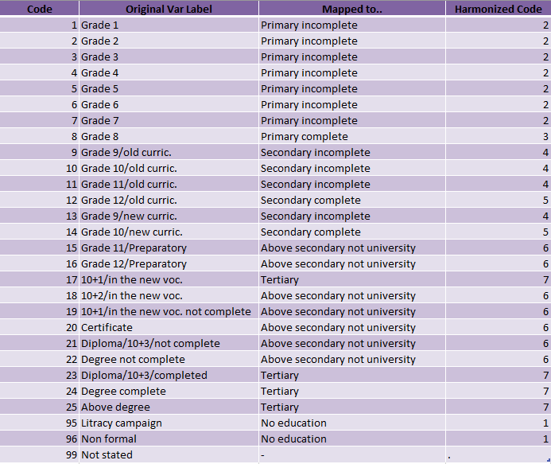
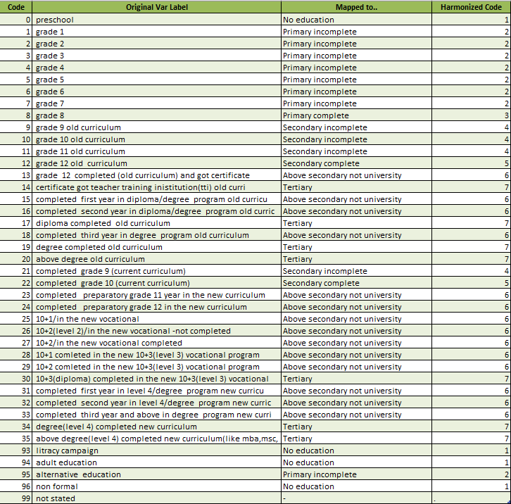
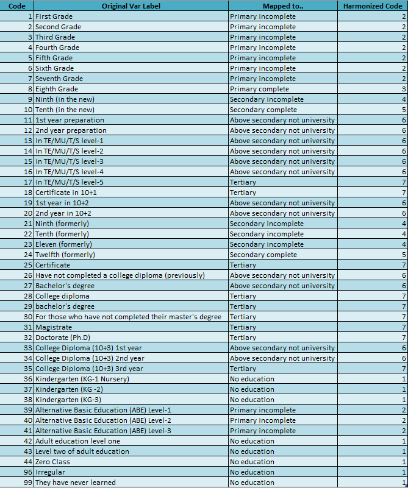

# Educational Achievement Harmonization

This document shows the correspondence tables used for harmonizing `educat7` in each year.
The excel document that includes all of the four tables and the original suggestions given by our colleagues from ESS can be accessed [here](utilities/Education/ESS_highest_edu.xls).

## Year 1999

## Year 2005

## Year 2013

## Year 2021

