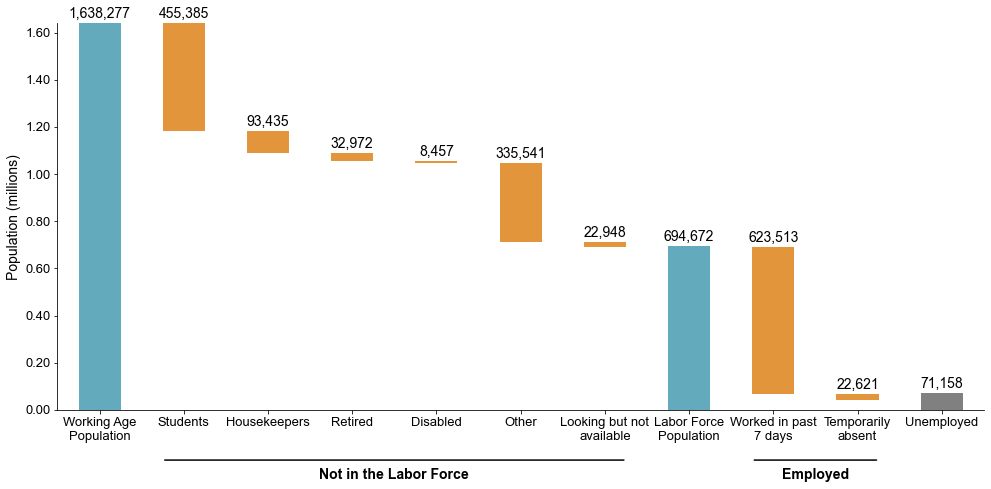

-   [Introduction to Enquête Gabonaise
pour l'Évaluation de la Pauvreté (EGEP)](#egpe-intro)
    -   [What is the Gabon EGEP?](#what-is-the-gabon-egep)
    -   [What does the BGD LFS cover?](#what-does-the-bgd-lfs-cover)
    -   [Where can the data be found?](#where-can-the-data-be-found)
    -   [What is the sampling
        procedure?](#what-is-the-sampling-procedure)
    -   [What is the significance
        level?](#what-is-the-significance-level)
    -   [Other noteworthy aspects](#other-noteworthy-aspects)

<h2 id="egpe-intro">
  Introduction to Enquête Gabonaise pour l'Évaluation de la Pauvreté (EGEP)
</h2>

## What is the Gabon EGEP?

The **Enquête Gabonaise pour l’Évaluation de la Pauvreté (EGEP‑2)** is a **national household poverty survey** carried out by Gabon’s national statistics office, La Direction Générale de la Statistique et des Etudes Economiques (DGSEE) in **2017**. It interviewed 7,992 households and is nationally representative.  

EGEP is **not** a labor force survey; its primary objective is to *measure living standards and poverty*. It includes a labor module with a questionnaire consistent with an LFS. The labor content is usable, but the survey is **not designed** as a stand‑alone LFS.

A prior round of the EGEP (EGEP-1) was conducted in 2005. While that exists, the 2017 profile indicates that 2017 results are not comparable to 2005 due to major questionnaire differences; we therefore do not use 2005.

## What does the EGEP labor module cover?

The EGEP labor module contains information on demographic characteristics, education, migration, and labor market activities over the past 7 days and 12 months. 

The harmonized years and sample sizes used in the GLD harmonization are as follows:

| Year | HH count | Individual count |
|---|---|---|
| 2005 |          7,989  |                      28,268  |

## Where can the data be found?

The datasets are not accessible to the public and researchers have to request the data from the DGSEE. The World Bank has been granted access to the datasets, if you work or are part of the World Bank Group, kindly contact the Jobs Group with a formal request for access to gld@worldbank.org

## What is the sampling procedure?

The EGEP uses a two-stage, stratified cluster design based on the 2013 census frame. The country is partitioned into 11 reporting strata—Libreville, Port-Gentil, Franceville, and the North/South/East/West regions split by urban and rural—within which primary sampling units (enumeration areas) are selected with probability proportional to size. In each selected cluster, a fresh household listing is conducted, from which 12 households are drawn with equal probability. Limited nonresponse and ordered substitutions are anticipated in the field protocol. Design weights are computed from first- and second-stage selection probabilities and then calibrated to population margins; an individual weight is also constructed to correct under-representation of small households.

## What is the significance level
Official estimates are published at the national level, by urban/rural residence, and separately for each of the 11 strata described above.

## Other noteworthy aspects

### Unemployment

The unemployment rate (~11%) in the 2017 EGEP is much lower than that reported by ILO at around ~20%. 

### Employment: Industry Classification

### Employment: Occupation Classification

