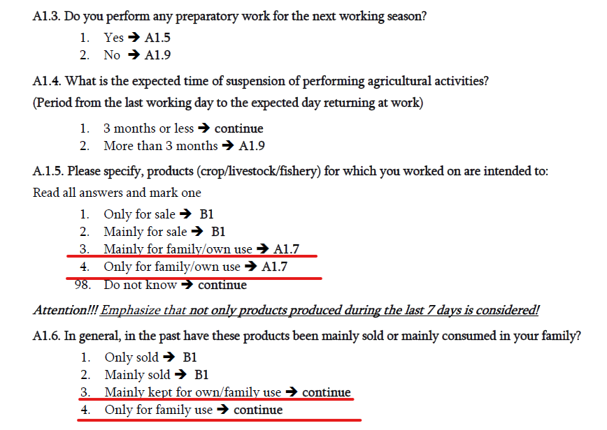

# Introduction
Since the passing of the [resolution concerning statistics of work, employment and labour underutilization](https://www.ilo.org/global/statistics-and-databases/standards-and-guidelines/resolutions-adopted-by-international-conferences-of-labour-statisticians/WCMS_230304/lang--en/index.htm) in 2013 at the 19th International Conference of Labour Statisticians (ICLS) surveys are at risk of a series break due to the change in the concept of employment.

In short, the ICLS 19 resolution restricts employment to *work performed for others in exchange for pay or profit*, meaning that own consumption work (e.g., subsistence agriculture or building housing for oneself) are not counted as employment.

The GLD codes the harmonization’s `lstatus` variable based on the concept used in the survey. In the case of the Georgian LFS this change occurs after 2019, when the survey switches to new definition. As a result, [time series data](utilities/GEO_lstatus.png) show a decrease in the size of employed and labor force participants for the 2020-2022 round. However, the code can be altered to try to match the previous definition. And this operation can be done conveniently taking advantage of the questionnaire's structure. 

# Framework for identifying the employed in the 2020-2022 GEO LFS

The information on current activity were used to define the employed using Questions A1-A9 in the questionnaire. The general flow of section A involves first asking the individual if he/she engaged in any activity to produce agricultural or fishery products in the past 7 days, for pay or for own use/consumption, if no agricultural activities then any non-agricultural activities, and lastly if no activities engaged what was the reason; if the individual reports otherwise, he/she would be asked about information regarding temporary absence from employment. 


# Current coding for the GEO LFS

In 2017-2019, the respondents who indicate that they either worked for salary (A1 is Yes) or engaged in activities for own consumption (A2 is Yes) are employed (B1 is only for employed respondents).


In 2020-2022, two separate questions (A1.5 and A1.6) were added to confirm whether the production from your main activity (from A1) was for profit or for own use.




These two questions allow users to change `lstatus` between the old and the new definitions by adding observations who chose category 3 or category 4 in question A1.5 and A1.6.


# Coding to convert the 2020 ILFS to the old definition

In converting back to the old definition, the approach adopted here is to create a variable that identifies those that are engaged in non-market farming, and those who were absent for less than a month from non-market farming. The code below should be pasted after the code creating the `lstatus` variable based on the 2020 definition. 

```
	 *Create an indicator "emp_diff" that identifies the difference between definitions (emp_diff)
	gen emp_diff = 0 if inrange(lstatus, 2, 3) 
	* Add those in non market farming
	replace emp_diff = 1 if emp_diff == 0 & inrange(Q13E, 3, 4)
	* Add those absent for less than a month from non market farming
	replace emp_diff = 1 if emp_diff == 0 & Q13K == 1 & inrange(Q13N, 3, 4)
	
	* Use emp_diff to generate 2014 definition
	replace lstatus = 1 if emp_diff == 1
	
	replace lstatus = . if Q05B_AGE < 5

```

Users may also wish to  identify the dual employment workers, i.e., those that report working for own consumption and have a main job for pay or profit. 

```
	gen dual_emp_2020 = 0 if lstatus == 1
	replace dual_emp_2020 = 1 if dual_emp_2020 == 0 &  inrange(Q13D, 1, 5) & ( inrange(Q13E, 3, 4) | (Q13K == 1 & inrange(Q13N, 3, 4))  )
	replace dual_emp_2020 = 2 if dual_emp_2020 == 0 &  Q13D == 6 & inrange(Q13E, 3, 4)
	label define lbl_dual 0 "Not dual" 1 "Ag dual" 2 "Construction dual"
	label values dual_emp_2020 lbl_dual
	label var dual_emp_2020 "Dual employment"
```

We can go further an try to overwrite the occupation sector, employment status, industry and occupation of those that we assume would have - under the old definition - been recorded with their own consumption definition under the previous employment definition.

The first step is to identify those interviewed who have dual employment who are not in their market job working in agriculture or construction (if they already do, no need to update their information).

```
* Reduce industry information to two digits, map if not in agriculture (codes 01 - 03) or construction (codes 41 - 43).
gen ind = floor(Q23B_DETAILS_ISIC_CODES/100)
gen dual_non_ag_construction = .
replace dual_non_ag_construction = 1 if dual_emp_2020 == 1 & !inrange(ind,1,3) 
replace dual_non_ag_construction = 2 if dual_emp_2020 == 2 & !inrange(ind,41,43)
```

The next step to consider is whether the change is warranted. The key question is whether own consumption work is the main task the respondent does (in which case they would have been recorded with that info under the old definition) or whether it is a side job - in which case the non-consumption job should remain. The border set by the GLD team (reasonable people may disagree) is 25 hours a week. If the individual works 25 or fewer hours in their job, then we assume this is in fact a secondary one and their main job is the own-consumption work.

```
gen dual_switcher = .
replace dual_switcher = 1 if dual_non_ag_construction == 1 & whours < 25
replace dual_switcher = 2 if dual_non_ag_construction == 2 & whours < 25
label define lbl_switch 1 "Ag switch" 2 "Construction switch"
label values dual_switcher lbl_switch
label var dual_switcher "Dual switcher"
```

Own consumption workers are by definition self-employed and in the private sector. Their occupation and industry are defined by their work.

```
* OCUSEC (all to private)
replace ocusec = 2 if inrange(dual_switcher, 1, 2) | emp_diff == 1

* EMPSTAT (all self-employed)
replace empstat = 4 if inrange(dual_switcher, 1, 2) | emp_diff == 1

* INDUSTRY
* Assume if we have emp_diff it was agricutlure
replace industrycat10 = 1 if emp_diff == 1 | dual_switcher == 1
* Except for construction
replace industrycat10 = 5 if (emp_diff == 1 & Q13D == 6) | dual_switcher == 2

* OCCUPATION
* Assume if we have emp_diff it was agricutlure
replace occup = 6 if emp_diff == 1 | dual_switcher == 1
* Except for construction
replace occup = 7 if (emp_diff == 1 & Q13D == 6) | dual_switcher == 2
```

Finally, do the last bits of cleaning up to ensure the other labour variables are in line with what could be expected for own-consumption workers.

```
* WAGE (send to missing)
replace wage_no_compen = . if emp_diff == 1 | inrange(dual_switcher, 1, 2)

* WHOURS (send to missing)
replace whours = . if emp_diff == 1 | inrange(dual_switcher, 1, 2)

* CONTRACT (send to missing)
replace contract = . if emp_diff == 1 | inrange(dual_switcher, 1, 2)

* SOCIAL SECURITY (send to missing)
replace socialsec = . if emp_diff == 1 | inrange(dual_switcher, 1, 2)

* UNION (send to missing)
replace union = . if emp_diff == 1 | inrange(dual_switcher, 1, 2)

* NLF Reason (send to missing)
replace nlfreason = . if emp_diff == 1 | inrange(dual_switcher, 1, 2)

* FIRMSIZE (set to 0, self employed)
replace firmsize_l = 0 if emp_diff == 1 | inrange(dual_switcher, 1, 2)
replace firmsize_u = 0 if emp_diff == 1 | inrange(dual_switcher, 1, 2)
```
