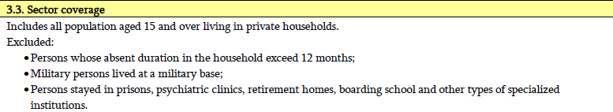

# Introduction to Georgian national Labour Force Survey (LFS)

- [What is the GEO LFS?](#what-is-the-geo-lfs)
- [What does the GEO LFS cover?](#what-does-the-geo-lfs-cover)
- [Where can the data be found?](#where-can-the-data-be-found)
- [What is the sampling procedure?](#what-is-the-sampling-procedure)
- [What is the geographic significance level?](#what-is-the-geographic-significance-level)
- [Other noteworthy aspects](#other-noteworthy-aspects)

## What is the GEO LFS?

The Georgian Labour Force Survey (LFS) is a household-based sample survey conducted by the Central Statistical Agency (CSA). This survey was first undertaken in 1999 followed by LFS 2005 as the second one in the LFS series. Till the birth of LFS 1999, there has not been a comprehensive national labor force survey representing both urban and rural area in Georgia. Both the 1981/82 and 1987/88 surveys only covered the rural part of the country. Therefore, the LFS came out to cover both the urban and rural areas of 12 regions in Georgia to fill the vacancy of national statistics.

Between 1998 and 2016, the labour force indicators were from another survey, Integrated Household Survey (IHS). The labour force module was seperated from the IHS and became an independent survey in 2017. During 1998-2016, IHS maintained a sample size of 3,400 households whereas LFS maintained sample size of about 6,400 households per quarter since 2017.

## What does the GEO LFS cover?

The GEO LFS mainly covers detailed information on demographic details, including age, sex, marital status, and location, education, and labour market activities over the previous 7 days for all private household members aged 15 and above. Years used for harmonization range from 2017 to 2022 continuously, 6 years in total.

Years and sample size of LFS harmonized for GLD are:

| **Year**	| **# of Households**	| **# of Individuals**	| **Expanded Population**	|
| :------:	| :-------:		| :-------:	 	| :-------:	 	|
| [2017](utilities/report/GEO_2017_report.pdf) | 20,486         |  54,824     |  12,049,182  | 
| [2018](utilities/report/GEO_2018_report.pdf) | 20,347         |  58,636     |  12,136,511  |
| [2019](utilities/report/GEO_2019_report.pdf) | 21,501         |  61,386     |  12,148,502  |
| [2020](utilities/report/GEO_2020_report.pdf) | 20,697         |  58,979     |  12,074,070  |
| [2021](utilities/report/GEO_2021_report.pdf) | 21,367         |  60,837     |  12,041,059  | 
| [2022](utilities/report/GEO_2022_report.pdf) | 21,366         |  60,262     |  11,955,709  | 

All the six years' official annual reports are provided in the table above through the links attached to each year. Each year's annual report mainly covers employment and unemployed rates as well as their changes compared to the previous year.    

## Where can the data be found?

Main data from 2017 to 2022 are publicly available on the [Georgia National Statistics Office website](https://www.geostat.ge/en/modules/categories/130/labour-force-survey-databases). The downloadable datasets include sub-datasets that cover different sections in the questionnaire, namely demographics, economic activities, excluded populations, and personal weights.  

However, employment-related variables have been already coded, which means that they are not the very original question-based variables. To validate the derived variables and code from the raw variables, we obtained raw data sets of the labour section and wage from the National Statistics Office (NSO) of Georgia. This data is not publicly available. Details about the derived variables are in the [other noteworthy aspects](#derived-variables). 

## What is the sampling procedure?

The GEO LFS uses a stratified random sampling design with 12 regions being the primary sampling unit, and households as the secondary sampling unit. An overall introduction and basic information of GEO LFS are covered in this [offical document](utilities/GEO_intro.pdf).

## What is the geographic significance level?

The GEO LFS is representative at the regional level with rural/urban division.

## Other noteworthy aspects  

### Coding of industry and occupation codes

Industrial classification is coded, in the first three years, 2017-2019, using the Statistical classification of Economic Activities in the European Community (NACE) rev.1 and rev.2, which correspond to International Standard Industrial Classification (ISIC) rev.3 and rev.4, respectively. The last three years, 2020-2022, uses only NACE rev.2. 

For the classification of occupation, all six years followed the International Standard Classification of Occupation (ISCO) and did not have a separate national classification. 2017 to 2019 used ISCO 1998 whereas 2020 to 2022 used ISCO 2008.  

Refer to this [separate document](Correspondence_in_Industrial_Classification.md) for detailed correspondence table of industrial classification and coding scheme in GLD. 

### Derived Variables

In the public data from the NSO website, labour adn employment status information was already coded. One of the sub-data sets "LFS_ECSTAT.dta" which is the economic activity data set, have derived variables such as `Employed`, `Hired`, `Self_employed`, and `Unemployed`. Moreover, income variables of specific income questions covered in the questionnaire are missed. [This](utilities/report/GEO_LFS_Database_Variables.docx) is the complete variable list with labels and explanations from the NSO website in which the derived variables can be found. 

However, without the un-coded original variables directly produced from the survey, GLD variables including `lstat`, `potential_lf` couldn't be created. As mentioned in the ["Where can the data be found?"](#where-can-the-data-be-found) part, we obtained the confidential original data sets from NSO which contains labour variables pulled out directly from the survey. We coded labour-related variables and income variables using confidential data. The detailed explanations about merging extra data and coding labour variables are covered in [this separate document](Merging_Original_Employment_Data_and_Coding_Labour_Variables.md).   

### Observation Exclusion

Each year's raw data set used for GLD harmonization was assembled manually as the original survey data were divided by sections, such as demographic section and main economic activities section. During the assembling process, each year has a certain amount of observations with only demographic information but no appearance in the economic activities section. Although there is no explicit explanation for the exclusion of these observations, the most likely reason, according to the [offical document](utilities/GEO_intro.pdf), is that these observations satisfy any of the following conditions:

Below are the statistics of excluded observations in each year.  

| **Year**	| **# Excluded**	| **# Included**	| **% Excluded**	|
| :------:	| :-------:		| :-------:	 	| :-------:	 	|
| 2017 | 18,604         |  54,824     | 25.34  | 
| 2018 | 16,055         |  58,636     | 21.50  |
| 2019 | 15,619         |  61,386     | 20.28  |
| 2020 | 13,699         |  58,979     | 18.85  |
| 2021 | 14,987         |  60,837     | 19.77  | 
| 2022 | 15,264         |  60,262     | 20.21  |

There was no ID information to include the observations of respondents under 15 years of age to the households they are a part of. Below are the statistics of observations only in the demographic dataset. Since age is in the original demographic data set and is one of the inclusion conditions, it was used as an indicator to show the share of total sample size that was excluded because of age. Note that these observations excluded do not have any weights, hence we were not able to conduct any analysis using these data.

| **Year**	| **# Age<15**	| **Percentage**	| **# Age>=15**	| **Percentage** |**Total** |
| :------:	| :-------:		| :-------:	 	| :-------:	| :-------:	| :-------:	|
| 2017| 13,666 |  81.39% | 4,938 |18.61% |18,604 | 
| 2018 | 14,129 |  88.00% | 1,926 |12.00% |16,055 |
| 2019 | 14,024 |  89.79% | 1,595 |10.20% |15,619 |
| 2020 | 13,098 |  95.61% | 604   |4.40%  |13,702 |
| 2021 | 13,631 |  90.95% | 1,356 |9.10%  |14,987 | 
| 2022 | 13,594 |  89.06% | 1,670 |10.90% | 15,264|

### Change of the Employment Standard

Since the passing of the [resolution concerning statistics of work, employment and labour underutilization](https://www.ilo.org/global/statistics-and-databases/standards-and-guidelines/resolutions-adopted-by-international-conferences-of-labour-statisticians/WCMS_230304/lang--en/index.htm) in 2013 at the 19th International Conference of Labour Statisticians (ICLS) surveys are at risk of a series break due to the change in the concept of employment.

In short, the ICLS 19 resolution restricts employment to *work performed for others in exchange for pay or profit*, meaning that own consumption work (e.g., subsistence agriculture or building housing for oneself) are not counted as employment.

The GLD codes the harmonization’s `lstatus` variable based on the concept used in the survey. In the case of the GEO LFS this change occurs after 2019, when the survey switches to new definition. This implies that estimates for 2020-2022 may not be directly comparable with those from the previous years. However, it is possible to recode `lstatus` such that it matches the previous definition. The precise details are covered in a [separate document here](Converting%20between%20ICLS%20Definitions.md).
