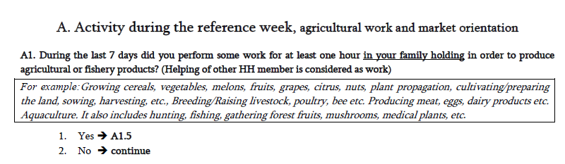

# Introduction
Since the passing of the [resolution concerning statistics of work, employment and labour underutilization](https://www.ilo.org/global/statistics-and-databases/standards-and-guidelines/resolutions-adopted-by-international-conferences-of-labour-statisticians/WCMS_230304/lang--en/index.htm) in 2013 at the 19th International Conference of Labour Statisticians (ICLS) surveys are at risk of a series break due to the change in the concept of employment.

In short, the ICLS 19 resolution restricts employment to *work performed for others in exchange for pay or profit*, meaning that own consumption work (e.g., subsistence agriculture or building housing for oneself) are not counted as employment.

The GLD codes the harmonization’s `lstatus` variable based on the concept used in the survey. In the case of the Georgian LFS this change occurs after 2019, when the survey switches to new definition. As a result, [time series data](utilities/GEO_lstatus.png) show a decrease in the size of employed and labor force participants for the 2020-2022 round. However, the code can be altered to try to match the previous definition. And this operation can be done conveniently taking advantage of the questionnaire's structure. 

# Framework for identifying the employed in the 2020-2022 GEO LFS

The information on current activity were used to define the employed using Questions A1-A9 in the questionnaire. The general flow of section A involves first asking the individual if he/she engaged in any activity to produce agricultural or fishery products in the past 7 days, for pay or for own use/consumption, if no agricultural activities then any non-agricultural activities, and lastly if no activities engaged what was the reason; if the individual reports otherwise, he/she would be asked about information regarding temporary absence from employment. 


# Current coding for the GEO LFS

In 2017-2019, the respondents who indicate that they either worked for salary (A1 is Yes) or engaged in activities for own consumption (A2 is Yes) are employed. The skip pattern leads such respondents to the first question in the section B on employment details (skip to B1 in the image below).


In 2020-2022, two separate questions (A1.5 and A1.6 - see image below) were added to confirm whether the production from the respondent's main activity (from A1) was for profit or for own use. These two questions allow users to change `lstatus` between the old and the new definitions by adding observations who chose category 3 or category 4 in question A1.5 and A1.6 (underlined red below).




The coding for identifying employed respondents (`lstatus == 1`) in 2020-2022 is thus:

```
replace lstatus = 1 inlist(A1_5,1,2) | inlist(A1_6,1,2) | A2==1 | A3==1 | A4==1 | inrange(A6,6,9) | A7==1 | A8==1 | A9==1
```

so that all answers that lead to section B ("Main Job") were coded as employed. 

## Dual employment of own-consumption workers

While prior to 2019 respondents with own consumption work would directly skip to section B, now they are asked further questions (skip pattern leads them to A1_7) and details of this own consumption work, followed by a question on work for compensation (question A2, see screenshot below).


Therefore, the respondents with own consumption work can be coded as employed on the basis of other work which is for market exchange.

# Coding to convert the 2020 ILFS to the old definition

In converting back to the old definition (ICLS-13), the approach adopted here is simply to remove all the restrictions on `A1_5` and `A1_6`, and instead, to code respondents who have answered question A1.5 to A1.9 as employed regardless of their answers to question A2 and questions forward. The revised codes would be:

```
* Generate empty variable first
gen lstatus_old_iscls = .

* Code employed as per ICLS-19 (only for market exchange)
replace lstatus_old_icls = 1 if inlist(A1_5,1,2) | inlist(A1_6,1,2) | A2==1 | A3==1 | A4==1 | inrange(A6,6,9) | A7==1 | A8==1 | A9==1

* Add those left out but covered by ICLS-13
replace lstatus_old_icls = 1 if (inrange(A1_5,3,4) | inrange(A1_6,3,4)) & mi(lstatus_old_icls)
```

Note that the above only covers the employment status. These added workers should also have information on their occupation sector, employment sector, industry, occupation, ... 

Own consumption workers are by definition self-employed and in the private sector. Regarding their industry and occupation, question A1.9 directly provides their industrial classification codes in NACE rev.2. And in 2020-2022, own-consumption workers' industry ranges from NACE rev.2 111 to 322, which are all in "Agriculture". As for occupation, users could refer to for-salary workers' occupations with the same industry codes. The data shows that own-consumption workers' industrial codes are mostly in "Elementary Occupations".  

Finally, it may be worthwhile for the above mentioned "dual employment workers" to evaluate their labour status. For example, someone working on own-consumption agriculture and a small shoe repair business who spends most of their work time in agriculture. On both definitions they are employed. However, by the ICLS-19 definition they are employed in manufacturing (shoe repair), while by ICLS-13 they are employed in agriculture. The data replacement above would only add agriculture workers not doing other work. The GLD team has no standard way of "re-assigning" labour status but has commonly advocated for evaluating the work time to judge what is the "main job". That is, if our example worker spends 10 hours a week on shoe repair when the average worker spends 45 hours at their main job and 75% of them work 20 or more hours, it would be reasonable to assume shoe repair is not the main job and that information should be overwritten with agriculture information (self-employed, ISCO code 63, ...).
