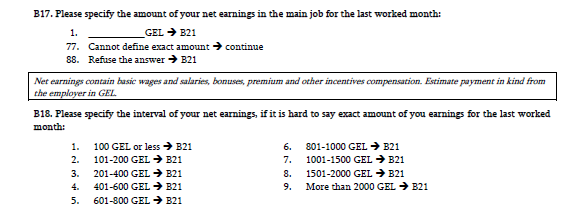
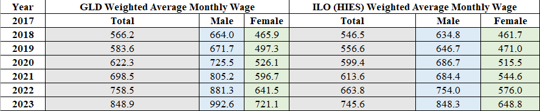

# Merging Extra Data and Coding Labour Variables for 2017-2022

The extra data we received from the NSO includes all questions from Section A *Activity during the reference week, agricultural work and, market orientation* and two income questions from Section B *Main Job*. In addition to the question-based variables, the data also contains ID, quarter, and weight variables for uniquely identifying observations.  

Before harmonization, for each year, we merged the confidential labour data from NSO into the raw data downloaded from the NSO website using weight and ID variables. And then we used the assembled data sets for harmonization, which allows us to code `lstatus`, `potential_lf`, and `wage_no_compen` from the very original variables pulled out directly from the survey instead of using the derived variables. 
 
# Coding Labour Variables

In the public raw data set, `Employed`, `Unemployed`, `Unemployed_soft`, `Inactive` and `Inactive_soft` are the derived labour variables. The main issue with derived variables is that there is no way to validate the estimates to ensure the definition applied aligns with ours. Especially in Georgia's case, both unemployment and non-labour force have two variables each following a "strict" or a "soft" ILO standard. We could not find an explanation of what this precisely means in the documentation.

Using the extra data from NSO, we were able to code employed population using questions from A1 to A10. The current coding is demonstrated below, in which all the answers that lead to section B are coded as employed. The employed estimate yielded by these codes is the same as the derived variable `Employed`, `Unemployed`, and `Inactive`. Disassembling the unemployment variable into the very original question-based variables, it includes:
1) people who answered G1 yes (have an agreement to start a job or will start own business within 3 months) and are available for starting a work (yes to G9);
2) people who are currently seeking jobs and would be able to start working (no to G1; 
answered either one of G2 and yes to G9). Therefore, we are sure that the "strict" definitions of unemployment and non-labour force align with our definition.  

```
        gen byte lstatus=.
	egen seeking=rowmin(G2_1_Methods_used_to_find_work-G2_97_Methods_used_to_find_work)
	replace lstatus=1 if A1==1|A2==1|A3==1|A4==1|A5==1|A6==1|A9==1|A10==1|A10==3
	replace lstatus=2 if (G1_agreement_to_start_a_work==1|seeking==1)&G9_Availability_to_start_working==1
	replace lstatus=3 if lstatus==. 
	replace lstatus=. if age<minlaborage
	label var lstatus "Labor status"
	la de lbllstatus 1 "Employed" 2 "Unemployed" 3 "Non-LF"
	label values lstatus lbllstatus
```

# Coding Wage Variables

The GEO LFS asks paid employees for their wages in two steps. It first asks them to reply with their precise salary. If they are unable to give a true estimate, they are requested to reply in what kind of range their salary lies in (see screenshot of questionnaire below).



On average, about 80% of paid employees can name their precise salary in 2017-2022, while about a fifth give a range value answer. In order to use the information, we imputed their salary. To do so, first the wage information of those who know their precise salary was trimmed of outliers (i.e., the lowest and highest percentile were replaced with the mean value). Next, the mean salary was calculated by (i) sex, (ii) urban/rural area, (iii) industry, and (iv) occupation within the range values of the responses from the questionnaire. This mean, for example, we calculated the mean salary of women, in urban areas, who worked in manufacturing as clerks and earn between 800 and 1000 GEL. Then all urban women in the same sector and occupation who cannot precisely tell us their wage but claim to have earned between 800 and 1000 GEL are assigned that salary. these estimates align (roughly) wiht the ILOSTAT data on salaries, calculated from the Household Income and Expenditure Survey (see below).


