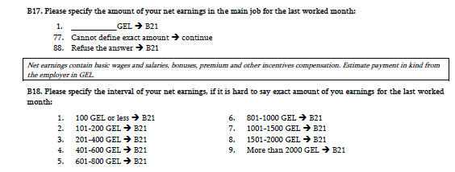
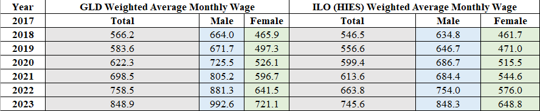

# Merging Extra Data and Coding Labour Variables for 2017-2024

The additional data received from NSO include all questions from Section A *Activity during the reference week, agricultural work and market orientation* and, for the earlier rounds, two income questions from Section B *Main Job*. In addition to the question-based variables, the files contain the IDs, quarter variables, and weights needed to identify observations consistently.  

Before harmonization, for each year, we merged the NSO labour data into the raw data downloaded from the NSO website using weight and ID variables. The resulting assembled files allow GLD to code `lstatus`, `potential_lf`, and `wage_no_compen` from the underlying survey variables rather than relying only on the public derived indicators. 
 
# Coding Labour Variables

In the public raw data set, `Employed`, `Unemployed`, `Unemployed_soft`, `Inactive` and `Inactive_soft` are the derived labour variables. The main issue with derived variables is that there is no way to validate the estimates to ensure the definition applied aligns with ours. Especially in Georgia's case, both unemployment and non-labour force have two variables each following a "strict" or a "soft" ILO standard. We could not find an explanation of what this precisely means in the documentation.

Using the additional data from NSO, we were able to code the employed population using questions A1 to A10. The current coding is shown below. In practice, all answers that lead to section B are treated as employed. The resulting employed count matches the public derived variables `Employed`, `Unemployed`, and `Inactive`. Looking at the underlying questionnaire flow, unemployment consists of:
1) people who answered G1 yes (have an agreement to start a job or will start own business within 3 months) and are available for starting a work (yes to G9);
2) people who are currently seeking jobs and would be able to start working (no to G1; 
answered either one of G2 and yes to G9). This gives confidence that the public "strict" definitions of unemployment and non-labour force align with the GLD definition in the earlier rounds where the full question sequence is available.  

For the post-2019 rounds, GLD relies on the raw derived variable `Unemployed` to retain future starters consistently. This is especially important in 2024, because the raw labour file does not retain `G1`, so future starters cannot be identified directly from the questionnaire items. The derived variable appears to preserve the within-three-month future-starter logic used in the earlier rounds and is therefore the preferred source for unemployment coding in those years.

```
        gen byte lstatus=.
	egen seeking=rowmin(G2_1_Methods_used_to_find_work-G2_97_Methods_used_to_find_work)
	replace lstatus=1 if A1==1|A2==1|A3==1|A4==1|A5==1|A6==1|A9==1|A10==1|A10==3
	replace lstatus=2 if (G1_agreement_to_start_a_work==1|seeking==1)&G9_Availability_to_start_working==1
	replace lstatus=3 if lstatus==. 
	replace lstatus=. if age<minlaborage
	label var lstatus "Labor status"
	la de lbllstatus 1 "Employed" 2 "Unemployed" 3 "Non-LF"
	label values lstatus lbllstatus
```

# Coding Wage Variables

In the earlier GEO LFS rounds, paid employees are asked about their wages in two steps. The questionnaire first asks for the exact salary. If the respondent cannot provide it, they are then asked to report the bracket in which their salary falls (see screenshot of questionnaire below).



On average, about 80% of paid employees in the earlier rounds can report their exact salary, while about a fifth give a bracket instead. To use the interval information, we imputed salary for bracket-only cases. First, the wage information from respondents who reported an exact salary was trimmed for outliers. Next, the mean salary was calculated by sex, urban/rural area, industry, and occupation within each wage bracket. For example, we calculated the mean salary of women in urban areas who worked in manufacturing as clerks and reported earnings between 800 and 1000 GEL. That mean was then assigned to otherwise comparable workers who reported the same bracket but not an exact wage. These estimates align broadly with the ILOSTAT salary series based on the Household Income and Expenditure Survey (see below).

The 2024 wage data differ from the earlier rounds. Although the questionnaire still asks first for the exact amount and then for a bracket if needed, the raw 2024 wage information retains only the bracketed earnings variable and not the exact amount. For this reason, the donor-based imputation used in the earlier rounds could not be reproduced in 2024. Instead, `wage_no_compen` in 2024 is approximated directly from the reported brackets.


