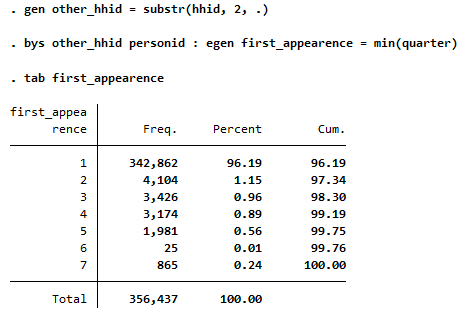
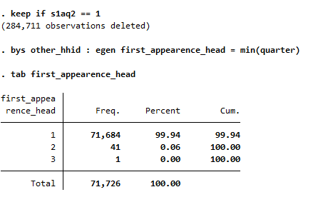
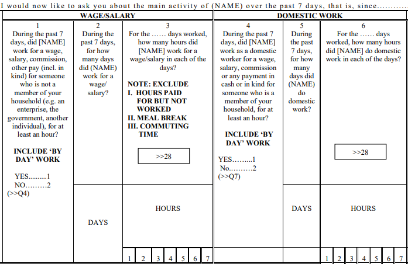
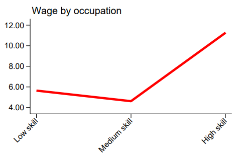
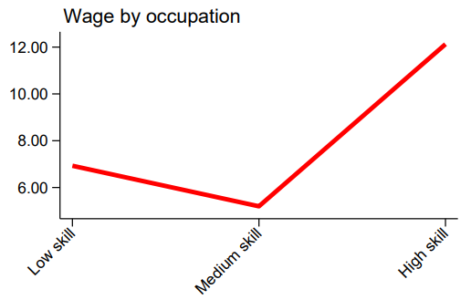

# Annual HouseHold Income and Expenditure Survey (AHIES)

- [What is the GHA AHIES?](#what-is-the-gha-ahies)
- [What does the GHA AHIES cover?](#what-does-the-gha-ahies-cover)
- [Where can the data be found?](#where-can-the-data-be-found)
- [What is the sampling procedure?](#what-is-the-sampling-procedure)
- [What is the significance level?](#what-is-the-geographic-significance-level)
- [Other noteworthy aspects](#other-noteworthy-aspects)

## What is the GHA AHIES?

The Annual Household Income and Expenditure Survey (AHIES) is Ghana's first nationally representative household panel survey with high frequency. It started in 2022 and is conducted on a quarterly basis.


## What does the GHA AHIES cover?

The AHIES provides essential demographic, economic and welfare variables including statistics
on labour, food security, multi-dimensional poverty and health status for research, policy, and planning. It allows for in-depth analysis at various levels, such as urban/rural, locality and region. Quarters used for harmonization are from 2022 Q1 to 2023 Q3.

| Year	| Quarter | # of Households | # of Individuals	|
| :----	| :-------| :--------	    | :--------	 	|
| 2022	| Q1	  | 10,761	    | 52,914		|
| 2022	| Q2	  | 10,628	    | 53,627		|
| 2022	| Q3	  | 10,422	    | 53,146		|
| 2022	| Q4	  | 10,309	    | 50,289		|
| 2023	| Q1	  | 10,131	    | 50,039		|
| 2023	| Q2	  | 10,113	    | 47,747		|
| 2023	| Q3	  | 10,085	    | 48,708		|


## Where can the data be found?


The Ghana Living Standard Survey  data is downloadable freely the [Ghanaian Statistical Service Microdata Catalog website](https://microdata.statsghana.gov.gh/index.php/catalog/?page=1&sk=ahies&ps=15). The website also provides all necessary documentation.

## What is the sampling procedure?

The AHIES uses a stratified two-stage stratified sampling design. The 2023 manual (see document [AHIES study documentation](utilities/AHIES2022_Documentationq1q2q3_20230504.pdf)) outlines the sampling procedure as:
```
With the sampling procedure, 10,800 households in 600 EAs, consisting of 304 (50.67%) urban and 296 (49.33%) rural households
were drawn from the 2021 Population and Housing Census listing frame to form the secondary sampling units. A random sampling
methodology was adopted to select eighteen (18) households per selected EAs in all regions to form the full sample for the
fieldwork to be able to produce regionally representative expenditures for GDP.

```

## What is the geographic significance level?

The AHIES is representative at the regional level and rural/urban division.

## Other noteworthy aspects

### Panel Nature
Although AHIES is a panel survey, its nature is not rotational; rather, the individuals interviewed are retained throughout all the quarters.

By examining the first appearance of individuals in the survey by quarter (Figure 1),  most of them have been present since the beginning of the survey. This is a key finding, as a rotating panel would typically see new individuals joining over time. However, in this case, the constant presence of the same participants suggests that this is a "true" panel.

<figure>

<figcaption><b>Figure 1</b><i> First appearance of individuals AHIES 2022 and 2023</i></figcaption>



</figure>

A more detailed analysis of heads of household reinforces this conclusion (Figure 2). While new members may join the household over time, it is unusual for a new head of household to be introduced in the survey.

<figure>

<figcaption><b>Figure 2</b><i> First appearance of household heads AHIES 2022 and 2023</i></figcaption>



</figure>

Similarly, comparing other variables, such as date of birth, it seems to indicate that the direction is the same.

### Employment Questions Order and Impact on Results
This survey has a special feature, the order of the questions in the main activity section matters. Looking at the first questions of this section (Figure 3), the participants are asked whether they have done paid work. If they answer "yes," they are then directed to questions 2 and 3, and subsequently to question 28, which corresponds to a variable that gathers all individuals who answered affirmatively to any of the work-related questions. They are then directed to question 40, which addresses the occupation related to that specific job.


<figure>

<figcaption><b>Figure 3</b><i> Current economic activity questions - AHIES 2022 and 2023 </i></figcaption>



</figure>


This occurs in all cases. Upon the first affirmative response, the individual is specifically asked about that job. It is not possible to know information about other types of work. Using the example of above, if the person answered "yes" to having worked for salary, it is not possible to determine whether they also worked as a domestic employee or how many hours they dedicated to that work compared to their salaried employment in the past 7 days. Commonly, if the survey determines a person eligible to be asked about employment in various ways (i.e., they have various jobs) the enumerator asks about the job that the respondent devotes the most time to. Here the order determines the selection.

### ICLS version
The AHIES 2022 and 2023 use ICLS-19 version. [This document](Conversion%20from%20ICLS-19%20to%20ICLS-13%20version.md) contains the methodology to make it comparable older GLD surveys for Ghana, some of which employ the ICLS-13 version.

### Employment concepts in Ghana

The AHIES uses concepts that differ slightly from the harmonization methodology employed by the GLD. For more information, please refer to [GLSS document](../GLSS/Employment%20concepts%20in%20the%20GLSS.md)

The below code, defines in the ```lstatus``` variable section how to code employment if using the AHIES official definition:

```
	gen byte lstatus = .
	
	*Code employed
	replace lstatus = 1 if s4aq1 == 1 | s4aq4 == 1 | inlist(s4aq10,1,2,3) | inlist(s4aq14,1,2,3) | inlist(s4aq18,1,2,3) | inlist(s4aq19,1,2,3) | s4aq22 == 1 | s4aq29 == 1 | s4aq29a == 1 | inlist(s4aq31,1,2,3) | inlist(s4aq33,1,2,3) | inlist(s4aq35,1,2,3) | inlist(s4aq36,1)

	*THE REST OF THE CODING OF THIS VARIABLE IS THE SAME AS THE CURRENT VERSION
	
```

The below code, defines in the ```lstatus``` variable section how to code unemployment if using the AHIES official definition:
```
	gen byte lstatus = .
	
	*THE REST OF THE CODING OF THIS VARIABLE IS THE SAME AS THE CURRENT VERSION
	
	*Code unemployed
	gen     active = 0 if !mi(s4eq2)
	replace active = 1 if s4eq2 == 1
	gen     passive = 0 if !mi(s4eq1)
	replace passive = 1 if s4eq1 == 1
	replace lstatus = 2 if (active == 1 | passive == 1) & missing(lstatus)

	*THE REST OF THE CODING OF THIS VARIABLE IS THE SAME AS THE CURRENT VERSION
	
```

### Skill and Wages

Both 2022 and 2023 show unusual patterns regarding salaries. Workers in low-skill occupations earn more than those in middle-skill occupations (Figure 4).

<div align="center"><strong>Figure 4:AHIES Skill and Wage</strong></div>

| AHIES 2022          |  AHIES 2023 |
|:-------------------------:|:-------------------------:|
|  |  |
|***Note:*** *The above graphs show hourly wages for paid employees*||

Upon further analysis, we realize that these differences are specifically due to the internal structure of the country and not an error in the survey. For more details, please see [this document](Relationship%20between%20Skill%20and%20Wages.md).

### Education System in Ghana

In Ghana, education is organized into three stages: basic education, secondary education, and tertiary education. The table below illustrates the average duration in years of each stage. This information is useful for creating the variable educy, that codes the number of years spent in education and the variable educat7, that classifies the highest level of education attained by the respondent to seven levels.

| Education Level                                     | Years   | Observations                                          |
|:---------------------------------------------------:|:-------:|:-----------------------------------------------------:|
| Primary                                             | 6       |                                                       |
| Junior High School (JSS1/JHS1)                      | 3       |                                                       |
| Middle Secondary                                    | 3       | After primary education (old system), replaced by JHS |
| Senior High School                                  | 4       |                                                       |
| Vocational/Technical                                | 2       |                                                       |
| Technical Training/Nursing/Polytechnic              | 3       |                                                       |
| University                                          | 4       |                                                       |
| Other Tertiary                                      | 2       | Assumes Master's and PhD                              |


