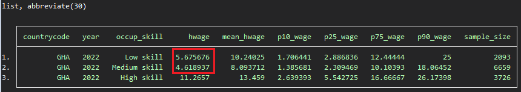
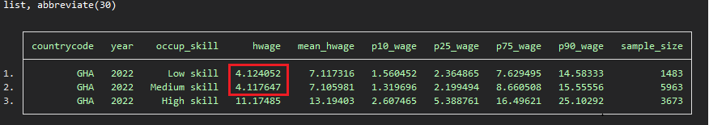

# Relationship between Skill and Wages

## Overview
In analyzing AHIES, a noticeable shift has emerged in the salary patterns for different skill levels. Both 2022 and 2023 reveal unusual trends, where workers in low-skill occupations are earning more than their counterparts in middle-skill occupations. This reversal of expectations raises important questions about the labor market dynamics and the factors influencing these wage disparities.

## Economic activities 

For AHIES 2022, When we examine the predominant economic activities of low-skill paid employees (Table 1), there are two dominant activities: Construction and Mining of other non-ferrous metal ores (specifically gold in this context).

<strong>Table 1: Economic Activities of Low skill workers</strong>

ISIC code   |   ISIC Economic activity description                                   | Percentage|
:-------:|:----------------------------------------------:|:----------------------------------------------:
 4100       |     Construction                                          | 18%
 0729       |     Mining of other non-ferrous metal ores                                          | 10%

With the medium skill paid employees (Table 2), the previous economic activities do not represent as much compared to the low-skill employees.

<strong>Table 2: Economic Activities of medium skill workers</strong>

ISIC code   |   ISIC Economic activity description                                   | Percentage|
:-------:|:----------------------------------------------:|:----------------------------------------------:
 4100       |     Construction                                          | 7%
 0729       |     Mining of other non-ferrous metal ores                                          | 2%

If we look the normal data, we can observe the difference in the median salary between low and medium skill employees. However, when we exclude the activities of construction and mining of other non-ferrous metal ores, we see that the salaries become more balanced (Figure 1).

<strong>Figure 1: Wage and Occupation skills </strong>

| Normal         |
|:-------------------------:|:-------------------------:|
|  |  

| Without most important low-skill activities         |
|:-------------------------:|:-------------------------:|
| |

This suggests that the salary differences between the two groups are due to the internal structure of the country and not an error in the survey. The extraction of precious metals, such as gold, is well-paid, and construction, being in higher demand in urban areas, may be better valued than some higher-skilled activities in rural areas.

