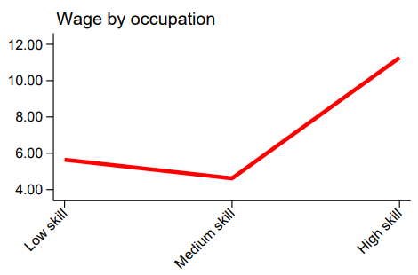

# Relationship between Skill and Wages

## Overview - Unexpected Payout for Skill
In reviewing the AHIES harmonization, a noticeable inversion of expected salary patterns by skill level emerged. Both 2022 and 2023 reveal unusual trends, where workers in low-skill occupations are earning more than their counterparts in middle-skill occupations (Figure 1). This reversal of expectations raises important questions about the labor market dynamics and the factors influencing these wage disparities. 

<strong>Figure 1:AHIES Skill and Wage</strong>

| AHIES 2022          |  AHIES 2023 |
|:-------------------------:|:-------------------------:|
|  |  |
|***Note:*** *The above graphs show hourly wages for paid employees*||

## Possible Reason : Economic Activity 

For AHIES 2022, When we examine the predominant economic activities of low-skill paid employees (Table 1), the two dominant activities are Construction and Mining of other non-ferrous metal ores (specifically gold in this context). These represent over a quarter of all low-skill workers.

<strong>Table 1: Economic Activities of Low skill workers</strong>

ISIC code   |   ISIC Economic activity description                                   | Percentage|
:-------:|:----------------------------------------------:|:----------------------------------------------:
 4100       |     Construction                                          | 18%
 0729       |     Mining of other non-ferrous metal ores                                          | 10%

 

Among medium skill paid employees (Table 2), the previous two economic activities do not represent as much compared to the low-skill employees. Under 10% of all medium-skilled workers.

<strong>Table 2: Economic Activities of medium skill workers</strong>

 
ISIC code   |   ISIC Economic activity description                                   | Percentage|
:-------:|:----------------------------------------------:|:----------------------------------------------:
 4100       |     Construction                                          | 7%
 0729       |     Mining of other non-ferrous metal ores                                          | 2%
 

Figures 2 and 3, below, compare the median, mean, and percentiles of the wage distribution by skill level for employees (aged 15 to 64). Comparing the median with (Figure 2) and without the main sectors (Figure 3) shows the gap between low and middle skilled earnings close significantly.

| | |
|:-------------------------:|:-------------------------:|
| **Figure 2 : Employee earnings by skill - all industries**         | |
|  |  
| **Figure 3 : Employee earnings by skill - ex construction, mining gold**         | |
| |

This suggests that the salary differences between the two groups are due to the internal structure of the country and not an error in the survey. The extraction of precious metals, such as gold, is well-paid, and construction, being in higher demand in urban areas, may be better valued than some higher-skilled activities in rural areas.
