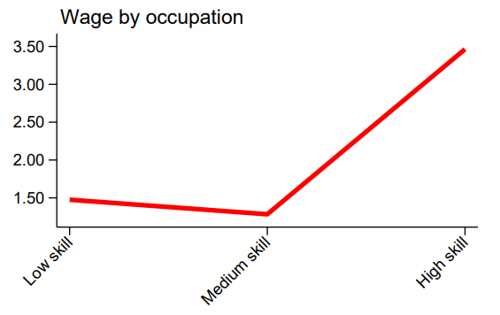
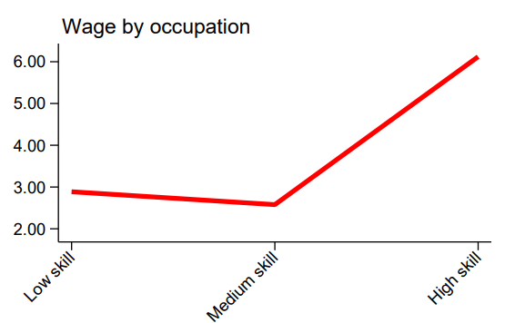

# Introduction to Ghana Living Standard Survey (GLSS)

- [What is the GHA survey?](#what-is-the-gha-glss)
- [What does the GHA survey cover?](#what-does-the-gha-glss-cover)
- [Where can the data be found?](#where-can-the-data-be-found)
- [What is the sampling procedure?](#what-is-the-sampling-procedure)
- [What is the significance level?](#what-is-the-geographic-significance-level)
- [Other noteworthy aspects](#other-noteworthy-aspects)

## What is the GHA GLSS?

Since 1987, the Ghana Statistical Service (GSS) has been conducting the Ghana Living Standards Survey (GLSS) to measure the living conditions and well-being of the population. The GLSS has been valuable to policymakers and other stakeholders as it provides timely and reliable data on poverty trends, helping to identify key areas for policy interventions aimed at improving people's lives. Over the years, it has become a key tool in monitoring progress on poverty reduction strategies in the country.


## What does the GHA GLSS cover?

The GLSS provides essential on the Demographic Characteristics; Education; Health; Employment; Migration and Tourism; Housing; Household Agriculture; Expenditure and Income; Governance, Peace and Security; Financial Services, Credit; and Assets. It allows for in-depth analysis at various levels, such as urban/rural, locality, region, and socioeconomic status. Years used for harmonization are 2012 and 2016.

| Year	| # of Households	| # of Individuals	|
| :-------	| :--------		| :--------	 	|
| 2012	| 16,772		| 72,372	|
| 2016	| 14,009		| 59,864		|


## Where can the data be found?


The Ghana Living Standard Survey data is downloadable freely from the [Ghanaian Statistical Service Microdata Catalog website](https://microdata.statsghana.gov.gh/index.php/catalog/?page=1&sk=glss&ps=15). The individual survey entries on the website also provide all necessary documentation.

## What is the sampling procedure?

The GLSS uses a stratified two-stage stratified sampling design. The 2012 manual (see document [*GLSS Round 6 Main Report*](utilities/GLSS6_Main%20Report.pdf)) outlines the sampling procedure as:
```
    The PSUs were allocated into the 10 regions using probability proportional to population size 
    (PPS). The EAs were further divided into urban and rural localities of residence. A complete 
    listing of households in the selected PSUs was undertaken to form the secondary sampling 
    units (SSUs). At the second stage, 15 households from each PSU were selected 
    systematically.
```

## What is the geographic significance level?

The GLSS is representative at the regional level and rural/urban division.

## Other noteworthy aspects

### ICLS version

The years covered use different ICLS versions. The GLSS 2016 uses ICLS-19 version. [This document](Conversion%20from%20ICLS-19%20to%20ICLS-13%20version.md) contains the methodology to make it comparable with the 2012 survey, which employs the ICLS-13 version.

### Employment concepts in Ghana

The GLSS uses concepts that differ slightly from the harmonization methodology employed by the GLD. The unemployment definition is broader than the GLD standard and the border between work for market exchange and own consumption is more lenient (more cases are seen as market exchange). For more details and to code according to the national definitions, please refer to [this document](Employment%20concepts%20in%20the%20GLSS.md)

### Skill and Wages
Both 2012 and 2016 show unusual patterns regarding salaries. Workers in low-skill occupations earn more than those in middle-skill occupations (Figure 1).

<div align="center"><strong>Figure 1: GLSS Skills and Wage</strong></div>

| GLSS 2012          |  GLSS 2016 |
|:-------------------------:|:-------------------------:|
|  |  |
|***Note:*** *The above graphs show hourly wage for paid employees aged 15-64 only*||

Upon further analysis, the GLD team believes these differences are due to the internal structure of the country and not an error in the survey. The issue is present in later years in the AHIES. For more details, please see [this document](../AHIES/Relationship%20between%20Skill%20and%20Wages.md).

### Education System in Ghana

In Ghana, education is organized into three stages: basic education, secondary education, and tertiary education. The table below illustrates the average duration in years of each stage. This information is useful for creating the variable `educy`, that codes the number of years spent in education and the variable `educat7`, that classifies the highest level of education attained by the respondent to seven levels.

| Education Level                                     | Years   | Observations                                          |
|:---------------------------------------------------:|:-------:|:-----------------------------------------------------:|
| Primar y                                            | 6       |                                                       |
| Junior High School (JSS1/JHS1)                      | 3       |                                                       |
| Middle Secondary                                    | 3       | After primary education (old system), replaced by JHS |
| Senior High School                                  | 4       |                                                       |
| Vocational/Technical                                | 2       |                                                       |
| Technical Training/Nursing/Polytechnic              | 3       |                                                       |
| University                                          | 4       |                                                       |
| Other Tertiary                                      | 2       | Assumes Master's and PhD                              |


