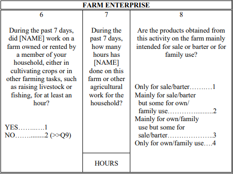

# Conversion from ICLS-19 to ICLS-13 version

## Overview

At the 19th ICLS in 2013, a significant development emerged with the adoption of the [Resolution concerning statistics of work, employment, and labor underutilization](https://www.ilo.org/resource/resolution-concerning-statistics-work-employment-and-labour). This led to a change in the concept of employment compared to ICLS-13.

In essence, the ICLS-19 resolution delineates **employment** only as work conducted for pay or profit. Activities performed not in exchange for remuneration, like own-use production work, volunteer work, and unpaid trainee work, are classified as **other forms of work**.

The GLD harmonizes data to the standard used in the design and reporting of the survey. Therefore, the 2012 GLSS is coded using ICLS-13 and the 2016 uses ICLS-19 (see variable `icls_v` in each survey). To compare GLSS 2012 (ICLS-13) with 2013 (ICLS-19) directly it is necessary to modify the coding of  variable `lstatus` using the nuances of the questionnaire.

## Framework for identifying employment in the GLSS

All questionnaires used information on current activity to define employment through the ***Economic Activity*** section in part A ***Employment last 7 days***.

## Current coding to the ICLS-13 definition

In converting to the old definition, the approach adopted here is to create a variable that identifies those that are engaged in non-market and market activities. See the Figure 1 below for the relevant parts in the questionnaire.

<figure>

<figcaption><b>Figure 1</b><i> Farm Enterprise Questions - GLSS 2016 </i></figcaption>



</figure>

In this case, if we code 1 for question 6, we can capture the employees according to the ICLS-13 definition. This strategy should be applied to all relevant questions in this section (question 1 to 30, part A - section 4)

The code below should be pasted after the code creating the ```lstatus``` variable. 

```     
  *Create an indicator "emp_diff" that identifies the difference between definitions (emp_diff)
	 gen emp_diff = 0 if inrange(lstatus, 2, 3)
	*Add those in non market interaction
	 gen icls_13 = 1 if s4aq2 == 1 | s4aq4 == 1 | s4aq6 == 1  | s4aq9 == 1  |  s4aq12 == 1  | inlist(s4aq15,1,2) | inlist(s4aq17,1,2,3) | s4aq19 == 1 | s4aq22 == 1 | s4aq23 == 1 | s4aq25 == 1 | s4aq27 == 1 | inlist(s4aq29,1,2,3) | s4aq30 == 1
	 replace emp_diff = 1 if emp_diff == 0 & icls_13 == 1
  
  * Use emp_diff to generate ICLS-13 definition
	replace lstatus = 1 if emp_diff == 1
	
	replace lstatus = . if age < minlaborage
```
This survey asks about the main job of all individuals who worked for at least one hour in the past seven days, regardless of their market interaction. Therefore, it is possible to gather variables such as employment status, industry, occupation, and other labor-related variables that may be affected by the old definition of employment.

