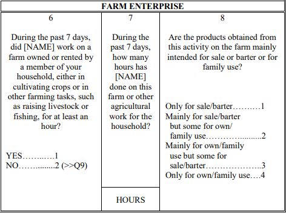

# Employment concepts in the GLSS

## Overview

The GLSS uses concepts that differ slightly from the harmonization methodology employed by the GLD. In this section, we explain the employment concepts used by the GLSS and the differences with those of the GLD. Additionally, we provide codes in case users wish to apply the country's definitions to the survey.

## Own consumption and sale products

GLSS 2016 employs the 19th International Conference of Labour Statisticians (ICLS) resolutions on statistics of work, employment and labour underutilization. For more information please visit [Resolution concerning statistics of work, employment, and labor underutilization](https://www.ilo.org/sites/default/files/wcmsp5/groups/public/%40dgreports/%40stat/documents/normativeinstrument/wcms_230304.pdf).

In essence, the ICLS-19 resolution delineates **employment** as work conducted for pay or profit. Whereas activities performed exchange for remuneration, like own-use production work, volunteer work, and unpaid trainee work, are classified as **other forms of work**.Hence, an additional question is added to differentiate the market interaction. The below screenshot (Figure 1) shows the farm enterprise questions from the GLSS 2016.

<figure>

<figcaption><b>Figure 1</b><i> Farm Enterprise Questions - GLSS 2016 </i></figcaption>



</figure>

According with ILO, a respondent is considered as employed if the farm's products are intended only or mainly for sale/barter (codes 1 and 2 in question 8). However, GLSS asks main job questions as well to those who answered their work was *mainly for own/family use but some for sale/barter* (code 3). In other words, the Ghanaian NSO considers as employed an individual that has had any market interaction, regardless of magnitude.

The below code, We define ```lstatus``` variable using GLSS definition

```
gen byte lstatus = .
	
* Code employed along national definition
replace lstatus = 1 if inlist(s4aq2,1) | s4aq4 == 1 | inlist(s4aq8,1,2,3) | inlist(s4aq11,1,2,3) |  ///
inlist(s4aq14,1,2,3) | inlist(s4aq15,1) | inlist(s4aq17,1) | s4aq22 == 1 | inlist(s4aq24,1,2,3) |   ///
inlist(s4aq26,1,2,3) | inlist(s4aq28,1) | inlist(s4aq29,1) 

*THE REST OF THE CODING OF THIS VARIABLE IS THE SAME AS THE CURRENT VERSION	
```

## Unemployment
In GLD we define unemployment as a individual jobless and available **and** looking for a job. In GLSS (2012 and 2016) the NSO uses a broader definition: unemployed are jobless individual who are available **or** looking for a job.

The below code, shows how to update the section on unemployed in the `lstatus` definition using national concept.

```
* ABOVE CODE AS IN CURRENT VERSION
	
*Code unemployed 
gen     active = 0 if !mi(s4eq2)
replace active = 1 if s4eq2 == 1
gen     passive = 0 if !mi(s4eq1)
replace passive = 1 if s4eq1 == 1
replace lstatus = 2 if (active == 1 | passive == 1) & missing(lstatus)

* BELOW CODE AS IN CURRENT VERSION
```
