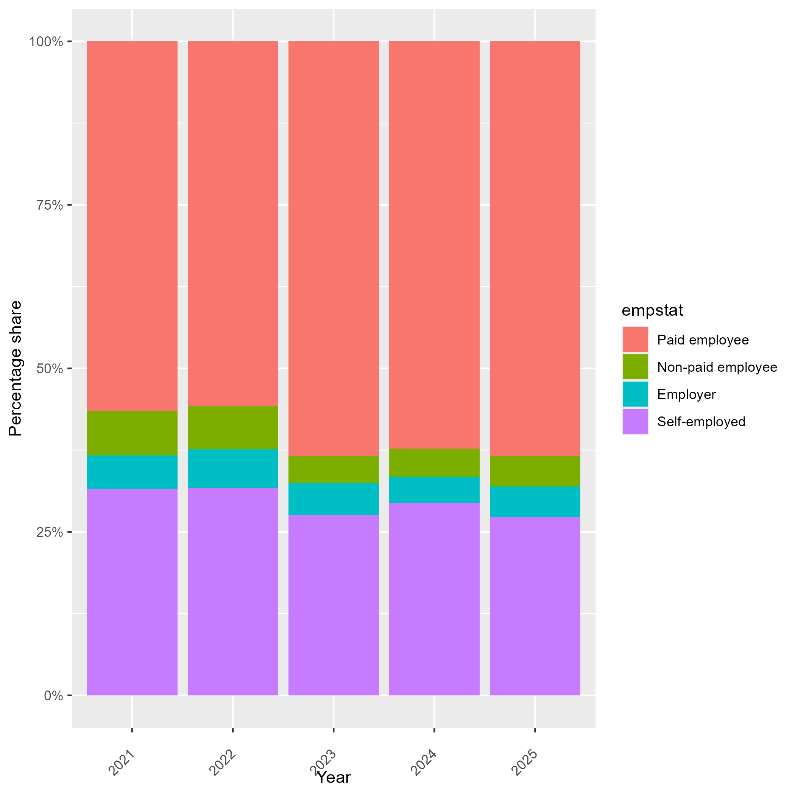

# Introduction to Honduras EPHPM

- [What is the Honduras EPHPM?](#what-is-the-honduras-ephpm)
- [What does the Honduras EPHPM cover?](#what-does-the-honduras-ephpm-cover)
- [Where can the data be found?](#where-can-the-data-be-found)
- [What is the sampling procedure?](#what-is-the-sampling-procedure)
- [What is the significance level?](#what-is-the-significance-level)
- [Other noteworthy aspects](#other-noteworthy-aspects)

## What is the Honduras EPHPM?

The Encuesta Permanente de Hogares de Propositos Multiples (EPHPM) is a household survey collected by the Instituto Nacional de Estadistica (INE) of Honduras. Its main objective is to produce labor-market indicators, but it also collects information on housing, education, access to information and communication technologies, household composition, income, employment problems, child and youth labor, poverty, and dwelling conditions.

The GLD harmonization currently covers the 2021, 2022, 2023, 2024, and 2025 EPHPM rounds. The received microdata are organized as merged person-household files, so the GLD harmonization starts from a single person-level file that already contains household-level information.

## What does the Honduras EPHPM cover?

The harmonized GLD rounds contain the following sample sizes:

| Year | Persons | Households |
| --- | ---: | ---: |
| 2021 | 20,906 | 5,079 |
| 2022 | 20,303 | 5,211 |
| 2023 | 20,308 | 5,342 |
| 2024 | 24,534 | 6,487 |
| 2025 | 28,714 | 7,870 |

The questionnaire uses the week before the survey as the reference period for occupation, hours worked, unemployment, and visible underemployment. For work income and invisible underemployment, the reference period is the month before fieldwork. The labor module is administered to household members above the survey's labor-module age threshold, while GLD labor-force indicators are harmonized using the GLD minimum labor age of 15.

## Where can the data be found?

The EPHPM microdata and documentation are produced by INE Honduras. INE makes the EPHPM bases available through its [official database page](https://ine.gob.hn/bases-de-datos/), including the 2021-2025 rounds in SPSS format.

## What is the sampling procedure?

The EPHPM is a household survey of private dwellings. It excludes collective dwellings such as hotels, hospitals, prisons, military barracks, and convents, but includes households living in premises not originally built as dwellings, such as garages, mobile homes, warehouses, and similar structures.

The sampling frame is based on the 2,104,750 dwellings registered in the 2011 pre-census for the 2013 National Population and Housing Census, with corresponding segmentation and cartography. The frame contains 24,065 census segments, which are used as primary sampling units (UPM). Secondary sampling units are compact groups of adjacent dwellings, usually five or six dwellings depending on the round. The [2023 methodology note](utilities/Metodologia-Junio-2023.pdf) gives the same basic design used in the adjacent rounds.

The frame is divided into four study domains: Distrito Central, San Pedro Sula, Resto Urbano, and Rural. The first three domains together form the urban total. The sample is probabilistic, stratified, and two-stage. In the first stage, UPMs are selected; in the second stage, compact dwelling groups are selected. Both stages use systematic sampling with a random start. The methodology documents describe the sample as proportional to the size of the study domains and use expansion factors adjusted for non-response.

## What is the significance level?

The single-round EPHPM methodology supports estimates for the four study domains: Distrito Central, San Pedro Sula, Resto Urbano, and Rural. The first three domains together form the urban total. INE's [2023 consolidated EPHPM publication](utilities/Consolidada-EPHPM-2023.pdf) states that departmental estimates are possible when the survey is carried out in the four quarterly rounds of the year: March, June, September, and November, and when a departmental expansion factor is generated from the consolidated data.

## Other noteworthy aspects

### Labor-force status

The EPHPM questionnaire identifies employment before unemployment. Employment includes direct work for pay or profit, other listed paid or profit activities, temporary absence with job attachment, and unpaid work when the questionnaire route supports employment. Unemployment is assigned among people who are not employed, have search or future-start evidence, and are available to work. People age 15 and above who meet neither definition are outside the labor force.

The main comparability issue is unpaid family work. In 2021 and 2022, the received data identify unpaid family work but do not retain whether that family work was mainly for sale or mainly for household consumption. GLD therefore counts the unpaid-family-work route as employment in those years. From 2023 to 2025, the received data include that market-orientation detail, so unpaid family work is counted as employment only when it was mainly for sale. In 2021 and 2022, other unpaid work is a separate branch after unpaid family work is ruled out. In the retained 2022 data, that branch identifies volunteer work, unpaid internship or apprenticeship, own-household domestic work, and production for household consumption, not a market-production route. The detailed treatment is covered in [Labor force status](Labor%20force%20status.md).

### Education

The GLD education variables are based on the survey's education-attainment and current-attendance questions. The harmonization treats people who are no longer attending school separately from people who are currently attending, because completed level and current grade have different meanings.

### Industry

The EPHPM methodology does not clearly identify the industry classification used in the detailed industry-code variable. Based on the observed code structure and labels, the first two digits are consistent with the International Standard Industrial Classification Rev. 4. Each dataset also includes a section-level industry variable, and in general those section categories are consistent with International Standard Industrial Classification Rev. 4. There are some cases where the section variable and the detailed industry code do not agree. Examples from the 2024 raw file include:

| Detailed industry code, `O02_CODIGO` | Broad industry code, `RAMAOP` |
| --- | --- |
| `84110 - General public administration activities (section O)` | `14 - Administrative and support service activities (section N)` |
| `84230 - Public order and safety activities (section O)` | `14 - Administrative and support service activities (section N)` |
| `81100 - Combined facilities support activities (section N)` | `20 - Activities of households as employers (section T)` |
| `81210 - General cleaning of buildings (section N)` | `20 - Activities of households as employers (section T)` |

When the section variable and the detailed industry code disagree, the GLD uses the first two digits of the detailed industry code to map `industrycat10`.

### Occupation

The EPHPM methodology states that occupation is coded according to the International Labour Organization classification at four digits. In the GLD, the occupation coding is treated as aligned with the International Standard Classification of Occupations 2008, but not always at the full four-digit level. Where the detailed national extension does not consistently match official four-digit codes, the harmonization uses the valid two-digit occupation group stored as a four-character code ending in `00`. This avoids presenting the data as more detailed than the classification evidence supports.

### Dependent Contractors

The HND questionnaire includes *dependent contractors* as a specific employment category. According to the [ILO](https://www.ilo.org/sites/default/files/wcmsp5/groups/public/%40dgreports/%40stat/documents/meetingdocument/wcms_648693.pdf), dependent contractors are workers who provide goods or services under a commercial arrangement rather than an employment contract. Although they are not employees, they depend on another economic unit for aspects such as the organization or execution of their work, their income, or access to the market.

Dependent contractors occupy an intermediate position between paid employment and self-employment. They are classified as dependent workers when the classification is based on the degree of authority over their work, but as workers in employment for profit when it is based on economic risk. The latter is analogous to the traditional distinction of self-employment.

Because the harmonized `empstat` variable does not contain a separate category for dependent contractors, we decided to classify them as **self-employed**. This mapping reflects that they do not have a standard employer–employee relationship and that their remuneration is associated with a commercial arrangement rather than a wage or salary. It also provides a consistent treatment of this group across all available survey years.

### Change in Status-in-Employment Shares from 2023 Onward

The distribution of status in employment shows a visible shift from 2023 onward. Compared with 2022, the share of paid employees increases, while the shares of non-paid employees and self-employed workers decline. 

  

This change does not come from a change in the harmonization rule for `empstat`, since the mapping from `OC609` to `empstat` is kept constant across years.

The shift is mainly explained by a few underlying changes in the response distribution of `OC609`, as shown below.

| OC609 category | Harmonized `empstat` group | 2022 share | 2023 share | Change |
|---|---|---:|---:|---:|
| Private-sector employee | Paid employee | 44.23% | 51.27% | +7.04 pp |
| Private-sector dependent contractor | Self-employed | 10.05% | 2.92% | -7.13 pp |
| Unpaid family worker | Non-paid employee | 8.92% | 4.88% | -4.04 pp |
| Own-account worker | Self-employed | 22.29% | 26.10% | +3.81 pp |
| Public-sector employee | Paid employee | 5.50% | 6.62% | +1.12 pp |
| Household dependent contractor | Self-employed | 0.01% | 0.73% | +0.72 pp |
| Domestic employee | Paid employee | 3.10% | 2.40% | -0.70 pp |
| Employer | Employer | 5.43% | 4.82% | -0.61 pp |

The largest driver is the fall in private-sector dependent contractors, from 10.05% of valid `OC609` responses in 2022 to 2.92% in 2023. Since dependent contractors are classified as self-employed in this harmonization, this mechanically reduces the self-employed share. However, this decline is partly offset by the increase in own-account workers, which rise from 22.29% to 26.10%.

At the same time, private-sector employees increase sharply, from 44.23% to 51.27%, explaining most of the increase in the paid-employee category. The decline in non-paid employees is driven by the fall in unpaid family workers, from 8.92% in 2022 to 4.88% in 2023. The decline in non-paid employees is also related to a stricter treatment of unpaid family work from 2023 onward: unpaid help in a family business is only counted as employment when it is linked to a market-oriented or income-generating activity. This reduces the number of unpaid family workers classified as employed.

Overall, the break observed from 2023 onward reflects changes in the underlying `OC609` composition, especially the fall in dependent contractors and unpaid family workers, together with the rise in private-sector employees. It should therefore be interpreted as a composition and routing change rather than as a change in the `empstat` harmonization rule.