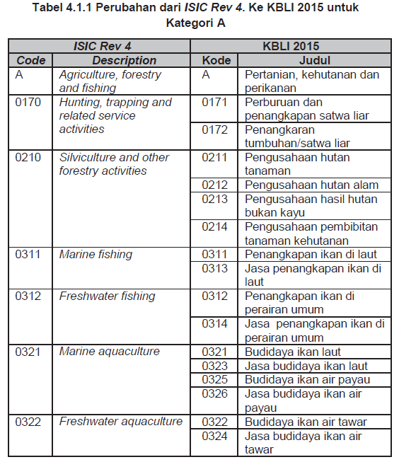

# Correspondences between national and international classifications

This document describes the methodology used to map KBLI-2015 and KBLI-2009 to *International Standard Industrial Classification of all Economic Activities (ISIC Rev. 4)*. As described in the [introduction to SAKERNAS](1.%20Introduction%20to%20SAKERNAS.md), other versions of KBLI either do not have official guidebooks or they are unable to communicate with their ISIC counterparts. As for occupation codes, we currently do not have sufficient information on KBJI code table. Thus we only describe the KBLI-2015 and KBLI-2009, the two national industrial classifications we mapped for GLD harmonization here.

*(We will update this documentation along with IDN GLD if we get more information on correspondence tables for KBJI and KBLI in the future. Please feel free to contact the GLD focal point (gld@worldbank.org) if you know anything that might help map Indonesia's industrial or occupational codes. Thanks!)*

## Correspondence in industry classification

The official documentation of KBLI-2015 can be found [here.](utilities/KBLI-2015.pdf) This documentation is only available in Indonesian. But it has a complete correspondence table with ISIC Rev.4 showing all the differences (see the picture below) and another one compared to KBLI-2009 from which KBLI-2015 was adapted.

**Example of the correspondence between KBLI-2015 and ISIC Rev.4**

**Example of the correspondence between KBLI-2015 and KBLI-2009**

The structure of KBLI-2015 is almost the same as KBLI-2009 and ISIC Rev.4. As being described in the documentation attached above: 

>Klasifikasi KBLI 2015 terdiri dari struktur pengklasifikasian aktivitas ekonomi yang konsisten dan saling berhubungan, didasarkan pada konsep, definisi, prinsip, dan tatacara pengklasifikasian yang telah disepakati secara internasional. Struktur klasifikasi menunjukkan format standar untuk mengelola informasi rinci tentang keadaan ekonomi, sesuai prinsip-prinsip dan persepsi ekonomi.

>Secara umum, baik KBLI 2015 dan KBLI 2009 Cetakan III masih mengacu pada rujukan yang sama yaitu ISIC Rev. 4 yang terdiri dari 21 kategori. Perubahan struktur berupa pergeseran atau pengelompokkan suatu kegiatan dari satu klasifikasi ke klasifikasi lainnya, dan penambahan klasifikasi baru yang disebabkan adanya perkembangan aktivitas ekonomi, memungkinkan untuk terbentuknya kelompok yang berdiri sendiri atau digabungkan dengan kategori lain yang lebih sesuai.

Translated by online software as:

>The 2015 KBLI classification consists of a classification structure consistent and interconnected with economic activity, based on concepts, definitions, principles, and classification procedures that has been agreed internationally. Classification structure shows standard format for managing detailed information about the state economy, according to economic principles and perceptions.

>In general, both KBLI-2015 and KBLI-2009 issue III still refers to the same reference, namely ISIC Rev.4 which consists of 21 categories. Changes happened in the form of shifts or grouping an activity from one classification to another.    

**Categories and Groupings of KBLI-2015**

| **Structure of KBLI-15**	| **Digit**	| **Quantity**	|
| :-----------------------:	| :-------:	| :-------------:	 	
| Category  | Alphabet        | 21|  
| Main Group  | 2-digit        | 88 |  
| Group  | 3-digit       | 240   |  
| Subgroup | 4-digit        | 520|  
| Group | 5-digit        | 1573  |  

Balancing between the level of precision and difficulty of mapping, we mapped KBLI-2015 to ISIC at a three-digit level, as the differences at three-digit level can be easily located and manually recoded. The table below shows all the differences between KBLI-2015 and ISIC, and those between KBLI-2009 and ISIC. When mapping KBLI to ISIC, for example, KBLI code 073 will be coded as ISIC 072.  

| **ISIC Rev.4**	| **KBLI 2015**	| **KBLI 2009**	|
| :-----------------------:	| :-------:	| :-------------:|	 	
| 072-Mining of non-ferrous metal ores|073-Pertambangan bijih logam|073-Pertambangan bijih logam |  
| 492-Other land transport|494-Angkutan darat bukan |494-Angkutan Darat Bukan Bus|
| 5520-Camping grounds, recreational vehicle, parks and trailer parks|5519-Penyediaan akomodasi|5519-Penyediaan akomodasi|
| 552-Penyedia Lahan Perkemahan, Sarana Taman Rekreasi Dan Akomodasi Jangka Pendek| (Same as ISIC) |551-Penyediaan Akomodasi Jangka Pendek|  
| 851-Jasa Pendidikan Usia Dini Dan Pendidikan Dasar | (Same as ISIC) |856-Jasa Pendidikan Anak Usia Dini|  
| 960-Other personal service activities |961-Aktivitas jasa perorangan|961-Jasa Perorangan Untuk Kebugaran, Bukan Olahraga|  
| 960-Other personal service activities |962-Aktivitas binatu | 962-Jasa Binatu |
| 960-Other personal service activities |969-Aktivitas jasa perorangan lainnya YTDL |969-Jasa Perorangan Lainnya Ytdl|

