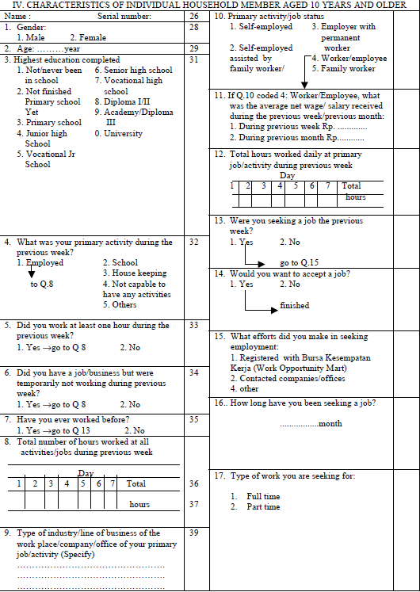
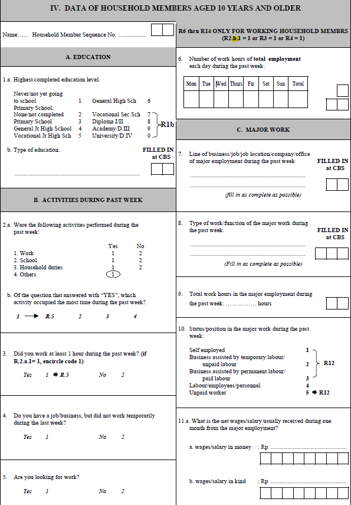
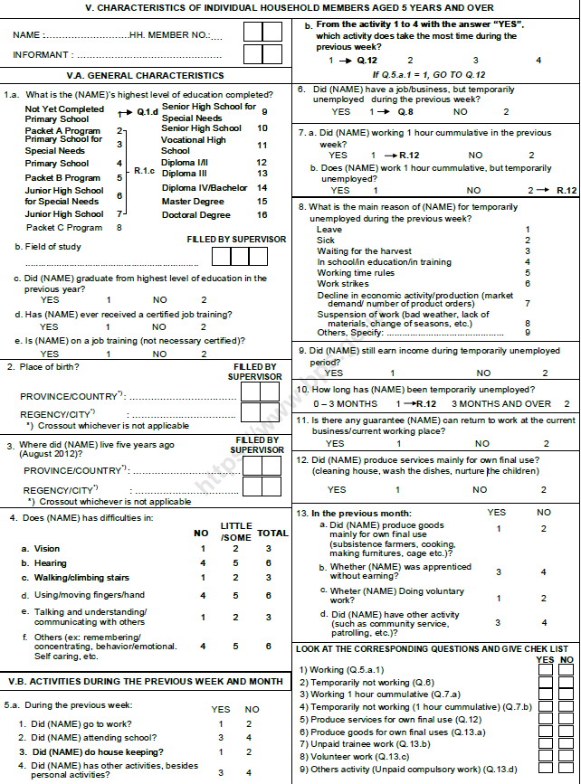
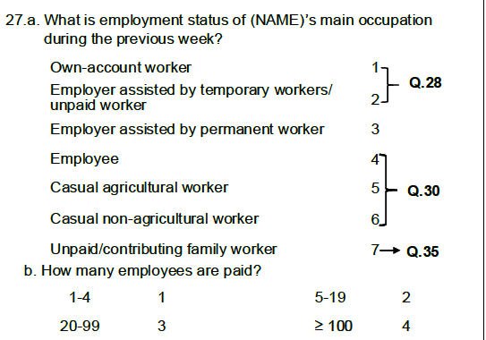
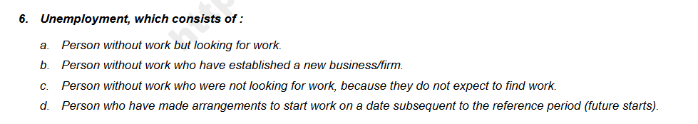
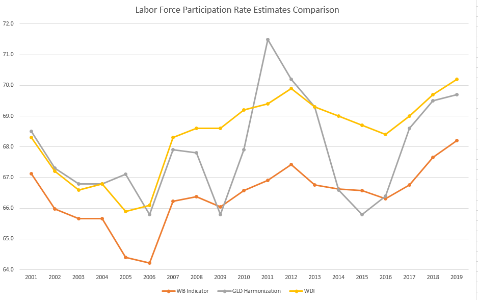

# Labor status and labor force participation rate

This document shows the details of coding `lstatus` for the three groups of years mentioned in the [Introduction to SAKERNAS.](/Support/B%20-%20Country%20Survey%20Details/IDN/SAKERNAS/1.Introduction.to.SAKERNAS.md)


## 1989-1999
>The questionnaires of these years follow the same structure and have the same labor force module questions. Simply following the order of the questions can locate all the conditions needed to decide the employed, the unemployed, and non-labor force population.

**Labor module in the questionnaire**



Starting from question 4 in this module, question 4, 5 and 6 were used for defining `lstatus==1` *(employed)*. 
```
Question 4 = 1: work primarily in the previous week
Question 5 = 1: work at least 1 hour in the previous week
Question 6 = 1: have a job but are not temporarily working
```

Because the questionnaire is designed in such way that people who have job will be led to question 8, question 6 is the minimum requirement for "being employed". Thus `lstatus=2` *(unemployed)* is: 
```
Question 6 = 2: people who do not have work
Question 13 = 1: seeking a job 
```

In this way, *non-labor force* becomes clear as same answer to question 6 as unemployed yet not seeking a job. 

## 2000-2016
>The labor force module has become more complete and questions are more well-guided during this time period. The Only for Working Household Members block states clearly the requirements for people to answer this block, which is a clear clue to code employed people.

**Labor module in the questionnaire**



As shown in the screenshot above, work hours (Q6) is only asked to who are employed. It is stated clearly how the questionnaire defines *employed*, which is consistent with ours for 1989-1999:
```
Question 2B = 1: work primarily in the previous week
Question 3 = 1: work at least 1 hour in the previous week
Question 4 = 1: have a job but are not temporarily working
```

Both *unemployed* and *non-labor force* groups do not answer question 6. They only differentiate each other in whether they were seeking a job.
```
Question 5 = 1: seeking a job – unemployed / 2: not seeking a job – non-labor force
```


## 2017-2019
>The last three years have the most up-to-date questionnaire structure, which adds details like work environment and welfare. But meanwhile as question block increases and expands, the previous order was discarded and guide becomes blurred. Following the logic of the questionnaire would not produce sound labor force participation rate. We slightly changed the way we coded lstatus so as to get close to the ILO and national estimates.

**Labor module in the questionnaire**



Applying the same logic as we did with years before 2017 would produce an extremely high labor force participation over 90%, which does not match the ILO data. Although 2017-2019 does not have a reminder like the one shown in 2000-2016 section, we used another hint – employment status.  


Question 35 was only asked to people whose employment status is not blank.



Thus, our way of defining *employed* for 2017-2019 becomes:
```
Question 35 !=0 : have employment status
```

Following the definition of *employed*, the unemployed would be those without employment status but also seeking work. Seeking work is straightforward according to the questionnaire:
```
Question 15a = 1 : searching work in the previous week
Question 15b = 1 : preparing for a business in the previous week
Question 21a = 1 : would accept a job if being offered
```

However, the definition of *unemployed* in the labor force survey report 2015 from ILO is different from ours.



This definition interacts with the other question asking about the main reason why not seeking a job or preparing for a business:


Because in previous years, *"Already having a job, but has not started to work* was classified as *employed*. To maintain consistency with previous years but also cater for the definition in the report, we deem people who have a new business but they have not stsrted yet as unemployed.
```
Question 20a = 2 : having a new business but not started yet.
```

In terms of *non-labor force*, people left with no labor status would be not in the labor force.


## Labor Force Participation Rate Comparison

The labor force participation rate produced for 2014-2017 using the method described above is almost identical to the estimates in the reports of the Indonesian Statistics Office (BPS). The labour force participation estimates of 2014, 2015 and 2016 are the identical to the official reports at on decimal place; 2017 has a difference of 1.9 percentage points.

The comparison among GLD harmonization, WDI, and WB country indicators is as follows:



As the earliest year of WB indicators is 2000, we only compared 2000-2019. The largest gap is 2.9 percentage points. This could be a result of different data sources as well as sample sizes.

