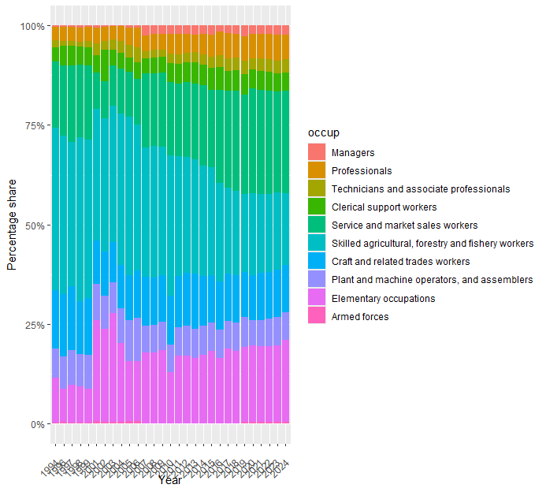
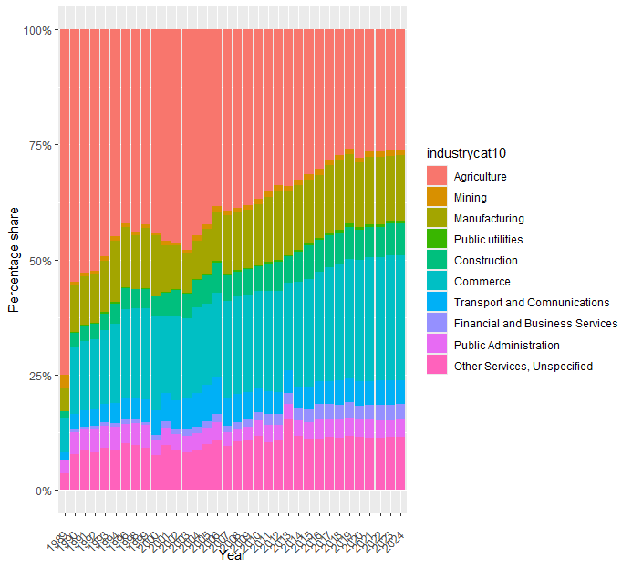

# Notes on Selected Data Issues and Harmonization Decisions

## Issue 1: High share of elementary occupation in 2001–2003

The high share of elementary occupations observed in 2001–2003 seems to be mainly driven by the change in occupation coding starting in 2001. Before 2001, the occupation variable used KBJI 2-digit codes, while from 2001 onward the data used KBJI 3-digit codes. The more detailed 3-digit classification introduced additional occupation categories and changed how some workers were mapped into broad occupation groups.

As a result, the increase in elementary occupations during these years likely reflects a classification and harmonization issue rather than a true labor market shift. In particular, the change in coding structure may have caused some occupations that were previously grouped differently under the 2-digit system to be classified as elementary occupations under the 3-digit system. Users should therefore interpret the 2001–2003 elementary occupation shares with caution when comparing them to earlier years.

## Issue 2: High agriculture share in 1989

The high agriculture share in 1989 appears to be due to a coding issue in the raw industry variable. In the 1989 data, agriculture-related codes appear in two formats at the same time: two-digit codes such as 01–04 and one-digit codes such as 1–4. These appear to refer to different groups of observations, which suggests an inconsistency in the original coding.

This issue produces an unusually high share of agricultural employment compared with subsequent years. In 1990, the same categories are coded consistently, and the resulting industry distribution is more in line with later years. Because the 1989 industry coding could not be reliably harmonized, the 1989 industry classification variables were set to missing.

## Issue 3: Use of V01_M and V02_M for 2011–2013

For 2011–2013, two versions of the harmonized data were used to preserve the most complete information available. The backcasted weights were taken from V01_M, while the more detailed industry and occupation information was taken from V02_M.

This approach allows the files to retain the preferred weights while also benefiting from the improved labor-market classification variables available in the later version. The decision was applied consistently across these three years and should be noted in both the code comments and the Country Survey Details.
