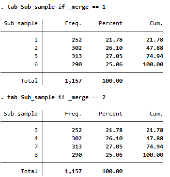

#Linking IDs in the 1999 EUS data

The 1999 EUS data for single visits suffers from inconsistency in person ID variable between the datasets for Block 4 (i.e., persons demographic and migration records) and Block 5 (i.e., usual principal and secondary activity records). This results in symmetric non-matches for a total of 2,314 individuals, all of which are found in the state of Lakshadweep. While small relative to the total sample, these observations comprise ~40% of the total sample for that state. Since EUS data is representative at the state level, losing these sizable number of respondents will make the data non-representative for the state of Lakshadweep. We have found a way to link these individuals by re-constructing the ID variable and recoding the Sub_sample variable. 

In the India 1999 EUS, the person ID variable can be constructed by combining information on sub-round, sub-sample, first sampling unit (FSU), visit number, segment number, stage-2 stratum, household ID and the person ID. However, the sub-sample information between block 5 and block 4 do not agree for some households in the state of Lakshadweep. The sub-sample codes where the mismatches were found show a 1:1 correspondence: i.e. in Block 4, sub-samples 1, 2, 5 and 6 have the exact same individual counts as sub-samples 3, 4, 7, and 8 in Block 5 (see screenshot of frequency table below).



These sub-sample values were recoded conditional on individual being in the state of Lakshadweep, in stratum code 10, and only for sub-rounds equal to 2 or 4. See code below for the full process:

```
replace Sub_sample = "3" if Sub_sample == "1" & State=="32" & Stratum == "10" & sub_round == "2"
replace Sub_sample = "4" if Sub_sample == "2" & State=="32" & Stratum == "10" & sub_round == "2"
replace Sub_sample = "7" if Sub_sample == "5" & State=="32" & Stratum == "10" & sub_round == "4"
replace Sub_sample = "8" if Sub_sample == "6" & State=="32" & Stratum == "10" & sub_round == "4"
```

Similarly, we have found another layer of inconsistency in the household ID codes, exhibiting the same symmetric counts of non-matches for the same sub-population of individuals (i.e., in state of Lakshadweep, stratum 10 and sub-rounds 2 or 4). The code below recodes these household IDs:


```
gen hhold_help = Hhold_Slno
replace hhold_help = "02" if inlist(hhold_help, "06", "22") &  State=="32" & Stratum == "10" & inlist(sub_round, "2", "4")
replace hhold_help = "04" if inlist(hhold_help, "08", "24") &  State=="32" & Stratum == "10"  & inlist(sub_round, "2", "4")
replace hhold_help = "06" if hhold_help== "26" &  State=="32" & Stratum == "10" & inlist(sub_round, "2", "4")
replace hhold_help = "08" if hhold_help== "28" &  State=="32" & Stratum == "10" & inlist(sub_round, "2", "4")
replace hhold_help = "10" if hhold_help== "30" &  State=="32" & Stratum == "10" & inlist(sub_round, "2", "4")
replace hhold_help = "12" if hhold_help== "32" &  State=="32" & Stratum == "10" & inlist(sub_round, "2", "4")
replace hhold_help = "14" if hhold_help== "34" &  State=="32" & Stratum == "10" & inlist(sub_round, "2", "4")
replace hhold_help = "16" if hhold_help== "36" &  State=="32" & Stratum == "10" & inlist(sub_round, "2", "4")
replace hhold_help = "18" if hhold_help== "38" &  State=="32" & Stratum == "10" & inlist(sub_round, "2", "4")
replace hhold_help = "20" if hhold_help== "40" &  State=="32" & Stratum == "10" & inlist(sub_round, "2", "4")
```
To check whether the code results in correct matches, we check if the individual age information in Block 5 are consistent with those in Block 4, and found perfect matches. 

