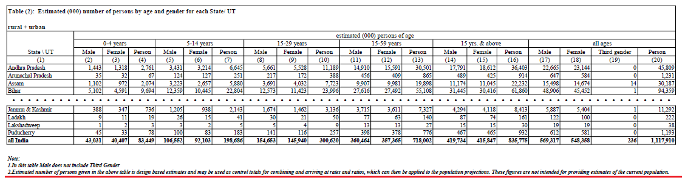
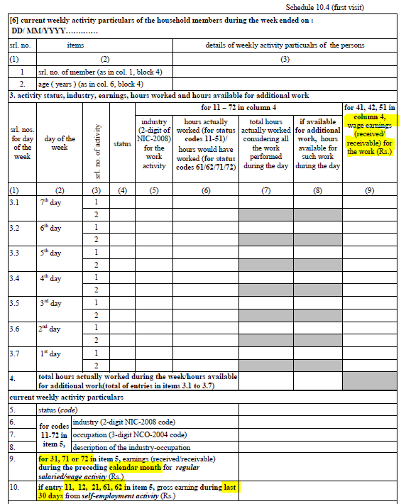

# Introduction to the Indian Periodic Labour Force Survey (PLFS)

- [What is the IND PLFS?](#what-is-the-ind-plfs)
- [What does the PLFS cover?](#what-does-the-plfs-cover)
- [Where can the data be found?](#where-can-the-data-be-found)
- [What is the sampling procedure?](#what-is-the-sampling-procedure)
- [What is the significance level?](#what-is-the-geographic-significance-level)
- [Other noteworthy aspects](#other-noteworthy-aspects)

## What is the IND PLFS?

The PLFS is the follow up labour force survey to the Employment and Unemployment Survey (EUS). It began in 2017 and runs annually from July to June of the following year. It is run by the National Statistical Office of the [Ministry of Statistics and Programme Implementation]( http://www.mospi.nic.in/) (MOSPI).

## What does the PLFS cover?

The PLFS covers household characteristics, individual demographic and education characteristics of respondents, as well as labour market information both over the past 12 months and over the 7 days prior to interview. The below table shows the survey years harmonized and the size of the sample in terms of households and individuals.

| Year	    | # of Households	| # of Individuals	|
| :------:	| :-------:		    | :-------:	 	    |
| 2017	    | 102,113		    | 433,339	    	|
| 2018	    | 101,579		    | 420,757		    |
| 2019	    | 100,408		    | 418,297		    |
| 2020	    | 100,344		    | 410,818		    |
| 2021	    | 101,782		    | 428,525		    |

## Where can the data be found?

The data can be downloaded freely from the [Download Tables Data section](https://mospi.gov.in/web/mospi/download-tables-data) on the MOSPI website. In particular from the README files [for 2018/19](https://mospi.gov.in/documents/213904/531813//README_demo1608274556988.pdf/2281ebcd-eb19-1468-dce0-23a6ea3a7b02) and [for 2019/20](https://mospi.gov.in/documents/213904/1216623//READMEM1627035725633.pdf/77c18981-9c85-a04a-3a35-af31ce8ce685) as well as from the National Data Archive [for 2017/18](http://microdata.gov.in/nada43/index.php/catalog/146).

## What is the sampling procedure?

The PLFS uses a stratified two stage sampling procedure. The exact details are given in the annual reports of each survey (e.g., which year’s census was used to draw the primary sampling units). For precise details please review these. The following is a general introduction to the methodology.

For the PLFS, the primary sampling units (PSUs) are, in rural areas, the census villages, in urban areas the blocks of the [Urban Frame Survey](http://mospi.nic.in/urban-frame-surveyufs), with urban PSUs further stratified by population size. PSUs are drawn with probability proportional to size.

The households represent the second stage sampling unit. 8 households, stratified by the number of members of secondary education in the household are selected per random sampling for each PSU.

## What is the geographic significance level?

The official reports detail results jointly by sex, sector (urban or rural), and state. That is, the unemployment rate of urban women in Madhya Pradesh can be safely reported.

## Urban Panel data

The India Periodic LFS facilitates the assembly of a panel dataset that tracks an individual's information over four consecutive quarters. However, this is possible **only for the urban households.**

Based on the 2011 Census of India, urban areas are characterized as:

a. Any location with a municipality, corporation, cantonment board, or a designated town area committee.

b. Any place meeting three criteria concurrently:
-  minimum population of 5,000.
- At least 75% of the male working-age population engaged in non-agricultural activities.
- A population density of at least 400 per sq. km (or 1,000 per sq. mile).

For more information on the urban panel data, refer to this [text](Urban%20panel%20data.md).

## Adjustments during the covid-19 pandemic

The PLFS survey faced multiple disruptions due to the COVID-19 pandemic. Initially, fieldwork was halted on March 18, 2020. It resumed on June 1, 2020, addressing both the pending tasks from January-March 2020 and those scheduled for April-June 2020. Even with these delays, the survey teams ensured that data still corresponded to the originally planned periods. For example, if a survey intended for April 2020 was conducted in June, the questions still pertained to events from April. This approach meant that, despite changes in collection dates, the data's reference points remained unchanged. To minimize risks associated with the pandemic, from June 2020 onward, the survey officials conducted certain interviews, especially revisits, over the phone, sticking to the original reference periods. The challenges persisted with another interruption in April 2021 due to the pandemic's 2nd wave, but resumed in June 2021.

## Other noteworthy aspects

### Changes in state codes

The state codes in the 2021 PLFS capture the following changes:

1. The separation of Ladakh from Jammu and Kashmir.  Starting with the 2021 PLFS, state codes were updated to distinguish the union territory of Ladakh (new state code "37") from its predecessor, Jammu and Kashmir. This change followed a pivotal constitutional amendment on August 5, 2019, when the Indian government annulled Article 370, an article that had accorded special autonomy to Jammu and Kashmir. This monumental move resulted in the splitting of the state into two separate union territories. Jammu and Kashmir remained with its own legislative assembly, while Ladakh was established as a union territory without such an assembly. This restructuring was formally implemented on October 31, 2019.

2. The merger of Dadra and Nagar Haveli and Daman and Diu. State codes in the 2021 PLFS were updated to merge two territories, Dadra and Nagar Haveli, and Daman and Diu. These were formerly codes "26" and "25", respectively, and merged into code "25". The Indian Government proposed this merger in July 2019 as a strategic move to streamline administration and reduce costs. Subsequently, the necessary legal framework, the Dadra and Nagar Haveli and Daman and Diu (Merger of Union Territories) Bill, 2019, was introduced in Parliament and received presidential assent in December 2019. The merger officially took effect on January 26, 2020.

For the full list of the state code changes, refer to this [document](utilities/IND_State_Code_Changes_2021.xlsx). The cross-walk between the updated state codes and their previous state codes are documented [here](utilities/IND_State_Correspondence_2021.csv).

### Reading in data

The data from the PLFS is shared in text format and not as a `.dta` or `.csv` The particular details are [covered further in a separate document](Reading_in_PLFS_data.md).

### Differences in methodology with respect to the EUS

The PLFS was preceded by the Employment and Unemployment Survey (EUS) covering the years 1983 to 2011. The questionnaires are nearly identical and cover also 12-month and 7-day labour market recall details (i.e., the definitions described in the next subsection still hold). Moreover, the design is also a two-stage stratified sample, with census villages and urban blocks working as PSUs and households as SSUs.

The main difference, however, lies in the stratification at the second stage. While EUS stratified households by relative income, PLFS stratifies them by the “*number of members in the households having level of general education as secondary (10th standard) or above*”.

The report on the first PLFS from 2017 compares the sampling methodologies for the last EUS round to the first PLFS one. The particular details are on [pages 6 to 10 of the report](utilities/AR_PLFS_2017.pdf).

### Calculating population totals

The population totals from the PLFS falls short of general estimates. This is acknowledged by the data producer. The screenshot below is [from page 125 of the PDF of the Annual Report for 2019](utilities/Annual_Report_PLFS_2019_20.pdf), showing a total population of about 1.1 billion people – UN estimates are at about 1.4 billion.

The GLD maintains the survey original weights. Users are advised to adjust the weights to calculate absolute estimates (not needed for ratios) in line with the data producer’s footnote (see the red underlined footnote in the screenshot above).

### Coding of industry and occupation codes

The PLFS data is coded using NIC-2008 codes for industry and NCO-2004 codes for occupation. NIC-2008 codes are five-digit codes whose first four are equivalent with ISIC-4 and the last one is used, wherever necessary to adapt to the Indian context. Hence no correspondence tables are necessary to translate the information to ISIC-4.
NCO-2004, on the other hand is not directly linked to the international occupation system ISCO. The harmonization team could not find any correspondence tables on the MOSPI website. Hence the method used was to rely on the correspondence develop by Mses. Saloni Khurana and Kanika Mahajan in their [technical appendix](utilities/NCO_concordance.pdf) to their paper [Evolution of wage inequality in India (1983-2017)](utilities/wp2020-167.pdf). The harmonization team is thankful to them for their research and kindness in sharing their work.

The technical appendix consists of two tables. The first is the concordance between NCO 1968 and NCO 2004. The second details the concordance between NCO 2004 and ISCO-88. The PDF we [convert into an Excel file](utilities/occupation_correspondences.xlsx). [This R code](utilities/convert_occup_concordance_to_dta.R) produces two `dta` files. One for mapping from older NCO versions (necessary for EUS, but not PLFS) and the [India_nco_04_to_isco_88.dta](utilities/Additional%20Data/India_nco_04_to_isco_88.dta) file used in the harmonization code to convert from NCO 2004 to ISCO-88.

### Changes in states over time

In the intervening years between the last EUS survey in 2011 and the first PLFS the state of Telangana was [formed out of districts previously part of Andhra Pradesh](https://en.wikipedia.org/wiki/Andhra_Pradesh_Reorganisation_Act,_2014). The states codes for the PLFS from 2017 to 2019 are consistent and the coding is equal with the [coding used in the EUS from 2004 to 2011](/Support/B%20-%20Country%20Survey%20Details/IND/EUS/Changes_States_And_State_Codes_Over_Time.md) with the addition of code 36 for Telangana.

### Definitions of employment over recall periods

The PLFS does not directly ask respondents about their employment but rather asks about *usual principal activity* and their *subsidiary economic activity*. In such a situation, a full-time university student who works on the weekends at a petrol station, for example, would classify their principal activity as student. If we were to use only principal activity, we would code this individual as out of the labour force, missing the fact that they are employed as per their subsidiary economic activity.

Moreover, the PLFS asks employment questions both over the 12-month and the 7-day recall period. Some employment codes (e.g., differentiating between unemployed who is looking for a job and available to work or just available to work but not looking), are only available for one of the recall periods.

The details of these definitions are [covered separately in another document](Definitions_of_employment_over_recall_periods.md)

### Definitions of wage information

The seven-day recall section 6 (see screenshot below) has two instances to record earnings. Column 9 of questions 3.1 through 3.7 asks for daily earnings for those with codes 41,42, and 51, while question 9 asks for the preceding month’s earnings for those with codes 31, 71, or 72. Finally, for those with codes 11, 12, 21, 61, and 62, the interviewees are asked to report their gross earnings over the previous 30 days.

Code 11 stands for the self-employed, while code 12 represents employers. Codes 61 and 62 represent family helpers in a business. For them we have the earnings for the past 30 days. The monthly wage is only collected for those in wage employment over the past week (code 31) or waged workers off in that week due to sickness (code 71) or other reasons (code 72).

The annual report (see [here the report for the 2019/20 PLFS](utilities/Annual_Report_PLFS_2019_20.pdf)) documents these earnings in separate tables. In addition, the daily earnings can be summarized to a weekly wage for casual wage workers in public works other than MGNREG (Mahatma Gandhi National Rural Employment Guarantee Act) (code 41), casual workers in MGNREG works (code 42), or in other types of works.

These wages are reported only as daily wages. It seems safe to summarise this into a weekly wage, but the Indian Authorities do not try to compare the two by for example dividing monthly earnings by 4.3. Hence attention should be given to extracting the correct information from the survey when calculating wages. Annualising casual workers earnings to a month or a year will likely result in an overestimate of their income.

### Definitions of employment status

The harmonization used for GLD only has one category for paid employees. However, the PLFS has different codes for so called "regular" and "casual" employees, denoting a tighter and a more lose relationship to the employer in either case. Commonly casual employees will earn less and be in a less formal setting. Differentiating between these types of employment may be useful to researchers. The GLD team has created codes to run on the raw data that create an alternative `empstat` called `empstat_alt`. The datafile created only has variables `empstat_alt` and `pid`, where the latter can be used to merge it with the regular harmonization. The [codes can be found here](utilities/Code%20for%20creating%20alternative%20empstat).
