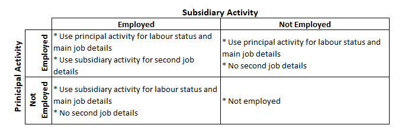

# PLFS labour market status definitions

This document gives an overview of the different labour market status definitions underlying the PLFS and how this information was coded in the GLD harmonization.

## Definition of the 12-month labour recall

The PLFS does not directly ask respondents about their employment over the past 12 months but rather asks about their *usual principal activity* and their *subsidiary economic activity*. In such a situation, a full-time university student who works on the weekends at a petrol station, for example, would classify their principal activity as student. If we were to use only principal activity, we would code this individual as out of the labour force, missing the fact that they are employed as per their subsidiary economic activity. The image below is the classification of the different status in the PLFS Instructions to Field Staff:


For the purposes of the GLD harmonization, the labour status and primary activity details over the 12-month reference period are taken from the usual principal activity if the person is employed as their principal activity, from the subsidiary if they are not employed in their principal activity (e.g., housekeeping or student as principal activity) but are working on their subsidiary activity. Only if they are active on both will the subsidiary activity be used to harmonize a second job. The below matrix presents an overview of these choices.



## Definition of the 7-day labour recall

Likewise, the PLFS does not directly ask respondents about their employment over the past 7 days but rather asks about the economic activities performed in the past 7 days and the number of days spent for each activity. Then, from these activities, the current weekly activity status (CWS) is determined based on the flow chart below. Unlike the principal activity status, the CWS is determined by favoring employment activities, i.e., activities corresponding to status codes 11 – 72. The implication of this determination procedure is that the employment status can already be determined directly from the CWS. Going back to the full-time student working part-time at the gasoline station: while this person spends more time as a student, the CWS will correspond to his work at the gasoline station as the procedure prioritizes employment activities regardless of the number of days spent in the past week.


Determining the 7-day primary activity status is more straightforward compared to the 12-month status, but it is tricky to determine the 7-day secondary activity status especially when respondents report more than two activities. The harmonizer needs to have a clear understanding on how the activities should be sorted and how to settle the ties. Based on the flow chart above, the activity statuses should be ordered based on the following activity categories:

1. Activities corresponding to employed (activity status codes: 11 – 72)
2. Activities corresponding to unemployed (codes: 81 – 82)
3. Activities corresponding to being outside of the labor force (codes: 91 – 98)

The process in the flow chart above also specifies how to settle the ties: e.g., a respondent reporting two employment activities, say codes “11” and “72”. The activity with the more days spent will be ordered ahead of the other activity of the same category.  If activity “11” has more days spent than activity “72”, then activity “11” is tagged as the CWS, while the latter can be treated as the secondary activity status. Examples of the determination procedure are shown below:


The flow chart, however, does not explain how to settle the ties when two activities of the same category have equal number of days spent. Instead, this is determined by deduction. Analysis from the 2009 and 2004 (NSS 61) surveys reveals that two activities of the same category and same number of days spent are resolved by the order of the activity status code. Suppose 3.5 days are spent for each of activities “11” and “72”. Treating both codes as ordinal numbers, it can be inferred that 11 is less than 72; and thus, “11” becomes the CWS. This way of resolving ties, however, biases towards status codes that are lower in order without any known meaningful intuition. For instance, status code “11” (self-employed in HH enterprise) is always going to be the default CWS if it is one of the respondent’s evenly divided employment activities.

**Specific case problems**

While the flowchart is clear that the CWS is determined from the list of activities, there are instances where the CWS is not among the activities performed during the past week. For instance, the record below from the 1999 survey reported two activities in the past week: “62” (*Had work in h.h. enterprise but did not work due to: Other reasons*) and “97” (*Others (including begging, prostitution, etc.*). Following the flow chart, the current weekly activity (B53_q20) should be code “62”; but instead, it is code “11”.


There are also cases where the given CWS is not equal to what would have been determined by the procedure. Below, for instance, a respondent from the 1993 survey reported three activities corresponding to codes “11”, “51” and “92”. Following the flow chart, activity code “11” should be the CWS as it recorded 3.5 days whereas activity “51” only recorded 2 days. However, the data tags activity “51” as the CWS instead. Whether this follows a different determination procedure or an encoding mistake cannot be confirmed.


In both cases where the determined CWS differs from the given CWS, the recommended approach is to accept the current weekly activity as the truth despite reneging from the determination rules. The logic behind this is that the current weekly activity is mapped to the industry and occupation variables that would not be compatible should the harmonizer use the determination procedure to tag the CWS. Meanwhile, the determined CWS would then be assigned to the secondary activity. Thus, in this case, the primary activity is “51” while the secondary activity is “11”.


## Difference in coding unemployment between the recall periods

The PLFS contains information on the labour status (employed, unemployed, or out of the labour force) based on the 7-day and the 12-month recall periods, as stated above. 
There is a further nuance to note in the treatment of the unemployed since the questionnaire is more fine-grained over the 7-day period than over the 12-month period.
For the 12-month period, the code `81` denotes a person who *did not work but was seeking and/or available for work*. Technically, the unemployed are those who are both seeking and available to work. Here it is not possible to differentiate and all individuals with code `81` are defined as unemployed.
For the 7-day period there are two different codes. Code `81` denotes here a person who *sought work*, while code `82` describes an individual who *did not seek but was available for work*. Thus, in this case we can discriminate.
Over the 7-day recall only individuals with code `81` are defined as unemployed, those with code `82` are deemed not in the labour force (`lstatus = 3`). To differentiate them nonetheless, people with code `82` are coded as potential labour force (`potential_lf = 1`) while the other individuals not in the labour force are also not potentially part of it (`potential_lf = 0`).
To compare both concepts, it is advised to create a new variable in the following way:
```
gen lstatus_compare = lstatus
replace lstatus_compare = 2 if potential_lf == 1
```
Then `lstatus_compare` can be safely compared to `lstatus_year`.
