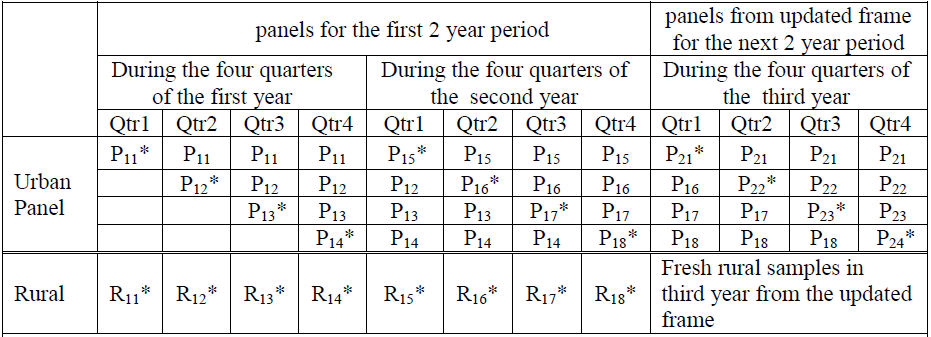
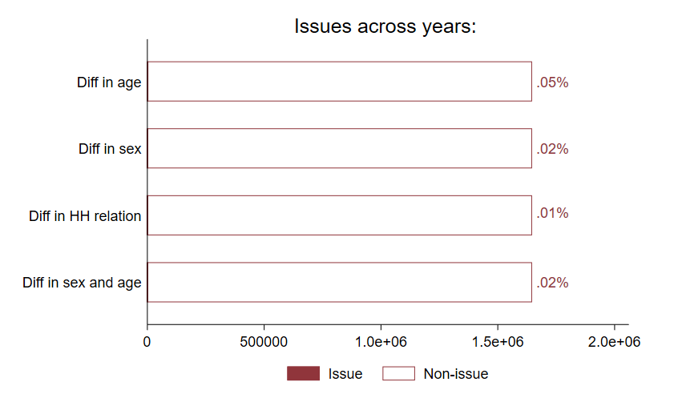
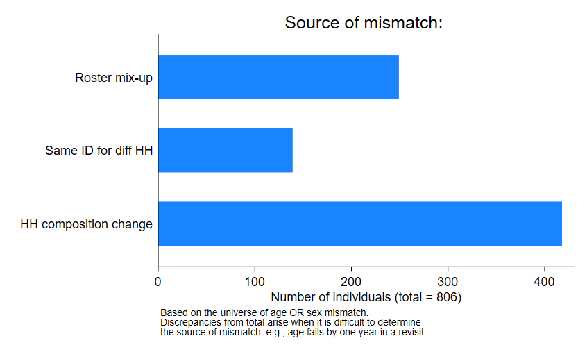
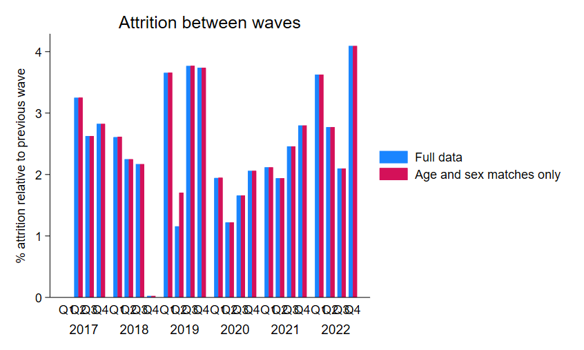
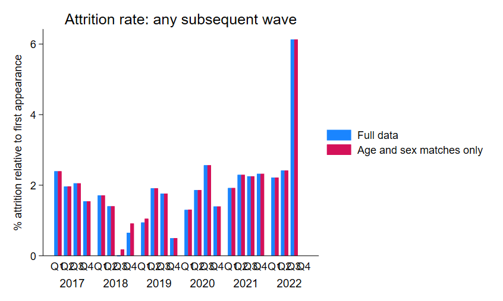
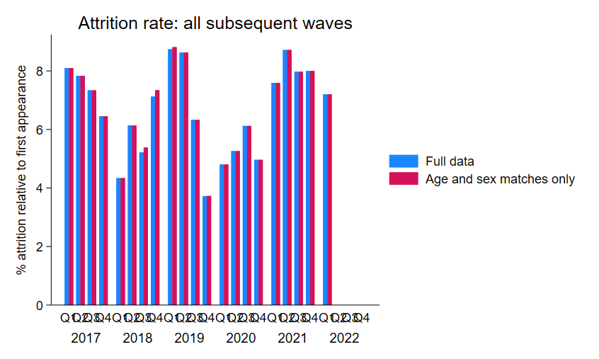

# Urban panel data from the PLFS

## Overview
The Periodic Labour Force Survey (PLFS) employs a two-stage sampling design to gather employment data across India. For urban areas, it utilizes a rotational panel scheme, while for rural regions, a cross-sectional survey approach is adopted. The urban panel data is visited for four consecutive quarters, and when combined with the single-visit cross-sectional data from rural areas, it facilitates users to generate nuanced labor estimates on a quarterly basis for each state, segmented by urban and rural demographics.

The PLFS adopts a strategic rotational design for its urban samples, ensuring consistent data capture throughout the year. The starting point in this rotational system is the P11 panel, designated as the "first" panel in the survey cycle. Representing 25% of the annual urban allocation, this panel sets the pace for the year-long survey, which spans four quarters. As each quarter unfolds, new panels are successively introduced, while the earlier ones, like the P11, are revisited. It's essential to highlight that the initial household listings remain unchanged during revisits, even if there are declinations in participation or a change in dwelling occupants.

The PLFS rotational scheme is designed with a two-year duration, accommodating potential changes in the urban frame during this period. This means that the sampling frames for both rural and urban areas remain consistent for this two-year stretch. Within this context, the dwelling serves as the primary unit of analysis, not its changing inhabitants. Original household IDs are  retained, even if there's a shift in the residents of a dwelling. This consistent identification is maintained across all panels, including the foundational P11. Once a panel completes its four-quarter survey cycle, it's succeeded by a new one in the subsequent survey year. By year's end, a 75% overlap exists between samples from two adjacent quarters, ensuring a harmonized surveying environment with panels coexisting at various quarters. 

## Issues with FSU codes between 2017-2018

The challenge with the PLFS data is the absence of household identifiers. But it is possible to construct IDs based on the codes for first sampling unit and the household number. However, between the 2017 and 2018 PLFS, the FSU codes have changed, and as a result, it is not possible to identify the same households based on the method of assigning the IDs. We are very grateful for Nils Enevoldsen of the Yale Economic Growth Center and Jhotirmoy Bhattacharya for their brilliant detective work that allowed them reconstruct the FSU codes and ultimately, match the households between the two years. As detailed in Nils's [blog post](https://egc.yale.edu/about/perspectives/filling-gaps-indias-official-labor-force-survey-constructing-urban-panel), Jyotirmoy used an unconstrained optimization model that identified a one-to-one renumbering, but Nils figured that Jyotirmoy discovered a simple substitution cipher between the FSU digits. For example, the digit equal to "0" in the PLFS 2017-18 is substituted by a digit equal to "6" in the PLFS 2018-19. By recoding each digit of the FSUs, it becomes possible to completely match the households in PLFS 2017-18 that were re-interviewed in PLS 2018-19. 

## Strategy for creating panel variable

A common strategy to identify the panel group to which a household belongs is by identifying the year and quarter that the household was first visited. In the case of India, a household interviewed in the first quarter of 2017-18 is P11. But there were a couple of instances were the household ID was re-used across non-consecutive survey years, and even within the same survey year as in the case of the PLFS 2021-22. With visit number independently constructed from the `hhid`, it becomes possible to identify the panel groups, as indicated by the variable `panel`, by utilizing information based on the wave of first visit. We adopt Nils Enevoldsen's strategy, which uses visit number and a monotonic transformation of wave to identify the panel groups. After concatenating the `panel` in the `hhid` and `pid` variables, the appended dataset has unique `pid` data for each survey wave.

## Quality checks

### Age and sex mismatches

It is common practice for research works that use panel surveys to identify extent to which the age and sex mismatches occur for the same person ID. These cases are typically dropped from the analyses, and reweighting is performed on the trimmed data, as done for instance by [Donovan, et al (2023)](https://academic.oup.com/qje/article-abstract/138/4/2287/7181328). Fortunately, the India urban panel data has negligible cases of age and/or sex mismatches: there are less than 1000 individuals (out of 900,000+ unique individuals) where such mismatches were observed, and among these cases, we extrapolated that these cases arise due to members' entry into and exit from the household. 

### Attrition

We also examine three measures of attrition: between waves, between the first visit and any subsequent wave, and between the first visit and all subsequent waves. The attrition rates for each measure are shown below, separating calculations for attrition in terms of ID only, and both ID and age-sex matches. 

#### Attrition between two consecutive waves

#### Attrition between the first visit and any subsquent wave

#### Attrition between the first visit and all subsequent waves

