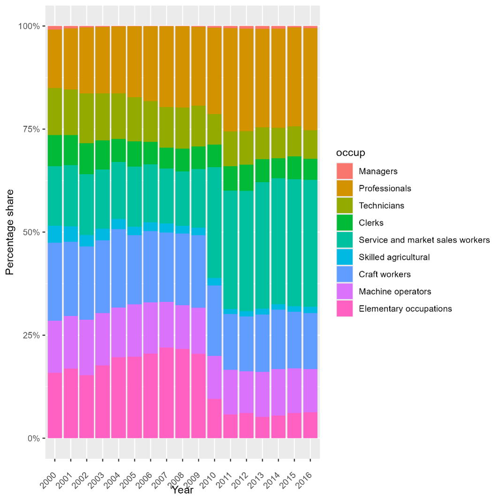

# Series Break in Occupation Classification (2009–2011)

## Summary

There is a documented series break in the occupation variable (`occup`) between 2009 and 2010, with the distribution stabilizing from 2011 onward. This break is **not an error in the GLD harmonization**. It has a clear and identifiable root cause: **the Jordan Department of Statistics (DoS) changed the underlying ISCO classification standard between survey years**. The 2009 LFS uses ISCO-88 (raw variable `occ_isco88_3`), while the 2010 and 2011 LFS use ISCO-08 (raw variables `occ_isco08_3` and `q222` respectively). This change in standard — not a change in harmonization logic — drives the distributional break visible at the 1-digit level.

---

## Root Cause: Change from ISCO-88 to ISCO-08

The 3-digit raw occupation variables confirm the classification standard changed at source:

| Year | Raw variable | ISCO version |
|---|---|---|
| 2009 | `occ_isco88_3` | ISCO-88 |
| 2010 | `occ_isco08_3` | ISCO-08 |
| 2011 | `q222` | ISCO-08 |

The dominant driver of the shift from group 9 (Elementary) to group 5 (Service and market sales workers) is **ISCO-08 code 541 (Protective services workers)**, which alone accounts for 9,233 workers in 2010 (16.6% of employment) and 9,080 in 2011 (18.5%). The ISCO-88 equivalent — code 516 (Protective services workers) — had only 1,619 workers in 2009 (2.8%). The difference of approximately 7,600 workers is largely explained by two ISCO-88 elementary occupation categories that were reclassified under ISCO-08:

- **ISCO-88 code 915 (Messengers, porters, doorkeepers and related workers)**: 3,213 workers in 2009. In Jordan, many of these roles carry a security function and map naturally to the broader ISCO-08 protective services category (541).
- **ISCO-88 code 931 (Mining and construction laborers)**: 5,933 workers in 2009, compared to only 210 in the equivalent ISCO-08 code 931 in 2010. These workers were likely redistributed across multiple ISCO-08 categories.

This reclassification is a known consequence of the ISCO-88 to ISCO-08 revision, which substantially restructured group 5 — particularly by expanding the protective services subcategory — and reorganized elementary occupations in group 9.

---

## Evidence: Occupational Distribution Over Time

The table below shows the share of employed workers in each 1-digit ISCO occupation group for 2009, 2010, and 2011.

| ISCO-88 Group | 2009 (%) | 2010 (%) | 2011 (%) |
|---|---|---|---|
| 1. Managers | 0.15 | 0.43 | 0.55 |
| 2. Professionals | 17.85 | 19.64 | 21.93 |
| 3. Technicians | 9.67 | 7.32 | 7.99 |
| 4. Clerks | 5.87 | 5.86 | 6.13 |
| **5. Service & market sales workers** | **13.95** | **29.24** | **31.43** |
| 6. Skilled agricultural | 2.58 | 2.59 | 1.69 |
| 7. Craft workers | 16.30 | 15.68 | 12.90 |
| 8. Machine operators | 11.75 | 11.16 | 11.11 |
| **9. Elementary occupations** | **21.87** | **8.09** | **6.29** |
| **Total employed** | **57,320** | **55,610** | **46,745** |

The shift between groups 5 and 9 is stark: elementary occupations fall from **21.87%** in 2009 to **8.09%** in 2010, while service and market sales workers rise from **13.95%** to **29.24%**. As established above, this shift is driven primarily by the change from ISCO-88 to ISCO-08, which reclassified large groups of workers — particularly messengers/porters/doorkeepers (ISCO-88 code 915) and construction laborers (ISCO-88 code 931) — into ISCO-08 protective services (code 541) and other categories.

---

## Confirmation That This Is a Raw Data Issue

Cross-tabulations of the raw occupation variable (`occ`) against the harmonized variable (`occup`) in each year produce a **perfect diagonal** — there are no off-diagonal cells in any year. This confirms that the GLD harmonization applied the raw codes correctly and introduced no reclassification.

The shift is entirely attributable to the change in ISCO standard applied by the DoS between survey years.

**Key 3-digit comparison: where the workers went**

| Category | ISCO-88 (2009) | Workers | ISCO-08 (2010) | Workers |
|---|---|---|---|---|
| Protective services | 516 | 1,619 | 541 | 9,233 |
| Messengers/porters/doorkeepers | 915 | 3,213 | *(absorbed into 541 and others)* | — |
| Construction laborers | 931 | 5,933 | 931 | 210 |
| Domestic helpers/cleaners | 913 | 1,637 | 911 | 2,212 |

The combined ISCO-88 elementary categories 915 and 931 account for 9,146 workers in 2009. Their near-disappearance under ISCO-08 — and the concurrent 7,600-worker expansion of protective services — is the quantitative evidence of how the ISCO standard change drove the observed distributional shift.

---

## Implication for Users

Researchers using the Jordan LFS GLD harmonized files should treat the `occup` variable as **not comparable** between 2009 and years from 2010 onward for groups 5 (Service and market sales workers) and 9 (Elementary occupations). Comparisons within the 2010–onward series appear stable.

Any analysis involving the share of elementary or service workers in employment that spans the 2009–2010 boundary should include a note on this break and consider either:

- Restricting the analysis to the post-2009 period; or
- Aggregating groups 5 and 9 together where the research question allows, since their combined share is more stable across the break (35.82% in 2009 vs. 37.33% in 2010).

---

## Harmonization Code

The harmonization logic is **identical across all three years**: the raw 3-digit occupation code is converted to a 4-digit string by appending `"0"`, and `occup` is then assigned by reading the first digit of that string via `inrange`. No crosswalk between ISCO-88 and ISCO-08 is applied at any point. This is the correct and expected GLD approach — the harmonizer faithfully reflects what the NSO coded; it does not attempt to bridge classification standards.

# Alternative Version

# Series Break in Occupation Classification (2009–2010)

## Summary

The Jordan LFS occupation series shows a clear break between 2009 and 2010, concentrated mainly in two broad occupation groups: **Service and market sales workers (group 5)** and **Elementary occupations (group 9)**.

The trigger for the break is identifiable in the source data: **the Jordan Department of Statistics changed the occupation classification used in the survey from ISCO-88 in 2009 to ISCO-08 from 2010 onward**.

This is therefore a **data comparability issue rather than a GLD harmonization issue**. GLD preserves the occupation codes supplied in the source data and does not apply a crosswalk between ISCO-88 and ISCO-08. Because the two classifications do not place all occupations in the same broad groups, the change in classification creates a discontinuity in the harmonized series.

Users should therefore avoid directly comparing occupation groups 5 and 9 across the 2009–2010 boundary without accounting for this classification change.

## 1. What happened?

The distribution of workers across broad occupation groups changes sharply between 2009 and 2010. The largest movement is between groups 5 and 9:

- **Service and market sales workers (group 5)** increase substantially.
- **Elementary occupations (group 9)** decrease substantially.
- From 2010 onward, the distribution is considerably more stable.

The full 2000–2019 series makes the timing of the break visible: the discontinuity occurs specifically at the transition from 2009 to 2010, rather than as part of a gradual trend.

The table below should report both the survey-weighted distribution and the underlying unweighted sample counts. Keeping these separate is important: the weighted percentages describe the estimated population distribution, while the unweighted counts show how many survey observations generate those estimates.

| Occupation group | 2009 weighted % | 2009 unweighted n | 2010 weighted % | 2010 unweighted n | 2011 weighted % | 2011 unweighted n |
|---|---:|---:|---:|---:|---:|---:|
| 1. Managers | [TO FILL] | [TO FILL] | [TO FILL] | [TO FILL] | [TO FILL] | [TO FILL] |
| 2. Professionals | [TO FILL] | [TO FILL] | [TO FILL] | [TO FILL] | [TO FILL] | [TO FILL] |
| 3. Technicians | [TO FILL] | [TO FILL] | [TO FILL] | [TO FILL] | [TO FILL] | [TO FILL] |
| 4. Clerks | [TO FILL] | [TO FILL] | [TO FILL] | [TO FILL] | [TO FILL] | [TO FILL] |
| **5. Service & market sales workers** | **[TO FILL]** | **[TO FILL]** | **[TO FILL]** | **[TO FILL]** | **[TO FILL]** | **[TO FILL]** |
| 6. Skilled agricultural workers | [TO FILL] | [TO FILL] | [TO FILL] | [TO FILL] | [TO FILL] | [TO FILL] |
| 7. Craft workers | [TO FILL] | [TO FILL] | [TO FILL] | [TO FILL] | [TO FILL] | [TO FILL] |
| 8. Machine operators | [TO FILL] | [TO FILL] | [TO FILL] | [TO FILL] | [TO FILL] | [TO FILL] |
| **9. Elementary occupations** | **[TO FILL]** | **[TO FILL]** | **[TO FILL]** | **[TO FILL]** | **[TO FILL]** | **[TO FILL]** |
| **Total employed** | **100%** | **[TO FILL]** | **100%** | **[TO FILL]** | **100%** | **[TO FILL]** |

Before finalizing the table, the percentages should be explicitly identified as **weighted or unweighted**, and the corresponding sample denominators should be reported.

## 2. What triggered the break?

The source occupation classification changes between survey years.

| Year | Raw occupation variable | Classification |
|---|---|---|
| 2009 | `occ_isco88_3` | ISCO-88 |
| 2010 | `occ_isco08_3` | ISCO-08 |
| 2011 | `q222` | ISCO-08 |

The break therefore coincides exactly with the move from **ISCO-88 to ISCO-08**.

This matters because ISCO-08 is not simply a renaming of ISCO-88 codes. The revision changed the boundaries of some occupation categories. As a result, similar occupations can appear in different broad 1-digit groups depending on which ISCO version is used.

The detailed 3-digit distributions provide additional evidence that this is what is occurring in Jordan. In particular, protective-services occupations become much more prominent under ISCO-08, while several categories previously recorded among elementary occupations become much smaller.

The code-level comparison should be presented with both counts and denominators:

| Occupation/category | 2009 classification/code | 2009 unweighted n | 2009 unweighted % of employed | 2009 weighted % of employed | 2010 classification/code | 2010 unweighted n | 2010 unweighted % of employed | 2010 weighted % of employed |
|---|---|---:|---:|---:|---|---:|---:|---:|
| Protective services | ISCO-88 516 | 1,619 | [TO FILL] | [TO FILL] | ISCO-08 541 | 9,233 | [TO FILL] | [TO FILL] |
| Messengers, porters, doorkeepers and related workers | ISCO-88 915 | 3,213 | [TO FILL] | [TO FILL] | No directly equivalent category shown here | — | — | — |
| Mining and construction labourers | ISCO-88 931 | 5,933 | [TO FILL] | [TO FILL] | ISCO-08 931 | 210 | [TO FILL] | [TO FILL] |
| Domestic helpers/cleaners | ISCO-88 913 | 1,637 | [TO FILL] | [TO FILL] | ISCO-08 911 | 2,212 | [TO FILL] | [TO FILL] |
| **Total employed** |  | **57,320** | **100%** | **100%** |  | **55,610** | **100%** | **100%** |

Reporting the unweighted count together with its share of the employed sample is important for interpreting the magnitude of these changes. Weighted shares should also be shown so that it is clear whether the shift observed in the sample translates into a comparable shift in the population estimates.

The large increase in protective-services coding, together with the contraction of several ISCO-88 elementary categories, is **consistent with the occupation boundaries changing under ISCO-08**.

The aggregate evidence does not, however, identify exactly which individual observations moved from one particular ISCO-88 code to one particular ISCO-08 code. The code-level comparison should therefore be treated as supporting evidence for the classification break rather than as an individual-level crosswalk.

## 3. Why is this a data issue rather than a harmonization issue?

GLD does not create the discontinuity.

For each year, the harmonization takes the occupation classification supplied in the source data and derives the broad occupation group from it. GLD does **not** apply an ISCO-88-to-ISCO-08 concordance intended to make the two classifications artificially comparable.

This can also be checked directly. Cross-tabulations of the source occupation group against the harmonized `occup` variable produce a **perfect diagonal** in each year. In practical terms, this means that observations assigned to source group 5 remain in harmonized group 5, observations assigned to source group 9 remain in group 9, and so on. GLD is not moving observations between broad occupation groups.

The evidence is therefore:

1. The source data use **ISCO-88 in 2009**.
2. The source data use **ISCO-08 from 2010 onward**.
3. The visible distributional break occurs at the same point.
4. GLD preserves the source 1-digit classification and introduces no additional reclassification.

Taken together, these facts indicate that the break originates in the **classification contained in the source data**, rather than in the GLD harmonization process.

This should not be interpreted as an error in the source data. It is a **data comparability break** created by a change in the statistical classification used to code occupations.

## 4. What should users do?

The harmonized `occup` variable should **not be compared directly across the 2009–2010 boundary for groups 5 and 9** without acknowledging the change from ISCO-88 to ISCO-08.

Depending on the research question, users can:

- restrict occupation comparisons to the **post-2009 period**, where the classification is consistently ISCO-08;
- retain the full series but include an explicit **series-break indicator or methodological note** at 2010; or
- use a broader aggregation where substantively appropriate.

One potentially useful robustness check is to combine groups 5 and 9. Their combined share appears considerably more stable across the break than either category separately. Before recommending this aggregation, however, the comparison should be calculated using the **survey weights** and reported alongside the corresponding unweighted shares and sample counts:

| Measure | 2009 | 2010 | 2011 |
|---|---:|---:|---:|
| Groups 5 + 9, weighted share of employment | [TO FILL] | [TO FILL] | [TO FILL] |
| Groups 5 + 9, unweighted share of employment | [TO FILL] | [TO FILL] | [TO FILL] |
| Groups 5 + 9, unweighted n | [TO FILL] | [TO FILL] | [TO FILL] |
| Total employed, unweighted n | 57,320 | 55,610 | 46,745 |

The appropriate treatment ultimately depends on the analysis. The important point is that users should recognize **2010 as a classification break** when working with occupation trends spanning this period.

## Technical note on GLD harmonization

The GLD harmonization derives the broad occupation group directly from the source occupation code. The same basic procedure is used across the affected survey years, and no ISCO-88/ISCO-08 crosswalk is applied.

GLD therefore preserves the classification supplied by the survey rather than attempting to reconstruct a common occupation classification across the two ISCO standards.
