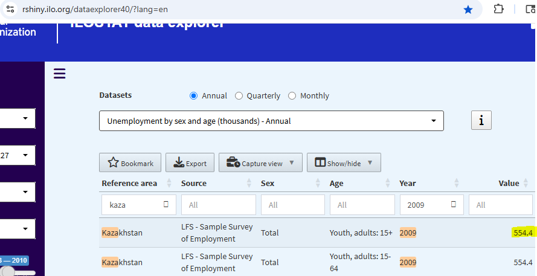
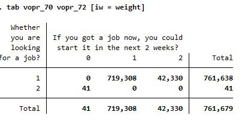

# Introduction to the Kazakhstan Labor Force Survey (KAZ LFS)

- [What is the KAZ LFS survey?](#what-is-the-kaz-lfs-survey)
- [What does the KAZ LFS survey cover?](#what-does-the-kaz-lfs-survey-cover)
- [Where can the data be found?](#where-can-the-data-be-found)
- [What is the sampling procedure?](#what-is-the-sampling-procedure)
- [What is the geographic significance level?](#what-is-the-geographic-significance-level)
- [Other noteworthy aspects](#other-noteworthy-aspects)

## What is the KAZ LFS survey?

The Kazakhstan Labor Force Survey (LFS) is a nationally representative household survey conducted by the Agency of Statistics of the Republic of Kazakhstan. It was first implemented in 2001, and although we only have access to data from 2009 to 2013, the survey continues to be fielded.

The surveys for 2009 to 2013 are collected on a quarterly basis, and based on the repetition of person identifiers and consistency in individual characteristics across quarters, we believe the survey follows a rotating panel design. However, we have no official documentation to confirm this structure, and another panel harmonization effort: e.g., [Donovan, Lu and Schoellman, 2023](https://academic.oup.com/qje/article/138/4/2287/7181328) do not appear to include Kazakhstan LFS in their list of panel surveys.

## What does the KAZ LFS survey cover?

The LFS collects detailed information on labor market status and demographic characteristics for individuals aged 15 and older. There are no observations for 0 - 14 year old members of sampled households.

Below is a summary of sample sizes by year:

| Year | Persons | Households |
|------|---------|------------|
| 2009 | 208,173 | 85,920     |
| 2010 | 206,862 | 85,747     |
| 2011 | 203,821 | 83,820     |
| 2012 | 200,440 | 82,918     |
| 2013 | 196,073 | 83,670     |

## Where can the data be found?

The data are **not publicly accessible** and have **strict access restrictions**. The GLD team received select years of KAZ LFS through collaboration with the ECA team. However, the team has not shared more recent rounds beyond 2013.

## What is the sampling procedure?

The data appear to have been collected using a two-stage sampling design, although this has not been confirmed. The PSU variable is available for years 2012 and 2013.

## What is the geographic significance level?

The KAZ LFS is representative at the national-level. As we have no documentation, we cannot confirm whether data is representative at a lower administrative level.

## Other noteworthy aspects

### Variable contamination and reconstruction

The dataset contains residual variables constructed by previous users, which were saved in the raw files -- whether this is accidental or intentional, we do not know. In some years, we had to rely on these harmonized versions where original raw variables were missing. As a general principle, we avoid using reconstructed variables unless there are no other options. Labor force variables are typically preserved in their original form in the source datasets.

### Household Reappearance Patterns in the Survey

Within each survey year, the same household ID appears multiple times, and individuals tend to retain similar characteristics across quarters. While this suggests a possible rotation or panel design, we have not confirmed whether the survey is formally structured as a panel or whether household identifiers can be reliably tracked across survey years. We have also not constructed panel identifiers or visit numbers. The summary below is based purely on observed patterns within each year.

| Year | Avg. # of Appearances per Household | Observed Pattern |
|------|-------------------------------------|------------------|
| 2009 | 1.16                                | Some households appear up to 4 times, but most appear only once |
| 2010 | 3.96                                | 4 consecutive quarters |
| 2011 | 1.99                                | 2 consecutive quarters only |
| 2012 | 3.95                                | 4 consecutive quarters |
| 2013 | 3.98                                | 4 consecutive quarters |

### Occupation

Occupation codes are available at the three-digit level and can be mapped to ISCO at the two-digit level. While we do not have official documentation indicating which version of ISCO is used in the survey, our matches suggest that ISCO-08 provides the best alignment for all the survey years. Therefore, we assume that the occupation codes are based on ISCO-08.

### Industry

Industry codes are available at the two- to three-digit level and can be mapped to ISIC at the two-digit level. We do not have official documentation indicating which version of ISIC is used in the survey. However, based on observed matches, the 2009 data aligns best with ISIC Revision 3.1, while the data from 2010 to 2013 aligns more closely with ISIC Revision 4.

### Education
The precise details on coding the education variable are covered in a separate document [here](Education.md)

### Urban Variable Varying Within Household

The survey data exhibits an unusual feature from 2009 to 2012: the urban variable is not always consistent within the same household. This issue does not appear in the 2013 data. One possible explanation is that some household members were recorded in different locations. Another possibility is that the same household ID was reused to represent different households, as we have observed changes in household composition under the same ID. It may also reflect data collection errors.

Fortunately, this issue appears to be minimal, affecting less than 1% of households in each of the affected years.

| Year | Number of Cases | % of Households |
|------|------------------|------------------|
| 2009 | 374              | 0.18%            |
| 2010 | 184              | 0.09%            |
| 2011 | 178              | 0.09%            |
| 2012 | 371              | 0.19%            |
| 2013 | 0                | 0.00%            |

### Unemployment

The coding of unemployment in the survey follows the ILO definition, which includes individuals who are both actively looking for work and available to start work. Based on this definition, we find that the unemployment estimate for 2009 is relatively high, at over 8%, with more than 700,000 individuals classified as unemployed. In contrast, ILOStat reports a lower estimate of approximately 554,000 for the same year, corresponding to an unemployment rate of around 6%.

We have not yet identified the reason for this discrepancy. It is possible that the higher unemployment rate in the survey reflects labor market disruptions caused by the Global Financial Crisis, which also affected Kazakhstan in 2009.

**Reported value in ILOSTAT:**

**Estimate from 2009 KAZ LFS:**

