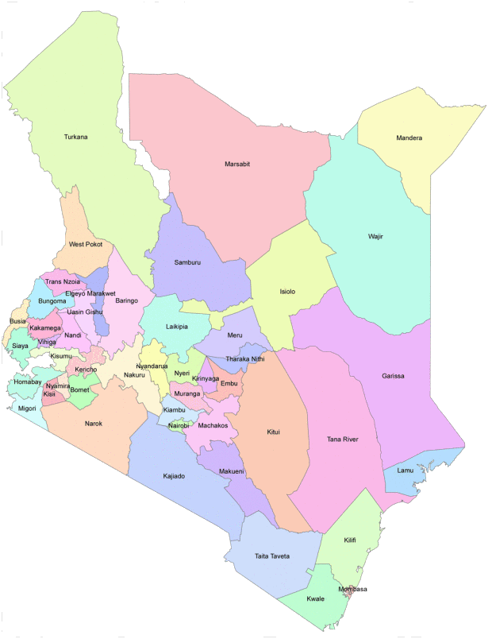

# Introduction to Kenya Continuous Household Survey (KCHS)

- [What is the KCHS?](#what-is-the-kchs)  
- [What does the KCHS cover?](#what-does-the-kchs-cover)  
- [Where can the data be found?](#where-can-the-data-be-found)  
- [What is the sampling procedure?](#what-is-the-sampling-procedure)  
- [What is the geographic significance level?](#what-is-the-geographic-significance-level)  
- [Other noteworthy aspects](#other-noteworthy-aspects)  

## What is the KCHS?
The Kenya Continuous Household Survey Programme (KCHSP) is a continuous household survey framework run by the Kenya National Bureau of Statistics (KNBS) to address persistent gaps in poverty and employment data.

Before KCHSP, KNBS relied on periodic household budget and welfare surveys (for example the Rural Household Budget Survey (RHBS), Urban Household Budget Surveys (UHBS), the Welfare Monitoring Survey (WMS), and the Kenya Integrated Household Budget Survey (KIHBS)). Labour indicators were often collected as modules inside other surveys (including KIHBS and the Micro, Small and Medium Enterprises (MSME) survey), and the last standalone labour force survey cited is the 1998 Labour Force Survey. 

KCHSP has two core modules: (1) a quarterly labour force module (i.e., Quarterly Labour Force Survey (QLFS) module under KCHSP) intended to update employment statistics and produce labour market indicators such as employment and unemployment, and (2) a quarterly household budget / consumption module for household consumption and poverty measurement. Unlike many countries where household consumption surveys and labour force surveys are implemented as separate surveys, the KCPH integrates both surveys within one continuous household survey framework.

## What does the KCHS cover?
KCHS integrates multiple questionnaire components, including a labor force module and household welfare-related modules.

| Year | # Persons | # Households |
|------|-----------|--------------|
| 2020 |   84,859  |    19,884   |
| 2021 |   68,677  |    17,042   |
| 2022 |   71,239  |    17,894   |

## Where can the data be found?
Microdata can be downloaded from the [KeNADA portal](https://statistics.knbs.or.ke/nada/index.php/catalog/36/get-microdata). Users need to create an account in order to download the datasets.

## What is the sampling procedure?
KCHS is a stratified, multi-stage cluster sample drawn from the Kenya Household Master Sample Frame (KHMSF), which is based on the 2019 Kenya Population and Housing Census. The frame is stratified into 92 strata defined by county and urban/rural residence (with Nairobi and Mombasa treated as urban-only). Clusters (primary sampling units) are selected systematically with equal probability within each stratum, then randomized into four quarterly replicates. Within each selected cluster, a fixed number of households are sampled systematically using a random start from the KHMSF household listings. The design supports quarterly national estimates for labour indicators, while county-level estimates for labour and poverty indicators are produced using the pooled annual sample (12 months).

## What is the geographic significance level?
The official reports detail estimates at the national, urban/rural, and each of the 47 counties.

## Other noteworthy aspects

### Defining the labor force
The Kenya KCHS classifies labor force status broadly in line with ILO concepts, but a few survey-specific operational choices follow from questionnaire routing; for full documentation of these choices and assumptions, see [Defining the Labor Force in KCHS](Labor%20Force.md)

### Geography
Kenya’s current first administrative level is the county. Under the 2010 Constitution, Kenya is divided into 47 counties. Counties are further subdivided into lower units that are commonly referenced as sub-counties and, below that, wards for local representation and administration. In the KCHS datasets for 2020 to 2023, the geography provided corresponds to the county level, and consistent identifiers for these lower subnational units are not available, so only ADM1 (county) can be coded reliably.

Before the 2010 Constitution, Kenya used a different administrative hierarchy based on provinces and districts. A common historical reference point is the independence-era constitutional arrangement, which divided Kenya into 40 districts plus the Nairobi Area, while later decades saw provinces (often referenced as eight) subdivided into districts whose number changed over time due to administrative reorganization. This is why older documentation may refer to “district” counts that do not align with the current county-based system.

### Industry

Industry information in the KCHS is recorded at the 4-digit level and follows the International Standard Industrial Classification (ISIC), Revision 4

### Occupation

Kenya uses its own occupational system called the Kenya National Occupational Classification System (KNOCS). The 2020 - 2022 rounds of KCHS uses the KNOCS 2000, which aligns with ISCO-88 but not one-to-one because some groups are split or combined to reflect local labor market structure. As a result, two-digit mapping can be approximate for certain categories and may require three-digit mapping to avoid misclassification. Kenya has since introduced KNOCS 2022, which is more closely aligned with ISCO-08. 

For more details on KNOCS and the recommended KNOCS-to-ISCO 2-digit mapping, refer to this [page](Occupation.md).

### Rotation Panel Design

The Kenya Continuous Household Survey (KCHS) is officially documented as following a 2-2-2 rotation panel design, under which households are interviewed for two consecutive quarters, rotated out for the next two quarters, and then re-interviewed for two additional consecutive quarters. In principle, such a design implies repeated observations of the same households and individuals across quarters and potentially across calendar years. However, inspection of the publicly available microdata does not reveal repeated household identifiers or expected duplication of individual characteristics consistent with a panel structure. 

For a detailed technical assessment of the expected duplication patterns and the empirical verification conducted using the microdata, see [Rotation Panel Issue](Rotation%20panel%20issue.md).

