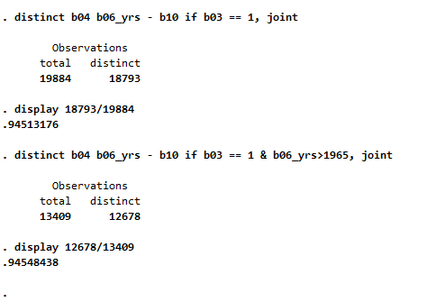
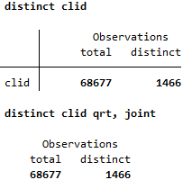

# Rotation Panel Issue
The Kenya Continuous Household Survey (KCHS) is officially documented as following a **2-2-2 rotation panel design**. Under this design, sampled households are interviewed for two consecutive quarters, rotated out of the sample for the next two quarters, and then re-interviewed for an additional two consecutive quarters. In principle, this structure implies that the same households and individuals should appear multiple times across survey waves and, because quarters span calendar years, potentially across two different years.  
See: [Technical Design of the Kenya Continuous Household Survey](Utilities/Technical-Design-of-the-Kenya-Continuous-Household-Survey.docx).

Under a properly implemented 2-2-2 rotation design, one would expect to observe repeated household identifiers across quarters and years. At the individual level, the same persons should reappear with largely stable characteristics. Variables such as sex, relationship to household head, and urban/rural residence should remain constant, while age should increase by approximately one year between interview cycles. In cross-sectional extracts constructed from such a panel design, a substantial proportion of individuals should therefore display matching characteristics across waves.

However, inspection of the available microdata does not reveal evidence consistent with a rotation panel structure. First, household identifiers do not repeat across quarters or years, preventing the construction of a panel household ID. Second, when restricting the sample to household heads and examining key individual characteristics that are highly unlikely to change over short intervals (sex, relationship to head, urban/rural residence, age, religion and marital status), only approximately 6% of observations display duplicate profiles in the appended 2020-2021 data (see below). This proportion is considerably lower than what would be expected under a functioning 2-2-2 panel design.

In addition, cluster identifiers appear to be unique by quarter, see example below for KCHS 2020, meaning that no cluster is observed across multiple quarters within the same year. Under a standard rotation panel design, clusters would typically reappear across adjacent quarters as households rotate in and out of the sample. A quick review of the quarterly datasets in the [Kenya National Data Archives](https://statistics.knbs.or.ke/nada/index.php/home) likewise does not reveal systematic repetition of households or individuals.

Taken together, these findings suggest that the publicly available KCHS microdata do not exhibit panel structure, despite the documented rotation design. Two possible explanations are that the rotation component was not operationalized in practice, or that the released annual and quarterly datasets contain only first-visit interviews rather than the full panel sample.

