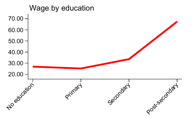

# Introduction to Liberia Labour Force Survey (LBR LFS)

- [What is the LBR LFS?](#what-is-the-lbr-lfs)
- [What does the LBR LFS cover?](#what-does-the-lbr-lfs-cover)
- [Where can the data be found?](#where-can-the-data-be-found)
- [What is the sampling procedure?](#what-is-the-sampling-procedure)
- [What is the geographic significance level?](#what-is-the-geographic-significance-level)
- [Other noteworthy aspects](#other-noteworthy-aspects)

## What is the LBR LFS?
The Liberia Labour Force Survey (LFS) is a household-based survey designed to collect detailed information on employment, unemployment, underemployment, informal employment, and other labour market characteristics in Liberia. The survey was jointly conducted by the Liberia Institute of Statistics and Geo-Information Services (LISGIS) and the Ministry of Labour

## What does the MWI LFS cover?
The survey collects information on demographic characteristics, education and training, migration, current economic activity, employment, unemployment, underemployment, informal employment, usual activity over the previous 12 months, occupational injuries, non-market economic activities, and household/community activities. It distinguishes between employed, unemployed, and inactive persons and includes information on occupation, industry, employment status, hours worked, wages and earnings, secondary activities, and vulnerable employment.

The Global Labor Database (GLD) currently includes harmonized information for Liberia for the following survey year:

| **Year** | **# of Households** | **# of Individuals** | **Expanded Population** | **Officially Reported Sample Size (# HH)** |
|:--------:|:------------------:|:-------------------:|:----------------------:|:------------------------------------------:|
| 2013 | 6,233 | 29,728  | 3,102,966 | 6,233 |


## Where can the data be found?
The datasets are not accessible to the public and researchers have to request the data from the Liberia Institute of Statistics and Geo-Information Services (LISGIS). The World Bank has been granted access to the datasets, if you work or are part of the World Bank Group, kindly contact the Jobs Group with a formal request for access to gld@worldbank.org

## What is the sampling procedure?
The 2010 Liberia LFS used a two-stage sample design. The sampling frame consisted of all enumeration areas from the 2008 Population and Housing Census. The frame was ordered by county, with separate urban and rural strata within each county. Greater Monrovia was treated as a separate stratum from the rest of Montserrado.

In the first stage, enumeration areas were selected with probability proportional to size. In the second stage, 12 households were selected systematically within each selected enumeration area. The initial sample included 526 primary sampling units and 6,312 households. After data processing and quality checks, the final usable sample was reduced to 523 enumeration areas and 6,233 households.

For more detailed information on the sample design, stratification, and implementation, see Annex A: Sample design and implementation in the [Liberia Labour Force Survey 2010 report](utilities/Labour_Force_Survey_Report_LISGIS.pdf).

## What is the significance level?
The 2010 Liberia LFS is representative at the national level, by urban/rural residence, and at the county level. Urban/rural estimates are also supported at the broader regional level. Regions are defined as shown below:

| Region | Counties included |
|---|---|
| Greater Monrovia | Greater Monrovia, part of Montserrado |
| North Central | Bong, Nimba, Lofa |
| North Western | Bomi, Grand Cape Mount, Gbarpolu |
| South Central | Montserrado excluding Greater Monrovia, Margibi, Grand Bassa |
| South Eastern A | Rivercess, Sinoe, Grand Gedeh |
| South Eastern B | River Gee, Grand Kru, Maryland |


## Other noteworthy aspects


### Resident eligibility filter

The Liberia LFS includes a residency filter in Section B of the questionnaire. Each listed household member was asked:

> During the last 4 weeks, did you spend at least 4 nights per week in this household?

This question corresponds to `B.9` in the questionnaire. The LFS eligibility condition was based on age and residence: individuals were eligible for the labour force questionnaire only if they were aged 5 or older and answered “Yes” to `B.9`. If a person answered “No” to `B.9`, the interview ended and no further labour force questions were asked.

Because GLD operates with resident household members in the harmonized database, individuals who did not satisfy the residence condition were excluded from the harmonized sample. In the Liberia LFS microdata, this corresponds to **2,081 observations** removed from the harmonized file.

### Unemployment definition note

The LFS 2010 official report uses a broad unemployment definition. According to the report, the ILO unemployment definition includes persons aged 15 or older who, during the survey reference week, were without work, available for work, and seeking employment. However, for LFS 2010, the job-search criterion was waived, meaning that persons without work and available to work may be classified as unemployed even if they did not actively search for a job.

For international comparability, the GLD harmonization uses the strict unemployment definition, which requires that a person is not employed, is available to work, and has actively searched for work. Users who want to reproduce the broader LFS 2010 unemployment definition can construct it using the availability and job-search questions in the employment module:

```
* GLD UNEMPLOYMENT DEFINITION: available AND looking for a job

  gen passive = (h1 == 1)
	gen active = (h3 == 1)
	
	replace lstatus = 2 if passive == 1 & active == 1 & missing(lstatus)
	
	
* LFS 2010 UNEMPLOYMENT DEFINITION: available for a job
* Use the code below instead if you want to apply the broader LFS 2010 definition

  gen passive = (h1 == 1)
	
	replace lstatus = 2 if passive == 1 & missing(lstatus)

```
### Wage distribution by education level

When We review the median hourly wages by education level for paid employees in the 2010 Liberia LFS. The results show the expected increase in wages from primary to secondary and post-secondary education. However, the no-education group reports a slightly higher median wage than the primary education group.

This pattern does not necessarily suggest that workers with no education earn more than workers with primary education. The no-education group has a very small sample size among paid employees. This small sample size likely explains the irregular difference between the no-education and primary groups.

**Median hourly wage by education level, Liberia LFS 2010**
<p align="center">

</p>

| Country | Year | Education level | Median hourly wage | Sample size |
|---|---:|---|---:|---:|
| LBR | 2010 | No education | 26.94 | 22 |
| LBR | 2010 | Primary | 25.26 | 473 |
| LBR | 2010 | Secondary | 33.68 | 664 |
| LBR | 2010 | Post-secondary | 67.36 | 197 |

Overall, the wage profile supports the expected relationship between education and wages, especially from primary education onward. The validation should flag the no-education comparison as a small-sample issue rather than a substantive inconsistency in the wage variable.


### Education system in Liberia

This section describes how education levels are recorded in the 2010 Liberia LFS and how they are harmonized in the Global Labor Database (GLD).

The survey asks respondents to report the highest grade completed through variable `c5`. The response categories distinguish no education, grades 1 to 6, grades 7 to 12, tertiary years 1 to 4, undergraduate education, and postgraduate education. According to the Liberia ISCED mapping, lower basic education lasts six years and corresponds to primary education, upper basic education lasts three years and corresponds to lower secondary education, and senior secondary education lasts three years and corresponds to upper secondary education. 

This information is used to construct `educy`, which measures years of education, and `educat7`, which classifies educational attainment into seven internationally comparable categories.

The table below summarizes the correspondence between the education levels reported in the Liberia LFS, the assigned years of education, and the resulting GLD harmonization.

| Level in Liberia LFS (`c5`) | Years assigned in `educy` | `educat7` |
|---|---:|---|
| No grade | 0 | No education |
| Grade 1 | 1 | Primary incomplete |
| Grade 2 | 2 | Primary incomplete |
| Grade 3 | 3 | Primary incomplete |
| Grade 4 | 4 | Primary incomplete |
| Grade 5 | 5 | Primary incomplete |
| Grade 6 | 6 | Primary complete |
| Grade 7 | 7 | Secondary incomplete |
| Grade 8 | 8 | Secondary incomplete |
| Grade 9 | 9 | Secondary incomplete |
| Grade 10 | 10 | Secondary incomplete |
| Grade 11 | 11 | Secondary incomplete |
| Grade 12 | 12 | Secondary complete |
| Tertiary year 1 | 13 | University incomplete or complete |
| Tertiary year 2 | 14 | University incomplete or complete |
| Tertiary year 3 | 15 | University incomplete or complete |
| Tertiary year 4 | 16 | University incomplete or complete |
| Undergraduate | 16 | University incomplete or complete |
| Postgraduate | 18 | University incomplete or complete |

The Liberia LFS provides more detail than a simple highest-level variable because it records the highest grade completed. This allows the harmonization to distinguish incomplete and complete primary education, as well as incomplete and complete secondary education. Grade 6 is treated as primary complete, while grade 12 is treated as secondary complete.

For tertiary education, the survey records tertiary years, undergraduate education, and postgraduate education. These categories are harmonized under `University incomplete or complete` in `educat7`. The harmonization assigns 13 to 16 years of education to tertiary years 1 to 4, 16 years to undergraduate education, and 18 years to postgraduate education.
